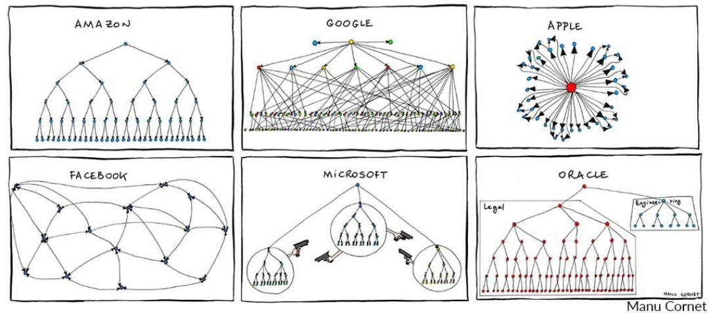
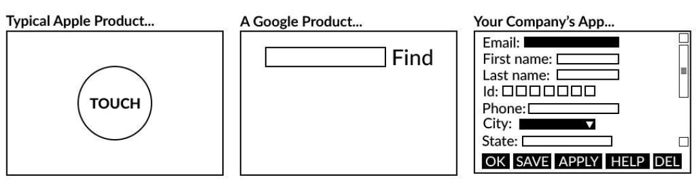
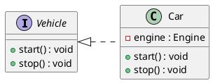
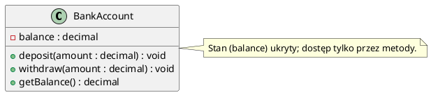
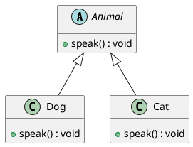
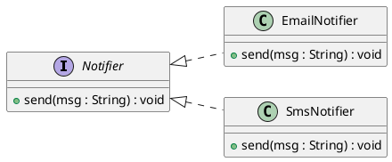

# Paradygmaty obiektowości

W tym rozdziale wprowadzimy podstawowe idee programowania zorientowanego obiektowo (OOP). Skupimy się na czterech filarach OOP oraz na kluczowych pojęciach: klasa, obiekt, interfejs/typ abstrakcyjny.

## I. Po co OOP?
OOP pomaga modelować świat jako zbiór współpracujących ze sobą obiektów. Ułatwia:
- modularność (łatwiejsze dzielenie kodu),
- utrzymanie i rozwój (enkapsulacja ukrywa szczegóły),
- ponowne wykorzystanie (dziedziczenie i kompozycja),
- elastyczność (polimorfizm pozwala pisać kod ogólny dla wielu typów).

## II. Cztery filary OOP

#### 1.) Abstrakcja

Dobrym przykładem abstrakcji w życiu są opisy oferowanych stanowisk pracy w firmie. 
Nazwa stanowiska to jedno, a obowiązki pracownika na tym stanowisku to drugie.

Wyobraź sobie, że tworzysz schemat organizacji Twojej przyszłej firmy. 
Możesz na przykład podzielić obowiązki administracyjne pomiędzy osobami pracującymi na różnych stanowiskach.
Możesz zrobić to samo z obowiązkami prezesa i rozdzielić je między dyrektora finansowego, dyrektora technologicznego, dyrektora działu marketingu oraz dyrektora działu HR. 
Możesz także łączyć obowiązki i na przykład scalić stanowisko kierownika biura i rekrutera w jedno.

Załóżmy, że najpierw wymyśliłeś/aś nazwy stanowisk w Twojej firmie, a dopiero później przydzielasz obowiązki do każdego z nich. 
**To właśnie jest abstrakcja – rozdzielanie czegoś dużego i monolitycznego na wiele małych części.**  
  
Z perspektywy programistycznej abstrakcja odpowiednio dzieli program na obiekty.

Duży program zazwyczaj można przedstawić jako **obiekty** oddziaływające na siebie na jeden z wielu różnych sposobów. 
Abstrakcja pozwala wybrać najważniejsze właściwości pewnego obiektu i pominąć wszystko to, co jest mniej ważne.

Abstrakcja jest jak strategia militarna. Jeśli wybierzesz niewłaściwą, problemów nie naprawi żaden genialny strateg.  

> Abstrakcja:  
> - polega na koncentracji tylko na kluczowych informacjach o danym przedmiocie, ignorując mniej istotne detale,  
> - w programowaniu abstrakcja umożliwia tworzenie klarownych modeli obiektów, ukrywając skomplikowane szczegóły i prezentując system w sposób abstrakcyjny,  
> - inaczej mówiąc, wyodrębnia istotne cechy i operacje, pomijając detale implementacyjne.
> - narzędzia: interfejsy, klasy abstrakcyjne (Java), klasy bazowe, protokoły/ABC (Python).

#### 2.) Enkapsulacja (hermetyzacja)
Enkapsulacja ma zadanie poprawiać interakcję między obiektami poprzez ich uproszczenie.  

Najlepszym sposobem na uproszczenie czegoś jest ukrycie tej skomplikowanej części przed tymi, którzy nie chcą o niej słyszeć. 
Na przykład, jeśli usiądziesz za sterami w Boeingu, to bardzo dużo czasu zajmie Ci zrozumienie, w jaki sposób kieruje się samolotem:

Z drugiej strony są jeszcze pasażerowie na pokładzie, dla których wszystko wydaje się prostsze: kupują bilet, wsiadają na pokład, startują, lądują i koniec. 
Możesz bez problemu przemieszczać się między kontynentami, wiedząc jedynie, jak «kupić bilet» i «wsiąść na pokład». 
Z ich perspektywy nie widać zawiłości całego procesu, związanego z przygotowaniem samolotu, startem, lądowaniem i wieloma potencjalnymi zagrożeniami. 
Nawet nie wspomnieliśmy o nawigacji satelitarnej, autopilocie i centrum kontroli lotów! 
A jednak to wszystko upraszcza nasze życie.

W programowaniu enkapsulacja to «ukrycie implementacji». 
Nasza klasa może zawierać setki metod i implementować bardzo złożone działania w przeróżnych sytuacjach. 
Ale wszystkie te metody możemy ukryć przed wzrokiem ciekawskich (oznaczając je jako «private») i pozostawić jedynie dwie czy trzy metody, aby oddziaływały z innymi klasami (oznaczając je jako «public»). 
Dzięki temu wszystkie inne klasy w naszym programie będą tylko widziały i wywoływały jedynie te kilka metod w tej klasie. 
Cała złożoność danej klasy będzie schowana, dokładnie tak, jak kokpit znajdujący się poza wzrokiem radosnych pasażerów.

#### 3. Dziedziczenie.
Dziedziczenie jest pojęciem znanym zarówno w programowaniu, jak i w życiu. 
W programowaniu dziedziczenie jest specjalną relacją między dwiema klasami. 
Natomiast w prawdziwym życiu dziedziczenie jest dużo ciekawsze.
Jeśli chcemy w życiu coś stworzyć, mamy dwie możliwości:
  - zabrać się do tego od podstaw, wkładając mnóstwo czasu i wysiłku.
  - zrobić to, używając rzeczy, które już istnieją.

A oto najlepsza strategia: bierzemy dobre, już istniejące rozwiązanie, przerabiamy je i dopracowujemy tak, aby odpowiadało naszym potrzebom, a następnie je implementujemy.
Pomyśl o ewolucji człowieka. Jeśli prześledzimy ten proces od samego powstania życia na naszej planecie, zdamy sobie sprawę, że minęły miliardy lat. 
Lecz jeśli za początek człowieka uznamy małpę, to czas ten skróci się do kilku milionów lat. 
Tworzenie czegoś od samego początku zajmuje więcej czasu. Dużo więcej.
W programowaniu jest podobnie, możemy utworzyć jakąś klasę, bazując na innej. 
Nowa klasa będzie wtedy potomkiem (spadkobiercą) klasy już istniejącej. 
Jest to bardzo pomocne, zwłaszcza kiedy posiadasz już klasę, która zawiera 80-90% potrzebnych Ci danych i metod. 
Po prostu należy wtedy zadeklarować odpowiednią klasę jako klasę macierzystą Twojej nowej klasy. 
Wszystkie dane i metody klasy macierzystej staną się automatycznie częścią tej nowej klasy. Wygodne, prawda?  

#### 4) Polimorfizm.

Polimorfizm w programowaniu jest koncepcją, zgodnie z którą różne implementacje zostały ukryte w tym samym interfejsie. 
Odpowiednią analogią tej sytuacji w prawdziwym życiu jest prowadzenie samochodu.
Jeśli ktoś potrafi prowadzić ciężarówkę, to może także usiąść za kółkiem sportowego auta bądź ambulansu. 
Taka osoba może prowadzić każdego rodzaju samochód, ponieważ wszystkie one mają taki sam panel kontrolny: kierownica, pedały i skrzynia biegów. 
Mimo że samochody wewnątrz mogą wyglądać różnie, wciąż działają one na takiej samej zasadzie.

Wracając do programowania – polimorfizm pozwala nam wchodzić w interakcje z obiektami różnych klas (zazwyczaj z takimi ze wspólnym przodkiem) w ten sam sposób. 
Trudno jest nie zauważyć tych możliwości. Jest to tym ważniejsze, im większy jest nasz program.

#### 5.) Paradygmaty obiektowości – najważniejsze idee

- Obiekt: posiada stan (dane/pola) i zachowanie (metody). Myślimy o nim jak o „rzeczy” w programie, która coś „wie” (stan) i coś „robi” (metody).
- Klasa: "przepis"/szablon do tworzenia obiektów. Definiuje wspólne pola i metody; obiekty są instancjami klas.
- Komunikacja przez wiadomości/metody: obiekty współpracują, wywołując wzajemnie swoje metody, nie znając szczegółów implementacji.
- Enkapsulacja (ukrywanie implementacji): szczegóły wewnętrzne klasy są schowane; na zewnątrz wystawiane jest proste, stabilne API.
- Abstrakcja: modelujemy tylko istotne cechy problemu, ignorując detale niepotrzebne do bieżącego celu.
- Dziedziczenie: możliwość tworzenia nowych klas na bazie istniejących w celu ponownego użycia i rozszerzania zachowań.
- Polimorfizm: to samo wywołanie (przez interfejs/klasę bazową) może prowadzić do różnych zachowań w zależności od rzeczywistego typu obiektu.
- Modularność i odpowiedzialności: duży system dzielimy na mniejsze, współpracujące obiekty o jasno określonych rolach. Ułatwia to rozwój i testowanie.

> W skrócie: w paradygmacie obiektowym program postrzegamy jako sieć współpracujących obiektów, które ukrywają implementację, komunikują się przez metody i mogą być różnie wyspecjalizowane dzięki dziedziczeniu i polimorfizmowi.

## III. Cztery filary – rozwinięcie 
> opcjonalnie do przejrzenia, będziemy to rozwijać w kolejnych lekcjach
### A) Abstrakcja
- Cel: skupić się na istotnych cechach obiektu i uprościć interfejs jego użycia.
- Narzędzia:
  - Java: interfejsy, klasy abstrakcyjne, metody abstrakcyjne.
  - Python: klasy bazowe, moduł abc/Protocol, metody abstrakcyjne.
- Wskazówki:
  - Modeluj „co” obiekt robi, a nie „jak” to robi.
  - Oddziel kontrakt (interfejs) od implementacji.
- Pułapki: zbyt wczesna lub zbyt agresywna abstrakcja prowadzi do nadmiaru poziomów pośrednich.

Diagram (kontrakt a implementacja):  

### B) Enkapsulacja (hermetyzacja)
- Cel: ukryć stan i szczegóły implementacji; wystawić stabilne API.
- Narzędzia:
  - Java: private/protected/public, gettery/settery, immutability.
  - Python: konwencje _protected, __name mangling, @property.
- Wskazówki:
  - Zasada: minimalny interfejs publiczny, reszta prywatna.
  - Wymuszaj niezmienność, gdy to możliwe (np. obiekty wartościowe).
- Pułapki: „przecieki” szczegółów przez zbyt rozbudowane gettery/settery.

Diagram (ukryty stan, kontrolowany dostęp):  

### C) Dziedziczenie
- Cel: ponownie użyć kod i rozszerzać zachowania przez relację „jest” (is-a).
- Wskazówki:
  - Preferuj kompozycję, jeśli relacja to „ma” (has-a).
  - Nie nadużywaj głębokich hierarchii; trzymaj klasy spójne.
- Pułapki: kruche podstawy (zmiany w bazie łamią potomków), „diamencik” w wielodziedziczeniu (Python).

Diagram (relacja is-a):  

### D) Polimorfizm
- Cel: jedno wywołanie – wiele zachowań w zależności od rzeczywistego typu.
- Odmiany: polimorfizm przez dziedziczenie/przesłanianie (Java, Python), interfejsy/protokoły, duck typing (Python).
- Korzyści: kod działający na poziomie abstrakcji, mniejsza liczba instrukcji warunkowych.

Diagram (wywołanie przez typ bazowy/interfejs):  

#### Dobre praktyki (skrót)
- Zasady SOLID (wysoki poziom): SRP, OCP, LSP, ISP, DIP.
- Kompozycja > dziedziczenie, gdy to możliwe.
- Minimalizuj zależności; ujawniaj tylko to, co potrzebne (enkapsulacja).

