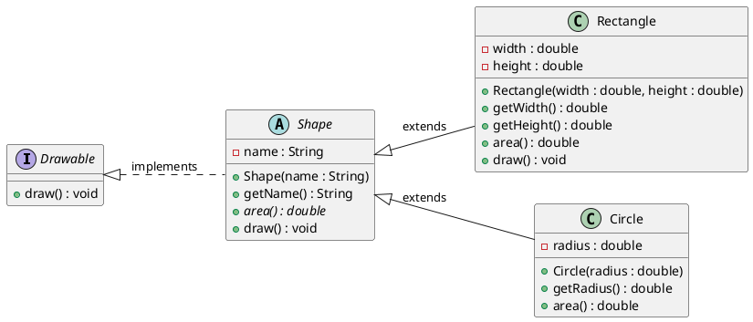
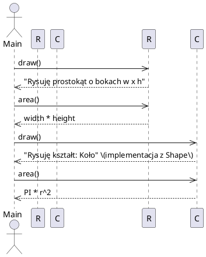

# Paradygmaty obiektowości

W tym rozdziale wprowadzimy podstawowe idee programowania zorientowanego obiektowo (OOP). Skupimy się na czterech filarach OOP oraz na kluczowych pojęciach: klasa, obiekt, interfejs/typ abstrakcyjny.

## Po co OOP?
OOP pomaga modelować świat jako zbiór współpracujących ze sobą obiektów. Ułatwia:
- modularność (łatwiejsze dzielenie kodu),
- utrzymanie i rozwój (enkapsulacja ukrywa szczegóły),
- ponowne wykorzystanie (dziedziczenie i kompozycja),
- elastyczność (polimorfizm pozwala pisać kod ogólny dla wielu typów).

## Kluczowe pojęcia
- Klasa – przepis (szablon) opisujący strukturę (pola) i zachowania (metody).
- Obiekt – instancja klasy; „żywy” byt w czasie wykonywania programu.
- Interfejs/typ abstrakcyjny – kontrakt określający, jakie operacje są dostępne, bez narzucania implementacji.

## Cztery filary OOP
1. Abstrakcja
   - Wyodrębnia istotne cechy i operacje, pomijając detale implementacyjne.
   - Narzędzia: interfejsy, klasy abstrakcyjne (Java), klasy bazowe, protokoły/ABC (Python).
2. Enkapsulacja (hermetyzacja)
   - Ukrywanie stanu i szczegółów wewnętrznych obiektu; kontrolowany dostęp przez metody.
   - Narzędzia: modyfikatory dostępu (Java), konwencje i właściwości `@property` (Python).
3. Dziedziczenie
   - Tworzenie nowych klas na podstawie istniejących; ponowne użycie kodu, rozszerzanie zachowań.
   - Uwaga: preferuj kompozycję nad dziedziczeniem, gdy relacja „ma” jest naturalniejsza niż „jest”.
4. Polimorfizm
   - Jedno wywołanie – wiele zachowań, zależnie od rzeczywistego typu obiektu.
   - Przykłady: przesłanianie metod, wywołania przez interfejs/bazę, duck typing (Python).

## Diagramy UML – wizualizacja idei OOP
Poniższe diagramy korzystają z notacji PlantUML. Pod diagramami znajdziesz krótkie objaśnienia.

### 1) Diagram klas: interfejs, klasa bazowa i dwie implementacje

Opis:
- Abstrakcja: Drawable to kontrakt; Shape częściowo implementuje zachowanie wspólne dla figur.
- Enkapsulacja: pola są prywatne (-), dostęp kontrolowany przez metody publiczne (+).
- Dziedziczenie: Rectangle i Circle rozszerzają Shape.
- Polimorfizm: ta sama metoda area()/draw() wywołana przez referencję Shape/Drawable działa różnie w zależności od rzeczywistej klasy.

### 2) Diagram sekwencji: polimorficzne wywołanie draw() i area()
Poniższy scenariusz odpowiada pętli w `Main.java`.

Opis:
- Polimorfizm dynamiczny: to ten sam kod pętli, ale inne obiekty reagują odmiennie.
- Wspólne API: interfejs/klasa bazowa pozwalają pisać kod niezależny od konkretnej klasy.

### 3) Diagram obiektów: stan dwóch instancji
```plantuml
@startuml
object RectangleInstance as R {
  width : double = 3
  height : double = 4
}
object CircleInstance as C {
  radius : double = 2
}
@enduml
```
Opis:
- Przykładowe wartości pokazują enkapsulację stanu wewnętrznego każdej instancji.

## Dobre praktyki (skrót)
- Zasady SOLID (wysoki poziom): SRP, OCP, LSP, ISP, DIP.
- Kompozycja > dziedziczenie, gdy to możliwe.
- Minimalizuj zależności; ujawniaj tylko to, co potrzebne (enkapsulacja).

## Przykłady kodu
Przygotowane zostały krótkie przykłady dla Java i Python, demonstrujące filary OOP.

- Java: folder `Java/01`
  - Kluczowe pliki: `Main.java`, `Shape.java` (zawiera Drawable, Shape, Rectangle, Circle).
- Python: folder `Python/01`
  - Plik: `oop_pillars.py` z analogicznymi przykładami.

W komentarzach w plikach znajdziesz wskazówki, który fragment ilustruje dany filar.

## Jak uruchomić
- Java:
  - Wejdź do katalogu `Java/01` i skompiluj/uruchom: `javac Main.java && java Main`
- Python:
  - Uruchom: `python3 Python/01/oop_pillars.py`

Powodzenia!