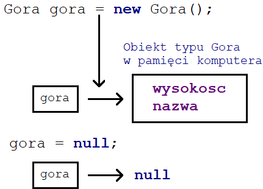

Źródło: https://kursjava.com/klasy/pola-klas/

Jak już wiemy, pola klas to pewne właściwości, które opisują obiekty danej klasy. Dla przykładu, klasa `Ksiazka` miała pola tytul, autor, oraz cena, a klasa Samochod – pola kolor i predkosc.

Każdy obiekt klasy (tzn. każda jej instancja, czyli egzemplarz) posiada własny zestaw zdefiniowanych w tej klasie pól – ustawienie koloru obiektu `czerwonySamochod` nie ma wpływu na kolor samochodu `zielonySamochod`:

    Samochod zielonySamochod = new Samochod();
    zielonySamochod.ustawKolor("Zielony");
    Samochod czerwonySamochod = new Samochod();
    czerwonySamochod.ustawKolor("Czerwony");

Pola klas to po prostu zmienne – mają one swój typ oraz nazwę, oraz mogą mieć różnego rodzaju modyfikatory. Przykładem są modyfikatory dostępu public oraz private, które poznaliśmy w poprzednim podrozdziale.  
Wyznaczają one, czy pole klasy jest publiczne (dostępne dla całego zewnętrznego świata), czy prywatne (dostępne tylko wewnątrz klasy).

Typem pól klasy mogą być zarówno typy prymitywne (na przykład `int` czy `boolean`), jak i typy złożone, czyli klasy zdefiniowane przez nas lub innych programistów.  
Korzystaliśmy już z tej możliwości definiując pola typu `String` w klasie `Ksiazka`, która miała pole `autor` oraz w klasie `Samochod`, która miała pole `kolor`.
## Pola klas a zmienne definiowane w metodach

Chociaż pola klas to zmienne, to jest kilka istotnych różnic pomiędzy polami klas a zmiennymi definiowanymi wewnątrz metod.
### Zapamiętywanie wartości

W rozdziale o metodach dowiedzieliśmy się, że zmienne zdefiniowane w metodach tracą swoje wartości po zakończeniu metody – są one lokalne dla metody, w której zostały zdefiniowane.

Pola klas, natomiast, zapamiętują swoje wartości. Wielokrotnie korzystaliśmy z tej właściwości w poprzednich rozdział, na przykład, w poniższym programie:
Fragment z pliku Ksiegarnia.java
```java
    Ksiazka lokomotywa = new Ksiazka();
    lokomotywa.tytul = "Lokomotywa"; // 1
    lokomotywa.autor = "Julian Tuwim"; // 2
    lokomotywa.ustawCene(29.99); // 3
    System.out.println(lokomotywa); // 4
```
Ustawiamy trzy pola obiektu `lokomotywa` – dwa z nich bezpośrednio (1) (2), a jedno poprzez metodę `ustawCene` (3):
Fragment z pliku Ksiazka.java
```java
    public void ustawCene(double nowaCena) {
      if (czyCenaJestPoprawna(nowaCena)) {
        cena = nowaCena;
      } else {
        System.out.println("Cena " + nowaCena + " jest nieprawidlowa!");
      }
    }
```
Na końcu pierwszego z powyższych fragmentów kodu wypisujemy na ekran tekstową reprezentację obiektu lokomotywa (4) i widzimy, że wartość pola cena ustawiona w metodzie `ustawCene`, po zakończeniu tej metody, nadal jest przechowywana (jest "zapamiętana") w polu cena obiektu `lokomotywa`:
> Ksiazka o tytule Lokomotywa, ktorej autorem jest Julian Tuwim, kosztuje 29.99

Dopóki obiekt istnieje, wartości nadane jego polom są zachowane.
W dalszej części rozdziału o klasach dowiemy się, co wyznacza długość istnienia tworzonych przez nas obiektów.

### Inicjalizacja i domyślne wartości typów prymitywnych

Podobnie jak w przypadku zmiennych, polom klas możemy nadać wstępne wartości, tzn. zainicjalizować je. Utworzone obiekty będą miały od razu przypisane te wartości do odpowiednich pól:
Nazwa pliku: Statek.java
```java
    public class Statek {
      public int liczbaZagli = 2; // 1
      public String nazwa = "nienazwany statek"; // 2
      
      public String toString() {
        return "Statek o nazwie '" + nazwa + "' ma " +
            liczbaZagli + " zagle.";
      }
      
      public static void main(String[] args) {
        Statek nieznanyStatek = new Statek(); // 3
        Statek hammond = new Statek(); // 4
        hammond.nazwa = "Hammond"; // 5
        System.out.println(nieznanyStatek);
        System.out.println(hammond);
      }
    }
```
Klasa `Statek` ma dwa pola publiczne `liczbaZagli` oraz `nazwa` – oba pola inicjalizujemy wartościami, odpowiednio, 2 (1) oraz "nienazwany statek" (2). Tworzymy dwa nowe obiekty klasy Statek (3) (4). Drugiemu z nich przypisujemy nową nazwę (5), a następnie wypisujemy na ekran ich tekstowe reprezentacje, w wyniku czego na ekranie zobaczymy:
Statek o nazwie 'nienazwany statek' ma 2 zagle.
Statek o nazwie 'Hammond' ma 2 zagle.

Jak widać, pomimo że nie ustawiliśmy pól `liczbaZagli` obu obiektów po ich utworzeniu, oraz pola nazwa pierwszego statku, to i tak oba statki mają już w tych polach wartości – te, którymi je zainicjowaliśmy w (1) i (2).

Z rozdziału o zmiennych wiemy, że w metodach nie możemy korzystać ze zmiennych, którym nie nadamy wstępnej wartości:

    public class UzycieNiezainicjalizowanejZmiennej {
      public static void main(String[] args) {
        int x;
        System.out.println("Wartosc x wynosi: " + x);
      }
    }

Próba kompilacji powyższego programu kończy się następującym błędem:
```sh
UzycieNiezainicjalizowanejZmiennej.java:5: error: variable x might not have been initialized
      System.out.println("Wartosc x wynosi: " + x);
                                                  ^
1 error
```

Zobaczmy, co się stanie, gdy spróbujemy odnieść się do pól klasy, którym nie nadaliśmy żadnych wartości:
Nazwa pliku: Adres.java
```java
    public class Adres {
      private String miasto;
      private String ulica;
      private int nrDomu;
      private int nrMieszkania;
      
      public String toString() {
        return "Adres " + miasto + ", ulica " + ulica +
          " " + nrDomu + " m. " + nrMieszkania;
      }
      
      public static void main(String[] args) {
        Adres mojAdres = new Adres(); // 1
        System.out.println(mojAdres); // 2
      }
    }
```
Klasa `Adres` przechowuje dane adresowe w czterech polach – dwóch stringach i dwóch liczbach typu `int`.  
Tworzymy nowy obiekt tej klasy (1), a następnie, bez przypisania wartości do pól tego obiektu, wypisujemy na ekran jego tekstową reprezentację (2) – spowoduje to automatyczne użycie metody toString, która używa pól miasto, ulica, nrDomu, oraz nrMieszkania.

Jaki będzie efekt próby kompilacji powyższego kodu?

Kod skompiluje się bez błędów, a po uruchomieniu zobaczymy na ekranie:
```sh
Adres null, ulica null 0 m. 0
```

Skąd w wyniku wzięły się zera jako `nrDomu` oraz `nrMieszkania`, czym jest dziwny tekst `null`, a także dlaczego powyższy kod w ogóle się skompilował, skoro nie nadaliśmy polom obiektu `mojAdres` żadnych wartości?

Pola klas różnią się tym od zmiennych lokalnych (zdefiniowanych w metodach), że mają wartości domyślne, nadawane im zawsze automatycznie, jeżeli my, jako programiści, nie zainicjujemy ich początkowymi wartościami (tak jak zrobiliśmy to w przypadku pól klasy `Statek`).

Każdy z 8 typów prymitywnych ma swoją wartość domyślną:  

| Typ     | Wartość domyślna |
|---------|------------------|
| byte    | 	0             |  
| short   | 	0             |
| int     | 	0             |
| long    | 0L               |
| float   | 	0.0f          |
| double  | 	0.0d          |
| char	   | '\u0000'         |
| boolean | 	false         |

Wartość domyślna liczb typu `byte`, `short`, oraz `int`, to zero. Wartości typu `long` definiujemy dopisując na końcu liczby znak `L` (jak Long).

Domyślne wartości pól typów rzeczywistych to, odpowiednio, 0.0f i 0.0d – f używamy dla oznaczenia liczb o mniejszej precyzji, typu `float`, a literą d kończymy wartości typu `double` (chociaż nie jest to wymagane – liczby rzeczywiste w Javie są domyślnie typu `double`).

Pola typu `boolean` mają zawsze domyślnie ustawioną wartość `false`. Pola typu `char`, natomiast, mają wartość '\u0000', która jest zapisem znaku, który reprezentuje "brak wartości" w systemie Unicode (jest to system, który definiuje, jak zapisywać znaki ze wszystkich alfabetów języków na świecie w świecie komputerów).
### Wartość null

A jaką wartość domyślną mają pola typów referencyjnych (tzn. typów złożonych, definiowanych przez klasy), jak na przykład w klasie `Adres` pola `miasto` i `ulica`, które są typu `String`?

Ta wartość to null, jak widać na ekranie po wypisaniu obiektu `mojAdres` w przykładzie z poprzedniego podrozdziału:
> Adres null, ulica null 0 m. 0

`Null` w programowaniu to wartość szczególna – występuje w większości języków programowania i w bazach danych – jego znaczenie to "brak wartości" (nie mylić z pustą wartością!).

Pola klas typu referencyjnego mają domyślną wartość `null`, jeżeli nic do nich nie przypiszemy – oznacza to po prostu, że nie wskazują one na żaden obiekt. Jak pamiętamy z rozdziału Przechowywane wartości, zmienne typów złożonych (czyli klas) to tak naprawdę referencje (odniesienia) do utworzonych obiektów. Gdy zmienna typu złożonego nie wskazuje na żaden obiekt, oznacza to, że jej wartość to null. Przypomnijmy także, iż tablice to także typ złożony i pola klas typu tablicowego także mają domyślną wartość null.

Próba odniesienia się do pola klasy lub wywołanie metody na rzecz obiektu, który jest nullem (nie ma przypisanego żadnego obiektu) kończy się błędem wykonywania programu. Spójrzmy na poniższy przykład:
Nazwa pliku: Gora.java
```java
    public class Gora {
      public int wysokosc;
      public String nazwa;
      
      public double policzWysokoscWKm() {
        return wysokosc / 1000.0;
      }
      
      public static void main(String[] args) {
        Gora pewnaGora = new Gora();
        System.out.println("Wysokosc gory: " + pewnaGora.wysokosc); // 1
        System.out.println("Nazwa gory: " + pewnaGora.nazwa); // 2
        // blad wykonywania programu!
        System.out.println("Nazwa gory wielkimi literami: " +
            pewnaGora.nazwa.toUpperCase()); // 3
      }
    }
``` 

Powyższy program kompiluje się bez problemów, ale po uruchomieniu jego działanie kończy się błędem – na ekranie zobaczymy następujący komunikat:
```sh
Wysokosc gory: 0
Nazwa gory: null
Exception in thread "main" java.lang.NullPointerException
    at Gora.main(Gora.java:16)
```

W metodzie `main` tworzymy nowy obiekt typu `Gora`. Wypisujemy najpierw na ekran wartości pól tego obiektu: `wysokosc` (1) oraz `nazwa` (2).  
Ważne jest tutaj to, że tym polom nie nadajemy żadnych wartości – zostaną więc one zainicjowane wartościami domyślnymi podczas tworzenia obiektu typu `Gora` – będą to wartości: 0 dla pola `wysokosc` oraz `null` dla pola `nazwa`.

Do tego momentu program działa poprawnie, ale w kolejnej linii (3) próbujemy wywołać metodę `toUpperCase` na rzecz pola typu `String` o nazwie `nazwa` – skoro do tego pola nie przypisaliśmy żadnej wartości, to na rzecz jakiego obiektu metoda `toUpperCase` ma zostać wywołana?

To jest właśnie powodem błędu (który widać powyżej) wykonania naszego programu – próbujemy wywołać metodę `toUpperCase` na nieistniejącym obiekcie – jest to "słynny" błąd `Null Pointer Exception` – będziemy się na niego natykać od czasu do czasu. Zawsze, gdy zobaczymy ten błąd, będzie to świadczyło o tym, że próbujemy działać na obiekcie, który jest nullem.

Wartością `null` można operować jak każdą inną wartością – można ją, na przykład, przypisać do zmiennej typu złożonego:
Fragment pliku: Gora.java
```java
    public static void main(String[] args) {
      Gora pewnaGora = new Gora();
      System.out.println("Wysokosc gory: " + pewnaGora.wysokosc);
      System.out.println("Nazwa gory: " + pewnaGora.nazwa);
      
      // zakomentowane, bo powoduje blad NullPointerException!
      // System.out.println("Nazwa gory wielkimi literami: " + 
      //     pewnaGora.nazwa.toUpperCase());
      
      pewnaGora = null; // 1
      System.out.println("Wysokosc gory w kilometrach: " +
          pewnaGora.policzWysokoscWKm()); // 2
    }
```

W zmienionej metodzie `main` z klasy `Gora`, po wypisaniu domyślnych wartości pól obiektu `pewnaGora`, przypisujemy do tej zmiennej `null` (1) – od tej pory, `pewnaGora` nie wskazuje już na żaden obiekt, a do obiektu typu `Gora`, który utworzyliśmy na początku metody `main`, tracimy dostęp! 
Nic już na ten obiekt nie wskazuje:  

  

### Przypisanie wartosci null do zmiennej

Po przypisaniu nulla do obiektu `pewnaGora`, próbujemy wypisać na ekran wysokość w kilometrach (2). Jaki będzie teraz efekt uruchomienia tego programu?

Ponownie zobaczymy na ekranie błąd `Null Pointer Exception` – w końcu próbujemy wywołać metodę `policzWysokoscWKm` na rzecz nullowego obiektu pewnaGora!
```shell
Wysokosc gory: 0
Nazwa gory: null
Exception in thread "main" java.lang.NullPointerException
    at Gora.main(Gora.java:22)
```
Czy możemy w takim razie w jakiś sposób uchronić się przed działaniem na nullowych obiektach?

Tak – zmienne typu referencyjnego można przyrównywać do wartości `null`, aby sprawdzić, czy wskazują na jakiś obiekt, czy nie – możemy poprawić poprzedni przykład, by korzystał tej funkcjonalności:
Fragment pliku: Gora.java
```java
    pewnaGora = null;
    if (pewnaGora != null) { // 1
      System.out.println("Wysokosc gory w kilometrach: " +
          pewnaGora.policzWysokoscWKm());
    } else { // 2
      System.out.println("Obiekt pewnaGora to null!");
    }
```
Do poprzedniego przykładu dodaliśmy instrukcję `if`, w której sprawdzamy, czy `pewnaGora` jest różna od nulla (1), czyli sprawdzamy "czy pewnaGora wskazuje na jakiś obiekt?".  
Jeżeli tak, to wypiszemy na ekran wysokość w kilometrach, a jeżeli nie (2), to wypiszemy drugi komunikat.

Porównując zmienne typu referencyjnego do wartości null możemy używać zarówno operatora != (nierówne) jak i operatora == (równe).  
Pierwszy sprawdzi w tym kontekście, czy zmienna typu referencyjnego pokazuje na jakiś obiekt (bo pokazuje na coś innego niż null), a drugi (operator ==) odpowie na pytanie: "Czy zmienna pokazuje na nic?":  

| Dane 	| nazwa == null 	| nazwa != null |
| -------- | ------- |------- |
|String nazwa = "Giewont"; 	|false 	|true|
|String nazwa = "Giewont"; <br/>nazwa = null; 	|true 	|false|

W efekcie działania programu z dodanym powyższym warunkiem, na ekranie zobaczymy:
Wysokosc gory: 0
Nazwa gory: null
Obiekt pewnaGora to null!

Tym razem program nie zakończył się błędem, ponieważ zabezpieczyliśmy się przed potencjalną próbą działania na nullowym obiekcie.

Pytanie: co by się stało, gdybyśmy spróbowali przypisać do zmiennej typu prymitywnego wartość null? Zmienne typu prymitywnego nigdy nie mogą mieć wartości null – próba przypisania `null` do zmiennej, na przykład, typu `int`, spowodowałaby błąd kompilacji:
Nazwa pliku: NullZmiennaPrymitywna.java
```java
    public class NullZmiennaPrymitywna {
      public static void main(String[] args) {
        int x = null; // 1
        System.out.println(x);
      }
    }
```
W powyższym programie próbujemy przypisać do zmiennej typu `int` wartość `null` (1). Próba kompilacji powyższego programu zakończy się następującym błędem:
```sh
NullZmiennaPrymitywna.java:3: error: incompatible types:  cannot be converted to int
      int x = null;
              ^
1 error
``` 

> Zapamiętajmy: pola typów prymitywnych (jak `int` i `boolean`) mają swoje domyślne wartości, natomiast pola typów złożonych (czyli klas) mają wartość domyślną `null`, co oznacza, że nie wskazują one na żaden obiekt.

Opisane powyżej zagadnienia związane z wartościami domyślnymi oraz wartością `null` są ważne i mogą na początku wydawać się skomplikowane, dlatego spojrzymy na jeszcze jeden przykład, w którym przećwiczymy sobie te zagadnienia.

W kolejnych fragmentach kodu będziemy bazować na poniższej klasie Uczen:
Nazwa pliku: Uczen.java
```java
    public class Uczen {
      public String nazwisko;
      public int[] oceny;
      public int rokUrodzenia;
      public double policzSredniaOcen() {
        double sumaOcen = 0;
        for (int i = 0; i < oceny.length; i++) {
          sumaOcen += oceny[i];
        }
        return sumaOcen / oceny.length;
      }
    }
```
Jakiego rodzaju pola zawiera ta klasa? Ile jest pól typu prymitywnego, a ile złożonego?

Klasa `Uczen` ma jedno pole typu prymitywnego – `rokUrodzenia`, oraz dwa pola typów złożonych `nazwisko` i `oceny`.  
Jak już wspominaliśmy, typy tablicowe także są typami referencyjnymi (złożonymi), więc zarówno pole nazwisko typu `String`, jak i `pole` oceny typu `int[]`, będą miały domyślną wartość `null`.  


Skoro pole oceny ma domyślnie przypisaną wartość `null`, to czy powyższy kod klasy `Uczen` jest poprawny? Czy moglibyśmy w nim coś poprawić?

Spróbujmy policzyć średnią ocen używając metody `policzSredniaOcen` obiektu typu `Uczen`:
Nazwa pliku: Szkola.java
```java
    public class Szkola {
      public static void main(String[] args) {
        Uczen pewnyUczen = new Uczen();
        System.out.println(
            "Srednia ocen: " + pewnyUczen.policzSredniaOcen()
        );
      }
    }
```
Co zostanie wypisane na ekranie?

Wykonanie naszego programu zakończy się błędem Null Pointer Exception, który już poznaliśmy:
```shell
Exception in thread "main" java.lang.NullPointerException
    at Uczen.policzSredniaOcen(Uczen.java:11)
    at Szkola.main(Szkola.java:7)
```
Co spowodowało taki wynik? Przyjrzyjmy się jeszcze raz metodzie policzSredniaOcen:
```java
    public double policzSredniaOcen() {
      double sumaOcen = 0;
      for (int i = 0; i < oceny.length; i++) { // 1
        sumaOcen += oceny[i];
      }
      return sumaOcen / oceny.length;
    }
```
Problem wystąpił w pierwszej linii pętli `for` (1).  
Nie przypisaliśmy żadnej wartości polu oceny obiektu `pewnyUczen`, więc oceny nie wskazują na żadną tablicę, lecz na `null`.  
Gdy wywołujemy metodę `policzSredniaOcen` na rzecz obiektu `pewnyUczen`, to w pętli (1) próbujemy odczytać liczbę elementów tablicy oceny, która nie wskazuje na żadną tablicę!  
Dlatego wykonanie programu zakończyło się błędem.

Jak już wiemy, może sprawdzić, czy zmienna "wskazuje na nic" (`null`) sprawdzając, czy jest równa `null` – poprawiona wersja metody `policzSredniaOcen` wygląda następująco:
```java
    public double policzSredniaOcen() {
      if (oceny == null) { // 1
        return 0;
      }
      double sumaOcen = 0;
      for (int i = 0; i < oceny.length; i++) {
        sumaOcen += oceny[i];
      }
      return sumaOcen / oceny.length;
    }
```
Dodaliśmy warunek sprawdzający, czy oceny są nullem (1). Jeżeli tak, to kończymy działanie metody, używając instrukcji `return`, by zwrócić 0.  
Teraz, po uruchomieniu klasy `Szkola`, na ekranie zobaczymy: 
>"Srednia ocen: 0.0".

A co zobaczymy na ekranie, gdy spróbujemy wypisać rok urodzenia ucznia?
```java
    Uczen pewnyUczen = new Uczen();
    System.out.println("Rok urodzenia: " + pewnyUczen.rokUrodzenia);
```
Jako, że `rokUrodzenia` to zmienna typu prymitywnego, to zostaje jej nadana wartość domyślna – dla typu int jest to 0. Na ekranie zobaczymy:
> Rok urodzenia: 0

Spróbujemy wypisać nazwisko ucznia wielkimi literami:
```java
    Uczen pewnyUczen = new Uczen();
    System.out.println("Nazwisko: " + pewnyUczen.nazwisko.toUpperCase());
```
Tym razem program ponownie zakończy się błędem wykonania i ponownie zobaczymy błąd `Null Pointer Exception` – nie nadaliśmy polu nazwisko żadnej wartości – jako, że jest to pole typu złożonego (`String`), będzie automatycznie zainicjalizowane wartością `null`.   
W powyższym fragmencie kodu próbujemy wywołać metodę `toUpperCase` na nullowym obiekcie, co jest niedozwolone, o czym świadczy błąd wykonania programu:
```shell
Exception in thread "main" java.lang.NullPointerException
    at Szkola.main(Szkola.java:9)
```
Spróbujmy na koniec nadać wartości polom obiektu `pewnyUczen`:  
Nazwa pliku: Szkola.java
```java
    public class Szkola {
      public static void main(String[] args) {
        Uczen pewnyUczen = new Uczen();
        pewnyUczen.nazwisko = "Kowalski";
        pewnyUczen.rokUrodzenia = 2000;
        pewnyUczen.oceny = new int[] { 4, 5, 5, 4, 5};
        System.out.println("Nazwisko: " + pewnyUczen.nazwisko.toUpperCase());
        System.out.println("Rok urodzenia: " + pewnyUczen.rokUrodzenia);
        System.out.println("Srednia ocen: " + pewnyUczen.policzSredniaOcen());
      }
    }
```
Tym razem nie zobaczymy na ekranie żadnych błędów:
```sh
Nazwisko: KOWALSKI
Rok urodzenia: 2000
Srednia ocen: 4.6
```  

### Brak wymagania definicji przed użyciem

W rozdziale o instrukcjach warunkowych dowiedzieliśmy się, że zmienne muszą być zdefiniowane w metodach przed pierwszym użyciem zmiennej:  
Nazwa pliku: Rozdzial_04__Instrukcje_warunkowe/UzyciePrzedDefinicja.java
```java
    public class UzyciePrzedDefinicja {
      public static void main(String[] args) {
        System.out.println("Liczba = " + liczba);
        int liczba = 5;
      }
    }
```
Próba kompilacji powyższego programu kończy się następującym błędem:
```shell
UzyciePrzedDefinicja.java:3: error: cannot find symbol
        System.out.println("Liczba = " + liczba);
                                         ^
  symbol:   variable liczba
  location: class UzyciePrzedDefinicja
```
Z drugiej jednak strony, w rozdziale o metodach dowiedzieliśmy się, że metody w klasach nie muszą być w zdefiniowane w kolejności użycia – kompilator analizuje cały plik źródłowy i wie, jakie metody utworzyliśmy:
Nazwa pliku: WypiszSume.java
```java
    public class WypiszSume {
      public static void main(String[] args) {
        wypiszSume(100, 200);
        wypiszSume(-5, -20);
        wypiszSume(0, 0);
      }
      public static void wypiszSume(int a, int b) {
        System.out.println(a + b);
      }
    }
```
Kompilator nie protestuje widząc linię:

    wypiszSume(100, 200);

ponieważ, po analizie całego pliku, wie, że `wypiszSume` jest metodą z dwoma argumentami, która nie zwraca żadnej wartości.

Pytanie: a jak jest z polami klasy? Czy muszą one być zdefiniowane przed użyciem? To zależy.

Pola klas mogą być zdefiniowane w dowolnym miejscu klasy i będą dostępne we wszystkich metodach tej klasy. Z drugiej jednak strony, pola klasy muszą być zdefiniowane przed użyciem ich do nadania wartości innym polom tej klasy. Spójrzmy na dwa przykłady, które to wyjaśnią:
Nazwa pliku: Punkt.java
```java
    public class Punkt {
      public void ustawX(int wartoscX) {
        x = wartoscX; // 1
      }
      
      private int x; // 2
      
      public void ustawY(int wartoscY) {
        y = wartoscY; // 3
      }
      
      public String toString() {
        return "X: " + x + ", Y: " + y; // 4
      }
      
      private int y; // 5
    }
```
Klasa `Punkt` jest poprawna i kompiluje się bez problemów, pomimo że pola `x` (2) oraz `y` (5) zdefiniowane są po metodach, które z nich korzystają (1) (3) (4). Powyższy kod nie stanowi problemów, ponieważ kompilator analizuje całą klasę i wie, czym są pola x oraz y, do których odnosimy się w metodach tej klasy.

Spójrzmy na zmodyfikowany przykład klasy Punkt, w której inicjalizujemy oba pola wartościami:
```java
    public class PunktBlad {
      private int x = y; // blad! (1)
      private int y = 0;
      
      public void ustawX(int wartoscX) {
        x = wartoscX;
      }
      
      public void ustawY(int wartoscY) {
        y = wartoscY;
      }
      
      public String toString() {
        return "X: " + x + ", Y: " + y;
      }
    }
```
Próba skompilowania powyższej klasy kończy się następującym błędem:
```shell
Punkt.java:2: error: illegal forward reference
  private int x = y;
              ^
```   
Do pola x próbujemy przypisać wartość pola `y` – jednakże pole `y` dla kompilatora nie ma jeszcze w tym momencie nadanej żadnej wartości i próba odniesienia się do niego w miejscu (1) jest traktowana jako błąd – kompilator protestuje.  

Podsumowując: pola klas nie muszą być umieszczone przed metodami, w których z nich korzystamy, ale jeżeli są one używane do inicjalizacji innych pól, to muszą wystąpić przed nimi.

To, że możemy umieszczać pola w różnych miejscach w klasie nie oznacza, że powinniśmy – ogólna konwencja mówi o tym, iż:

    Publiczne pola powinny być zawsze na początku definicji klasy – ale jak już sobie powiedzieliśmy w rozdziale o modyfikatorach dostępu – takich pól nie powinno w ogóle być w naszych klasach (poza statycznymi polami, o których opowiemy sobie na końcu rozdziału o klasach),
    po nich powinny następować pola prywatne,
    następnie metody publiczne metody,
    na końcu powinny znajdować się metody prywatne.

Stosujmy się do powyższej konwencji – ułatwi to analizę naszego kodu przez innych programistów, a także nas samych, w przyszłości!
Dlaczego taka kolejność?

Pola trzymane w jednym miejscu, na początku klasy, są łatwe do znalezienia.  
Metody publiczne są zawsze punktem wejścia i sposobem na interakcję z obiektami danej klasy i to one zazwyczaj najbardziej nas interesują.  
Metody prywatne stanowią wewnętrzną implementację logiki w klasie i zazwyczaj nie mamy potrzeby ich analizować (o ile, oczywiście, nie szukamy błędu lub nie mamy za zadanie zmodyfikować daną klasę).

## Gettery i settery oraz enkapsulacja

Z pojęciem enkapsulacji zetknęliśmy się w poprzednim podrozdziale o modyfikatorach dostępu.

Enkapsulacja to taki sposób tworzenia klas, w którym przed światem zewnętrznym ukrywamy wewnętrzną implementację klas, udostępniając zamiast tego zestaw metod, z których użytkownicy klas mają korzystać. Enkapsulacja jest ogólnie przyjętym sposobem na tworzenie klas w języku Java.

Aby zapewnić enkapsulację, pola naszych klas zawsze powinny być prywatne, tzn. powinniśmy korzystać z modyfikatora dostępu private podczas ich definiowania. W związku z tym będziemy potrzebować zestaw metod, za pomocą których będzie można korzystać z pól naszych klas – takie metody nazywamy akcesorami.

Metody-akcesory dzielą się na dwa rodzaje ze względu na ich zadanie:

    gettery – służą do pobierania wartości danego pola,
    settery – służą do ustawiania wartości danego pola.

Oba rodzaje akcesorów mają konwencje nazewnicze – metody-gettery zaczynamy od słowa get, a metody-settery – od słowa set.

Druga część nazwy stanowi zawsze nazwa ustawianego/pobieranego pola, zapisana, znanym nam już, camelCasem. Dla przykładu, mając pola kolor oraz predkosc z klasy Samochod, moglibyśmy napisać do nich następujące akcesory:

    getKolor oraz setKolor
    getPredkosc oraz setPredkosc

Od tej pory nie będziemy już korzystać z publicznych pól w naszych klasach – zawsze będziemy pisać do nich gettery oraz settery.

Pamiętajmy, że nazwy klas, zmiennych, metod itd. powinniśmy nazywać po angielsku.

W kursie używamy polskich nazw ze względu na wygodę. We wszelkich projektach komercyjnych, jak i open source, "językiem" kodu jest język angielski.

Spójrzmy na przykład klasy z setterami i getterami:
Nazwa pliku: Produkt.java
```java
    public class Produkt {
      private double cena; // 1
      private String nazwa; // 2
      
      public void setCena(double nowaCena) { // 3
        cena = nowaCena;
      }
      
      public double getCena() { // 4
        return cena;
      }
      
      public void setNazwa(String nowaNazwa) { // 5
        nazwa = nowaNazwa;
      }
      
      public String getNazwa() { // 6
        return nazwa;
      }
      
      public String toString() {
        return "Produkt o nazwie " + nazwa + " kosztuje " + cena;
      }
    }
```
Klasa Produkt zawiera dwa prywatne pola: cena (1) oraz nazwa (2). Dla każdego z tych pól przygotowaliśmy po dwa akcesory – po jednym setterze (3) (5) oraz po jednym getterze (4) (6). Są to bardzo proste metody – ich jedynym zadaniem jest albo ustawienie danego pola, albo zwrócenie jego wartości. Klasa zawiera także użyteczną metodę toString. Spróbujmy użyć klasy Produkt:
Nazwa pliku: Sklep.java
```java
    public class Sklep {
      public static void main(String[] args) {
        Produkt czeresnie = new Produkt();
        Produkt herbata = new Produkt();
        czeresnie.setCena(8.0); // 1
        czeresnie.setNazwa("Czeresnie"); // 2
        herbata.setCena(12.0); // 1
        herbata.setNazwa("Herbata czarna"); // 2
        // 3
        System.out.println("Nazwa pierwszego produktu to: " + czeresnie.getNazwa());
        System.out.println("Cena pierwszego produktu to: " + czeresnie.getCena());
        System.out.println(herbata);
      }
    }
```
W klasie `Sklep` tworzymy dwa obiekty typu `Produkt`. Za pomocą setterów ustawiamy ceny obu produktów (1) oraz ich nazwy (2).

Wykorzystując gettery, wypisujemy na ekran nazwę oraz cenę obiektu czeresnie (3). Na końcu wypisujemy informacje o obiekcie herbata (wykorzystana zostanie metoda `toString`) – na ekranie zobaczymy:  
```shell
Nazwa pierwszego produktu to: Czeresnie
Cena pierwszego produktu to: 8.0
Produkt o nazwie Herbata czarna kosztuje 12.0
```
Zauważmy, że nasze settery to jedyny sposób na ustawienie wartości w polach cena oraz nazwa – próba bezpośredniego odniesienia się do któregoś z tych pól zakończyłaby się błędem kompilacji:

    czeresnie.cena = -20;

```shell
Sklep.java:6: error: cena has private access in Produkt
      czeresnie.cena = -20;
               ^
```  

Ukrywając pola nazwa oraz cena zostawiamy sobie możliwość zmiany sposobu zapisywania i odczytywania tych pól – może w przyszłości będziemy chcieli wykonywać na polach walidację, może będziemy chcieli gdzieś zapisać informację o ustawianej cenie, lub przechowywać ją w wielu walutach?  
Gdybyśmy udostępnili je używając modyfikatora public, to odebralibyśmy sobie pole manewru. Powyższy przykład jest prosty, ale wyobraźmy sobie programy z tysiącami klas – zapewnienie, że dostęp do pól klas odbywa się poprzez settery i gettery staje się wtedy bardzo ważny.

### Słowo kluczowe `this`

Pytanie: czy moglibyśmy nazwać argumenty setterów tak samo, jak ustawiane pole? Nasz kod wyglądałby lepiej, gdybyśmy nie musieli za każdym razem poprzedzać argumentu settera np. słowem "nowa", jak np. nowaCena, nowaNazwa. Spróbujmy:
Nazwa pliku: Produkt.java
```java
    public class Produkt {
      private double cena;
      private String nazwa;
      
      public void setCena(double cena) { // 1
        cena = cena;
      }
      
      public double getCena() {
        return cena;
      }
      
      public void setNazwa(String nazwa) { // 2
        nazwa = nazwa;
      }
      
      public String getNazwa() {
        return nazwa;
      }
      
      public String toString() {
        return "Produkt o nazwie " + nazwa + " kosztuje " + cena;
      }
    }
```
Zmieniliśmy nazwy argumentów setterów setCena oraz setNazwa z nowaCena i nowaNazwa na, po prostu, cena (1) i nazwa (2). Przypomnijmy klasę Sklep, która korzysta z obiektów typu Produkt:
Nazwa pliku: Sklep.java
```java
    public class Sklep {
      public static void main(String[] args) {
        Produkt czeresnie = new Produkt();
        Produkt herbata = new Produkt();
        czeresnie.setCena(8.0);
        czeresnie.setNazwa("Czeresnie");
        herbata.setCena(12.0);
        herbata.setNazwa("Herbata czarna");
        System.out.println("Nazwa pierwszego produktu to: " + czeresnie.getNazwa());
        System.out.println("Cena pierwszego produktu to: " + czeresnie.getCena());
        System.out.println(herbata);
      }
    }
```

Gdy teraz uruchomimy powyższy program, to na ekranie zobaczmy:
```shell
Nazwa pierwszego produktu to: null
Cena pierwszego produktu to: 0.0
Produkt o nazwie null kosztuje 0.0
```
Co się stało? Dlaczego ustawiane przez nas wartości nie zostały wypisane? Wygląda na to, że oba obiekty, czeresnie oraz herbata, mają ustawione wartości domyślne w swoich polach cena oraz nazwa!

Spójrzmy jeszcze raz na setter `setCena`:
```java
    public void setCena(double cena) {
      cena = cena;
    }
```
Zmieniliśmy nazwę argumentu metody `setCena` na `cena`.  
W związku z tym, argument cena zasłania pole klasy Produkt o tej samej nazwie – powoduje to, że linia:

    cena = cena;

przypisuje argumentowi `cena` wartość ... argumentu `cena`!  
Nie ma to sensu – nie to chcieliśmy osiągnąć.  
W wyniku takiego działania, wywołanie settera nie przynosi żadnych efektów – pole klasy nie zostaje w ogóle zmienione.

Czy istnieje zatem jakaś możliwość, by odwołać się do pola cena, które jest polem klasy, a nie argumentem metody `setCena`, by nadać temu polu wartość?

Tak – służy do tego specjalne słowo kluczowe `this`.

`this` jest aktualnym obiektem – obiektem, na rzecz którego metoda została wywołana.  
Za pomocą `this` możemy odnieść się do pól i metod obiektu, na rzecz którego wywołujemy metodę.  
Zobaczymy this w akcji w poprawionej klasie `Produkt`:  
Nazwa pliku: Produkt.java
```java
    public class Produkt {
      private double cena;
      private String nazwa;
      
      public void setCena(double cena) {
        this.cena = cena; // 1
      }
      
      public double getCena() {
        return cena;
      }
      
      public void setNazwa(String nazwa) {
        this.nazwa = nazwa; // 2
      }
      
      public String getNazwa() {
        return nazwa;
      }
      
      public String toString() {
        return "Produkt o nazwie " + nazwa + " kosztuje " + cena;
      }
    }
```
Zmieniliśmy settery pól `cena` (1) oraz `nazwa` (2), by korzystały z `this`, które traktujemy tak, jakbyśmy działali na obiekcie typu Produkt, a konkretniej – tym obiekcie, na rzecz którego wywołaliśmy daną metodę.

Gdy teraz uruchomimy klasę Sklep, korzystającą z zaktualizowanej wersji klasy Produkt, na ekranie zobaczymy spodziewany komunikat:
```shell
Nazwa pierwszego produktu to: Czeresnie
Cena pierwszego produktu to: 8.0
Produkt o nazwie Herbata czarna kosztuje 12.0  
```

## Konwencje dotyczące pisania setterów i getterów

Pisząc metody będące setterami lub getterami, powinniśmy stosować się do kilku konwencji – spójrzmy jeszcze raz na setter i getter pola cena z klasy `Produkt`:
```java
    //      (1)   (2)    (3)   (4)
    public void setCena(double cena) {
      this.cena = cena; // 5
    }
    //      (6)     (7)  (8)
    public double getCena() {
      return cena; // 9
    }
```
Settery powinny:

    nie zwracać żadnej wartości (1),
    zaczynać się od słowa set, po którym powinna nastąpić nazwa ustawianego pola, zapisana camelCasem (2) – przykładowe nazwy setterów: setNazwisko i setAdresZamieszkania,
    przyjmować jeden argument takiego samego typu, jak pole, które ustawia (3),
    mieć jeden argument o takie samej nazwie, jak nazwa pola, które ustawia (4),
    przypisać do odpowiedniego pola przesłaną wartość (5).

Gettery powinny:

    zwracać wartość takiego samego typu, jakiego jest pole, z którego pobierają wartość (6), zaczynać się od słowa get (z pewnym wyjątkiem, opisanym poniżej) po którym powinna nastąpić nazwa pola, którego wartość zwracają, zapisana camelCasem (7) – przykładowe nazwy getterów: getNazwisko i getAdresZamieszkania,
    nie mieć żadnych argumentów (8),
    zwracać wartość danego pola (9).

Od drugiej reguły getterów istnieje jeden wyjątek – gettery pól typu `boolean` powinny zaczynać się od słowa `is`, na przykład `isZamowienieWyslane`.  
Dozwolone są także zamienniki słowa `is` dla tych przypadków, gdy użycie któregoś z nich lepiej oddaje cel pobieranego pola.  
Te zamienniki to `has`, `should`, oraz `can`, na przykład, dla pola boolean `activeAccount`, getter mógłby nazywać się `hasActiveAccount`.  


Od tej pory powinniśmy zawsze pisać gettery i settery w naszych klasach zgodnie z powyższą konwencją.

## Podsumowanie
### Pola klas

  - Pola klas to pewne właściwości, które opisują obiekty danej klasy, np. pola tytul i autor klasy Ksiazka:
```java
    public class Ksiazka {
      public String tytul;
      public String autor;
      // pozostala część klasy zostala pominieta
    }
```
Każdy obiekt klasy (każdy jej egzemplarz, czyli instancja) posiada własny zestaw zdefiniowanych w tej klasie pól – ustawienie koloru obiektu `czerwonySamochod` nie ma wpływu na kolor samochodu `zielonySamochod`:  
```java
    Samochod zielonySamochod = new Samochod();
    zielonySamochod.ustawKolor("Zielony"); // 1
    Samochod czerwonySamochod = new Samochod();
    czerwonySamochod.ustawKolor("Czerwony"); // 2
```
Po wykonaniu ostatniej linijki (2), pole kolor obiektu `zielonySamochod` nadal będzie miało wartość "Zielony" ustawioną w linii (1) – zmiana wykonana w (2) na obiekcie `czerwonySamochod` nie ma wpływu na obiekt `zielonySamochod`.  

  - Pola klas to po prostu zmienne – mają one swój typ oraz nazwę, oraz mogą mieć różnego rodzaju modyfikatory, jak na przykład `public` oraz `private`.  

  - Pola klasy mogą być typów zarówno prymitywnych (na przykład int czy boolean), jak i typów złożonych (np. `String`).  

  - W przeciwieństwie do zmiennych lokalnych, które przestają istnieć po zakończeniu metody, pola klas istnieją, dopóki istnieje obiekt, do którego należą – wartości, które te pola przechowują są dostępne przez całe "życie" obiektu.  

  - Pola klas nie muszą być umieszczone przed metodami, w których z nich korzystamy, ale jeżeli są one używane do inicjalizacji innych pól, to muszą wystąpić przed nimi.

  - Pola i metody w klasach powinny być umieszczane w następującej kolejności (dla lepszej czytelności kodu):
    - publiczne pola powinny być zawsze na początku definicji klasy (chociaż nasze klasy raczej nie powinny posiadać takich pól, poza ewentualnymi polami statycznymi, o których opowiemy sobie wkrótce),
    - po nich powinny następować pola prywatne,
    - następnie metody publiczne metody,
    - na końcu powinny znajdować się metody prywatne.

### Wartości domyślne i null

  - Pola klas mają wartości domyślne, które są im automatycznie nadawane, jeżeli nie nadamy im wartości początkowej.  
  Zmienne lokalne nie mają wartości domyślnych.
  - Wartości domyślne typów prymitywnych są następujące:


| Typ     | Wartość domyślna |
|---------|------------------|
| byte    | 	0             |  
| short   | 	0             |
| int     | 	0             |
| long    | 0L               |
| float   | 	0.0f          |
| double  | 	0.0d          |
| char	   | '\u0000'         |
| boolean | 	false         |

- Typy referencyjne mają specjalną wartość domyślną – `null`.
- `Null` w programowaniu to wartość szczególna – jego znaczenie to "brak wartości" (nie mylić z pustą wartością!).
- Pola klas typu referencyjnego mają domyślną wartość null, jeżeli nic do nich nie przypiszemy – oznacza to, że nie wskazują one na żaden obiekt.
- Tablice to także typ złożony i pola klas typu tablicowego też mają domyślną wartość null.
- Próba odniesienia się do pola klasy lub wywołanie metody na rzecz obiektu, który jest nullem (nie ma przypisanego żadnego obiektu), kończy się błędem wykonywaniu programu:  
```java
        public class Gora {
          public int wysokosc;
          public String nazwa;
          public double policzWysokoscWKm() {
            return wysokosc / 1000.0;
          }
          public static void main(String[] args) {
            Gora pewnaGora = new Gora();
            // blad wykonywania programu!
            System.out.println("Nazwa gory wielkimi literami: " +
                pewnaGora.nazwa.toUpperCase()); // 1
          }
        }
```
    na ekranie zobaczymy:  
```shell
    Exception in thread "main" java.lang.NullPointerException
        at Gora.main(Gora.java:16)
```
- Gdy zobaczymy błąd `Null Pointer Exception`, będzie to świadczyło o tym, że próbujemy działać na obiekcie, który jest nullem.  
Powyżej, pole nazwa ma domyślną wartość `null`, a w linii (1) próbujemy na jego rzecz wywołać metodę `toUpperCase`.
- Wartością null można operować jak każdą inną wartością – można ją, na przykład, przypisać do zmiennej typu złożonego:
```java     
    pewnaGora = null; // 1
    System.out.println("Wysokosc gory w kilometrach: " +
            pewnaGora.policzWysokoscWKm()); // 2
``` 
Powyższy przykład ponownie zakończyłby się błędem `Null Pointer Exception`.
- Aby uchronić się przed działaniem na nullowych obiektach, zmienne typu referencyjnego możemy przyrównywać do wartości `null`, aby sprawdzić, czy wskazują na jakiś obiekt, czy nie.
- Porównując zmienne typu referencyjnego do wartości `null` możemy używać operatora != (nierówne), jak i operatora == (równe). Pierwszy sprawdzi w tym kontekście, czy zmienna typu referencyjnego pokazuje na jakiś obiekt (bo pokazuje na coś innego niż null), a drugi (operator ==) odpowie na pytanie: "Czy zmienna pokazuje na nic?":

| Dane 	| nazwa == null 	| nazwa != null |
| -------- | ------- |------- |
|String nazwa = "Giewont"; 	|false 	|true|
|String nazwa = "Giewont"; <br/>nazwa = null; 	|true 	|false|

```java
    pewnaGora = null;
    if (pewnaGora != null) {
      System.out.println("Wysokosc gory w kilometrach: " +
          pewnaGora.policzWysokoscWKm());
    } else {
      System.out.println("Obiekt pewnaGora to null!");
    }
```
- Zmienne typu prymitywnego nigdy nie mogą mieć wartości null – próba przypisania null do zmiennej, na przykład, typu `int`, spowodowałaby błąd kompilacji:  
```java
        int x = null;
        System.out.println(x);
```
```sh
    error: incompatible types:  cannot be converted to int
            int x = null;
```
### Gettery i settery oraz this

- Enkapsulacja to sposób tworzenia klas, w którym ukrywamy ich wewnętrzną implementację.
- Aby zapewnić enkapsulację, pola naszych klas zawsze powinny być prywatne.
- Aby można było korzystać z naszych klas, tworzymy metody nazywane akcesorami, które dzielą się na dwa rodzaje ze względu na ich zadanie:  
  - gettery – służą do pobierania wartości danego pola,
  - settery – służą do ustawiania wartości danego pola.
- Nazwy metody-getterów zaczynamy od słowa get, a metody-settery – od słowa set. 
- Drugą część nazwy stanowi zawsze nazwa ustawianego/pobieranego pola, zapisana camelCasem.
- Dla przykładu, mając pola cena oraz nazwa z klasy `Produkt`, moglibyśmy napisać do nich następujące akcesory: `getCena` i `setCena` oraz `getNazwa` i `setNazwa`:  
```java
          public class Produkt {
            private double cena;
            private String nazwa;
            
            public void setCena(double nowaCena) {
              cena = nowaCena;
            }
            
            public double getCena() {
              return cena;
            }
            
            public void setNazwa(String nowaNazwa) {
              nazwa = nowaNazwa;
            }
            
            public String getNazwa() {
              return nazwa;
            }
          }
```
- Nasz kod wyglądałby lepiej, gdybyśmy mogli nazwać argumenty setterów tak samo, jak ustawiane pole – zamiast nowaCena – po prostu cena. Jeżeli jednak spróbowalibyśmy przypisać wtedy do pola cena wartość argumentu o tej samej nazwie, nasz kod nie zadziałałby zgodnie z naszym oczekiwaniem:
```java
      public void setCena(double cena) {
        cena = cena; // 1
      }
```
- Zmieniliśmy powyżej nazwę argumentu metody setCena na cena. W wyniku tego, argument cena zasłania pole klasy Produkt o tej samej nazwie. Powoduje to, że linia (1) przypisuje argumentowi cena wartość argumentu cena, przez co wywołanie settera nie przynosi żadnych efektów – pole klasy nie zostaje w ogóle zmienione.
- Aby odwołać się do pola cena, które jest polem klasy, a nie argumentem metody `setCena`, korzystamy ze słowa kluczowego `this`.
      `this` jest aktualnym obiektem – obiektem, na rzecz którego metoda została wywołana.
- Za pomocą `this` możemy odnieść się do pól i metod obiektu, na rzecz którego wywołujemy metodę – w tym przypadku, `setCena` i `setNazwa`:  
```java
          public class Produkt {
            private double cena;
            private String nazwa;
            
            public void setCena(double cena) {
              this.cena = cena;
            }
            
            public void setNazwa(String nazwa) {
              this.nazwa = nazwa;
            }
            // gettery zostaly pominiete
          }
```
### Konwencje dotyczące pisania setterów i getterów

Pisząc metody będące setterami lub getterami, powinniśmy stosować się do kilku konwencji – spójrzmy jeszcze raz na setter i getter pola cena z klasy Produkt:
```java
    //      (1)   (2)    (3)   (4)
    public void setCena(double cena) {
      this.cena = cena; // 5
    }
    //      (6)     (7)  (8)
    public double getCena() {
      return cena; // 9
    }
```
Settery powinny:

    nie zwracać żadnej wartości (1),
    zaczynać się od słowa set, po którym powinna nastąpić nazwa ustawianego pola, zapisana camelCasem (2) – przykładowe nazwy setterów: setNazwisko i setAdresZamieszkania,
    przyjmować jeden argument takiego samego typu, jak pole, które ustawia (3),
    mieć jeden argument o takie samej nazwie, jak nazwa pola, które ustawia (4),
    przypisać do odpowiedniego pola przesłaną wartość (5).

Gettery powinny:

    zwracać wartość takiego samego typu, jakiego jest pole, z którego pobierają wartość (6), zaczynać się od słowa get (z pewnym wyjątkiem, opisanym poniżej) po którym powinna nastąpić nazwa pola, którego wartość zwracają, zapisana camelCasem (7) – przykładowe nazwy getterów: getNazwisko i getAdresZamieszkania,
    nie mieć żadnych argumentów (8),
    zwracać wartość danego pola (9).

Od drugiej reguły getterów istnieje jeden wyjątek – gettery pól typu `boolean` powinny zaczynać się od słowa `is`, na przykład `isZamowienieWyslane`.  
Dozwolone są także zamienniki słowa `is` dla tych przypadków, gdy użycie któregoś z nich lepiej oddaje cel pobieranego pola.  
Te zamienniki to `has`, `should`, oraz `can`, na przykład, dla pola `boolean` `activeAccount`, getter mógłby nazywać się `hasActiveAccount`.  
