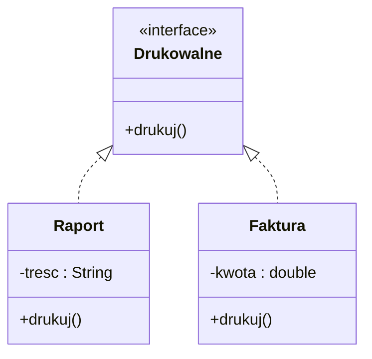
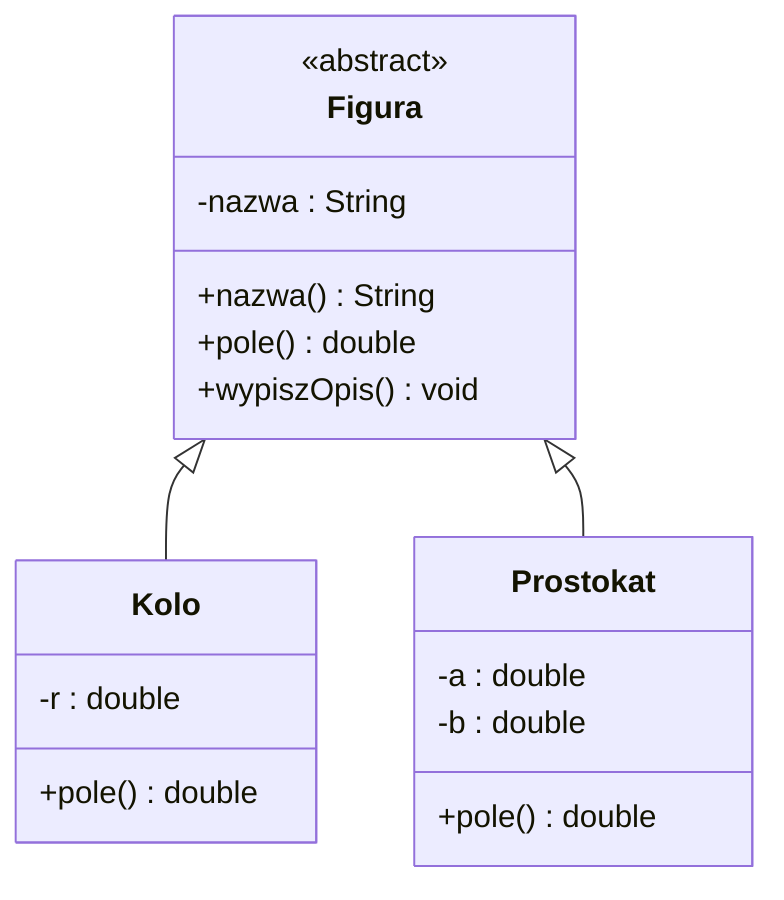
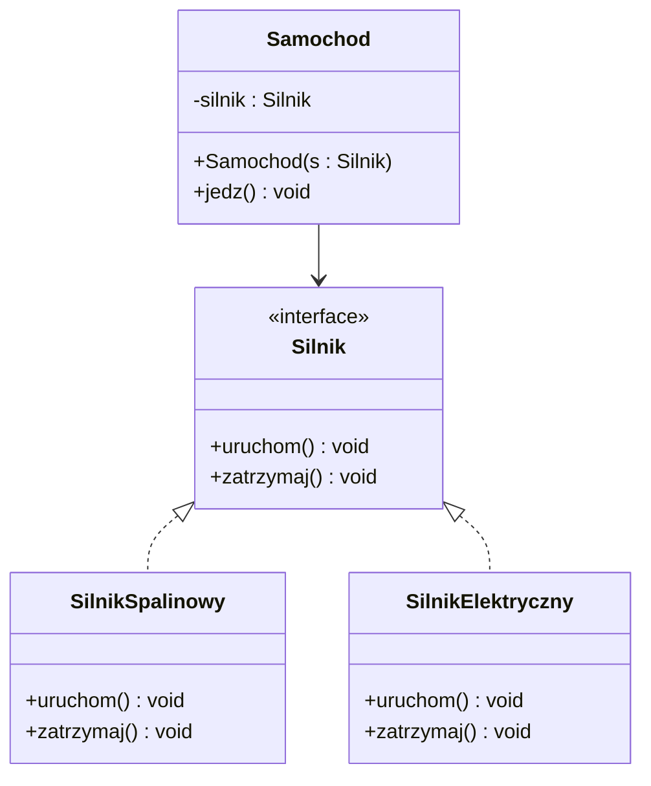
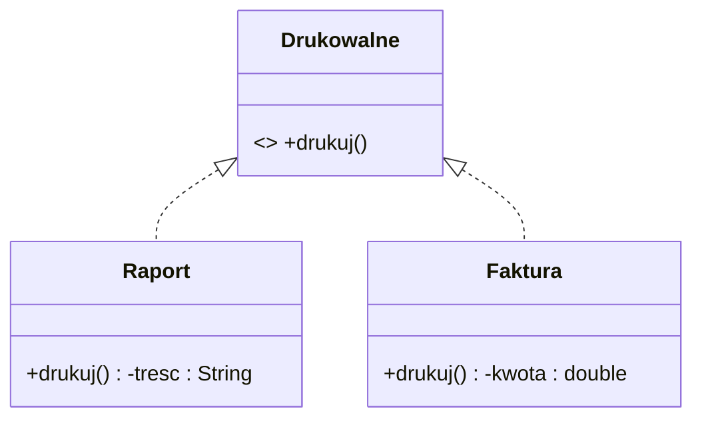
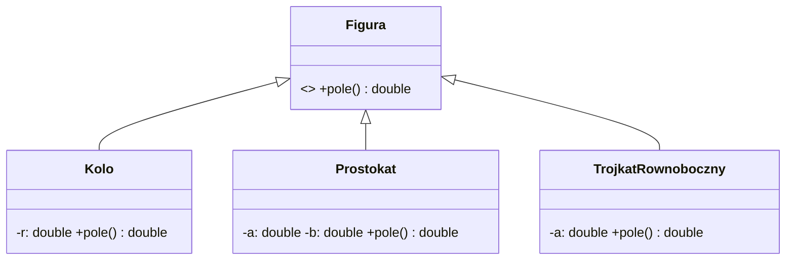

### 08. Interfejsy i klasy abstrakcyjne w Javie

---

#### 1. Wprowadzenie i motywacja

Zanim użyjemy słowa „kontrakt”, zdefiniujmy je precyzyjnie:

- Kontrakt (umowa programistyczna) to jasno określony zestaw wymagań dotyczących zachowania obiektu: sygnatur metod, ich znaczenia i oczekiwanych efektów (pre‑ i post‑warunków), a także ewentualnych wyjątków i gwarancji. Kod, który „spełnia kontrakt”, dostarcza metody o ustalonych nazwach i parametrach oraz zachowuje się zgodnie z tym opisem.

W programowaniu obiektowym często chcemy:

- Zdefiniować wspólny kontrakt dla różnych klas, bez narzucania szczegółów implementacyjnych.
- Udostępnić częściową, niepełną implementację, którą klasy potomne muszą uzupełnić.

W Javie rozwiązują to dwa mechanizmy:

- Interfejs (`interface`) – deklaruje „co obiekt potrafi”, definiuje kontrakt metod (od Javy 8 może też zawierać metody domyślne `default` oraz metody statyczne, a od Javy 9 również metody prywatne jako pomocnicze).
- Klasa abstrakcyjna (`abstract class`) – może dostarczać wspólną część zachowania (w tym implementację metod i pól) i wymuszać uzupełnienie brakujących elementów w klasach pochodnych.

Zarówno interfejsy, jak i klasy abstrakcyjne wspierają polimorfizm – pozwalają traktować obiekty różnych klas w jednolity sposób, jeśli te obiekty spełniają dany kontrakt lub dziedziczą po abstrakcji.

---

#### 2. Interfejsy – teoria i składnia

Interfejs określa zestaw metod (i ewentualnie stałych), które klasa implementująca interfejs musi dostarczyć. Interfejsy doskonale modelują rolę/umiejętność („co robi”), a nie naturę („czym jest”).

Podstawowe cechy interfejsów:

- Domyślnie wszystkie metody bez ciała są publiczne i abstrakcyjne (słowa kluczowe `public abstract` są domyślne i zwykle pomijane).
- Pola w interfejsach są domyślnie `public static final` (stałe), a ich wartości muszą być zainicjalizowane.
- Klasa może implementować wiele interfejsów (w przeciwieństwie do dziedziczenia klas, które jest pojedyncze).
- Od Javy 8 interfejs może posiadać metody domyślne (`default`) z ciałem i metody statyczne (`static`).
- Od Javy 9 interfejs może posiadać także metody prywatne (`private`) do współdzielenia logiki między metodami domyślnymi.

Przykład prostego interfejsu:

```java
public interface Drukowalne {
    void drukuj();
}
```

Implementacja interfejsu w klasie:

```java
public class Raport implements Drukowalne {
    private final String tresc;

    public Raport(String tresc) {
        this.tresc = tresc;
    }

    @Override
    public void drukuj() {
        System.out.println("Raport: " + tresc);
    }
}
```

Interfejs z metodą domyślną i statyczną:

```java
public interface Eksportowalne {
    String eksportuj();

    default void zapiszDoPliku(String sciezka) {
        String dane = eksportuj();
        FileUtils.zapisz(sciezka, dane);
    }

    static boolean walidujSciezke(String sciezka) {
        return sciezka != null && !sciezka.isBlank();
    }
}

final class FileUtils {
    static void zapisz(String sciezka, String tresc) {
        // uproszczony zapis
        System.out.println("Zapis do pliku " + sciezka + ": " + tresc);
    }
}
```

Interfejsy mogą rozszerzać inne interfejsy (wiele naraz):

```java
public interface Raportowalne extends Drukowalne, Eksportowalne { }
```

---

#### 3. Klasy abstrakcyjne – teoria i składnia

Klasa abstrakcyjna to klasa, której nie można zainstancjonować. Może zawierać zarówno metody abstrakcyjne (bez implementacji), jak i metody z implementacją, a także pola (w tym stan obiektu). Służy do wspólnego, częściowego zaimplementowania zachowania oraz do wymuszenia uzupełnienia brakujących fragmentów w klasach pochodnych.

Cechy klas abstrakcyjnych:

- Nie można tworzyć ich instancji bezpośrednio (`new` jest zabronione), ale można odnosić się do nich poprzez referencję typu abstrakcyjnego.
- Mogą posiadać konstruktor(y), które są wywoływane z konstruktorów klas pochodnych.
- Mogą definiować pola (stan), metody z ciałem, metody abstrakcyjne, a także metody `final`.
- Klasa może dziedziczyć tylko po jednej klasie (w tym abstrakcyjnej) – Java nie wspiera wielodziedziczenia klas.

Przykład klasy abstrakcyjnej:

```java
public abstract class Figura {
    private final String nazwa;

    protected Figura(String nazwa) {
        this.nazwa = nazwa;
    }

    public String nazwa() {
        return nazwa;
    }

    public abstract double pole();

    public void wypiszOpis() {
        System.out.println("Figura: " + nazwa);
    }
}

public class Kolo extends Figura {
    private final double r;

    public Kolo(double r) {
        super("Koło");
        this.r = r;
    }

    @Override
    public double pole() {
        return Math.PI * r * r;
    }
}
```

---

#### 4. Interfejs vs klasa abstrakcyjna – porównanie i wybór

Kiedy użyć interfejsu, a kiedy klasy abstrakcyjnej?

- Użyj interfejsu, gdy chcesz opisać zdolność/kontrakt niezależnie od hierarchii klas i umożliwić implementację przez klasy z różnych drzew dziedziczenia (np. `Comparable`, `Serializable`, `AutoCloseable`).
- Użyj klasy abstrakcyjnej, gdy chcesz dostarczyć wspólną część implementacji i/lub stanu oraz kontrolować sposób rozszerzania (silniejszy związek „is-a”).

Różnice praktyczne:

- Dziedziczenie: klasa może rozszerzać tylko jedną klasę (abstrakcyjną/konkretną), ale może implementować wiele interfejsów.
- Stan: interfejsy nie mają stanu obiektu (mogą mieć tylko stałe), klasy abstrakcyjne – tak.
- Konstruktor: interfejs nie ma konstruktora; klasa abstrakcyjna – tak.
- Ewolucja API: interfejsy od Javy 8 mają metody `default`, co ułatwia rozwój kontraktów bez łamania kompatybilności.

---

#### 5. Polimorfizm i programowanie „na interfejs”

Praktyczna zasada: programuj do interfejsów, nie do implementacji. Oznacza to, aby typy referencji, parametry metod i wartości zwracane były możliwie ogólne (interfejsy), co zwiększa elastyczność i testowalność kodu.

```java
public interface Silnik {
    void uruchom();
    void zatrzymaj();
}

public class SilnikSpalinowy implements Silnik {
    public void uruchom() { System.out.println("Vroom!"); }
    public void zatrzymaj() { System.out.println("Stop"); }
}

public class Samochod {
    private final Silnik silnik; // Programujemy do interfejsu

    public Samochod(Silnik silnik) {
        this.silnik = silnik;
    }

    public void jedz() {
        silnik.uruchom();
        System.out.println("Jadę...");
    }
}
```

Dzięki temu `Samochod` może współpracować z dowolną implementacją `Silnik` (np. elektryczną), bez zmian w swojej klasie.

---

#### 6. Interfejsy funkcyjne i wyrażenia lambda (Java 8+)

Interfejs funkcyjny to interfejs z dokładnie jedną metodą abstrakcyjną (SAM – Single Abstract Method). Może mieć dowolną liczbę metod domyślnych i statycznych. Przykłady z JDK: `Runnable`, `Callable<T>`, `Comparator<T>`, a także rodzina `java.util.function`: `Supplier<T>`, `Consumer<T>`, `Function<T,R>`, `Predicate<T>`, `UnaryOperator<T>`, `BinaryOperator<T>`.

Adnotacja `@FunctionalInterface` nie jest wymagana, ale zalecana – kompilator sprawdzi, że interfejs ma dokładnie jedną metodę abstrakcyjną i zasygnalizuje niezamierzone zmiany.

Przykład własnego interfejsu funkcyjnego i użycia lambdy:

```java
@FunctionalInterface
public interface Transformacja<T> {
    T zastosuj(T wartosc);
}

Transformacja<String> upper = s -> s.toUpperCase();
System.out.println(upper.zastosuj("java")); // JAVA
```

6.1. Składnia lambd i inferencja typów

- Ogólny kształt: `(parametry) -> wyrażenie` lub `(parametry) -> { blok; return ...; }`
- Gdy jest jeden parametr, nawiasy można pominąć: `s -> s.length()`
- Typy parametrów zwykle są wnioskowane (target typing) na podstawie typu interfejsu funkcyjnego po lewej stronie przypisania.
- Gdy ciało zwraca pojedyncze wyrażenie, `return` i klamry można pominąć.

```java
Predicate<String> niepuste = s -> s != null && !s.isBlank();
Function<String, Integer> dlugosc = s -> s.length();
BiFunction<String, String, Integer> porownajDlugosc = (a, b) -> Integer.compare(a.length(), b.length());
```

6.2. Najważniejsze interfejsy z `java.util.function`

- `Supplier<T>` – dostarcza wartość: `Supplier<Double> rnd = Math::random;`
- `Consumer<T>` – konsumuje wartość: `Consumer<String> log = System.out::println;`
- `Predicate<T>` – zwraca `boolean`: `Predicate<String> niepuste = s -> !s.isBlank();`
- `Function<T,R>` – przekształca `T` na `R`: `Function<String,Integer> len = String::length;`
- `UnaryOperator<T>` – `Function<T,T>`: `UnaryOperator<String> upper = String::toUpperCase;`
- `BinaryOperator<T>` – łączy dwie wartości `T`: `BinaryOperator<Integer> suma = Integer::sum;`

Przykłady kompozycji:

```java
Function<String, String> trim = String::trim;
Function<String, String> upper = String::toUpperCase;
Function<String, String> trimUpper = trim.andThen(upper);
System.out.println(trimUpper.apply("  java  ")); // JAVA

Predicate<String> niepuste = s -> s != null && !s.isBlank();
Predicate<String> maLitereA = s -> s.contains("a");
Predicate<String> zlozony = niepuste.and(maLitereA).negate();
```

6.3. Referencje do metod (`::`)

- Do metody instancyjnej konkretnego obiektu: `printer::drukuj`
- Do metody statycznej: `Math::max`
- Do metody instancyjnej nieokreślonego obiektu danego typu: `String::toUpperCase`
- Do konstruktora: `ArrayList::new`

```java
List<String> names = List.of("Anna", "Ola", "Jan");
List<String> kopia = names.stream().map(String::toUpperCase).toList();
Supplier<List<String>> nowaLista = ArrayList::new;
```

6.4. Zasięg i przechwytywanie zmiennych (capturing)

- Lambda może używać zmiennych z zewnętrznego zakresu, ale muszą być one „efektywnie finalne” (niezmieniane po przypisaniu).
- W lambdzie `this` odnosi się do instancji klasy otaczającej (nie do obiektu anonimowego, jak w klasach anonimowych).

```java
int prog = 10; // efektywnie finalny
Predicate<Integer> wieksze = x -> x > prog; // OK
// prog++; // spowodowałoby błąd kompilacji
```

6.5. Comparator i łańcuchy porównań

```java
List<String> nazwy = new ArrayList<>(List.of("Anna", "Jan", "Ala", "Ola"));
nazwy.sort(Comparator
    .comparingInt(String::length)
    .thenComparing(Comparator.naturalOrder()));
System.out.println(nazwy); // [Ala, Jan, Ola, Anna]
```

6.6. Stream API – praktyczne zastosowania lambd

```java
List<String> wejscie = List.of("  java ", "", "lambda", "  OOP");
List<String> wynik = wejscie.stream()
    .map(String::trim)
    .filter(s -> !s.isEmpty())
    .map(String::toUpperCase)
    .sorted()
    .toList();
System.out.println(wynik); // [JAVA, LAMBDA, OOP]

int sumaDlugosci = wejscie.stream()
    .map(String::trim)
    .mapToInt(String::length)
    .sum();
```

6.7. Wyjątki w lambdach (checked exceptions)

- Interfejsy z `java.util.function` nie deklarują wyjątków sprawdzanych (checked), więc trzeba je obsłużyć wewnątrz lambdy lub owinąć w wyjątek niekontrolowany.
- Alternatywnie, zdefiniuj własny interfejs funkcyjny z deklaracją `throws`.

```java
@FunctionalInterface
interface ThrowingFunction<T,R> {
    R apply(T t) throws Exception;
}

static <T,R> Function<T,R> wrap(ThrowingFunction<T,R> f) {
    return t -> {
        try { return f.apply(t); }
        catch (Exception e) { throw new RuntimeException(e); }
    };
}

List<String> lines = List.of("a.txt", "b.txt");
List<String> contents = lines.stream()
    .map(wrap(path -> java.nio.file.Files.readString(java.nio.file.Path.of(path))))
    .toList();
```

6.8. Wydajność i dobre praktyki

- Unikaj zbędnego autoboxingu w strumieniach – rozważ prymitywne strumienie (`IntStream`, `LongStream`, `DoubleStream`).
- Preferuj małe, czyste lambdy bez efektów ubocznych; gdy logika rośnie, wyodrębnij nazwane metody.
- Nie nadużywaj lambd w miejscach, gdzie prosta pętla jest czytelniejsza.
- Dbaj o niezmienność danych wejściowych w operacjach równoległych (`parallel()`), aby uniknąć warunków wyścigu.

---

#### 7. Wielodziedziczenie zachowania przez `default` – konflikt metod

Jeśli klasa implementuje dwa interfejsy zawierające metody `default` o tej samej sygnaturze, powstaje konflikt, który należy rozwiązać, nadpisując metodę i wskazując, którą implementację wybrać (lub zapewniając własną).

```java
interface A { default void x() { System.out.println("A"); } }
interface B { default void x() { System.out.println("B"); } }

class C implements A, B {
    @Override
    public void x() {
        A.super.x(); // lub B.super.x(); albo własna implementacja
    }
}
```

---

#### 8. UML (Mermaid) – przykładowe diagramy

Poniżej kilka diagramów pokazujących relacje „realizacja interfejsu” oraz „dziedziczenie klasy abstrakcyjnej”. Zapis Mermaid pozwala w prosty sposób szkicować diagramy UML.

Interfejs i jego implementacje:



Klasa abstrakcyjna i klasy pochodne:



Złożony przykład: programowanie do interfejsu i kompozycja:



---

#### 9. Wzorce projektowe a interfejsy/abstrakcje

- Strategia (Strategy): interfejs określa rodzinę algorytmów wymiennych w czasie działania.
- Metoda szablonowa (Template Method): klasa abstrakcyjna definiuje szkielet algorytmu, pozostawiając szczegóły klasom potomnym.
- Adapter: interfejs/adaptacja typu pozwala „dopasować” niezgodne API do oczekiwanego kontraktu.

Przykład – Template Method:

```java
public abstract class RaportGenerator {
    public final void generuj() { // szablon
        przygotujDane();
        String tresc = zbudujTresc();
        zapisz(tresc);
    }

    protected abstract void przygotujDane();
    protected abstract String zbudujTresc();
    protected void zapisz(String tresc) {
        System.out.println("Zapis: " + tresc);
    }
}
```

---

#### 10. Dobre praktyki i pułapki

- Preferuj kompozycję nad dziedziczeniem – interfejsy plus kompozycja często są elastyczniejsze niż rozbudowane hierarchie klas.
- Unikaj „tłustych” interfejsów: trzymaj kontrakty małe, spójne i specyficzne (Interface Segregation Principle – ISP).
- Nie nadużywaj metod `default` – to wygodne narzędzie do ewolucji API, ale nadmiar może zaciemnić kontrakt.
- W klasach abstrakcyjnych rozważ metody `final` tam, gdzie szkielet algorytmu nie powinien być modyfikowany (Template Method).
- Uważaj na konflikt `default` z wielu interfejsów – zawsze rozstrzygaj świadomie, często implementując własne zachowanie.

---

#### 11. Przykłady kodu – różne warianty

Interfejs + metoda domyślna + prywatna (Java 9+):

```java
public interface Logowalne {
    default void info(String msg) { infoImpl(msg); }
    default void warn(String msg) { warnImpl(msg); }

    private void infoImpl(String msg) { log("INFO", msg); }
    private void warnImpl(String msg) { log("WARN", msg); }
    private void log(String level, String msg) {
        System.out.printf("[%s] %s%n", level, msg);
    }
}
```

Abstrakcja z częściową implementacją i stanem:

```java
public abstract class KontoBankowe {
    private double saldo;

    protected KontoBankowe(double saldoPoczatkowe) {
        this.saldo = saldoPoczatkowe;
    }

    public final double saldo() { return saldo; }

    protected final void zmienSaldo(double delta) {
        this.saldo += delta;
    }

    public abstract void naliczOprocentowanie();
}

public class KontoOszczednosciowe extends KontoBankowe {
    private final double stopa;

    public KontoOszczednosciowe(double saldo, double stopa) {
        super(saldo);
        this.stopa = stopa;
    }

    @Override
    public void naliczOprocentowanie() {
        zmienSaldo(saldo() * stopa);
    }
}
```

Interfejs funkcyjny i użycie z `Comparator`:

```java
List<String> nazwy = List.of("Anna", "Jan", "Ola");
List<String> posortowane = new ArrayList<>(nazwy);
posortowane.sort((a, b) -> Integer.compare(a.length(), b.length()));
System.out.println(posortowane); // [Jan, Ola, Anna]
```

---

#### 12. Zadania – od podstaw do zaawansowanych

Poniżej zestaw zadań do samodzielnego wykonania. Dołączono podpowiedzi i diagramy, aby ułatwić start. Rozwiązania możesz umieścić w dowolnym katalogu roboczym projektu.

Zadanie 1 (podstawowe): Drukowalne

- Stwórz interfejs `Drukowalne` z metodą `void drukuj()`.
- Zaimplementuj w klasach `Raport` i `Faktura` (przykładowe pola: `tresc`, `kwota`).
- Stwórz metodę, która przyjmuje listę `Drukowalne` i wywołuje `drukuj()` na każdym.

Diagram (Mermaid):



Zadanie 2 (podstawowe): Eksportowalne z `default`

- Dodaj interfejs `Eksportowalne` z metodą `String eksportuj()` i domyślną `default void zapiszDo(String sciezka)` wypisującą treść na ekran z prefiksem ścieżki.
- Zaimplementuj `Eksportowalne` w `Raport` i `Faktura`.

Zadanie 3 (średnie): Figura – klasa abstrakcyjna

- Utwórz abstrakcyjną klasę `Figura` z metodą abstrakcyjną `double pole()` i opcjonalnie `double obwod()`.
- Zaimplementuj `Kolo`, `Prostokat` i `TrojkatRownoboczny`.
- Napisz metodę, która przyjmuje listę figur i zwraca sumę pól.

Diagram (Mermaid):



Zadanie 4 (średnie): Strategia płatności

- Zaprojektuj interfejs `Platnosc` z metodą `boolean zaplac(double kwota)`.
- Zaimplementuj `KartaKredytowa`, `BLIK`, `Przelew` jako strategie.
- Klasa `Sklep` powinna przyjmować `Platnosc` w konstruktorze i wywoływać `zaplac` podczas zakupów.

Zadanie 5 (średnio-zaawansowane): Szablon raportu

- Zaimplementuj klasę abstrakcyjną `RaportGenerator` z metodą szablonową `final void generuj()` i abstrakcjami `przygotujDane`, `zbudujTresc`.
- Dodaj dwie implementacje: `RaportCSV` i `RaportJSON`.

Zadanie 6 (zaawansowane): Konflikt `default`

- Utwórz interfejsy `A` i `B` z metodą `default void m()`. Klasa `C` ma implementować oba, rozwiązać konflikt oraz dodać własne zachowanie.

Zadanie 7 (zaawansowane): Interfejs funkcyjny i lambda

- Zdefiniuj `@FunctionalInterface` o nazwie `Walidator<T>` z metodą `boolean test(T t)`.
- Napisz funkcję, która filtruje listę elementów na podstawie `Walidator<T>`, użyj lambd i metod referencyjnych.

Zadanie 8 (zaawansowane): Hybryda – abstrakcja + interfejs

- Zbuduj abstrakcyjną klasę `Pojazd` z częściową implementacją (`jedz`, `zatrzymaj`).
- Zdefiniuj interfejs `Zasilany`, który opisuje dostarczanie energii (`tankuj()` / `laduj()`).
- Zaimplementuj `SamochodSpalinowy` oraz `SamochodElektryczny`, które dziedziczą po `Pojazd` i implementują `Zasilany`.

Zadanie 9 (lambda): `java.util.function` w praktyce

- Napisz funkcję `przetworz(List<T> in, Function<T,R> f) -> List<R>`, a następnie użyj jej do: przycięcia białych znaków w liście `String`, podniesienia do kwadratu elementów `Integer`, oraz zmapowania osób na ich nazwiska.
- Dodaj funkcję `filtruj(List<T> in, Predicate<T> p) -> List<T>` i przetestuj kombinacje predykatów (`and`, `or`, `negate`).

Zadanie 10 (lambda): Method references i konstruktor

- Użyj referencji do metody do przekształcenia `List<String>` na `List<Integer>` z długościami (`String::length`).
- Użyj referencji do konstruktora, aby przekształcić `Stream<String>` w `List<StringBuilder>` (`StringBuilder::new`), a następnie dodaj sufiks wszystkim elementom, wykorzystując `map` i `forEach` z `Consumer`.

Zadanie 11 (lambda): Obsługa wyjątków w lambdach

- Zaimplementuj interfejs funkcyjny `ThrowingFunction<T,R>` deklarujący `throws Exception` oraz pomocniczą metodę `wrap`, która zamienia go na zwykły `Function<T,R>` owijający wyjątki w `RuntimeException`.
- Wykorzystaj to do wczytania treści wielu plików zwracanych z `List<Path>` i zmapowania na ich długości.

---

#### 13. Mini‑quiz (sprawdź się)

1) Czy interfejs może mieć pola inne niż stałe? Dlaczego?  
2) Czy klasa może dziedziczyć po dwóch klasach jednocześnie?  
3) Jak rozwiążesz konflikt metody `default` o tej samej sygnaturze z dwóch interfejsów?  
4) Czym różni się interfejs funkcyjny od „zwykłego” interfejsu?  
5) Kiedy preferować klasę abstrakcyjną nad interfejsem?

Odpowiedzi (skrótowo): 1) Nie – pola w interfejsie są `public static final`. 2) Nie – Java ma pojedyncze dziedziczenie klas. 3) Nadpisując metodę w klasie i wybierając `A.super.m()` lub `B.super.m()` (lub własna implementacja). 4) Ma dokładnie jedną metodę abstrakcyjną i wspiera lambdy. 5) Gdy potrzebny jest wspólny stan/częściowa implementacja i silniejszy związek w hierarchii.

---

#### 14. Podsumowanie

Interfejsy definiują kontrakty i ułatwiają luźne powiązanie komponentów, klasy abstrakcyjne dostarczają wspólny kod i stan. Świadome łączenie obu mechanizmów prowadzi do elastycznych, testowalnych i czytelnych projektów. Programuj „do interfejsu”, stosuj kompozycję, a abstrakcję wybieraj tam, gdzie naturalnie występuje wspólny szkielet zachowania.
