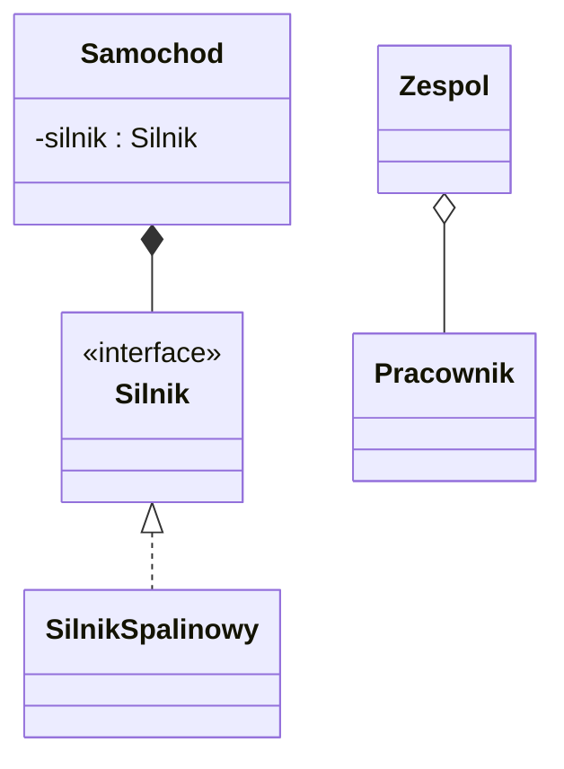
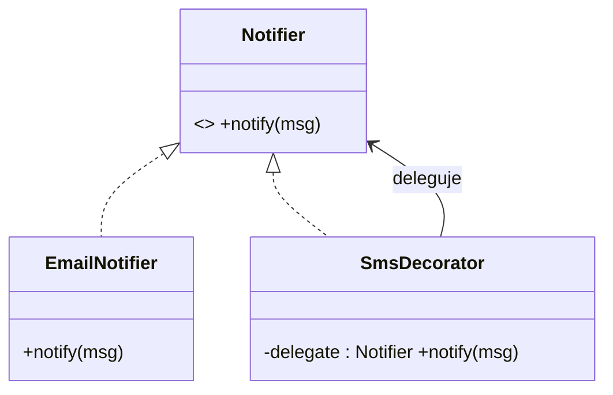
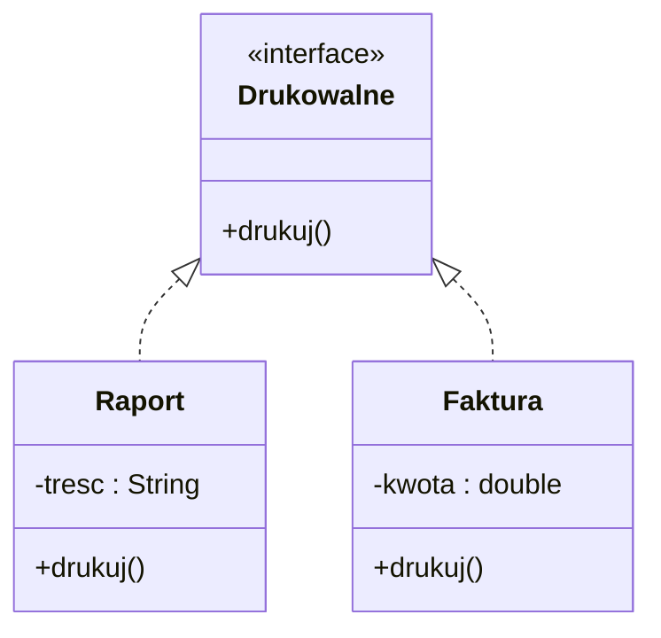
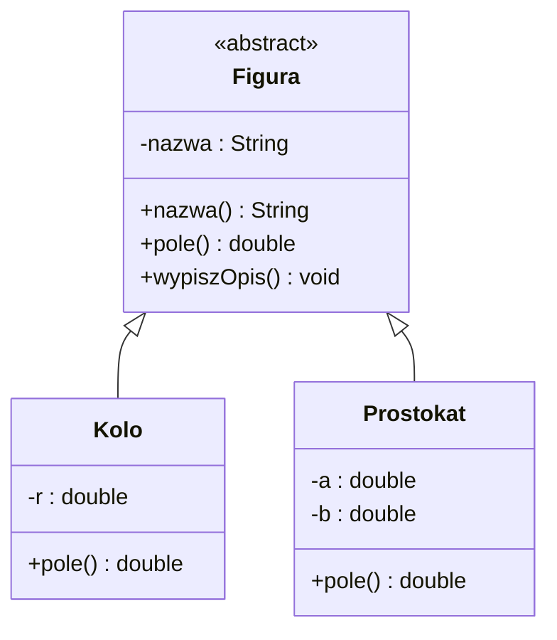
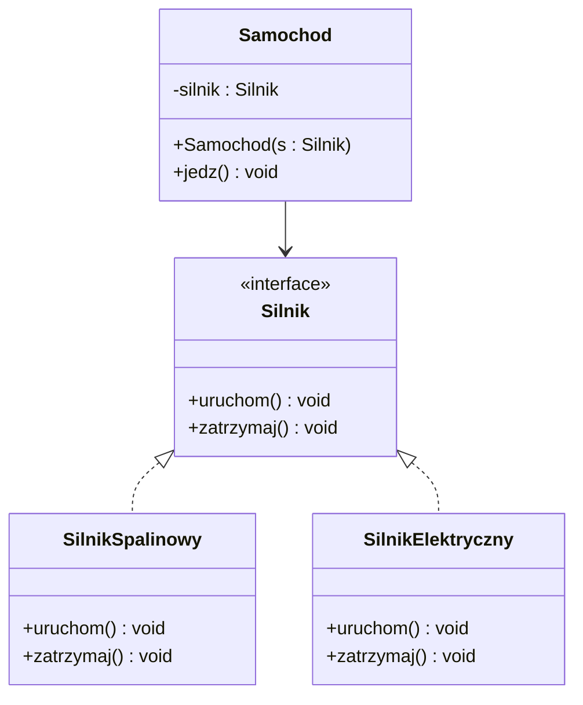

### 08. Interfejsy i klasy abstrakcyjne w Javie

---

#### 1. Wprowadzenie i motywacja

Zanim użyjemy słowa „kontrakt”, zdefiniujmy je precyzyjnie:

- Kontrakt (umowa programistyczna) to jasno określony zestaw wymagań dotyczących zachowania obiektu: sygnatur metod, ich znaczenia i oczekiwanych efektów (pre‑ i post‑warunków), a także ewentualnych wyjątków i gwarancji. Kod, który „spełnia kontrakt”, dostarcza metody o ustalonych nazwach i parametrach oraz zachowuje się zgodnie z tym opisem.

W programowaniu obiektowym często chcemy:

- Zdefiniować wspólny kontrakt dla różnych klas, bez narzucania szczegółów implementacyjnych.
- Udostępnić częściową, niepełną implementację, którą klasy potomne muszą uzupełnić.

W Javie rozwiązują to dwa mechanizmy:

- Interfejs (`interface`) – deklaruje „co obiekt potrafi”, definiuje kontrakt metod (od Javy 8 może też zawierać metody domyślne `default` oraz metody statyczne, a od Javy 9 również metody prywatne jako pomocnicze).
- Klasa abstrakcyjna (`abstract class`) – może dostarczać wspólną część zachowania (w tym implementację metod i pól) i wymuszać uzupełnienie brakujących elementów w klasach pochodnych.

Zarówno interfejsy, jak i klasy abstrakcyjne wspierają polimorfizm – pozwalają traktować obiekty różnych klas w jednolity sposób, jeśli te obiekty spełniają dany kontrakt lub dziedziczą po abstrakcji.

---

#### 2. Interfejsy – teoria i składnia

Interfejs określa zestaw metod (i ewentualnie stałych), które klasa implementująca interfejs musi dostarczyć. Interfejsy doskonale modelują rolę/umiejętność („co robi”), a nie naturę („czym jest”).

Podstawowe cechy interfejsów:

- Domyślnie wszystkie metody bez ciała są publiczne i abstrakcyjne (słowa kluczowe `public abstract` są domyślne i zwykle pomijane).
- Pola w interfejsach są domyślnie `public static final` (stałe), a ich wartości muszą być zainicjalizowane.
- Klasa może implementować wiele interfejsów (w przeciwieństwie do dziedziczenia klas, które jest pojedyncze).
- Od Javy 8 interfejs może posiadać metody domyślne (`default`) z ciałem i metody statyczne (`static`).
- Od Javy 9 interfejs może posiadać także metody prywatne (`private`) do współdzielenia logiki między metodami domyślnymi.

Przykład prostego interfejsu:

```java
public interface Drukowalne {
    void drukuj();
}
```

Implementacja interfejsu w klasie:

```java
public class Raport implements Drukowalne {
    private final String tresc;

    public Raport(String tresc) {
        this.tresc = tresc;
    }

    @Override
    public void drukuj() {
        System.out.println("Raport: " + tresc);
    }
}
```

Interfejs z metodą domyślną i statyczną:

```java
public interface Eksportowalne {
    String eksportuj();

    default void zapiszDoPliku(String sciezka) {
        String dane = eksportuj();
        FileUtils.zapisz(sciezka, dane);
    }

    static boolean walidujSciezke(String sciezka) {
        return sciezka != null && !sciezka.isBlank();
    }
}

final class FileUtils {
    static void zapisz(String sciezka, String tresc) {
        // uproszczony zapis
        System.out.println("Zapis do pliku " + sciezka + ": " + tresc);
    }
}
```

Interfejsy mogą rozszerzać inne interfejsy (wiele naraz):

```java
public interface Raportowalne extends Drukowalne, Eksportowalne { }
```

---

#### 3. Klasy abstrakcyjne – teoria i składnia

Klasa abstrakcyjna to klasa, której nie można zainstancjonować. Może zawierać zarówno metody abstrakcyjne (bez implementacji), jak i metody z implementacją, a także pola (w tym stan obiektu). Służy do wspólnego, częściowego zaimplementowania zachowania oraz do wymuszenia uzupełnienia brakujących fragmentów w klasach pochodnych.

Cechy klas abstrakcyjnych:

- Nie można tworzyć ich instancji bezpośrednio (`new` jest zabronione), ale można odnosić się do nich poprzez referencję typu abstrakcyjnego.
- Mogą posiadać konstruktor(y), które są wywoływane z konstruktorów klas pochodnych.
- Mogą definiować pola (stan), metody z ciałem, metody abstrakcyjne, a także metody `final`.
- Klasa może dziedziczyć tylko po jednej klasie (w tym abstrakcyjnej) – Java nie wspiera wielodziedziczenia klas.

Przykład klasy abstrakcyjnej:

```java
public abstract class Figura {
    private final String nazwa;

    protected Figura(String nazwa) {
        this.nazwa = nazwa;
    }

    public String nazwa() {
        return nazwa;
    }

    public abstract double pole();

    public void wypiszOpis() {
        System.out.println("Figura: " + nazwa);
    }
}

public class Kolo extends Figura {
    private final double r;

    public Kolo(double r) {
        super("Koło");
        this.r = r;
    }

    @Override
    public double pole() {
        return Math.PI * r * r;
    }
}
```

---

#### 4. Interfejs vs klasa abstrakcyjna – porównanie i wybór

Kiedy użyć interfejsu, a kiedy klasy abstrakcyjnej?

- Użyj interfejsu, gdy chcesz opisać zdolność/kontrakt niezależnie od hierarchii klas i umożliwić implementację przez klasy z różnych drzew dziedziczenia (np. `Comparable`, `Serializable`, `AutoCloseable`).
- Użyj klasy abstrakcyjnej, gdy chcesz dostarczyć wspólną część implementacji i/lub stanu oraz kontrolować sposób rozszerzania (silniejszy związek „is-a”).

Różnice praktyczne:

- Dziedziczenie: klasa może rozszerzać tylko jedną klasę (abstrakcyjną/konkretną), ale może implementować wiele interfejsów.
- Stan: interfejsy nie mają stanu obiektu (mogą mieć tylko stałe), klasy abstrakcyjne – tak.
- Konstruktor: interfejs nie ma konstruktora; klasa abstrakcyjna – tak.
- Ewolucja API: interfejsy od Javy 8 mają metody `default`, co ułatwia rozwój kontraktów bez łamania kompatybilności.

---

#### 5. Polimorfizm i programowanie „na interfejs”

Praktyczna zasada: programuj do interfejsów, nie do implementacji. Oznacza to, aby typy referencji, parametry metod i wartości zwracane były możliwie ogólne (interfejsy), co zwiększa elastyczność i testowalność kodu.

```java
public interface Silnik {
    void uruchom();
    void zatrzymaj();
}

public class SilnikSpalinowy implements Silnik {
    public void uruchom() { System.out.println("Vroom!"); }
    public void zatrzymaj() { System.out.println("Stop"); }
}

public class Samochod {
    private final Silnik silnik; // Programujemy do interfejsu

    public Samochod(Silnik silnik) {
        this.silnik = silnik;
    }

    public void jedz() {
        silnik.uruchom();
        System.out.println("Jadę...");
    }
}
```

Dzięki temu `Samochod` może współpracować z dowolną implementacją `Silnik` (np. elektryczną), bez zmian w swojej klasie.

---

#### 6. Kompozycja obiektów – teoria, praktyka i porównanie

Kompozycja to tworzenie obiektów z innych obiektów poprzez „składanie” ich razem. Zamiast dziedziczyć zachowanie („is-a”), klasa posiada referencje do innych obiektów i deleguje im część pracy („has-a”). Zasada często powtarzana w projektowaniu: „Preferuj kompozycję nad dziedziczeniem”.

6.1. Kompozycja vs agregacja vs dziedziczenie

- Kompozycja: silny związek całości i części. Część zwykle nie żyje poza całością, a cykl życia jest współdzielony. W UML oznaczana wypełnionym rombem. Przykład: `Zamówienie` zawiera pozycje `PozycjaZamówienia` – usunięcie zamówienia zwykle usuwa jego pozycje.
- Agregacja: słabszy związek całości i części. Części mogą istnieć niezależnie. W UML oznaczana pustym rombem. Przykład: `Zespół` agreguje `Pracownik` – pracownik może zmienić zespół lub istnieć poza nim.
- Dziedziczenie: relacja „jest-typem” („is-a”), silne powiązanie hierarchiczne. Używaj, gdy naturalnie zachodzi relacja specjalizacji, a klasa bazowa zapewnia wspólny szkielet lub kontrakt.

Checklist – kiedy wybrać co?

- Wybierz kompozycję, gdy chcesz zmienialnie konfigurować zachowania w czasie tworzenia/wykonania, uniknąć ciasnego związania hierarchią, ukrywać szczegóły implementacji i promować testowalność przez wstrzykiwanie zależności.
- Wybierz agregację, gdy całość zarządza zbiorem współdzielonych bytów, które mogą mieć własny cykl życia.
- Wybierz dziedziczenie, gdy istnieje silna relacja „jest-typem”, a klasa bazowa dostarcza wspólny szkielet (np. Template Method) lub kontrakt plus część implementacji.

6.2. Przykład: `Samochod` kompozytuje `Silnik` (programowanie do interfejsu)

```java
public interface Silnik {
    void uruchom();
    void zatrzymaj();
}

public class SilnikSpalinowy implements Silnik {
    public void uruchom() { System.out.println("Vroom!"); }
    public void zatrzymaj() { System.out.println("Stop"); }
}

public class SilnikElektryczny implements Silnik {
    public void uruchom() { System.out.println("Bzzzt!"); }
    public void zatrzymaj() { System.out.println("Cisza"); }
}

public class Samochod {
    private Silnik silnik; // kompozycja: Samochod "ma" Silnik

    public Samochod(Silnik silnik) {
        this.silnik = silnik; // wstrzyknięcie zależności
    }

    public void ustawSilnik(Silnik nowy) { // możliwość wymiany części
        this.silnik = nowy;
    }

    public void jedz() {
        silnik.uruchom();
        System.out.println("Jadę...");
    }
}

// Użycie:
Samochod s = new Samochod(new SilnikSpalinowy());
s.jedz();
s.ustawSilnik(new SilnikElektryczny()); // wymiana silnika bez zmiany klasy Samochod
s.jedz();
```

6.3. Dekorator przez kompozycję (dodawanie zachowania bez dziedziczenia)

```java
public interface Notifier {
    void notify(String message);
}

public class EmailNotifier implements Notifier {
    public void notify(String message) {
        System.out.println("Email: " + message);
    }
}

// Dekorator: opakowuje inny Notifier i dodaje funkcjonalność
public class SmsDecorator implements Notifier {
    private final Notifier delegate;

    public SmsDecorator(Notifier delegate) {
        this.delegate = delegate;
    }

    public void notify(String message) {
        delegate.notify(message); // delegacja do oryginalnego zachowania
        System.out.println("SMS: " + message); // rozszerzenie przez kompozycję
    }
}

Notifier n = new SmsDecorator(new EmailNotifier());
n.notify("Twoje zamówienie zostało wysłane");
```

6.4. Kompozycja obiektów wartościowych (Value Object) i kopie defensywne

```java
public final class Adres {
    private final String ulica;
    private final String miasto;
    public Adres(String ulica, String miasto) {
        this.ulica = ulica; this.miasto = miasto;
    }
    public String ulica() { return ulica; }
    public String miasto() { return miasto; }
}

public class Klient {
    private Adres adres;

    public Klient(Adres adres) {
        // Adres jest niemutowalny, więc bezpiecznie przechwycić referencję
        this.adres = adres;
    }

    public Adres adres() { return adres; }

    public void zmienAdres(Adres nowy) {
        this.adres = nowy;
    }
}
```

Jeśli część jest mutowalna i ujawniasz ją na zewnątrz, rozważ zwracanie kopii defensywnej, aby nie naruszyć enkapsulacji.

6.5. Kompozycja polityk – strategia podatku i rabatu

```java
public interface DiscountPolicy { double apply(double amount); }
public interface TaxPolicy { double apply(double amount); }

public class NoDiscount implements DiscountPolicy { public double apply(double a) { return a; } }
public class TenPercent implements DiscountPolicy { public double apply(double a) { return a * 0.9; } }
public class Vat23 implements TaxPolicy { public double apply(double a) { return a * 1.23; } }

public class OrderService {
    private final DiscountPolicy discount;
    private final TaxPolicy tax;

    public OrderService(DiscountPolicy discount, TaxPolicy tax) {
        this.discount = discount;
        this.tax = tax;
    }

    public double finalize(double net) {
        double afterDiscount = discount.apply(net);
        return tax.apply(afterDiscount);
    }
}

OrderService os = new OrderService(new TenPercent(), new Vat23());
double total = os.finalize(100.0); // 100 -> 90 -> 110.7
```

6.6. Diagramy UML (Mermaid)

Kompozycja (`*--`) i agregacja (`o--`):



Dekorator przez kompozycję:



6.7. Dobre praktyki i pułapki kompozycji

- Nie wyciekaj wewnętrznych, mutowalnych części – stosuj enkapsulację i kopie defensywne.
- Uważaj na płytkie vs głębokie kopiowanie obiektów złożonych; określ semantykę `equals`/`hashCode` uwzględniając części.
- Unikaj cykli zależności (A ma B, B ma A) bez jasnych reguł własności – może to utrudnić sprzątanie zasobów i testy.
- Dokumentuj kontrakt własności i cyklu życia części (kto tworzy, kto niszczy, kto może wymienić części).
- Kompozycja ułatwia testy: w testach podstawiaj „duble” (moki/stuby) zamiast realnych części.

---

<!-- Sekcja o lambdach przeniesiona do pliku 09-lambda.md -->

#### 7. Wielodziedziczenie zachowania przez `default` – konflikt metod

Jeśli klasa implementuje dwa interfejsy zawierające metody `default` o tej samej sygnaturze, powstaje konflikt, który należy rozwiązać, nadpisując metodę i wskazując, którą implementację wybrać (lub zapewniając własną).

```java
interface A { default void x() { System.out.println("A"); } }
interface B { default void x() { System.out.println("B"); } }

class C implements A, B {
    @Override
    public void x() {
        A.super.x(); // lub B.super.x(); albo własna implementacja
    }
}
```

---

#### 8. UML (Mermaid) – przykładowe diagramy

Poniżej kilka diagramów pokazujących relacje „realizacja interfejsu” oraz „dziedziczenie klasy abstrakcyjnej”. Zapis Mermaid pozwala w prosty sposób szkicować diagramy UML.

Interfejs i jego implementacje:



Klasa abstrakcyjna i klasy pochodne:



Złożony przykład: programowanie do interfejsu i kompozycja:



---

#### 9. Wzorce projektowe a interfejsy/abstrakcje

- Strategia (Strategy): interfejs określa rodzinę algorytmów wymiennych w czasie działania.
- Metoda szablonowa (Template Method): klasa abstrakcyjna definiuje szkielet algorytmu, pozostawiając szczegóły klasom potomnym.
- Adapter: interfejs/adaptacja typu pozwala „dopasować” niezgodne API do oczekiwanego kontraktu.

Przykład – Template Method:

```java
public abstract class RaportGenerator {
    public final void generuj() { // szablon
        przygotujDane();
        String tresc = zbudujTresc();
        zapisz(tresc);
    }

    protected abstract void przygotujDane();
    protected abstract String zbudujTresc();
    protected void zapisz(String tresc) {
        System.out.println("Zapis: " + tresc);
    }
}
```

---

#### 10. Dobre praktyki i pułapki

- Preferuj kompozycję nad dziedziczeniem – interfejsy plus kompozycja często są elastyczniejsze niż rozbudowane hierarchie klas.
- Unikaj „tłustych” interfejsów: trzymaj kontrakty małe, spójne i specyficzne (Interface Segregation Principle – ISP).
- Nie nadużywaj metod `default` – to wygodne narzędzie do ewolucji API, ale nadmiar może zaciemnić kontrakt.
- W klasach abstrakcyjnych rozważ metody `final` tam, gdzie szkielet algorytmu nie powinien być modyfikowany (Template Method).
- Uważaj na konflikt `default` z wielu interfejsów – zawsze rozstrzygaj świadomie, często implementując własne zachowanie.

---

#### 11. Przykłady kodu – różne warianty

Interfejs + metoda domyślna + prywatna (Java 9+):

```java
public interface Logowalne {
    default void info(String msg) { infoImpl(msg); }
    default void warn(String msg) { warnImpl(msg); }

    private void infoImpl(String msg) { log("INFO", msg); }
    private void warnImpl(String msg) { log("WARN", msg); }
    private void log(String level, String msg) {
        System.out.printf("[%s] %s%n", level, msg);
    }
}
```

Abstrakcja z częściową implementacją i stanem:

```java
public abstract class KontoBankowe {
    private double saldo;

    protected KontoBankowe(double saldoPoczatkowe) {
        this.saldo = saldoPoczatkowe;
    }

    public final double saldo() { return saldo; }

    protected final void zmienSaldo(double delta) {
        this.saldo += delta;
    }

    public abstract void naliczOprocentowanie();
}

public class KontoOszczednosciowe extends KontoBankowe {
    private final double stopa;

    public KontoOszczednosciowe(double saldo, double stopa) {
        super(saldo);
        this.stopa = stopa;
    }

    @Override
    public void naliczOprocentowanie() {
        zmienSaldo(saldo() * stopa);
    }
}
```

<!-- Przykład lambdy przeniesiony do 09-lambda.md -->

---

#### 12. Mini‑quiz (sprawdź się)

1) Czy interfejs może mieć pola inne niż stałe? Dlaczego?  
2) Czy klasa może dziedziczyć po dwóch klasach jednocześnie?  
3) Jak rozwiążesz konflikt metody `default` o tej samej sygnaturze z dwóch interfejsów?  
4) Kiedy preferować klasę abstrakcyjną nad interfejsem?

Odpowiedzi (skrótowo): 1) Nie – pola w interfejsie są `public static final`. 2) Nie – Java ma pojedyncze dziedziczenie klas. 3) Nadpisując metodę w klasie i wybierając `A.super.m()` lub `B.super.m()` (lub własna implementacja). 4) Gdy potrzebny jest wspólny stan/częściowa implementacja i silniejszy związek w hierarchii.

---

#### 13. Podsumowanie

Interfejsy definiują kontrakty i ułatwiają luźne powiązanie komponentów, klasy abstrakcyjne dostarczają wspólny kod i stan. Świadome łączenie obu mechanizmów prowadzi do elastycznych, testowalnych i czytelnych projektów. Programuj „do interfejsu”, stosuj kompozycję, a abstrakcję wybieraj tam, gdzie naturalnie występuje wspólny szkielet zachowania.
