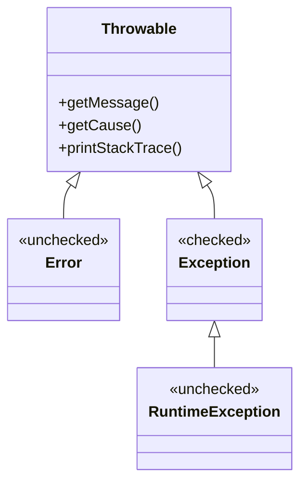
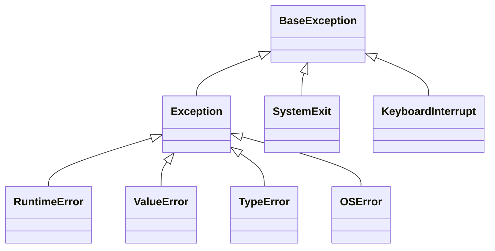
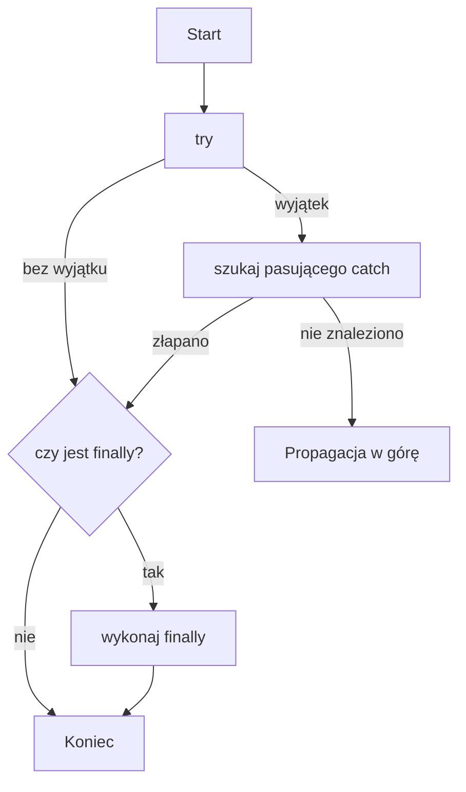
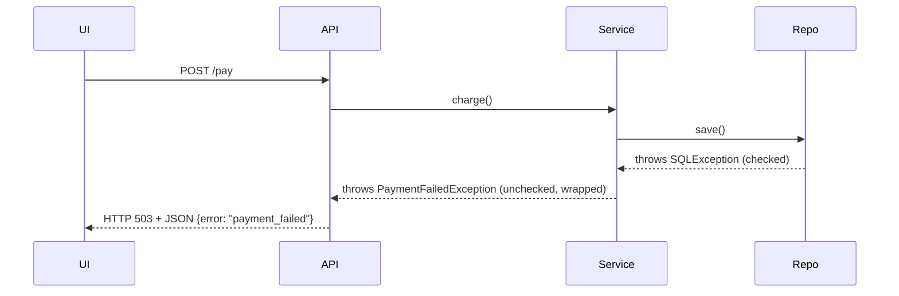

### 10. Wyjątki w Java i Python — teoria, praktyka, dobre i złe przykłady

---

#### Cel wykładu
Poznasz mechanizm wyjątków (ang. exceptions), głównie w Javie, z przykładami także w Pythonie. Zobaczysz: hierarchię, `try/catch/finally`, tworzenie własnych wyjątków, propagację, obsługę zasobów (`try-with-resources`, context manager), dobre praktyki i anty‑wzorce. W wielu miejscach znajdziesz diagramy Mermaid i kod z komentarzem.

Spis treści:
- Czym są wyjątki i po co je stosować?
- Hierarchia wyjątków (Java vs Python)
- Checked vs unchecked (Java) i co to oznacza dla API
- Rzucanie i łapanie: `throw`, `throws`, `try/catch/finally`
- Zarządzanie zasobami: `try-with-resources` (Java), `with` (Python)
- Tworzenie własnych wyjątków (Java i Python)
- Propagacja, owijanie (wrapping) i łańcuch przyczyn
- Dobre praktyki (logging, komunikaty, projektowanie API)
- Anty‑wzorce (catch‑all, kontrola przepływu przez wyjątki, tłumienie)
- Wyjątki a testy, kontrakty i dokumentacja
- Wydajność i decyzje projektowe (kiedy użyć wyjątków)
- Przykłady i mini‑zadania

---

### Czym są wyjątki?
Wyjątek to mechanizm sygnalizowania i obsługi błędów podczas wykonywania programu. Zamiast zwracać kod błędu, funkcja „rzuca” (Java: `throw`, Python: `raise`) obiekt wyjątku, a przepływ sterowania przeskakuje do najbliższego pasującego bloku obsługi (`catch`/`except`).

Korzyści:
- oddzielenie ścieżki błędów od ścieżki „szczęśliwej” (happy path),
- bogatszy kontekst o błędzie (typ, komunikat, stos wywołań),
- lepsza współpraca z frameworkami (transakcje, zasoby, rollback),
- silniejsze kontrakty API (zwłaszcza w Javie przez checked exceptions).

---

### Hierarchia wyjątków (Java)



Wybrane fakty:
- Wszystko dziedziczy z `Throwable`.
- `Error` (np. `OutOfMemoryError`) oznacza problemy środowiskowe — zwykle ich nie łapiemy.
- `Exception` dzieli się na checked i unchecked:
  - Checked: wszystkie potomki `Exception` poza `RuntimeException` i jego potomkami. Kompilator wymusza obsługę lub deklarację w `throws`.
  - Unchecked: `RuntimeException` (np. `NullPointerException`, `IllegalArgumentException`). Nie wymagają deklaracji.

### Hierarchia wyjątków (Python)



Wybrane fakty:
- Wszystko pochodzi z `BaseException`; typowe błędy użytkownika z `Exception`.
- Python nie ma checked exceptions — kompilator niczego nie wymusza. Dyscyplinę zapewnia styl, testy i dokumentacja.

---

### Checked vs Unchecked (Java)

- Checked (np. `IOException`, `SQLException`):
  - Musisz albo złapać (`try/catch`), albo zadeklarować (`throws`).
  - Dobre do bezpośrednich, przewidywalnych błędów środowiskowych (I/O, sieć).
- Unchecked (`RuntimeException` i pochodne):
  - Brak obowiązku deklaracji.
  - Dobre do błędów programistycznych (walidacja argumentów, stan nieprawidłowy).

Konsekwencje dla API:
- Publiczne API biblioteki z checked exceptions dokumentuje, co może pójść źle, ale zwiększa szum (`throws` kaskadą). 
- Często wybiera się unchecked dla walidacji argumentów i błędów domenowych.

---

### Rzucanie i łapanie w Javie

Zły przykład 1: łapanie zbyt ogólne i „połknięcie” błędu
```java
public class FileReaderBad {
    public String read(String path) {
        try {
            java.nio.file.Path p = java.nio.file.Paths.get(path);
            return java.nio.file.Files.readString(p);
        } catch (Exception e) { // za szeroko!
            // Złe: zjedzenie wyjątków i brak informacji dla wywołującego
            return ""; // ukrywa problem
        }
    }
}
```

Lepszy przykład: węższy `catch`, doprecyzowany komunikat, owijanie do unchecked
```java
public class FileReaderGood {
    public String read(String path) {
        try {
            var p = java.nio.file.Path.of(path);
            return java.nio.file.Files.readString(p);
        } catch (java.io.IOException io) {
            throw new FileAccessException("Nie udało się odczytać pliku: " + path, io);
        }
    }
}

class FileAccessException extends RuntimeException {
    public FileAccessException(String msg, Throwable cause) { super(msg, cause); }
}
```

Rzucanie własnego wyjątku i deklaracja `throws` (checked)
```java
public class UserService {
    public User findById(String id) throws UserNotFoundException {
        var user = loadFromDb(id);
        if (user == null) {
            throw new UserNotFoundException("Brak użytkownika id=" + id);
        }
        return user;
    }

    private User loadFromDb(String id) { return null; }
}

class User {}

class UserNotFoundException extends Exception { // checked
    public UserNotFoundException(String msg) { super(msg); }
}
```

Schemat przepływu `try/catch/finally`


`finally` gwarantuje wykonanie, np. zwalnianie zasobów; nie nadpisuj wyjątków w `finally`.

---

### Zarządzanie zasobami

Java: try‑with‑resources
```java
public static long countLines(String path) {
    try (java.io.BufferedReader br = java.nio.file.Files.newBufferedReader(java.nio.file.Path.of(path))) {
        return br.lines().count();
    } catch (java.io.IOException e) {
        throw new FileAccessException("Błąd I/O", e);
    }
}
```

Python: context manager `with`
```python
from pathlib import Path

def count_lines(path: str) -> int:
    try:
        with Path(path).open("r", encoding="utf-8") as f:
            return sum(1 for _ in f)
    except OSError as e:
        raise FileAccessError(f"Błąd I/O: {path}") from e

class FileAccessError(RuntimeError):
    pass
```

---

### Tworzenie własnych wyjątków

Zasady:
- Nazwa powinna kończyć się na `Exception` (Java) / w Pythonie często `Error` (konwencja).
- Ustal, czy ma być checked (Java: dziedzicz z `Exception`) czy unchecked (`RuntimeException`).
- Dodaj konstruktor z komunikatem i przyczyną (`cause`).

Java — wyjątek domenowy (unchecked)
```java
public class DomainValidationException extends RuntimeException {
    public DomainValidationException(String message) { super(message); }
    public DomainValidationException(String message, Throwable cause) { super(message, cause); }
}
```

Python — wyjątek domenowy
```python
class DomainValidationError(ValueError):
    def __init__(self, message: str, *, code: str | None = None):
        super().__init__(message)
        self.code = code
```

---

### Propagacja, owijanie i łańcuch przyczyn

- „Owijaj” wyjątki z niższego poziomu w wyjątki domenowe wyższego poziomu, by nie przeciekały szczegóły implementacji.
- Zachowuj `cause`/`__cause__`, aby nie stracić stosu i diagnozy.

Java — wrapping i ponowne rzucenie
```java
try {
    paymentGateway.charge(card, amount);
} catch (GatewayTimeoutException e) {
    throw new PaymentFailedException("Płatność przekroczyła limit czasu", e);
}
```

Python — chaining przez `from`
```python
try:
    gateway.charge(card, amount)
except TimeoutError as e:
    raise PaymentFailedError("Płatność przekroczyła limit czasu") from e
```

---

### Dobre praktyki

- Łap jak najwęższy typ wyjątku; unikaj `catch (Exception)`/`except Exception` bez potrzeby.
- Nie tłum wyjątków po cichu; loguj na odpowiednim poziomie i/lub propaguj.
- Nie używaj wyjątków do normalnej kontroli przepływu (np. do sterowania pętlą) — to kosztowne i zaciemnia intencję.
- Waliduj argumenty wcześnie: w Javie `Objects.requireNonNull`, rzucaj `IllegalArgumentException`, w Pythonie `ValueError`/`TypeError`.
- Przekazuj sensowne komunikaty (z danymi domenowymi, bez wrażliwych informacji).
- Projektuj API: wybierz checked dla przewidzianych sytuacji środowiskowych; unchecked dla błędów programistycznych i domenowych.
- W `finally`/`__exit__` nie gub oryginalnego wyjątku; nie „nadpisuj” go nowym (chyba że z premedytacją i z łańcuchem przyczyn).
- W aplikacjach warstwowych zakończ „mapowaniem wyjątków” na granicy warstwy (np. HTTP 4xx/5xx).

---

### Anty‑wzorce

1) Catch‑all i zjedzenie błędu
```java
try { doWork(); } catch (Exception e) { /* nic */ }
```
Lepsze: przynajmniej zaloguj i zasygnalizuj
```java
try { doWork(); } catch (SpecificException e) { logger.warn("Operacja częściowo nieudana", e); }
```

2) Wyjątki jako kontrola przepływu (Python)
```python
# Złe: łapanie wyjątku, by sterować normalnym przebiegiem
try:
    if cache[key]:
        use(cache[key])
except KeyError:
    use(default)
```
Lepsze: EAFP lub LBYL w zależności od kontekstu
```python
# EAFP (Pythonic):
try:
    use(cache[key])
except KeyError:
    use(default)

# LBYL (sprawdź zanim):
if key in cache:
    use(cache[key])
else:
    use(default)
```

3) Nadmierne deklarowanie `throws` (Java)
```java
public void f() throws Exception { /* ... */ } // zbyt ogólne API
```
Lepsze: precyzyjne typy wyjątków lub opakowanie w wyjątek domenowy

4) Utrata przyczyny
```java
catch (IOException e) {
    throw new RuntimeException("Błąd"); // gubi cause!
}
```
Lepsze:
```java
catch (IOException e) {
    throw new RuntimeException("Błąd", e);
}
```

---

### Wyjątki a testy i kontrakty

- Testuj, że metody rzucają właściwe wyjątki z właściwym komunikatem.
- Java/JUnit 5
```java
import static org.junit.jupiter.api.Assertions.*;

@org.junit.jupiter.api.Test
void shouldThrowOnInvalidAmount() {
    IllegalArgumentException ex = assertThrows(IllegalArgumentException.class,
        () -> account.withdraw(-10));
    assertTrue(ex.getMessage().contains("ujemna"));
}
```

- Python/pytest
```python
import pytest

def test_withdraw_raises_for_negative():
    with pytest.raises(ValueError) as exc:
        account.withdraw(-10)
    assert "ujemna" in str(exc.value)
```

Dokumentuj kontrakty: w JavaDoc/Markdown wypisz możliwe wyjątki; w Pythonie w docstringu.

---

### Wydajność i decyzje projektowe

- Rzucanie wyjątków jest kosztowniejsze niż zwykły zwrot — nie używaj ich do sterowania normalnym przepływem.
- Nie mikro‑optymalizuj: jasność i poprawność ważniejsze. Użyj wyjątków dla sytuacji wyjątkowych.
- Czasem lepsze jest `Optional`/`Optional<T>` (Java) lub `None`/wynik typu `Result` (własny) dla zwykłego braku wartości, a wyjątek dla błędów.

Java — porównanie
```java
// 1) Wyjątek dla błędów
User user = repo.findById(id).orElseThrow(() -> new UserNotFoundException("id=" + id));

// 2) Optional dla zwykłego braku
Optional<User> maybeUser = repo.findByEmail(email);
```

Python — wzorzec Either/Result (prosty wariant)
```python
from dataclasses import dataclass

@dataclass
class Ok:
    value: int

@dataclass
class Err:
    error: Exception

def parse_int(s: str) -> Ok | Err:
    try:
        return Ok(int(s))
    except ValueError as e:
        return Err(e)
```

---

### Wątki, asynchroniczność i wyjątki

- Java: w wątkach wyjątki mogą „zniknąć”; użyj `Thread.setDefaultUncaughtExceptionHandler` lub obsługuj w `Future/CompletableFuture`.
```java
CompletableFuture<Void> f = CompletableFuture.runAsync(() -> { throw new IllegalStateException("boom"); });
try {
    f.join();
} catch (CompletionException e) { // owinięte
    Throwable cause = e.getCause();
    // obsługa
}
```

- Python: w `asyncio` nieobsłużone wyjątki w taskach trafią do pętli zdarzeń/logów; zawsze `await` lub dodaj `task.add_done_callback` i zbierz wyjątek `task.exception()`.

---

### Kompletny mini‑przykład (Java)

```java
// Domenowy wyjątek
class InsufficientFundsException extends RuntimeException {
    public InsufficientFundsException(String msg) { super(msg); }
}

class Account {
    private int balance;

    public Account(int initial) { this.balance = initial; }

    public void withdraw(int amount) {
        if (amount <= 0) throw new IllegalArgumentException("Kwota musi być dodatnia");
        if (amount > balance) throw new InsufficientFundsException("Brak środków: " + balance);
        balance -= amount;
    }
}

public class App {
    public static void main(String[] args) {
        Account acc = new Account(100);
        try {
            acc.withdraw(150);
        } catch (InsufficientFundsException e) {
            System.err.println("Nie można wypłacić: " + e.getMessage());
        }
    }
}
```

### Kompletny mini‑przykład (Python)

```python
class InsufficientFundsError(RuntimeError):
    pass

class Account:
    def __init__(self, initial: int) -> None:
        self._balance = initial

    def withdraw(self, amount: int) -> None:
        if amount <= 0:
            raise ValueError("Kwota musi być dodatnia")
        if amount > self._balance:
            raise InsufficientFundsError(f"Brak środków: {self._balance}")
        self._balance -= amount

if __name__ == "__main__":
    acc = Account(100)
    try:
        acc.withdraw(150)
    except InsufficientFundsError as e:
        print("Nie można wypłacić:", e)
```

---

### Diagram: warstwy i mapowanie wyjątków



---

### Checklist projektowy

- [ ] Czy złapałeś możliwie wąski typ wyjątku?
- [ ] Czy nie zjadłeś błędu bez logowania ani informacji dla wyżej położonej warstwy?
- [ ] Czy łańcuch przyczyn (`cause`) jest zachowany?
- [ ] Czy API nie przecieka szczegółami implementacji (np. `SQLException` z warstwy DB do UI)?
- [ ] Czy użyłeś `try-with-resources`/`with` do zasobów?
- [ ] Czy komunikaty błędów są zrozumiałe i niewyjawiające tajemnic?
- [ ] Czy testy sprawdzają, że właściwe wyjątki są rzucane w błędnych scenariuszach?

---

### Zadania do samodzielnego wykonania

1) Java: Napisz metodę `parsePort(String s): int`, która:
- zwraca liczbę z zakresu 1–65535,
- dla wartości spoza zakresu rzuca `IllegalArgumentException` z czytelnym komunikatem,
- dla nieliczby rzuca `NumberFormatException` (możesz pozwolić jej „wypłynąć”).

2) Python: Stwórz klasę `ConfigLoader`, która wczytuje JSON z pliku.
- Dla braku pliku rzuć `FileNotFoundError`,
- dla niepoprawnego JSON rzuć `ConfigParseError` opakowując `json.JSONDecodeError` (`from e`).

3) Java: Zaimplementuj `try-with-resources` do kopiowania pliku i napisz test łapiący `IOException` (np. brak uprawnień).

4) Python: Napisz własny context manager (klasa z `__enter__`/`__exit__`), który otwiera połączenie i zawsze je zamyka, nie gubiąc wyjątków z sekcji `with`.

---

### Dodatkowe wskazówki i linki

- Java SE Docs: `Throwable`, `Exception`, `RuntimeException`, `try-with-resources`.
- Python Docs: "Errors and Exceptions", `contextlib`, `traceback`.