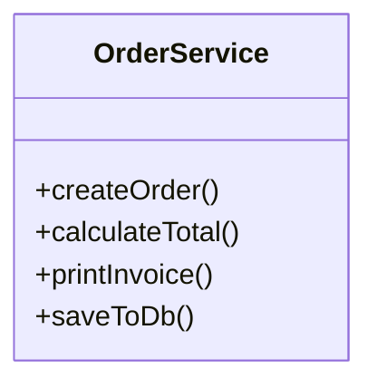
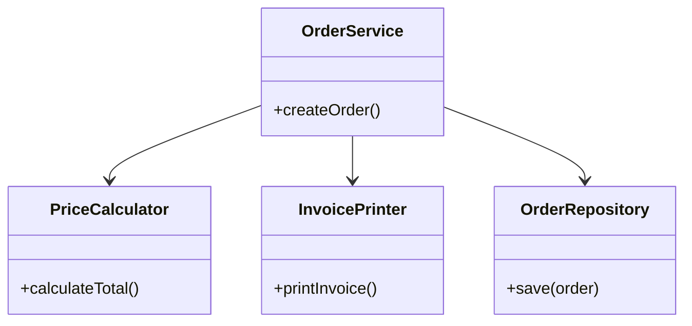
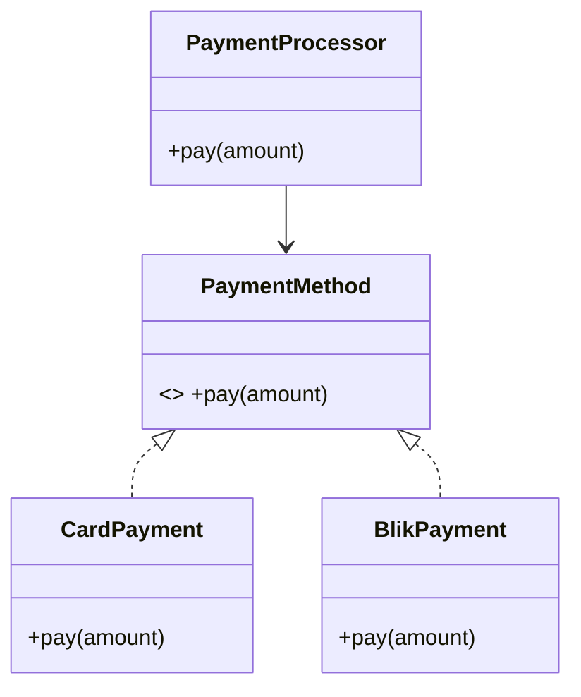
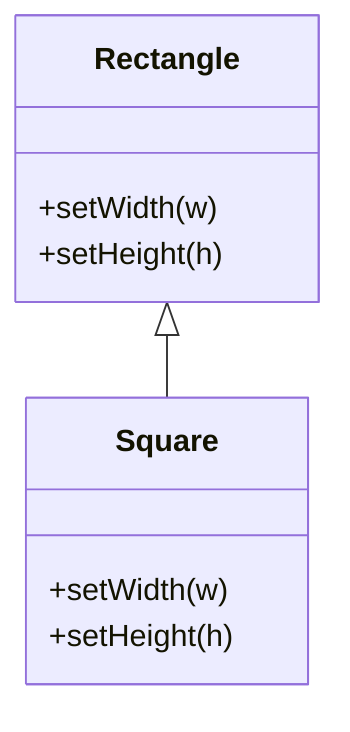
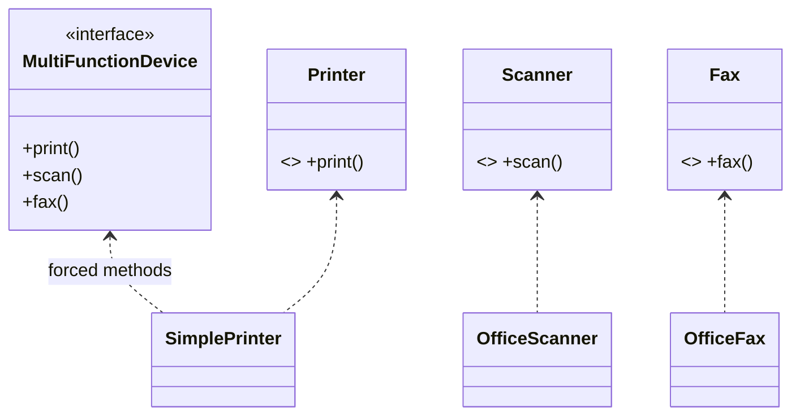
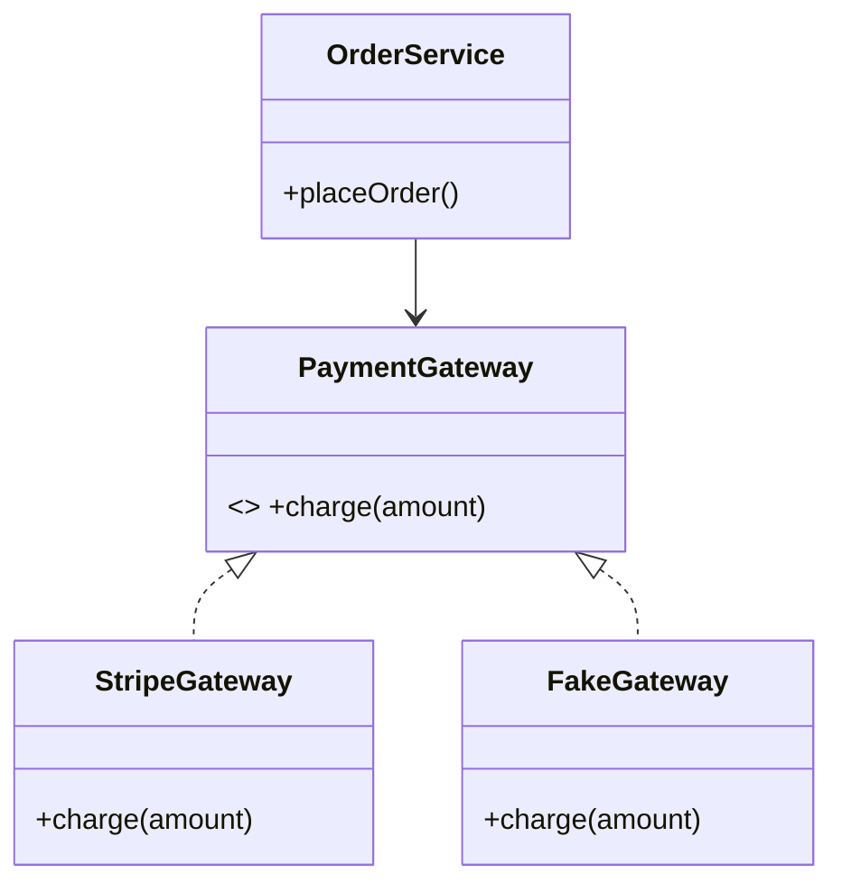
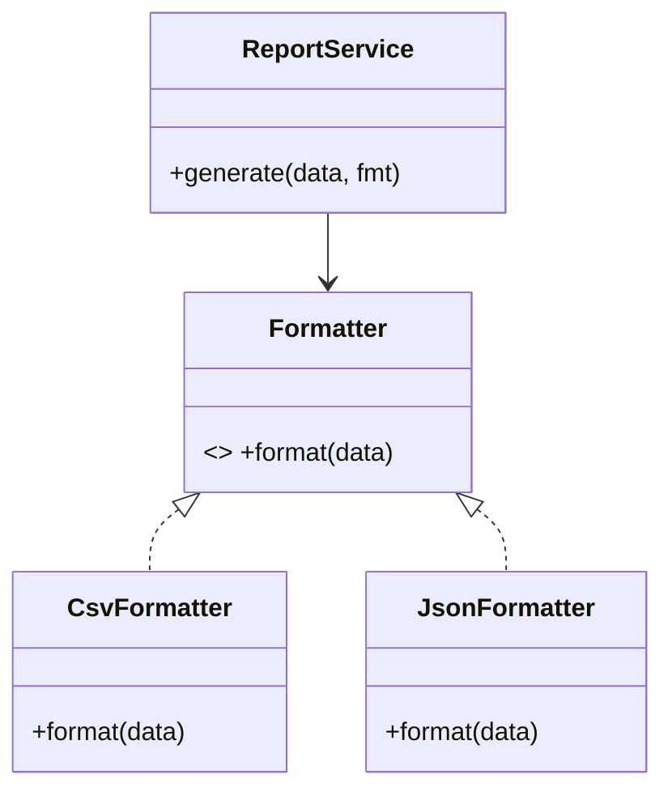
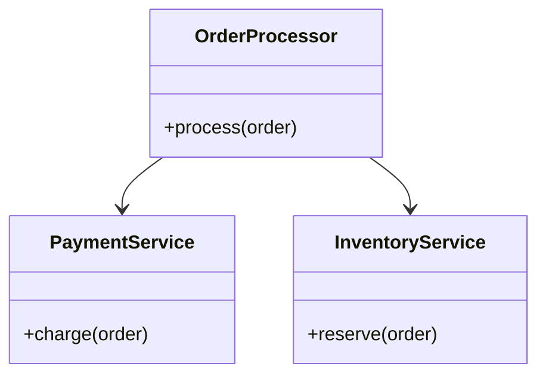
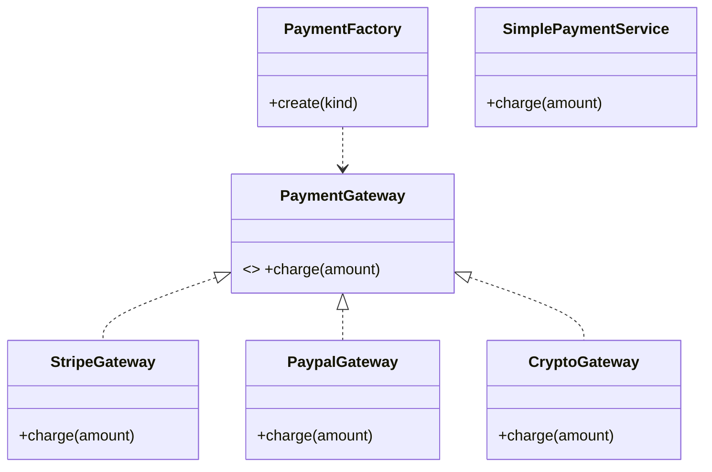

### 11. Zasady SOLID w OOP (Java i Python)

---
---

#### Cel wykładu
Poznasz 5 zasad SOLID, zobaczysz dobre i złe przykłady (Java i Python), a także proste diagramy UML (Mermaid) ułatwiające zrozumienie. Każdą literę ilustrują co najmniej dwa przykłady (anty‑przykład i poprawa, czasem więcej wariantów).

Spis treści:
- S — Single Responsibility Principle (SRP)
- O — Open/Closed Principle (OCP)
- L — Liskov Substitution Principle (LSP)
- I — Interface Segregation Principle (ISP)
- D — Dependency Inversion Principle (DIP)
-- Zasady uzupełniające --
- DRY — Don't Repeat Yourself
- KISS — Keep It Simple, Stupid
- YAGNI — You Aren't Gonna Need It

---

### S — Single Responsibility Principle
„Klasa/moduł powinien mieć tylko jedną przyczynę do zmiany.”

Dlaczego:
- mniejsza złożoność, łatwiejsze testy, mniej sprzężeń, mniej konfliktów przy zmianach.

UML (naruszenie SRP — klasa robi „wszystko”):


UML (zgodnie z SRP — rozdzielenie odpowiedzialności):


Zły przykład 1 (Java): jedna klasa od logiki, IO i formatowania
```java
class ReportService {
    public void generateAndSaveReport(DataSource ds, String path) {
        // 1) zbieranie danych
        var data = ds.fetch();
        // 2) przetwarzanie/logika
        var total = 0.0;
        for (var d : data) total += d.value();
        // 3) formatowanie
        String content = "TOTAL: " + total + "\n";
        // 4) zapis do pliku
        try (var fw = new java.io.FileWriter(path)) {
            fw.write(content);
        } catch (Exception e) {
            throw new RuntimeException(e);
        }
    }
}
```

Lepszy przykład 1 (Java): separacja odpowiedzialności
```java
class ReportGenerator {
    private final Calculator calculator;
    private final Formatter formatter;
    private final Saver saver;

    ReportGenerator(Calculator c, Formatter f, Saver s) {
        this.calculator = c; this.formatter = f; this.saver = s;
    }

    public void generate(DataSource ds, String path) {
        var result = calculator.calculate(ds.fetch());
        var content = formatter.format(result);
        saver.save(content, path);
    }
}

interface Calculator { double calculate(Iterable<Item> items); }
interface Formatter { String format(double value); }
interface Saver { void save(String content, String path); }
```

Zły przykład 2 (Python): klasa łączy walidację, zapis i wysyłkę e‑mail
```python
class UserRegistration:
    def register(self, user):
        if not user.email or "@" not in user.email:
            raise ValueError("Invalid email")  # walidacja
        with open("users.txt", "a") as f:    # zapis
            f.write(user.email + "\n")
        print(f"Sending welcome email to {user.email}")  # wysyłka
```

Lepszy przykład 2 (Python):
```python
class UserValidator:
    def validate(self, user):
        if not user.email or "@" not in user.email:
            raise ValueError("Invalid email")

class UserRepository:
    def save(self, user):
        with open("users.txt", "a") as f:
            f.write(user.email + "\n")

class Mailer:
    def send_welcome(self, user):
        print(f"Sending welcome email to {user.email}")

class RegistrationService:
    def __init__(self, validator, repo, mailer):
        self.v = validator; self.r = repo; self.m = mailer
    def register(self, user):
        self.v.validate(user)
        self.r.save(user)
        self.m.send_welcome(user)
```

Checklist SRP:
- Czy klasa ma jedną odpowiedzialność biznesową? Czy nazwa jest spójna z zawartością?
- Czy test zmiany formatu danych wymaga edycji logiki lub zapisu? Jeśli tak — naruszenie SRP.

---

### O — Open/Closed Principle
„Być otwartym na rozszerzenia, zamkniętym na modyfikacje.”

Idea: dodajemy nowe zachowania (strategia, dziedziczenie, kompozycja), bez ruszania stabilnego, przetestowanego kodu.

UML (strategia zamiast if‑ów):


Zły przykład 1 (Java): kaskada if/else w starej klasie
```java
class PaymentProcessor {
    public void pay(String type, double amount) {
        if (type.equals("CARD")) {
            // płatność kartą
        } else if (type.equals("BLIK")) {
            // płatność BLIK
        } else if (type.equals("CRYPTO")) {
            // nowy typ => trzeba modyfikować klasę
        }
    }
}
```

Lepszy przykład 1 (Java): rozszerzalność przez interfejs
```java
interface PaymentMethod { void pay(double amount); }
class CardPayment implements PaymentMethod { public void pay(double a){ /*...*/ } }
class BlikPayment implements PaymentMethod { public void pay(double a){ /*...*/ } }

class PaymentProcessor {
    private final PaymentMethod method;
    PaymentProcessor(PaymentMethod m) { this.method = m; }
    public void pay(double amount) { method.pay(amount); }
}
```

Zły przykład 2 (Python): modyfikacja funkcji za każdym razem
```python
def discount(price, type):
    if type == "student":
        return price * 0.8
    elif type == "vip":
        return price * 0.7
    elif type == "black_friday":
        return price * 0.5
    # każdy nowy typ => edycja funkcji
```

Lepszy przykład 2 (Python): rejestr strategii
```python
class Discount:
    def apply(self, price):
        raise NotImplementedError

class StudentDiscount(Discount):
    def apply(self, price):
        return price * 0.8

class VipDiscount(Discount):
    def apply(self, price):
        return price * 0.7

DISCOUNTS = {
    "student": StudentDiscount(),
    "vip": VipDiscount(),
}

def discount(price, kind):
    return DISCOUNTS[kind].apply(price)
```

Checklist OCP:
- Czy dodanie nowego wariantu wymaga modyfikacji istniejących klas, czy tylko dodania nowej implementacji/interpretera/strategii?

---

### L — Liskov Substitution Principle
„Obiekty podklas powinny dać się użyć zamiast obiektów klas bazowych bez zmiany poprawności.”

Oznaki naruszenia: wymuszanie dodatkowych pre/postwarunków, rzucanie nieoczekiwanych wyjątków, „puste”/zablokowane metody.

UML (klasycznie błędny przykład: Kwadrat jako Prostokąt):


Zły przykład 1 (Java): `Square` łamie oczekiwania `Rectangle`
```java
class Rectangle {
    protected int w, h;
    public void setWidth(int w){ this.w = w; }
    public void setHeight(int h){ this.h = h; }
    public int area(){ return w * h; }
}
class Square extends Rectangle {
    @Override public void setWidth(int w){ this.w = this.h = w; }
    @Override public void setHeight(int h){ this.w = this.h = h; }
}
```

Lepszy przykład 1 (Java): rozdziel interfejsy/abstrakcje
```java
interface Shape { int area(); }
final class Rectangle implements Shape {
    private final int w, h;
    Rectangle(int w, int h){ this.w=w; this.h=h; }
    public int area(){ return w*h; }
}
final class Square implements Shape {
    private final int a;
    Square(int a){ this.a=a; }
    public int area(){ return a*a; }
}
```

Zły przykład 2 (Python): podklasa zawęża kontrakt
```python
class FileWriter:
    def write(self, text: str) -> None:
        print(text)

class SafeFileWriter(FileWriter):
    def write(self, text: str) -> None:
        if len(text) > 100:
            raise ValueError("Too long")  # nowe ograniczenie łamie LSP
        super().write(text)
```

Lepszy przykład 2 (Python): wprowadź nowy typ/kontrakt
```python
class Writer:
    def write(self, text: str) -> None:
        raise NotImplementedError

class ConsoleWriter(Writer):
    def write(self, text: str) -> None:
        print(text)

class BoundedWriter(Writer):
    def __init__(self, limit: int, inner: Writer):
        self.limit = limit; self.inner = inner
    def write(self, text: str) -> None:
        if len(text) > self.limit:
            text = text[:self.limit]
        self.inner.write(text)
```

Checklist LSP:
- Czy podklasa nie wprowadza dodatkowych ograniczeń względem klasy bazowej?
- Czy kod używający bazowego interfejsu działa poprawnie z każdą implementacją?

---

### I — Interface Segregation Principle
„Wiele specjalistycznych interfejsów jest lepsze niż jeden ogólny, przeładowany.”

UML (zbyt gruby interfejs vs. segregacja):


Zły przykład 1 (Java): jeden interfejs do wszystkiego
```java
interface MultiFunctionDevice {
    void print();
    void scan();
    void fax();
}
class SimplePrinter implements MultiFunctionDevice {
    public void print() { /* ok */ }
    public void scan() { throw new UnsupportedOperationException(); }
    public void fax() { throw new UnsupportedOperationException(); }
}
```

Lepszy przykład 1 (Java): rozdziel interfejsy
```java
interface Printer { void print(); }
interface Scanner { void scan(); }
class SimplePrinter implements Printer {
    public void print() { /* ... */ }
}
```

Zły przykład 2 (Python): „tłusty” protokół
```python
class Storage:
    def save(self, data): ...
    def load(self, key): ...
    def purge_cache(self): ...

class FileStorage(Storage):
    def save(self, data): ...
    def load(self, key): ...
    def purge_cache(self):
        raise NotImplementedError  # nie dotyczy
```

Lepszy przykład 2 (Python): mniejsze protokoły
```python
class Saver:
    def save(self, data): ...

class Loader:
    def load(self, key): ...

class FileStorage(Saver, Loader):
    def save(self, data): ...
    def load(self, key): ...
```

Checklist ISP:
- Czy implementacje nie muszą rzucać `UnsupportedOperation` dla metod z interfejsu?
- Czy interfejsy odzwierciedlają rzeczywiste role/zdolności?

---

### D — Dependency Inversion Principle
„Moduły wysokiego poziomu nie powinny zależeć od modułów niskiego poziomu. Oba powinny zależeć od abstrakcji.”

Konsekwencje: wstrzykiwanie zależności, testowalność (mocki/stubby), luźne powiązania.

UML (wysoki poziom zależy od interfejsu):


Zły przykład 1 (Java): twarda zależność od implementacji
```java
class OrderService {
    private final StripeGateway gateway = new StripeGateway();
    public void placeOrder(double amount) { gateway.charge(amount); }
}
```

Lepszy przykład 1 (Java): zależność od abstrakcji + DI
```java
interface PaymentGateway { void charge(double amount); }
class StripeGateway implements PaymentGateway { public void charge(double a){ /*...*/ } }
class OrderService {
    private final PaymentGateway gateway;
    OrderService(PaymentGateway g){ this.gateway = g; }
    public void placeOrder(double amount){ gateway.charge(amount); }
}
```

Zły przykład 2 (Python): tworzenie zależności w środku
```python
class ReportService:
    def export(self, data):
        import json
        return json.dumps(data)  # trudno podmienić w testach/innym formacie
```

Lepszy przykład 2 (Python): podaj strategię z zewnątrz
```python
class Serializer:
    def dumps(self, data):
        raise NotImplementedError

class JsonSerializer(Serializer):
    def dumps(self, data):
        import json
        return json.dumps(data)

class ReportService:
    def __init__(self, serializer: Serializer):
        self.s = serializer
    def export(self, data):
        return self.s.dumps(data)
```

Checklist DIP:
- Czy klasy wysokopoziomowe znają tylko interfejsy?
- Czy zależności są dostarczane z zewnątrz (konstruktor, setter, parametr metody)?

---

### Wskazówki praktyczne i anty‑wzorce
- Unikaj „Boga‑klasy” (god object). SRP i ISP pomagają ją rozdrobnić.
- Zamiast instrukcji `switch`/`if-else` po typie — rozważ polimorfizm (OCP).
- Nie nadużywaj dziedziczenia — preferuj kompozycję (często pomaga w LSP i OCP).
- Wprowadzaj kontrakty/abstrakcje tam, gdzie zależą od nich moduły wyżej (DIP).
- Zadbaj o spójny, minimalny interfejs publiczny (ISP + SRP).

### Szybkie mini‑zadania (dla studentów)
1) SRP: Podziel klasę, która jednocześnie liczy, formatuje i zapisuje dane.
2) OCP: Usuń `if(type)` z procesora płatności, wprowadź strategię.
3) LSP: Przerób hierarchię tak, by zamienić bazę na interfejs `Shape` bez setterów.
4) ISP: Rozbij „gruby” interfejs repozytorium na mniejsze role.
5) DIP: Wstrzyknij interfejs logowania do serwisu zamiast używać `System.out` / `print` bezpośrednio.

### Podsumowanie
- SOLID to zestaw heurystyk projektowych, nie dogmat. Stosuj, gdy upraszcza kod i ułatwia zmianę.
- Każdą zasadę możesz wdrożyć stopniowo. Refaktoryzuj, gdy pojawia się ból zmiany/testowania.

---

### Dodatkowa teoria: pogłębienie SOLID

#### Skąd wzięło się SOLID (kontekst historyczny)
- Akronim SOLID spopularyzował Robert C. Martin (Uncle Bob) około 2000–2003 r., porządkując wcześniejsze prace m.in. B. Meyer (Design by Contract), M. Fowler (Refactoring), K. Beck (XP/TDD).
- Celem było dostarczenie zestawu praktycznych heurystyk ułatwiających zmienność i testowalność oprogramowania w środowisku zwinnego rozwoju.
- Zasady nie są prawami matematycznymi — to skróty myślowe, które pomagają podejmować decyzje projektowe.

#### Definicje i interpretacje praktyczne
- SRP: Jedna odpowiedzialność = jedna przyczyna zmiany. W praktyce: wysoka kohezja klasy/modułu, spójna nazwa, minimalny interfejs publiczny. Granice często wynikają z języka domeny (DDD: kontekst ograniczony).
- OCP: Zmieniaj zachowanie przez rozszerzanie (nowe implementacje, strategie, plug-iny), a nie przez edycję sprawdzonego kodu. W praktyce: stabilne API, punkty rozszerzeń, wyraźna separacja modułów.
- LSP: Zamienność typów. W praktyce: nie dodawaj wymagań w podklasie, których nie ma klasa bazowa; nie łam kontraktów (pre/postwarunki, niezmienniki). Preferuj kompozycję, gdy dziedziczenie kusi, ale łamie kontrakt.
- ISP: Małe, wyspecjalizowane interfejsy zamiast jednego „tłustego”. W praktyce: interfejsy zorientowane na role (role-based), zależności wyrażone tak, aby konsumenci nie byli zmuszani do metod, których nie użyją.
- DIP: Kierunek zależności ku abstrakcjom. W praktyce: moduły wysokopoziomowe zależą od interfejsów/protokołów; konfiguracja i integracja dostarczają implementacje (DI), co ułatwia testy i wymienialność.

#### Jakie problemy (pain points) rozwiązuje SOLID
- Zmiany kaskadowe (shotgun surgery) — SRP, ISP, DIP.
- Krucha architektura i ryzyko regresji — OCP, DIP.
- Niezgodność kontraktów, zaskakujące wyjątki — LSP.
- Skomplikowane zależności i trudne testy — DIP, ISP.

#### Trade‑offy i anty‑dogmatyzm
- Nadmierna abstrakcja (overengineering): zbyt wiele interfejsów/warstw przy małej skali (narusza YAGNI). Objawy: dużo klas „przekaźników”, trudna nawigacja.
- Przedwczesna generalizacja pod OCP potrafi utrudnić proste zmiany. Najpierw prosta implementacja, dopiero potem wyodrębnianie strategii, gdy pojawią się realne warianty.
- SRP a ergonomia: zbyt drobna granulacja może utrudnić zrozumienie i zwiększyć koszty orkiestracji.

#### Code smells powiązane z SOLID i taktyki refaktoryzacji
- SRP: God Object, Divergent Change, Shotgun Surgery, Feature Envy.
  - Taktyki: Extract Class/Module, Extract Function, Facade, rozdzielenie warstw IO/formatowania/logiki.
- OCP: Switch/if‑else po typie, Rigid Design, Primitive Obsession.
  - Taktyki: Strategy/Policy, Registry/Plugin, Template Method, State, Polimorfizm zamiast instrukcji warunkowych.
- LSP: Refused Bequest, Broken Hierarchy, Throwing Unexpected Exceptions.
  - Taktyki: Prefer composition over inheritance, final/immutable types, wydzielenie wspólnego interfejsu zamiast dziedziczenia impl.
- ISP: Fat Interface, Interface Bloat, Unused Parameters/Methods.
  - Taktyki: Segregate interfaces (role-based), Adapter, Event/Observer do odsprzęglenia sygnałów.
- DIP: Concrete Dependency, Hidden Dependency (Service Locator), Hard‑wired new.
  - Taktyki: Dependency Injection (konstruktor, setter, parametr), wprowadzenie interfejsów/protokołów, Inversion of Control (kontener DI).

#### Interakcje i potencjalne konflikty zasad
- SRP vs OCP: zbyt drobne SRP może utrudnić rozszerzalność bez orkiestracji. Równoważ: stabilne punkty rozszerzeń w modułach o spójnej odpowiedzialności.
- ISP vs LSP: segmentując interfejsy nie wprowadzaj podinterfejsów z węższymi kontraktami, które nie są zamienne w miejscach oczekujących bazowego kontraktu.
- DIP wspiera OCP: zależność od abstrakcji pozwala wstrzyknąć nowe warianty bez modyfikacji.

#### Kontekst architektoniczny: gdzie SOLID pasuje
- Clean/Hexagonal Architecture: DIP na granicy aplikacja–infrastruktura (porty i adaptery). SRP i ISP pomagają określić porty, OCP ułatwia dodawanie adapterów.
- DDD (Domain‑Driven Design): SRP przy wyznaczaniu agregatów i serwisów domenowych; OCP w politykach domenowych; LSP przy kontraktach domenowych; DIP w warstwie aplikacyjnej.

#### Specyfika językowa (Java i Python)
- Java: bogate wsparcie interfejsów i frameworków DI (Spring, CDI). Wymusza czytelne zależności (konstruktor/setter) i ułatwia testy przez mocki. `final` pomaga w utrzymaniu kontraktów LSP.
- Python: duck typing i `typing.Protocol` zamiast interfejsów. Abstrakcje przez `abc.ABC` lub protokoły; DI zwykle ręcznie (przekazywanie zależności) lub lekkie kontenery.

Przykład (Python `Protocol` dla DIP/ISP):
```python
from typing import Protocol

class PaymentGateway(Protocol):
    def charge(self, amount: float) -> None: ...

class StripeGateway:
    def charge(self, amount: float) -> None:
        print("stripe", amount)

class OrderService:
    def __init__(self, gateway: PaymentGateway):
        self.gateway = gateway
    def place_order(self, amount: float) -> None:
        self.gateway.charge(amount)
```

Przykład (Java — konstruktorowe DI bez frameworka):
```java
interface Clock { java.time.Instant now(); }
class SystemClock implements Clock { public java.time.Instant now(){ return java.time.Instant.now(); } }
class ReportService {
    private final Clock clock;
    ReportService(Clock clock){ this.clock = clock; }
    public String header(){ return "Generated at " + clock.now(); }
}
```

#### Najczęstsze nieporozumienia i mity
- „SRP = jedna funkcja w klasie” — nie. Chodzi o jedną przyczynę zmiany, nie o liczbę metod.
- „OCP = wszędzie interfejsy” — nie. Wprowadzaj abstrakcje tam, gdzie realnie oczekujesz wariantów.
- „LSP dotyczy tylko dziedziczenia” — dotyczy każdego kontraktu typu; także interfejsów/protokołów.
- „ISP zwiększa liczbę interfejsów = gorsza złożoność” — więcej, ale mniejszych i trafniejszych interfejsów upraszcza zmiany.
- „DIP wymaga kontenera DI” — nie, wystarczy przekazywanie zależności w konstruktorze.
- „SOLID zawsze skraca kod” — czasem zwiększa liczbę klas, ale zmniejsza sprzężenia i koszt zmiany.

#### Mini case studies (skrócone)
1) Moduł płatności: zastąpienie `if(type)` strategią (OCP) + wstrzyknięcie interfejsu bramki (DIP) skróciło testy integracyjne o 50% i umożliwiło testy z `FakeGateway` bez sieci.
2) Raportowanie: rozdzielenie zbierania danych, kalkulacji i zapisu (SRP) obniżyło konflikty mergowe między zespołami pracującymi nad formatem a logiką o 70%.
3) Hierarchia figur: usunięcie dziedziczenia `Square extends Rectangle` na rzecz wspólnego `Shape` (LSP) uprościło kontrakty i testy brzegowe.

#### Pytania kontrolne / quiz (z krótkimi odpowiedziami)
1) Co oznacza „jedna przyczyna zmiany” w SRP? — Zmiana jednego aspektu domeny powinna dotykać jednej klasy/modułu.
2) Jak OCP wpływa na regresje? — Zmiany realizujesz przez dodawanie nowych implementacji, nie ruszając starego, przetestowanego kodu.
3) Podaj przykład naruszenia LSP. — Podklasa zaostrza prewarunek (np. rzuca wyjątek dla danych akceptowanych przez bazę).
4) Dlaczego ISP pomaga w testach? — Mniejsze interfejsy łatwiej zamockować i izolować w testach.
5) Jak DIP wspiera wymienialność? — Moduł zależy od abstrakcji, implementacje można podmieniać bez zmian klienta.
6) Kiedy unikać nadmiernego OCP? — Gdy nie ma realnych wariantów; stosuj YAGNI.
7) Jaki zapach kodu sugeruje naruszenie SRP? — God Object, Divergent Change.
8) Jaką taktykę wybrać zamiast kaskady if‑ów po typie? — Strategy/Registry + polimorfizm.
9) Co w Javie pomaga w egzekwowaniu LSP? — Testy kontraktów, klasy `final`, niemodyfikowalność stanu, jawne interfejsy.
10) Jak w Pythonie wyrazić kontrakt bez interfejsów? — `typing.Protocol` lub ABC + testy zachowania.

#### Źródła i dalsza lektura
- R. C. Martin: Agile Software Development, Principles, Patterns, and Practices; Clean Architecture.
- M. Fowler: Refactoring, Patterns of Enterprise Application Architecture.
- B. Meyer: Object-Oriented Software Construction (Design by Contract).
- Sandi Metz: Practical Object-Oriented Design (POODR).
- Artykuły: „The Principles of OOD” (Uncle Bob), katalog refaktoryzacji (refactoring.guru), dokumentacja `typing.Protocol` (Python), Spring Framework Reference (DI).

---

### Zasady uzupełniające: DRY, KISS, YAGNI

Choć SOLID dotyczy głównie projektowania obiektowego, w praktyce codziennej warto stosować uzupełniające heurystyki: DRY, KISS i YAGNI. Pomagają one utrzymać kod krótki, czytelny i odporny na zmiany, a także chronią przed nadinżynierią. Te trzy zasady dobrze uzupełniają SRP/OCP/LSP/ISP/DIP i pomagają podejmować pragmatyczne decyzje w zespole.

#### DRY — Don't Repeat Yourself
„Nie powtarzaj się” — wiedza (logika biznesowa, reguły, formaty) powinna mieć jedno źródło prawdy. DRY dotyczy nie tylko duplikacji kodu, ale również duplikacji wiedzy w dokumentacji, testach i konfiguracji.

Kiedy łamiemy DRY:
- kopiuj‑wklej podobnych fragmentów (copypasta),
- powielone stałe, formaty, walidacje w wielu miejscach,
- duplikacja SQL/JSON/konfiguracji w wielu plikach bez wspólnego modułu/wzorca,
- duplikacja testów pokrywających ten sam przypadek inną drogą.

Korzyści DRY:
- mniej miejsc do zmiany przy nowym wymaganiu (mniejszy koszt utrzymania),
- spójność zachowania, mniej rozjazdów i regresji,
- krótszy, bardziej modułowy kod (często współgra z SRP i OCP).

UML (refaktoryzacja pod DRY: Strategia zamiast duplikacji algorytmu):


Zły przykład 1 (Java): powtórzona logika formatowania w dwóch metodach
```java
class InvoicePrinter {
    public String printCsv(List<Invoice> invoices) {
        StringBuilder sb = new StringBuilder();
        sb.append("id,amount\n");
        for (Invoice i : invoices) {
            // LOGIKA FORMATOWANIA #1 (duplikacja)
            sb.append(i.getId()).append(',').append(i.getAmount());
            sb.append('\n');
        }
        return sb.toString();
    }

    public String printCsvPaidOnly(List<Invoice> invoices) {
        StringBuilder sb = new StringBuilder();
        sb.append("id,amount\n");
        for (Invoice i : invoices) {
            if (!i.isPaid()) continue;
            // LOGIKA FORMATOWANIA #2 (druga kopia)
            sb.append(i.getId()).append(',').append(i.getAmount());
            sb.append('\n');
        }
        return sb.toString();
    }
}
```

Lepszy przykład 1 (Java): ekstrakcja wspólnej funkcji/strategii
```java
class InvoiceCsvFormatter {
    public void appendRow(StringBuilder sb, Invoice i) {
        sb.append(i.getId()).append(',').append(i.getAmount()).append('\n');
    }
}

class InvoicePrinter {
    private final InvoiceCsvFormatter fmt = new InvoiceCsvFormatter();

    public String printCsv(List<Invoice> invoices) {
        StringBuilder sb = new StringBuilder();
        sb.append("id,amount\n");
        for (Invoice i : invoices) fmt.appendRow(sb, i);
        return sb.toString();
    }

    public String printCsvPaidOnly(List<Invoice> invoices) {
        StringBuilder sb = new StringBuilder();
        sb.append("id,amount\n");
        for (Invoice i : invoices) if (i.isPaid()) fmt.appendRow(sb, i);
        return sb.toString();
    }
}
```

Zły przykład 2 (Python): zduplikowane reguły walidacji w kilku miejscach
```python
def register_user(user):
    if not user.email or "@" not in user.email:
        raise ValueError("Invalid email")  # duplikacja
    # ... zapis

def send_newsletter(user):
    if not user.email or "@" not in user.email:
        raise ValueError("Invalid email")  # duplikacja
    # ... wysyłka
```

Lepszy przykład 2 (Python): pojedyncze źródło walidacji
```python
class UserValidator:
    def validate_email(self, email: str) -> None:
        if not email or "@" not in email:
            raise ValueError("Invalid email")

validator = UserValidator()

def register_user(user):
    validator.validate_email(user.email)
    # ... zapis

def send_newsletter(user):
    validator.validate_email(user.email)
    # ... wysyłka
```

Zły przykład 3 (Java): zduplikowane stałe i regexy
```java
class UserForm {
    private static final String EMAIL_REGEX = ".+@.+\\..+"; // kopia #1
    // ... użycie
}
class NewsletterForm {
    private static final String EMAIL_REGEX = ".+@.+\\..+"; // kopia #2
    // ... użycie
}
```

Lepszy przykład 3 (Java): współdzielone stałe w jednym miejscu
```java
final class Regexes {
    private Regexes() {}
    public static final String EMAIL = ".+@.+\\..+";
}

class UserForm { /* używa Regexes.EMAIL */ }
class NewsletterForm { /* używa Regexes.EMAIL */ }
```

Checklist DRY:
- Czy konkretną regułę/format/algorytm zmieniasz w jednym miejscu?
- Czy testy nie powielają tego samego przypadku logicznego tylko inną ścieżką?
- Czy konfiguracja (np. endpointy, klucze) nie jest duplikowana w wielu modułach?

Mini‑zadania DRY:
- Wyodrębnij wspólny kod budowania CSV z kilku metod do jednej klasy formatującej.
- Zastąp powtarzające się walidacje użytkownika wywołaniem `UserValidator`.

---

#### KISS — Keep It Simple, Stupid
„Utrzymuj prostotę.” Preferuj proste rozwiązania działające dziś, zamiast skomplikowanych i ogólnych na hipotetyczne jutro. Prostota zmniejsza koszt poznawczy i ryzyko błędów.

Złożoność niezbędna vs. przypadkowa:
- niezbędna — wynika z domeny; nie usuniesz jej bez utraty funkcji,
- przypadkowa — wynika z projektu/implementacji; możesz ją zredukować.

Heurystyki KISS:
- małe, spójne funkcje i klasy; preferuj kompozycję nad rozbudowane dziedziczenie,
- unikaj nadmiarowych wzorców, metaprogramowania i refleksji, gdy zwykły `if` wystarczy,
- pisz jawny kod zamiast „magii”; dodaj komentarz, nie framework,
- optymalizuj po pomiarze, nie przed (premature optimization szkodzi).

UML (upraszczanie — redukcja zbędnej hierarchii na rzecz kompozycji):


Zły przykład 1 (Java): nadmierna ogólność i dziedziczenie
```java
abstract class AbstractProcessor<T> {
    protected abstract void before(T t);
    protected abstract void doProcess(T t);
    protected abstract void after(T t);
}

class OrderProcessor extends AbstractProcessor<Order> {
    protected void before(Order o) { /* ... */ }
    protected void doProcess(Order o) { /* ... */ }
    protected void after(Order o) { /* ... */ }
}
```

Lepszy przykład 1 (Java): bez zbędnej hierarchii, prosta kompozycja
```java
class OrderProcessor {
    private final PaymentService payment;
    private final InventoryService inventory;

    OrderProcessor(PaymentService p, InventoryService i) {
        this.payment = p; this.inventory = i;
    }

    public void process(Order o) {
        inventory.reserve(o);
        payment.charge(o);
    }
}
```

Zły przykład 2 (Python): skomplikowane meta‑fabryki bez potrzeby
```python
class ProcessorFactoryRegistry:
    _registry = {}
    @classmethod
    def register(cls, name, factory):
        cls._registry[name] = factory
    @classmethod
    def create(cls, name, **kwargs):
        return cls._registry[name](**kwargs)

def process_order(order):
    proc = ProcessorFactoryRegistry.create("order", config={"modes": ["x","y"]})
    proc.process(order)
```

Lepszy przykład 2 (Python): prosty, jawny kod
```python
class OrderProcessor:
    def __init__(self, payment, inventory):
        self.payment = payment
        self.inventory = inventory

    def process(self, order):
        self.inventory.reserve(order)
        self.payment.charge(order)

def process_order(order, payment, inventory):
    OrderProcessor(payment, inventory).process(order)
```

Zły przykład 3 (Java): „sprytna” optymalizacja przedwcześnie
```java
class Stats {
    // skomplikowane cache + wielowątkowość, choć dane mają 100 rekordów
    private final java.util.concurrent.ConcurrentMap<String, Double> cache = new java.util.concurrent.ConcurrentHashMap<>();
    public double avg(List<Double> xs) {
        return xs.stream().mapToDouble(Double::doubleValue).average().orElse(0.0);
    }
}
```

Lepszy przykład 3 (Java): najprostsze rozwiązanie wystarczające dziś
```java
class Stats {
    public double avg(List<Double> xs) {
        double sum = 0.0; for (double x : xs) sum += x; return xs.isEmpty() ? 0.0 : sum / xs.size();
    }
}
```

Checklist KISS:
- Czy rozumiesz funkcję/klasę w 60 sekund? Jeśli nie — rozbij lub uprość.
- Czy istnieje prostsza struktura danych/algorytm dający ten sam efekt?
- Czy nie wdrożyłeś wzorca tylko po to, by „brzmiało dobrze” w kodzie?

Mini‑zadania KISS:
- Usuń zbędne klasy bazowe i interfejsy, zastępując je prostą kompozycją.
- Zamień rejestr meta‑fabryk na jawne wywołania konstruktorów.

---

#### YAGNI — You Aren't Gonna Need It
„Nie będziesz tego potrzebować.” Nie implementuj funkcji, rozszerzalności ani konfiguracji, dopóki nie ma realnej potrzeby (wymagania/klienta/testu).

Związek z SOLID:
- YAGNI równoważy OCP: nie twórz ogólnych punktów rozszerzeń bez sygnału z domeny,
- pomaga trzymać KISS: mniej warstw/abstrakcji, dopóki nie są konieczne,
- wspiera SRP: każda dodatkowa odpowiedzialność to potencjalny powód zmiany.

Kiedy ignorować YAGNI: gdy koszt późniejszej zmiany jest ekstremalny (np. wybór niezmiennego formatu danych publicznych API) — wtedy projektuj ostrożnie, ale wciąż minimalnie.

UML (przed YAGNI: nadmiar abstrakcji) vs (po YAGNI: tylko potrzebne elementy):


Zły przykład 1 (Java): fabryki i pluginy bez konsumentów
```java
interface Exporter { void export(Object data); }
class PdfExporter implements Exporter { public void export(Object d){ /* ... */ } }
class CsvExporter implements Exporter { public void export(Object d){ /* ... */ } }
class ExporterFactory { Exporter create(String kind){ /* if-else */ return new PdfExporter(); } }

class ReportService {
    public void generate(Object data){
        // zawsze PDF, ale mamy nieużywaną fabrykę i CSV
        new PdfExporter().export(data);
    }
}
```

Lepszy przykład 1 (Java): tylko to, co potrzebne teraz
```java
class ReportService {
    public void generate(Object data){
        new PdfExporter().export(data); // dodamy CSV, gdy zajdzie potrzeba
    }
}
```

Zły przykład 2 (Python): rozbudowana konfiguracja feature‑flag bez użycia
```python
FEATURES = {"dark_mode": False, "beta_checkout": False, "ml_recommendations": False}

def render_home():
    if FEATURES["ml_recommendations"]:
        pass  # brak implementacji, gałąź martwa
    return "Home"
```

Lepszy przykład 2 (Python): usuń martwy kod, dodaj gdy realnie potrzebny
```python
def render_home():
    return "Home"  # dodamy rekomendacje, gdy pojawi się wymaganie
```

Zły przykład 3 (Java): nadmiar parametrów konfiguracyjnych bez sensu
```java
class Cache {
    Cache(int shards, boolean enableJmx, boolean enableMetrics, boolean allowDiskSpill, boolean useUnsafe) { /* ... */ }
}
```

Lepszy przykład 3 (Java): minimalny konstruktor, reszta później
```java
class Cache {
    Cache(int capacity) { /* ... */ }
}
```

Checklist YAGNI:
- Czy ta abstrakcja/funkcja ma konkretnego użytkownika dziś? Jeśli nie — odłóż.
- Czy powód dodania parametru/warstwy jest mierzalny (wydajność, bezpieczeństwo) i udowodniony?
- Czy możesz dostarczyć prostszą wersję i rozszerzyć ją iteracyjnie?

Mini‑zadania YAGNI:
- Usuń nieużywane parametry/feature‑flagi i martwe gałęzie kodu.
- Zastąp fabrykę jednego rodzaju prostą instancją; przy drugim rodzaju wprowadź dopiero OCP.

---

### Podsumowanie DRY/KISS/YAGNI
- DRY redukuje koszt zmiany przez jedno źródło prawdy.
- KISS minimalizuje złożoność przypadkową — wybieraj proste konstrukcje.
- YAGNI broni przed nadinżynierią — implementuj tylko to, co potrzebne.

Te zasady wzajemnie się wzmacniają i równoważą SOLID. Stosuj je pragmatycznie: najpierw prostota i potrzeba, potem ewentualne uogólnienia i punkty rozszerzeń.
