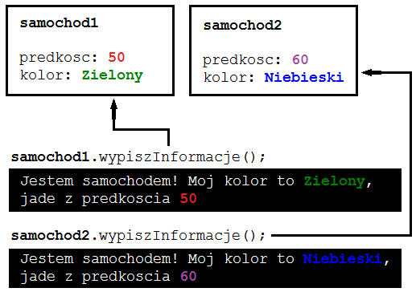

W tym rozdziale rozpoczniemy poznawanie klas i programowania zorientowanego obiektowo (OOP – Object-Oriented Programming). 
> Materiał pochodzi z [Kursu Javy](https://kursjava.com/). 

Każdy tworzony przez nas tej pory program składał się z jednej klasy publicznej. Zazwyczaj
nadawaliśmy mu nazwę zgodną z zadaniem, które wykonywał. Przypomnijmy kod naszego
pierwszego programu:

```java
public class HelloWorld {
    public static void main(String[] args) {
        System.out.println("Witaj Swiecie!");
    }
}
```
Program ten składa się z definicji publicznej klasy `HelloWorld`, której ciało zawarte jest między
nawiasami klamrowymi. Klasa ta ma w swoim ciele jedną metodę – `main`. Jak wiemy, `main`
to specjalna metoda, która jest punktem wejścia do wykonania naszego programu, która zawsze ma
taką samą _sygnaturę_ (tzn. modyfikatory, zwracany typ, nazwę, argumenty).

## Czym są klasy i do czego służą?

Klasy w programowaniu służą m.in. do opisywania otaczających nas przedmiotów, pojęć,
zdarzeń, zadań, wymagań biznesowych, relacji itd. Za pomocą klas definiujemy zupełnie
nowe typy, z których możemy korzystać w naszych programach tworząc zmienne tych typów.
Typy definiowane za pomocą klas nazywamy _typami złożonymi_, czy też _typami
referencyjnymi_.

Klasy mają dwie składowe:

- Pola – to nic innego jak poznane już przez nas zmienne. Kiedy jednak mamy na myśli
    zmienne należące do pewnej klasy, nazywamy je wtedy _polami_ tej klasy.
- Metody – metody definiują, jakie operacje klasa udostępnia dla zewnętrznego świata i jak
    można z niej korzystać.

Można powiedzieć, że klasa to pewien schemat, na który składają się jej pola i metody.

Na podstawie tego schematu możemy tworzyć _instancje_ (czyli egzemplarze) klasy. Te egzemplarze
klasy będą zawierały pola, które zdefiniowaliśmy w definicji klasy, oraz będzie można na nich
wywoływać zdefiniowane w tej klasie metody. Te utworzone egzemplarze (instancje) klasy
nazywamy _obiektami_.

Na rozmowach kwalifikacyjnych często zadawane jest pytanie: **_Czym różni się klasa od obiektu?_**

Bardzo istotne jest, by zrozumieć różnicę pomiędzy tymi dwoma pojęciami:

1. Jeżeli klasa zostałaby porównana do schematu samochodu, wówczas _obiektem tej klasy_
    byłby konkretny samochód wyprodukowany na podstawie tego schematu.
2. Innym przykładem mógłby być przepis na ciasto (klasa) oraz konkretne ciasto upieczone
    wedle tego przepisu (obiekt). Mając jeden przepis (jedną definicję klasy), możemy upiec
    wiele ciast (obiektów).

Korzystaliśmy z typu `String`. Typ `String` to właśnie klasa, napisana
przez twórców języka Java i udostępniona nam, programistom, byśmy mogli w prosty sposób
operować na ciągach znaków. Za każdym razem, gdy tworzyliśmy zmienną typu `String`,
tworzyliśmy obiekt klasy `String` – spójrzmy na [przykład](https://github.com/przemyslaw-kruglej/kursjava_przyklady/blob/master/Rozdzial_07__Metody/StringReplace.java):

```java
public class StringReplace {
    public static void main(String[] args) {
        String tekst = "Ala ma kota" ;
        String zmianaImienia = tekst.replace( "Ala" , "Jola" );
        String bezSpacji = tekst.replace( " " , "" );

        System. out .println( "Tekst z innym imieniem: " + zmianaImienia);
        System. out .println( "Tekst bez spacji: " + bezSpacji);
    }
}
```
W powyższym programie, w którym zaprezentowana została metoda `replace` klasy String,
utworzyliśmy trzy obiekty typu (klasy) `String` o nazwach: `tekst`, `zmianaImienia`, oraz
`bezSpacji` – obiekty te to konkretne instancje klasy `String`.

```
Jeszcze raz: klasa definiuje jakie pola i metody będą miały jej instancje , czyli obiekty tej
klasy. Obiekty to konkretne, utworzone egzemplarze danej klasy.
```

### Przykład pierwszej klasy z polami

Spójrzmy na przykład klasy `Samochod` z kilkoma polami oraz metodami:


```java
public class Samochod {
  private int predkosc; // (1)
  private String kolor; // (2)
  
  public void ustawPredkosc(int nowaPredkosc) {
    predkosc = nowaPredkosc; // (3)
  }
  
  public void ustawKolor(String nowyKolor) {
    kolor = nowyKolor; // (4)
  }
  
  public void wypiszInformacje() {
    System.out.println("Jestem samochodem! Moj kolor to " + kolor +
        ", jade z predkoscia " + predkosc); // (5)
  }
}
```
1. Nasza klasa Samochod ma **dwa pola**: `predkosc` oraz `kolor`, a także **trzy metody** :
    `ustawPredkosc`, `ustawKolor`, oraz `wypiszInformacje`.
2. Jak widzimy, pola klasy _(1) (2)_ to po prostu zmienne zdefiniowane poza jakąkolwiek
    metodą – właśnie ta właściwość powoduje, że są to pola klasy, a nie zmienne lokalne jednej
    z metod. Dodatkowo typ pól klasy poprzedza modyfikator **private** – wkrótce opowiemy
    sobie dokładniej o tej i innych różnicach pomiędzy zmiennymi lokalnymi a polami klas,
    a także o znaczeniu modyfikatorów.
3. Zadaniem dwóch metod zdefiniowanych w klasie Samochod jest przypisanie wartości polom
    klasy:  
  - metoda `ustawPredkosc` ustawia wartość pola `predkosc` _(3)_,  
  - natomiast `ustawKolor` pola `kolor` _(4)_.  

Trzecia metoda, `wypiszInformacje`, wypisuje dane o samochodzie _(5)_.

Taka definicja klasy informuje nas, że obiekty tej klasy będą miały po dwa pola: `predkosc` oraz
`kolor`, oraz będziemy mogli na rzecz obiektów tej klasy wywoływać trzy metody: `ustawPredkosc`,
`ustawKolor`, oraz `wypiszInformacje`.

**Pytanie** : czy metody napisane w klasie Samochod różnią się czymś od metod, które pisaliśmy do tej
pory?

Metody te nie mają modyfikatora **static** , którego do tej pory zawsze używaliśmy tworząc nasze
metody. Brak użycia słowa kluczowego **static** jest celowe – dlaczego i jaka jest różnica, gdy jest
użyte – dowiemy się w dalszej części rozdziału. Na razie nie będziemy korzystać z modyfikatora
**static** – jedynym wyjątkiem będzie metoda main, której sygnatura będzie go zawierała.


### Użycie pierwszej klasy

Jak, mając tak zdefiniowaną klasę Samochod, możemy z niej skorzystać? W jaki sposób _stworzyć
obiekty_ (instancje) wedle powyższego _schematu_? Spójrzmy na przykład użycia powyższej klasy:

```java
public class UzycieSamochodu {
    public static void main(String[] args) {
        Samochod samochod1 = new Samochod(); // 1
        samochod1.ustawKolor( "Zielony" );
        samochod1.ustawPredkosc( 50 );
        
        Samochod samochod2 = new Samochod(); // 2
        samochod2.ustawKolor( "Niebieski" );
        samochod2.ustawPredkosc( 60 );
        
        samochod1.wypiszInformacje();
        samochod2.wypiszInformacje();
    }
}
```  

Powyższa klasa o nazwie `UzycieSamochodu` zawiera metodę `main`, w której widzimy dwie zmienne
`samochod1` oraz `samochod2` typu `Samochod`, czyli klasy, którą wcześniej zdefiniowaliśmy
w osobnym pliku Samochod.java. Jak widzimy, możemy korzystać z klasy `Samochod` w innej,
napisanej przez nas klasie.

Zmienne `samochod1` oraz `samochod2` przechowują dwa utworzone egzemplarze (obiekty) klasy
`Samochod`. Tworzenie obiektów _(1) (2)_ odbywa się poprzez użycie słowa kluczowego **new** ,
o którym opowiemy sobie dokładniej w kolejnym podrozdziale.

```
Klasa UzycieSamochodu to także nowy, zdefiniowany przez nas typ, jednak jedyne, do czego
go wykorzystujemy, to punkt wejścia do naszego programu, ponieważ to w tej klasie
zdefiniowaliśmy metodę main.
```  

Na rzecz obu utworzonych obiektów wywołujemy metody `ustawKolor` oraz `ustawPredkosc` – tak
samo, jak robiliśmy to w rozdziale o metodach typu String – tam także wywoływaliśmy różne
metody (np. `toLowerCase`, `replace`) na zmiennych typu `String`. 
Wywołanie metod odbyło się poprzez napisanie kropki po nazwie zmiennej, po której nastąpiła nazwa metody oraz nawiasy wraz z argumentem dla każdej z metod:

```
samochod1.ustawKolor( "Zielony" );
samochod1.ustawPredkosc( 50 );
```
Na końcu programu wywołujemy metodę `wypiszInformacje` na rzecz każdego z naszych
obiektów typu `Samochod`, w wyniku czego na ekranie zobaczymy:

```
Jestem samochodem! Moj kolor to Zielony, jade z predkoscia 50Jestem samochodem! Moj kolor to Zielony, jade z predkoscia 50
Jestem samochodem! Moj kolor to Niebieski, jade z predkoscia 60Jestem samochodem! Moj kolor to Niebieski, jade z predkoscia 60
```
Zauważmy bardzo ważną cechę naszych obiektów – każdy z nich ma swój własny stan. 
Pierwszy samochód jest zielony, a drugi niebieski. 
Wywoływanie metody `ustawKolor` spowodowało zmianę jedynie tego obiektu, na rzecz którego została wywołana. 
Każdy z egzemplarzy (instancji) klasy `Samochod` ma swój własny zestaw niezależnych pól kolor oraz predkosc. 
Zmiana jednego obiektu typu `Samochod` nie ma wpływu na drugi obiekt.


```
Tak samo jak w życiu – pomalowanie naszego samochodu na zielono nie spowoduje,
że wszystkie samochody tej samej marki i modelu na świecie staną się zielone.
```   

Jest to bardzo ważna cecha obiektów, więc powtórzmy: każda obiekt ma swój własny stan, oddzielony od innych instancji tej samej klasy. 
Na ten stan składają się pola, które zostały zdefiniowane w klasie – w przypadku klasy `Samochod` są to pola:

- predkosc, typu **int**, oraz
- kolor, typu `String`.

Z drugiej jednak strony, wszystkie obiekty współdzielą metody, które zostały zdefiniowane w klasie. 
Metody te operują na stanie (polach) tego obiektu, na rzecz którego zostały wywołane. 
To dlatego wywołanie metody `wypiszInformacje` na różnych obiektach powoduje wypisanie innych danych na ekran – wypisywane są wartości pól obiektu, 
na rzecz którego metoda została wywołana:  
  

Obiekty `samochod1` i `samochod2` mają własne egzemplarze pól predkosc oraz kolor. Wywołanie
metody `wypiszInformacje` na każdym z obiektów powoduje, że metoda ta za pierwszym razem
działa na polach predkosc oraz kolor o wartościach 50 i "Zielony", a za drugim razem – 60 i
"Niebieski". Dzieje się tak dlatego, że metoda `wypiszInformacje` wie, na rzecz którego obiektu
została wywołana.

```
Oba pliki ( Samochod oraz UzycieSamochodu ) z powyższego przykładu powinny być w tym
samym katalogu. W jednym z kolejnych podrozdziałów nauczymy się, jak możemy odnosić
się do klas zdefiniowanych w innych katalogach i używać ich w naszych programach.
```

```
Pytanie : co by się stało, gdybyśmy spróbowali skompilować i uruchomić klasę Samochod?
Kompilacja przebiegłaby bez problemów, jednak zaraz po uruchomieniu program
zakończyłby się błędem, ponieważ nie ma w nim metody main , a to ona definiuje, co nasz
program będzie robił! Dlatego potrzebowaliśmy drugiej klasy, UzycieSamochodu , by
zobaczyć naszą klasę Samochd w akcji.
```
```
Nasuwa się teraz kolejne pytanie – czy moglibyśmy przenieść metodę main z klasy
UzycieSamochodu do klasy Samochod i wtedy spróbować ją uruchomić?
```
```
Oczywiście! Program zadziałałby tym razem bez problemu – na ekranie zobaczylibyśmy
komunikaty "Jestem samochodem (...)".
```
### Nazewnictwo klas

W jednym z pierwszych rozdziałów kursu podane były dwie informacje dotyczące nazewnictwa
klas i plików, w których są zawarte – przypomnijmy je sobie teraz:

1. Plik z kodem źródłowym musi nazywać się tak samo, jak nazwa publicznej klasy, która
    jest w nim zawarta – dlatego plik z kodem źródłowym klasy Samochod musieliśmy
    nazwać Samochod.java.
2. Nazwę klasy zawsze zaczynamy wielką literą – nie jest to wymóg, lecz ogólnie
    przyjęta konwencja.

Klasy nie muszą być publiczne – opowiemy sobie dokładniej o takim przypadku w podrozdziale o
pakietach klas. Na razie pamiętajmy, żeby zawsze nazywać plik z klasą tak, jak nazywa się klasa
(z dodatkiem rozszerzenia .java), oraz by nazwa klasy zawsze zaczynała się wielką literą.

Co więcej, w jednym pliku może być więcej niż jedna klasa – ale tylko jedna z nich może być
publiczna. My będziemy w tym kursie zawsze umieszczali klasy w osobnych plikach, ponieważ tak
najczęściej definiuje się klasy.

### Jak tworzyć nowe instancje (obiekty) klas?

Aby utworzyć nowy obiekt danej klasy, używamy słowa kluczowego `new`, po którym powinny nastąpić: 
  - nazwa konstruktora klasy, której obiekt chcemy utworzyć, 
  - nawiasy, 
  - oraz średnik. 
Konstruktory to specjalne metody służące do inicjalizacji tworzonych przez nas obiektów –
poświęcony jest im jeden z kolejnych rozdziałów. Na razie wystarczy nam informacja, że
konstruktory mają taką samą nazwę, jak klasa, w której się znajdują.

W przykładzie, w którym pokazywaliśmy, jak używać klasy `Samochod`, utworzyliśmy dwa obiekty
typu `Samochod` w następujący sposób:

```
Samochod samochod1 = new Samochod();
Samochod samochod2 = new Samochod();
```
Każdy z utworzonych obiektów jest osobnym bytem, do którego możemy odnosić się za pomocą
zmiennych samochod1 oraz `samochod2`. Utworzone obiekty mają własny zestaw pól
zdefiniowanych w klasie – ustawienie pola kolor obiektu samochod1 nie ma wpływu na kolor
obiektu `samochod2`.

Jeżeli w powyższym przykładzie zapomnielibyśmy o słowie kluczowym **new**, nasz kod źródłowy
w ogóle by się nie skompilował – kompilator oczekiwałby, że `Samochod` będzie metodą bez
argumentów, która zwraca obiekt typu `Samochod` – a takiej metody nasz przykład nie zawierał.


**Może teraz nasunąć się pytanie**: czy możemy już podczas tworzenia nowego obiektu nadać jego
polom jakieś wartości? Możemy, używając, wspomnianych już, specjalnych metod nazywanych
_konstruktorami_, o których wkrótce sobie opowiemy.

### Metoda toString

W klasie `Samochod` napisaliśmy metodę `wypiszInformacje`, której zadaniem było wypisanie na
ekran informacji na temat obiektu tej klasy:

```
public void wypiszInformacje() {
    System. out .println( "Jestem samochodem! Moj kolor to " + kolor +
    ", jade z predkoscia " + predkosc );
}
```
Ta metoda jest przydatna, ponieważ możemy wypisać na ekran aktualny stan obiektu, to znaczy
wartości przechowywane w danym momencie w jego polach (`kolor` i `predkosc`). Często się to
przydaje, gdy np. zapisujemy do pliku logu różne informacje o statusie wykonywania naszego
programu.

Okazuje się, że ta operacja jest na tyle często używana i przydatna, że możemy w każdej klasie napisać specjalną metodę `toString`, która będzie zwracała tekstową reprezentację danego obiektu.

Metoda `toString` musi mieć konkretną sygnaturę, jak pokazano poniżej:

```
// 1     2      3     4
public String toString() {
    return "Jestem samochodem! Moj kolor to " + kolor +
    ", jade z predkoscia " + predkosc ; // 5
}
```
Powyższa metoda `toString` zastępuje metodę `wypiszInformacje`, której do tej pory używaliśmy
w klasie Samochod. Metoda `toString` musi spełniać następujące wymagania:

1. Musi nazywać się `toString` _(3)_.
2. Musi zwracać `String` _(2) (5)_.
3. Nie może przyjmować żadnych argumentów _(4)_.
4. Musi być publiczna _(1)_ (tzn. należy użyć modyfikatora **public**) i nie może być statyczna
    (nie może mieć modyfikatora **static**).

Jeżeli nie spełnimy powyższych wymagań, nasz program nie będzie albo działał w ogóle (nie
skompiluje się), albo metoda nie będzie działała zgodnie z naszymi oczekiwaniami – z czego te
wymagania wynikają, dowiemy się w rozdziale o dziedziczeniu.

**Pytanie**: jaka jest w takim razie zaleta metody `toString`?

Metoda `toString` jest automatycznie wywoływana na rzecz obiektu, gdy będzie on użyty w wyrażeniu, w którym znajdują się łańcuchy tekstowe (stringi).
Metoda `println` (używana poprzez `System.out.println`) także jest w stanie skorzystać z tej metody.

Dzięki temu nie musimy wywoływać tej metody sami za każdym razem, kiedy chcielibyśmy
dostać tekstową reprezentację naszego obiektu. Spójrzmy na przykład klasy Samochod oraz
`UzycieSamochodu` po dodaniu do klasy Samochod metody `toString`:


```java
public class Samochod {
    private int predkosc ;
    private String kolor ;
    
    public void ustawPredkosc( int nowaPredkosc) {
    predkosc = nowaPredkosc;
    }
    
    public void ustawKolor(String nowyKolor) {
    kolor = nowyKolor;
    }
    
    
    public String toString() {
        return "Jestem samochodem! Moj kolor to " + kolor +
        ", jade z predkoscia " + predkosc ;
    }
}
```
Zastąpiliśmy metodę `wypiszInformacje` metodą `toString`, która nie wypisuje już informacji na
ekran, a zamiast tego zwraca opis naszego obiektu w postaci stringu. Spójrzmy na użycie tej klasy:

```java
public class UzycieSamochodu {
    public static void main(String[] args) {
        Samochod samochod1 = new Samochod();
        samochod1.ustawKolor( "Zielony" );
        samochod1.ustawPredkosc( 50 );
        
        Samochod samochod2 = new Samochod();
        samochod2.ustawKolor( "Niebieski" );
        samochod2.ustawPredkosc( 60 );
        
        System. out .println(samochod1); // 1
        System. out .println(samochod2); // 2
        
        String opisSamochodu1 = samochod1.toString(); // 3
        String dokladniejszyOpis = "Opis zmiennej samochod1 to: " + samochod1; // 4
        
        System. out .println(opisSamochodu1);
        System. out .println(dokladniejszyOpis);
    }
}
```
W klasie `UzycieSamochodu` nie korzystamy już z metody `wypiszInformacje`. Zamiast tego
wypisujemy na ekran informacje o zmiennych `samochod1` oraz `samochod2` bezpośrednio
przesyłając je jako argumenty do println _(1) (2)_.

`toString` to metoda jak każda inna – możemy z niej skorzystać, tzn. wywołać ją na rzecz danego
obiektu – tak jak robimy to w linijce oznaczonej _(3)_, w której przypisujemy wynik wywołania
`toString` na obiekcie samochod1 do zmiennej typu String o nazwie `opisSamochodu1`.

Co więcej, jak wspomnieliśmy powyżej, `toString` jest automatycznie wywoływane na rzecz
obiektów, które znajdują się w wyrażeniu zwierającym łańcuchy tekstowe. Spójrzmy na linijkę _(4)_:

```java
String dokladniejszyOpis = "Opis zmiennej samochod1 to: " + samochod1; // 4
```
Do zmiennej `dokladniejszyOpis` przypisujemy wynik konkatenacji (złączenia) stringu "Opis zmiennej samochod1 to: " oraz zmiennej `samochod1`.   
Zmienna `samochod1` nie ma żadnego związku z łańcuchami tekstowymi – w końcu jest to obiekt typu `Samochod`, 
a nie `String`! 
Jednakże, w tym przypadku, kompilator ułatwia nam życie i automatycznie wywołuje za nas metodę
`toString` na zmiennej `samochod1`. Zamiast więc przypisać do zmiennej `dokladniejszyOpis`
string i `Samochod`, tak naprawdę przypisujemy do niej złączenie stringu "Opis zmiennej
samochod1 to: " oraz stringu "Jestem samochodem! Moj kolor to Zielony, jade z
predkoscia 50", który zwrócony zostanie przez metodę `toString` wywołaną na rzecz obiektu
`samochod1`.

W wyniku działania programu na ekranie zobaczymy:

```sh
Jestem samochodem! Moj kolor to Zielony, jade z predkoscia 50Jestem samochodem! Moj kolor to Zielony, jade z predkoscia 50
Jestem samochodem! Moj kolor to Niebieski, jade z predkoscia 60Jestem samochodem! Moj kolor to Niebieski, jade z predkoscia 60
Jestem samochodem! Moj kolor to Zielony, jade z predkoscia 50Jestem samochodem! Moj kolor to Zielony, jade z predkoscia 50
Opis zmiennej samochod1 to: Jestem samochodem! Moj kolor to Zielony, jade zOpis zmiennej samochod1 to: Jestem samochodem! Moj kolor to Zielony, jade z
predkoscia 50predkoscia 50
```
**Pytanie**: a co by się stało, gdyby klasa `Samochod` nie miała metody `toString`, a spróbowalibyśmy
ją wypisać na ekran za pomocą `System.out.println`? Czy kompilacja zakończyłaby się błędem?
Nie – program wykonałby się bez błędów, a na ekranie zobaczylibyśmy komunikat podobny do
poniższego (dla obiektu `samochod1`):

```
Samochod2@4554617cSamochod2@4554617c
```
Jest to domyślny sposób tekstowej reprezentacji obiektów, gdy w ich klasie nie została
zdefiniowana metoda `toString`. Dlaczego zapis ten wygląda w taki właśnie sposób – dowiemy się
w jednym z kolejnych podrozdziałów.


## Podsumowanie

- Klasy w programowaniu służą m.in. do opisywania otaczających nas przedmiotów, pojęć,
    zdarzeń, zadań, wymagań biznesowych, relacji itp.
- Za pomocą klas definiujemy nowe typy, których możemy używać w naszych programach.
- Typy definiowane za pomocą klas nazywamy _typami złożonymi_, czy też _typami_
    _referencyjnymi_.
- Plik z kodem źródłowym musi nazywać się tak samo, jak nazwa publicznej klasy, która jest
    w nim zawarta, z dodatkiem rozszerzenia `.java`. Dla przykładu – klasa `Samochod` powinna
    być zapisana w pliku o nazwie `Samochod.java`.
- Nazwę klasy zaczynamy wielką literą – nie jest to wymóg, lecz przyjęta konwencja.
- Klasy składają się z _pól_ oraz _metod_.
- _Pola klasy_ to zmienne, która zostały zdefiniowane w tej klasie (poza metodami).
- Metody klas definiują, jakie operacje klasa udostępnia dla zewnętrznego świata i jak można
    z niej korzystać.
- Klasa to pewien schemat, na który składają się jej pola i metody.  
- Aby korzystać z klasy, należy utworzyć jej instancje, czyli obiekty tej klasy.  
- Klasa od obiektu różni się tym, że klasa to opis zawartości (pól) i dostępnych metod, a obiekty to konkretne egzemplarze tej klasy, mające opisaną w klasie zawartość (pola) i możliwe do wykonania na nich metody.
- Klasę można porównać do schematu samochodu, a konkretne samochody wyprodukowane na podstawie tego schematu, do obiektów tej klasy.
- Na razie pola w klasach definiujemy z modyfikatorem **private** , a metody – z **public**.
- Modyfikatora **static** nie używamy na razie ani przy definicjach pól, ani metod. Wyjątkiem
    jest tutaj metoda `main`, która nadal powinna korzystać z tego modyfikatora.
- Aby skorzystać z utworzonej klasy, należy utworzyć obiekt tej klasy za pomocą słowa
    kluczowego **new** , po którym następuje _konstruktor_ tej klasy (konstruktor to specjalna
    metoda, która nazywa się tak samo jak klasa, w której jest zawarta), nawiasy oraz średnik:  
```java
Samochod samochod1 = **new** Samochod();
Samochod samochod2 = **new** Samochod(); 
```  

- Na rzecz utworzonych obiektów danej klasy możemy wywoływać zdefiniowane w tej klasie
metody za pomocą użycia nazwy zmiennej, kropki, nazwy metody, i ewentualnych
argumentów.  
- Każdy z utworzonych obiektów danej klasy ma swój własny zestaw pól zdefiniowanych w tej klasie – ustawienie pola kolor obiektu `samochod1` nie wpływa na pole kolor obiektu `samochod2`: 
```java
samochod1.ustawKolor("Zielony");
samochod1.ustawPredkosc( 50 );
samochod2.ustawKolor("Niebieski"); // 1
samochod2.ustawPredkosc( 60 );
```

```
Po wykonaniu metody ustawKolor na obiekcie samochod2 (1) , wartość pola kolor
w obiekcie samochod1 to nadal"Zielony" – ustawienie koloru na obiekcie samochod2 nie
ma wpływu na obiektsamochod1, który ma własny "zestaw" pól kolor oraz predkosc.
```  

- Gdy wywołujemy metodę na rzecz pewnego obiektu, metoda ta wie, na rzecz którego
    obiektu została wykonana. Wszelkie operacje, które ta metoda wykonuje na polach obiektu,
    wykonuje na polach dokładnie tego obiektu, na rzecz którego została wywołana. Użycie
    metody `wypiszInformacje`, którą zdefiniowaliśmy w klasie `Samochod`, która wypisuje
    wartości pól obiektu, powoduje, że wypisane zostają wartości pól tego obiektu, na rzecz
    którego ją wywołaliśmy – zagadnienie to opisuje poniższy obrazek:  
  

- W klasach możemy zdefiniować specjalną metodę `toString`, której zadaniem będzie
    zwracanie tekstowej reprezentacji naszych obiektów:

```java
public String toString() {
  return "Jestem samochodem! Moj kolor to " + kolor +
      ", jade z predkoscia " + predkosc;
}
```

- Metoda ta jest automatycznie wykonywana, gdy nasz obiekt znajduje się w wyrażeniu,
    w którym występują stringi (łańcuchy tekstowe). Przykład – poniżej metoda `toString`
    zostanie automatycznie wywołana na obiekcie samochod1:
```java
String dokladniejszyOpis = "Opis zmiennej samochod1 to: " + samochod1;
```
- `System.out.println` także może skorzystać z tej metody:
```shell
System.out.println(samochod1);
```


Metoda toString musi spełniać następujące wymagania:
  - Musi nazywać się `toString`.
  - Musi zwracać `String`.  
  - Nie może przyjmować żadnych argumentów.  
  - Musi być publiczna (tzn. należy użyć modyfikatora `public`) i nie może być statyczna (nie może mieć modyfikatora `static`).
