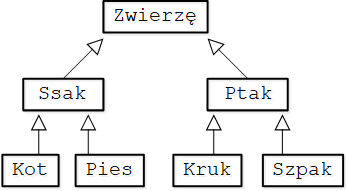

Źródło: https://kursjava.com/dziedziczenie-i-polimorfizm/

### 1. Dziedziczenie – wprowadzenie

Dziedziczenie w językach obiektowych to tworzenie hierarchii klas. Kolejne klasy w hierarchii posiadają zarówno pola, jak i metody klas, które je poprzedzają, oraz mogą zawierać nowe pola i metody.

Przykładowa hierarchia klas reprezentujących zwierzęta mogłaby wyglądać następująco:

 

Strzałka na rysunku oznacza, że jedna klasa dziedziczy po drugiej – po stronie grotu strzałki znajduje się klasa nadrzędna. Na przykład: klasa `Kot` dziedziczy (jest klasą‑dzieckiem) po klasie `Ssak`, a klasa `Ssak` dziedziczy po klasie `Zwierzę`.

Bardzo istotna obserwacja: każdy kot to zwierzę, ale nie każde zwierzę to kot (bo może być nim pies). Podobne zależności są pomiędzy pozostałymi klasami na tym rysunku – każdy ptak to zwierzę, ale nie każde zwierzę to ptak (bo może nim być ssak) itd.

---

### 2. Pierwszy przykład dziedziczenia

Gdy klasa dziedziczy po innej klasie, mówimy, że klasa ta rozszerza tę klasę. Taką klasę będziemy nazywać klasą podrzędną. Klasę rozszerzaną będziemy nazywać klasą bazową bądź klasą nadrzędną. W języku Java do zaznaczenia, że dana klasa ma dziedziczyć po innej klasie, używamy słowa kluczowego `extends`, po którym następuje nazwa klasy nadrzędnej (klasy‑rodzica).

Spójrzmy na prosty przykład dziedziczenia.

Nazwa pliku: `prostyprzyklad/Osoba.java`

```java
package prostyprzyklad;

public class Osoba {
  public String imie;
  public String nazwisko;
  public String toString() {
    return "Osoba " + imie + " " + nazwisko;
  }
}
```

Nazwa pliku: `prostyprzyklad/Pracownik.java`

```java
package prostyprzyklad;

public class Pracownik extends Osoba { // 1
  public int numerIdentyfikatora;
  public static void main(String[] args) {
    Osoba pewnaOsoba = new Osoba();
    pewnaOsoba.imie = "Jan";
    pewnaOsoba.nazwisko = "Kowalski";
    System.out.println(pewnaOsoba);

    Pracownik pewienPracownik = new Pracownik();
    pewienPracownik.imie = "Joanna"; // 2
    pewienPracownik.nazwisko = "Sikorska"; // 3
    pewienPracownik.numerIdentyfikatora = 1234;
    System.out.println(pewienPracownik); // 4
  }
}
```

Klasa `Osoba` to prosta klasa zawierająca pola `imie` i `nazwisko` oraz metodę `toString`, która zwraca połączone imię i nazwisko osoby.

Klasa `Pracownik` rozszerza klasę `Osoba` (1) – zwróć uwagę na słowo kluczowe `extends` oraz nazwę klasy, która po nim następuje. Oznacza to, że klasa `Pracownik`, poza polem `numerIdentyfikatora`, które jest w niej zdefiniowane, posiada także pola `imie` oraz `nazwisko`, odziedziczone z klasy `Osoba`. Dzięki temu możemy te pola ustawić w obiekcie `pewienPracownik` (2) (3). To jednak nie koniec – klasa `Pracownik` dziedziczy także metodę `toString` – dzięki temu, w linii (4), zamiast wypisać na ekran nazwę klasy i „hash code” obiektu w postaci `prostyprzyklad.Pracownik@f6f4d33`, zobaczymy imię oraz nazwisko przechowywane w obiekcie `pewienPracownik`:

```
Osoba Jan Kowalski
Osoba Joanna Sikorska
```

Należy zwrócić uwagę, że klasa `Osoba` nie wie o istnieniu klasy `Pracownik`. Co ważniejsze, obiekty klasy `Osoba` nie posiadają pola `numerIdentyfikatora`, ponieważ pole to zdefiniowane jest w klasie podrzędnej `Pracownik`, i tylko obiekty klasy `Pracownik` mają to pole.

Podobnie jak w przypadku hierarchii ze zwierzętami z początku tego rozdziału, tutaj także możemy zauważyć, iż każdy `Pracownik` to `Osoba`, ale nie każda `Osoba` to `Pracownik`, bo możemy utworzyć obiekt klasy `Osoba`, a obiekt klasy `Osoba` to obiekt klasy `Osoba`, a nie `Pracownik`. Mało tego, moglibyśmy dodać wiele nowych klas dziedziczących po klasie `Osoba`, i wtedy to rozgraniczenie byłoby jeszcze wyraźniejsze.

Dziedzicząc klasy, musimy zwrócić uwagę na kilka reguł i właściwości, o których po kolei sobie opowiemy. Zanim jednak porozmawiamy o szczegółach, zobaczymy przykład wykorzystania polimorfizmu.

> Jeżeli korzystasz z IntelliJ IDEA, to możesz szybko przejść do klasy bazowej naciskając na klawiaturze przycisk Ctrl i klikając lewym przyciskiem myszy na nazwę klasy bazowej.

---

### 3. Polimorfizm w akcji

Polimorfizm to bardzo potężny i często wykorzystywany w językach obiektowych mechanizm. Pozwala on na traktowanie obiektów pewnej klasy jako obiektów innej klasy, jeżeli jedna z tych klas dziedziczy po drugiej klasie (pośrednio bądź bezpośrednio).

Wracając do przykładu z poprzedniego rozdziału, obiekt klasy `Pracownik` mógłby zostać potraktowany jako reprezentant klasy `Osoba`, ponieważ klasa `Pracownik` rozszerza klasę `Osoba` – zachodzi więc tutaj zależność „Pracownik jest Osobą”.

Jak to wygląda w praktyce? W poniższej klasie metoda `wejdzDoBudynku` w klasie `Budynek` oczekuje jako argumentu obiektu typu `Osoba`:

Nazwa pliku: `prostyprzyklad/Budynek.java`

```java
package prostyprzyklad;

public class Budynek {
  public static void main(String[] args) {
    Osoba osoba = new Osoba();
    osoba.imie = "Jan";
    osoba.nazwisko = "Kowalski";

    Pracownik pracownik = new Pracownik();
    pracownik.imie = "Joanna";
    pracownik.nazwisko = "Sikorska";
    pracownik.numerIdentyfikatora = 1234;

    wejdzDoBudynku(osoba);     // 1
    wejdzDoBudynku(pracownik); // 2
  }

  public static void wejdzDoBudynku(Osoba osoba) { // 3
    System.out.println("W budynku jest " + osoba);
  }
}
```

Wynik uruchomienia programu:

```
W budynku jest Osoba Jan Kowalski
W budynku jest Osoba Joanna Sikorska
```

Zauważmy, że metoda `wejdzDoBudynku` oczekuje argumentu typu `Osoba` (3). W metodzie `main` najpierw wywołujemy ją z argumentem `osoba` typu `Osoba` (1), ale w kolejnej linii (2) wywołujemy tę samą metodę z argumentem innego typu – obiektem `pracownik` typu `Pracownik`!

Kompilator języka Java nie zgłasza problemów podczas kompilacji, a Maszyna Wirtualna Java nie rzuca wyjątku w trakcie działania programu, ponieważ powyższy kod jest całkowicie legalny i ilustruje polimorfizm w akcji. Kod działa, ponieważ każdy obiekt klasy `Pracownik` może być traktowany jako obiekt klasy `Osoba` ze względu na to, że jedna z tych klas dziedziczy (rozszerza) drugą klasę.

Czy moglibyśmy zmienić argument metody `wejdzDoBudynku` z `Osoba` na `Pracownik`? Tak, ale wtedy kod przestałby się kompilować – problemem byłaby linia (1). Wynika to z faktu, że o ile każdy `Pracownik` to `Osoba`, to nie każda `Osoba` to `Pracownik`. Kompilator wypisałby następujący błąd:

```
prostyprzyklad\Budynek.java:14: error: incompatible types: Osoba cannot be converted to Pracownik
    wejdzDoBudynku(osoba);
```

Przykład metody `wejdzDoBudynku` pokazuje, że argument tej metody raz wskazuje w pamięci na obiekt typu `Osoba`, a drugi raz – na obiekt typu `Pracownik`. Oznacza to, że zmienne typu bazowego możemy stosować do wskazywania na obiekty klas pochodnych – spójrzmy na poniższy przykład:

```java
Osoba innaOsoba = new Pracownik();
innaOsoba.imie = "Artur";
innaOsoba.nazwisko = "Strzelecki";
```

Powyższy fragment kodu jest prawidłowy. Jak już wiemy, każdy `Pracownik` to `Osoba`. Korzystamy ze zmiennej `innaOsoba`, która może przechowywać referencję do obiektu typu `Osoba`, ale obiekt, jaki faktycznie tworzymy i którego adres przypisujemy do tej zmiennej, jest typu `Pracownik`. Nie jest to jednak problem, ponieważ klasa `Pracownik` dziedziczy po klasie `Osoba`.

Ustawiliśmy powyżej `imie` i `nazwisko` – te pola są w klasie `Osoba`. A gdybyśmy spróbowali ustawić pole `numerIdentyfikatora`?

```java
// blad!
innaOsoba.numerIdentyfikatora = 4321;
```

Ta linia spowodowałaby następujący błąd kompilatora:

```
prostyprzyklad\Budynek.java:21: error: cannot find symbol
    innaOsoba.numerIdentyfikatora = 4321;
             ^
  symbol:   variable numerIdentyfikatora
  location: variable innaOsoba of type Osoba
```

Co prawda tworzymy obiekt typu `Pracownik`, w której to klasie zdefiniowane jest pole `numerIdentyfikatora`, ale do odnoszenia się do tego obiektu używamy referencji typu `Osoba` – a obiekty klasy `Osoba` pola `numerIdentyfikatora` nie posiadają.

Jak zobaczymy w kolejnych rozdziałach, jest sposób na ustawienie pola `numerIdentyfikatora` za pomocą referencji typu `Osoba`. W tym celu należy skorzystać z mechanizmu rzutowania, który poznaliśmy już w poprzednich rozdziałach – rzutowaliśmy na przykład liczby typu całkowitego na liczby rzeczywiste. Rzutowanie odbywa się poprzez napisanie typu docelowego w nawiasach przed rzutowaną wartością. Zobaczmy, jak moglibyśmy poprawić powyższy przykład, by zadziałał:

```java
((Pracownik) innaOsoba).numerIdentyfikatora = 4321;
```

Dzięki takiemu zapisowi, kod jest poprawny i jesteśmy w stanie ustawić wartość pola `numerIdentyfikatora`. Poprzez użycie rzutowania powiedzieliśmy kompilatorowi:

> „Wiem, że zmienna `innaOsoba` jest typu `Osoba`, ale tak naprawdę wskazuje ona na obiekt klasy pochodnej o nazwie `Pracownik`, proszę więc o pozwolenie na kompilację i ustawienie pola `numerIdentyfikatora` na moją odpowiedzialność”.

Dlaczego „na naszą odpowiedzialność”? Ponieważ zmienna `innaOsoba` mogłaby wskazywać na obiekt klasy `Osoba`, a nie `Pracownik` – wtedy rzutowanie byłoby niemożliwe i działanie programu zakończyłoby się błędem. Działanie programu, a nie kompilacja – zauważmy tutaj, że kompilator nie jest w stanie nas uchronić przed próbą nieprawidłowego rzutowania – o potencjalnym problemie dowiemy się dopiero po uruchomieniu programu:

Fragment pliku `Budynek.java`:

```java
Osoba kolejnaOsoba = new Osoba();
// kompilacja ok, ale blad wykonania!
((Pracownik) kolejnaOsoba).numerIdentyfikatora = 5555;
```

Kompilacja tego fragmentu kodu zakończy się bez błędów – kompilator w tym przypadku nie uchroni nas przed potencjalnym błędem, który w tym przypadku ewidentnie popełniliśmy, co widać na ekranie po uruchomieniu programu:

```
Exception in thread "main" java.lang.ClassCastException: class prostyprzyklad.Osoba cannot be cast to class prostyprzyklad.Pracownik 
        at prostyprzyklad.Budynek.main(Budynek.java:26)
```

Problem występuje, ponieważ próbujemy ustawić pole `numerIdentyfikator` rzutując obiekt `kolejnaOsoba` na typ `Pracownik`, jednak jest to niemożliwe – zmienna `kolejnaOsoba` wskazuje na obiekt typu `Osoba`, a nie `Pracownik`.

---

### 4. Przykład method overriding (nadpisywania metod)

Z polimorfizmem i dziedziczeniem wiąże się także bardzo ważny mechanizm zwany method overriding (nadpisywanie metod), o którym opowiemy sobie więcej w kolejnych rozdziałach, a na razie zobaczymy jeden przykład, który wyjaśni, na czym ten mechanizm polega.

Method overriding to tworzenie w klasie pochodnej takiej samej metody, jaka już znajduje się w klasie nadrzędnej (z możliwością pewnych zmian, które poznamy wkrótce). Gdy metoda ta zostanie wywołana na zmiennej typu bazowego, to wykonana zostanie nie metoda z typu bazowego, lecz z typu obiektu, na który ta zmienna faktycznie wskazuje w pamięci.

Dla przykładu, załóżmy, że dodamy do klasy `Pracownik` metodę `toString` – ta metoda będzie wypisywała nie tylko imię i nazwisko (jak już to robi metoda `toString` w klasie `Osoba`), ale także identyfikator pracownika.

Nazwa pliku: `prostyprzyklad/Pracownik.java`

```java
package prostyprzyklad;

public class Pracownik extends Osoba {
  public int numerIdentyfikatora;
  
  public String toString() {
    return "Pracownik " + imie + " " + nazwisko +
        ", identyfikator: " + numerIdentyfikatora; 
  }
  // metoda main zostala pominieta
}
```

Przypomnijmy jeszcze, jak wygląda metoda `toString` z klasy bazowej `Osoba`:

Nazwa pliku: `prostyprzyklad/Osoba.java`

```java
package prostyprzyklad;

public class Osoba {
  public String imie;
  public String nazwisko;
  public String toString() {
    return "Osoba " + imie + " " + nazwisko;
  }
}
```

Gdy teraz utworzymy obiekt klasy `Osoba` i obiekt klasy `Pracownik` i wypiszemy ich tekstową reprezentację na ekran, to zobaczymy następujący komunikat:

Fragment metody `main` z pliku `Pracownik.java`:

```java
Osoba pewnaOsoba = new Osoba();
pewnaOsoba.imie = "Jan";
pewnaOsoba.nazwisko = "Kowalski";
System.out.println(pewnaOsoba.toString());

Pracownik pewienPracownik = new Pracownik();
pewienPracownik.imie = "Joanna";
pewienPracownik.nazwisko = "Sikorska";
pewienPracownik.numerIdentyfikatora = 1234;
System.out.println(pewienPracownik.toString());
```

```
Osoba Jan Kowalski
Pracownik Joanna Sikorska, identyfikator: 1234
```

Na razie nie jest to nic nowego – obiekt `pewnaOsoba` został zamieniony na tekst za pomocą metody `toString` z klasy `Osoba`, a obiekt `pewienPracownik` – nową metodą `toString` z klasy `Pracownik`.

Spójrzmy jednak, co się stanie, jeżeli do referencji do typu `Osoba` przypiszemy obiekt typu `Pracownik` i wtedy użyjemy metody `toString`:

Fragment metody `main` z pliku `Pracownik.java`:

```java
Osoba innaOsoba = new Pracownik();
innaOsoba.imie = "Adrian";
innaOsoba.nazwisko = "Sochacki";
System.out.println(innaOsoba.toString());
```

Ten fragment kodu spowoduje wypisanie na ekran komunikatu:

```
Pracownik Adrian Sochacki, identyfikator: 0
```

Tutaj zachodzi „magia” mechanizmu method overriding – pomimo że typ zmiennej `innaOsoba` to `Osoba`, a nie `Pracownik`, została użyta metoda `toString` zaimplementowana w klasie `Pracownik`, ponieważ faktyczny obiekt wskazywany przez zmienną `innaOsoba` jest właśnie typu `Pracownik`.

Mechanizm ten działa automatycznie i daje ogromne możliwości. Jest on jedną z podstaw programowania zorientowanego obiektowo. Jest kilka istotnych zasad dotyczących nadpisywania metod (method overriding), które trzeba mieć na uwadze – opowiemy sobie o nich dokładnie w jednym z kolejnych rozdziałów.

> Nie należy mylić nadpisywania metod z przeciążaniem metod (method overriding vs. method overloading). Przeciążanie metod poznaliśmy w rozdziale o metodach – polega ono na tworzeniu metod o tej samej nazwie, ale różniących się argumentach. Z kolei w nadpisywaniu metod lista parametrów jest taka sama (z pewnymi wyjątkami, które poznamy wkrótce).

---

### 5. Zasady i uwagi dotyczące dziedziczenia

Dziedziczenie to dość skomplikowany mechanizm – w kolejnych rozdziałach dokładnie sobie o nim opowiemy. Najpierw jednak skrótowo przedstawmy różne związane z nim zagadnienia.

Widzieliśmy już, jak rozszerza się klasę – korzystamy w tym celu ze słowa kluczowego `extends`, po którym następuje nazwa klasy bazowej:

```java
public class Pracownik extends Osoba {
  // ...
}
```

Tak zdefiniowana klasa `Pracownik` staje się pochodną klasy `Osoba`. Mówimy też, że klasa `Pracownik` rozszerza klasę `Osoba`. Klasa `Osoba` natomiast jest klasą bazową, bądź rodzicem, dla klasy `Pracownik`. Pomiędzy klasami zachodzi relacja „Pracownik jest Osobą”, dzięki czemu możemy traktować obiekty klasy `Pracownik` jak obiekty klasy `Osoba` (polimorfizm). Nie działa to jednak w drugą stronę – każdy `Pracownik` to `Osoba`, ale nie każda `Osoba` to `Pracownik`. Najlepiej widoczne byłoby to, gdybyśmy utworzyli nową klasę `Uczen`, która rozszerzałaby klasę `Osoba`. Każdy `Pracownik` to `Osoba`, każdy `Uczen` to `Osoba`, ale nie każda `Osoba` to `Pracownik` – może być przecież `Uczniem`.

- W języku Java klasa może dziedziczyć tylko po jednej klasie – nie ma możliwości rozszerzenia więcej niż jednej klasy (tzw. pojedyncze dziedziczenie).
- W rozdziale o klasach wspomnieliśmy o klasie `Object`. Jest to specjalna klasa w języku Java – wszystkie klasy dziedziczą po klasie `Object` – pośrednio bądź bezpośrednio. Jeżeli klasa nie definiuje, że rozszerza jakąś klasę, to automatycznie rozszerza klasę `Object`.
- Klasa `Pracownik` dziedziczy po klasie `Osoba`, oraz po wszystkich poprzednich klasach w hierarchii, pola oraz metody publiczne i te oznaczone modyfikatorem `protected`.
- Modyfikator `protected` udostępnia pola i metody klasom pochodnym, ale też klasom w tym samym pakiecie (nawet jeśli nie dziedziczą). Pół prywatnych (`private`) oraz pól z dostępem domyślnym (brak modyfikatora) nie dziedziczy się.
- Odziedziczone metody niestatyczne możemy nadpisywać (method overriding). Tylko metody niestatyczne można nadpisywać.
- Z dziedziczeniem wiąże się słowo kluczowe `super` – służy ono do dwóch celów: wywoływania konstruktora klasy bazowej oraz do korzystania z metody bądź pola z klasy bazowej.
- Poza tym klasy i metody mogą być abstrakcyjne lub finalne. Obiekty klas abstrakcyjnych nie mogą być tworzone – należy takie klasy rozszerzyć. Klasy `final` nie mogą być rozszerzane. Metody abstrakcyjne nie mają ciał i trzeba je zaimplementować w klasie pochodnej, a metod `final` nie można nadpisywać.
- Zamiast rozszerzać klasę abstrakcyjną, można utworzyć nienazwaną klasę (anonymous class) w miejscu użycia.

---

### 6. Pojedyncze dziedziczenie – przykłady i błędy kompilacji

W języku Java każda klasa może bezpośrednio rozszerzać tylko jedną klasę. Próba kompilacji poniższej klasy `Kot` zakończyłaby się błędem:

```java
public class Zwierze {
  // ...
}

public class NajlepszyPrzyjacielCzlowieka {
  // ...
}

public class Kot extends Zwierze, NajlepszyPrzyjacielCzlowieka {
  // ...
}
```

Komunikat zwracany przez kompilator:

```
Kot.java:1: error: '{' expected
class Kot extends Zwierze, NajlepszyPrzyjacielCzlowieka {
                         ^
1 error
```

Kompilator spodziewał się klamry otwierającej ciało klasy `Kot` zamiast przecinka i nazwy kolejnej klasy, którą chcieliśmy rozszerzyć.

Klasa nie może bezpośrednio rozszerzać więcej niż jednej klasy, ale pośrednio tak – tzn. klasy mogą mieć w swojej hierarchii dziedziczenia wiele klas:

```java
public class Zwierze {
  // ...
}

public class Ssak extends Zwierze {
  // ..
}

public class Kot extends Ssak {
  // ...
}

public class Dachowiec extends Kot {
  // ...
}
```

W powyższym przypadku klasa `Dachowiec` bezpośrednio rozszerza klasę `Kot`, a ponadto ma w swojej hierarchii dziedziczenia klasy `Ssak` oraz `Zwierze` (a także klasę `Object`). Innymi słowy, klasa `Dachowiec` pośrednio dziedziczy po tych klasach.

Pamiętaj, że w języku Java klasy mogą rozszerzać maksymalnie jedną, wybraną przez Ciebie klasę, tzn. po słowie kluczowym `extends` możesz umieścić nazwę co najwyżej jednej klasy.

---

### 7. Modyfikatory dostępu a dziedziczenie – przykład z pojazdami

Gdy rozszerzamy klasę, dziedziczymy po niej pola i metody, które mają modyfikatory `public` lub `protected`.

Spójrzmy na poniższe klasy.

Nazwa pliku: `pojazdy/Pojazd.java`

```java
package pojazdy;

public class Pojazd {
  public void jedz() { // 1
    System.out.println("Pojazd jedzie.");
  }
}
```

Nazwa pliku: `pojazdy/Samochod.java`

```java
package pojazdy;

public class Samochod extends Pojazd {
  protected int liczbaKol; // 2
}
```

Nazwa pliku: `pojazdy/SamochodWyscigowy.java`

```java
package pojazdy;

public class SamochodWyscigowy extends Samochod {
  public SamochodWyscigowy() {
    this.liczbaKol = 4; // 3
  }
  public String toString() {
    return "Samochod wyscigowy, liczba kol: " + liczbaKol; // 4
  }
}
```

Klasa `SamochodWyscigowy` rozszerza klasę `Samochod`. Klasa `Samochod` posiada jedno pole z modyfikatorem `protected` (2), które klasa `SamochodWyscigowy` po niej dziedziczy – ustawiamy je w konstruktorze tej klasy (3) oraz wypisujemy w metodzie `toString` (4).

Ponadto klasa `SamochodWyscigowy` dziedziczy pośrednio po klasie `Pojazd`, która ma jedną publiczną metodę `jedz` (1). Tę metodę klasa `SamochodWyscigowy` także dziedziczy. Zobaczmy, jak moglibyśmy użyć tej klasy.

Nazwa pliku: `pojazdy/TorWyscigowy.java`

```java
package pojazdy;

public class TorWyscigowy {
  public static void main(String[] args) {
    SamochodWyscigowy wyscigowy = new SamochodWyscigowy();
    System.out.println(wyscigowy);
    wyscigowy.jedz();
  }
}
```

Wynik działania programu:

```
Samochod wyscigowy, liczba kol: 4
Pojazd jedzie.
```

Zarówno pól i metod prywatnych, jak i tych z dostępem domyślnym (tzn. gdy nie mają one zdefiniowanego żadnego modyfikatora dostępu), nie dziedziczy się. Próba odniesienia się z klasy pochodnej do pola bądź metody `private`, zdefiniowanych w klasie bazowej, kończy się błędem kompilacji:

```java
package pojazdy;

public class Pojazd {
  private String rejestracja; // 1
  public void jedz() {
    System.out.println("Pojazd jedzie.");
  }
}

package pojazdy;

public class SamochodWyscigowy extends Samochod {
  public SamochodWyscigowy() {
    this.liczbaKol = 4;
    // blad!
    // pole rejestracja jest prywatne, więc nie jest dziedziczone!
    this.rejestracja = "KJ-777"; // 2
  }
  public String toString() {
    return "Samochod wyscigowy, liczba kol: " + liczbaKol;
  }
}
```

Do klasy `Pojazd` dodaliśmy prywatne pole `rejestracja` (1). Próba ustawienia tego pola w konstruktorze klasy `SamochodWyscigowy` kończy się błędem kompilacji:

```
Error:(8, 9) java: rejestracja has private access in pojazdy.Pojazd
```

> Jeżeli klasa pochodna jest w tym samym pakiecie, co jej klasa bazowa, to będzie mimo wszystko miała dostęp do pól i metod z domyślnym modyfikatorem dostępu – w końcu takie właśnie zastosowanie ma ten modyfikator.


---

### 8. Rozszerzone wyjaśnienia z przykładami i diagramami UML (Mermaid)

Poniżej zebrano kluczowe pojęcia dotyczące dziedziczenia i polimorfizmu wraz z krótkimi przykładami w Javie oraz diagramami UML przygotowanymi w Mermaid.

#### 8.1. Czym są dziedziczenie, polimorfizm i method overriding
- Dziedziczenie: mechanizm pozwalający tworzyć nowe klasy na podstawie istniejących, przejmując ich pola i metody oraz dodając/zmieniając własne.
- Polimorfizm: możliwość traktowania obiektów klas pochodnych jak obiekty klasy bazowej oraz dynamiczne wybieranie właściwej implementacji metod w czasie działania.
- Method overriding (nadpisywanie): ponowne zdefiniowanie metody z klasy bazowej w klasie pochodnej (taka sama sygnatura), aby zmienić jej zachowanie.

Przykład:

```java
class Zwierze {
  public String dzwiek() { return "?"; }
}
class Pies extends Zwierze {
  @Override public String dzwiek() { return "hau"; }
}
class Kot extends Zwierze {
  @Override public String dzwiek() { return "miau"; }
}
class Demo {
  static void wydajDzwiek(Zwierze z) { System.out.println(z.dzwiek()); }
  public static void main(String[] args) {
    wydajDzwiek(new Pies()); // hau
    wydajDzwiek(new Kot());  // miau
  }
}
```

Diagram UML (Mermaid):


#### 8.2. Jak rozszerzać klasy i limit liczby rozszerzanych klas
W Javie używamy słowa kluczowego `extends` i możemy rozszerzać tylko jedną klasę (pojedyncze dziedziczenie).

```java
class Osoba {}
class Pracownik extends Osoba {}      // OK
// class Kierownik extends Osoba, Inna {} // BŁĄD: wielokrotne dziedziczenie klas jest zabronione
```

Diagram UML:


#### 8.3. Które pola i metody się dziedziczy, a których nie
- Dziedziczone: elementy `public` i `protected` oraz elementy z dostępem domyślnym (package‑private) jeśli klasa pochodna jest w tym samym pakiecie.
- Niedziedziczone: elementy `private` (zawsze) oraz package‑private z innego pakietu.
- Statyczne składowe są dziedziczone „nazwą”, ale nie podlegają polimorfizmowi (ukrywanie, nie overriding).

```java
package a;
public class Bazowa {
  public int pub;
  protected int prot;
  int pkg;        // domyślny (package‑private)
  private int priv;
  public void f() {}
}

package a;
public class PochodnaA extends Bazowa {
  void demo() {
    pub = 1; prot = 2; pkg = 3; // OK
    // priv = 4; // BŁĄD: private
  }
}

package b;
import a.Bazowa;
public class PochodnaB extends Bazowa {
  void demo() {
    pub = 1; prot = 2;   // OK (protected dziedziczone)
    // pkg = 3;          // BŁĄD: inny pakiet
    // priv = 4;         // BŁĄD: private
  }
}
```

Diagram UML (z widocznością):


#### 8.4. Modyfikator `protected` vs dostęp domyślny (package‑private)
- `protected`: dostęp w tym samym pakiecie oraz w klasach pochodnych (także w innych pakietach).
- Domyślny (brak modyfikatora): dostęp tylko w tym samym pakiecie (brak dostępu w podklasach z innego pakietu).

```java
package lib;
public class Rzecz {
  protected String nazwa;
  String opis; // package‑private
}

package app;
import lib.Rzecz;
class SpecRzecz extends Rzecz {
  void demo() {
    this.nazwa = "OK";  // protected: dostępne w podklasie z innego pakietu
    // this.opis = "NIE"; // package‑private: niedostępne poza pakietem lib
  }
}
```

Diagram:


#### 8.5. Wpływ modyfikatorów dostępu na dziedziczenie i użycie
Podsumowanie:
- `public`: dziedziczone i dostępne wszędzie.
- `protected`: dziedziczone; dostępne w tym samym pakiecie oraz w podklasach (również z innych pakietów).
- Domyślny: dziedziczone tylko w tym samym pakiecie; brak dostępu w podklasach z innych pakietów.
- `private`: nie są dziedziczone (niedostępne bezpośrednio); dostęp tylko wewnątrz tej samej klasy.

#### 8.6. Korzystanie z konstruktorów klas bazowych
Konstruktor klasy pochodnej może (i często powinien) wywołać konstruktor bazowy za pomocą `super(...)`.

```java
class Osoba {
  protected final String imie;
  protected final String nazwisko;
  public Osoba(String imie, String nazwisko) {
    this.imie = imie; this.nazwisko = nazwisko;
  }
}
class Pracownik extends Osoba {
  private final int id;
  public Pracownik(String imie, String nazwisko, int id) {
    super(imie, nazwisko); // wywołanie konstruktora bazowego
    this.id = id;
  }
}
```

Diagram:


#### 8.7. Słowo kluczowe `super`
- `super(...)` wywołuje konstruktor klasy bazowej (musi być pierwszą instrukcją w konstruktorze).
- `super.metoda()` odwołuje się do metody z klasy bazowej (np. w celu rozszerzenia, a nie całkowitego zastąpienia implementacji).

```java
class Logger {
  public void log(String msg) { System.out.println("LOG: " + msg); }
}
class FileLogger extends Logger {
  @Override public void log(String msg) {
    super.log(msg); // użyj bazowej logiki i dodaj coś swojego
    System.out.println("(zapisano do pliku)");
  }
}
```

Diagram:


#### 8.8. Rzutowanie typów (casting) i jak z niego korzystać
- Upcasting: przypisanie obiektu podklasy do referencji nadklasy – bezpieczne i automatyczne.
- Downcasting: rzutowanie referencji nadklasy do podklasy – wymaga jawnego rzutowania i jest bezpieczne tylko, gdy obiekt faktycznie jest instancją podklasy.

```java
Osoba o = new Pracownik("Jan", "Kowalski", 1); // upcasting OK
// o.id; // niedostępne przez referencję Osoba
Pracownik p = (Pracownik) o; // downcasting – jeśli o faktycznie jest Pracownikiem
int id = p.getClass().getSimpleName().length(); // przykładowe użycie
```

Diagram:


#### 8.9. Adnotacja `@Override` – po co jej używać
`@Override` mówi kompilatorowi: „ta metoda ma nadpisywać metodę z klasy bazowej lub interfejsu”. Dzięki temu:
- Kompilator wykryje literówki lub złą sygnaturę.
- Kod jest czytelniejszy.

```java
class A { public void f(int x) {} }
class B extends A {
  @Override public void f(int x) {} // OK – poprawnie nadpisano
  // @Override public void f(long x) {} // BŁĄD – to przeciążenie, nie overriding
}
```

#### 8.10. Overloading vs overriding – różnice
- Overloading (przeładowanie): ta sama nazwa metody, różne listy parametrów (w obrębie tej samej klasy). Wybór wersji następuje w czasie kompilacji.
- Overriding (nadpisanie): ta sama sygnatura w klasie pochodnej; wybór implementacji następuje w czasie działania na podstawie rzeczywistego typu obiektu.

```java
class Kalkulator {
  public int dodaj(int a, int b) { return a + b; }        // overloading 1
  public double dodaj(double a, double b) { return a + b; } // overloading 2
}
class SmartKalkulator extends Kalkulator {
  @Override public int dodaj(int a, int b) { return Math.addExact(a, b); } // overriding
}
```

Diagram:


#### 8.11. Specjalna klasa `Object`
Wszystkie klasy w Javie bezpośrednio lub pośrednio dziedziczą po `java.lang.Object`. Dostarcza ona m.in. metody: `toString`, `equals`, `hashCode`, `getClass`, `clone` (chroniona), `finalize` (przestarzała).

```java
class Punkt { // nie podajemy extends, więc extends Object
  int x, y;
  @Override public String toString() { return "("+x+","+y+")"; }
}
```

Diagram:


#### 8.12. Klasy i metody abstrakcyjne – do czego służą
Klasa abstrakcyjna może zawierać metody abstrakcyjne (bez implementacji) oraz zwykłe. Nie można tworzyć jej instancji – trzeba ją rozszerzyć.

```java
abstract class Figura {
  public abstract double pole();
  public String opis() { return "Jestem figurą"; }
}
class Kolo extends Figura {
  private final double r;
  public Kolo(double r) { this.r = r; }
  @Override public double pole() { return Math.PI * r * r; }
}
```

Diagram:


#### 8.12a. Interfejsy w Javie – definicja i zastosowanie
Interfejs definiuje kontrakt (zestaw metod), który klasy mogą implementować. Słowa kluczowe: `interface` do definiowania interfejsu i `implements` do jego implementacji przez klasę. Klasa może implementować wiele interfejsów (w przeciwieństwie do dziedziczenia klas, które jest pojedyncze).

Przykład – podstawowy interfejs i implementacja:

```java
interface Drukowalne {
  String drukuj(); // domyślnie public abstract
}
class Raport implements Drukowalne {
  private final String tytul;
  public Raport(String tytul) { this.tytul = tytul; }
  @Override public String drukuj() { return "Raport: " + tytul; }
  public static void main(String[] args) {
    Drukowalne d = new Raport("Sprzedaż Q3"); // polimorfizm przez interfejs
    System.out.println(d.drukuj());
  }
}
```

Diagram UML (Mermaid):


Interfejsy a wielokrotna implementacja przez klasę:

```java
interface Latajace { void lec(); }
interface Plywajace { void plywaj(); }
class Kaczka implements Latajace, Plywajace {
  @Override public void lec() { System.out.println("Kaczka leci"); }
  @Override public void plywaj() { System.out.println("Kaczka plywa"); }
}
```

Diagram:


Metody `default` i `static` w interfejsach:
- `default` dostarcza domyślną implementację metody w interfejsie; klasa może ją nadpisać.
- `static` to metoda statyczna interfejsu, wywoływana przez nazwę interfejsu.

```java
interface Nazewalne {
  default String pelnaNazwa(String imie, String nazwisko) {
    return imie + " " + nazwisko;
  }
  static boolean niePuste(String s) { return s != null && !s.isBlank(); }
}
class OsobaNazwana implements Nazewalne {
  @Override public String pelnaNazwa(String imie, String nazwisko) {
    return (Nazewalne.niePuste(imie) ? imie : "?") + " " + nazwisko;
  }
}
```

Uwaga: przy konflikcie dwóch takich samych metod `default` pochodzących z różnych interfejsów, klasa musi jednoznacznie wskazać implementację lub dostarczyć własną. Można też użyć `NazwaInterfejsu.super.metoda()`:

```java
interface A { default void f(){ System.out.println("A"); } }
interface B { default void f(){ System.out.println("B"); } }
class C implements A, B {
  @Override public void f() {
    A.super.f(); // jawny wybór lub własna implementacja
    B.super.f();
  }
}
```

Stałe w interfejsie:
- Pola w interfejsie są niejawnie `public static final` (stałe), a metody – `public abstract` (chyba że `default`/`static`).

```java
interface Statusy {
  int OK = 200;        // public static final
  int NOT_FOUND = 404; // public static final
}
class HttpDemo implements Statusy {
  int status = OK; // odwołanie do stałej z interfejsu
}
```

Dziedziczenie interfejsów i implementacja przez klasę:

```java
interface Rysowalne { void rysuj(); }
interface Skalowalne extends Rysowalne { void skaluj(double factor); }
class Prostokat implements Skalowalne {
  @Override public void rysuj() { System.out.println("rysuje prostokat"); }
  @Override public void skaluj(double f) { System.out.println("skaluje x"+f); }
}
```

Diagram:


Interfejs vs klasa abstrakcyjna – kiedy używać?
- Użyj interfejsu, gdy chcesz zdefiniować czysty kontrakt zachowań, który może być współdzielony przez klasy z różnych hierarchii (wielokrotna implementacja, brak pól stanu – poza stałymi).
- Użyj klasy abstrakcyjnej, gdy chcesz współdzielić część implementacji i stanu oraz narzucić wspólną bazę w jednej hierarchii (pojedyncze dziedziczenie klas).

> Praktyka: często łączymy oba podejścia – interfejs definiuje kontrakt (`List`), a abstrakcyjna klasa bazowa dostarcza część domyślnej implementacji (`AbstractList`).

#### 8.13. `final` – właściwości klas i metod
- `final` klasa: nie można jej rozszerzyć.
- `final` metoda: nie można jej nadpisać w podklasie.
- `final` pola: można przypisać tylko raz (stałe lub niemutowalne referencje).

```java
final class NieDziedziczalna {}
class Podstawowa {
  public final void nieNadpisuj() {}
}
class Pochodna extends Podstawowa {
  // @Override void nieNadpisuj() {} // BŁĄD
}
```

Diagram:


#### 8.14. Wady i zalety dziedziczenia
Zalety:
- Reużywalność kodu i zmniejszenie duplikacji.
- Polimorfizm i czytelne modelowanie hierarchii „jest‑tym”.
- Możliwość współdzielenia wspólnych kontraktów i zachowań.

Wady:
- Zbyt głębokie hierarchie zwiększają złożoność i sprzężenie.
- Dziedziczenie bywa nadużywane tam, gdzie lepsza jest kompozycja.
- Zmiany w klasie bazowej mogą mieć nieoczywisty wpływ na wiele podklas.

Wskazówka projektowa: preferuj kompozycję nad dziedziczeniem, jeśli relacja nie jest naturalnym „jest‑tym” (is‑a), lecz raczej „ma‑to” (has‑a).
