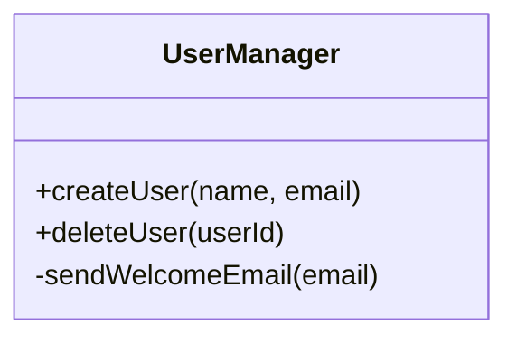
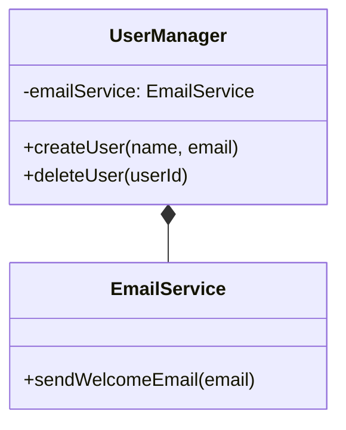
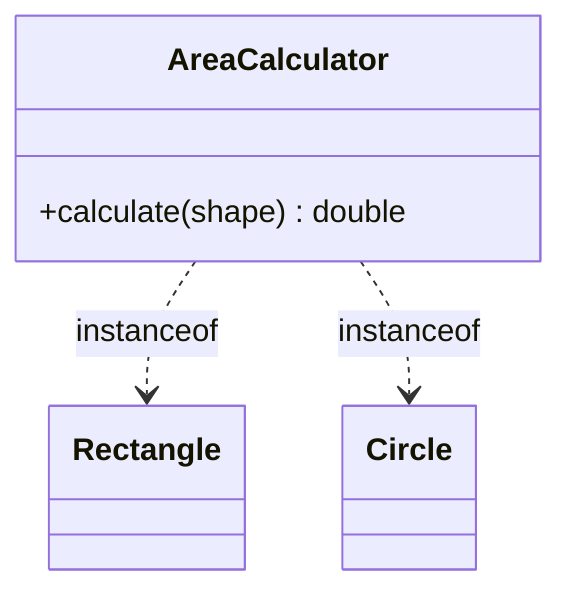
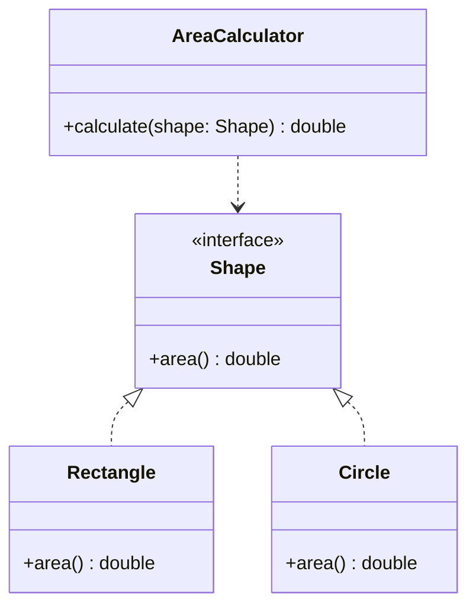
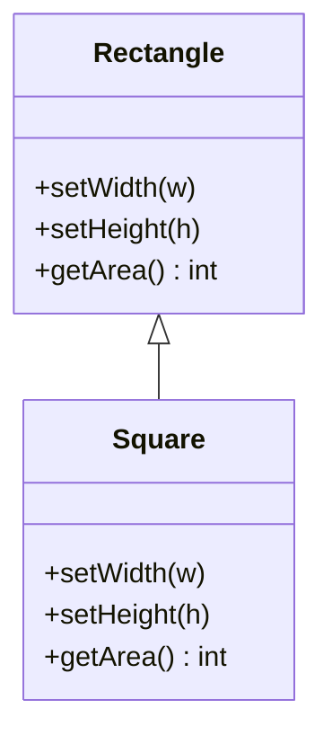
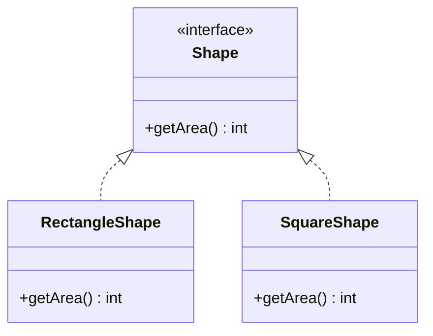
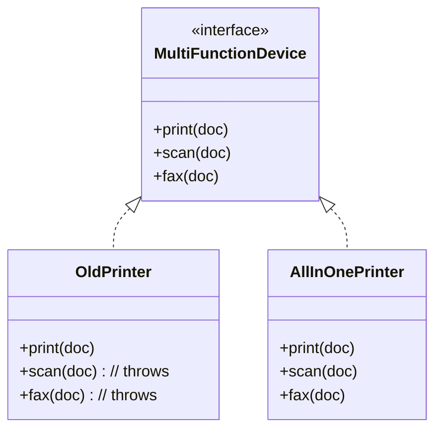
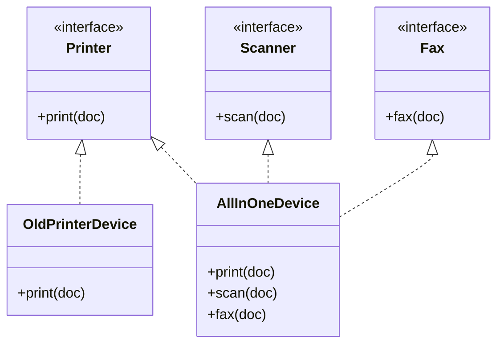
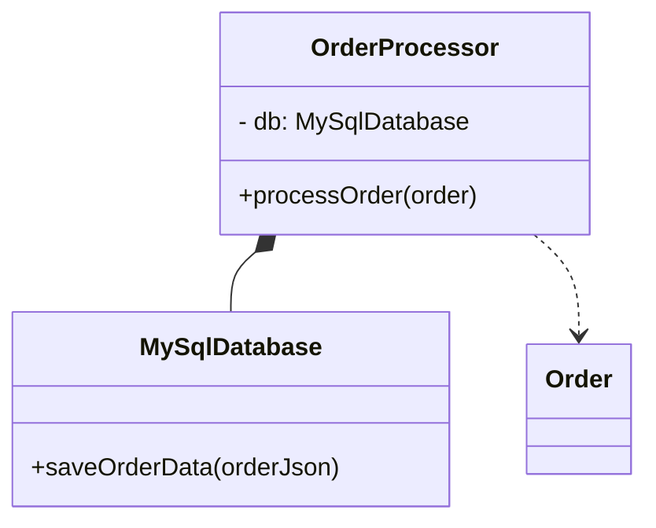
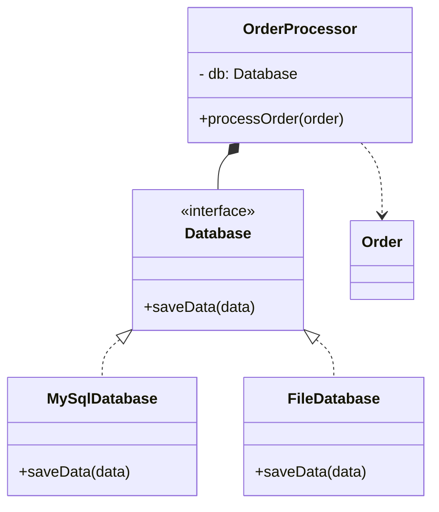

SOLID – pięć zasad projektowania obiektowego
Wprowadzenie

SOLID to akronim opisujący pięć fundamentalnych zasad projektowania obiektowego, sformułowanych przez Roberta C. Martina (znanego jako Uncle Bob) i spopularyzowanych na początku lat 2000. Sam akronim został ukuty kilka lat później (około 2004) przez Michaela Feathersa, który zauważył, że pierwsze litery zasad tworzą słowo “SOLID. Zasady SOLID mają na celu uczynić projekty programistyczne bardziej zrozumiałymi, elastycznymi i łatwymi w utrzymaniu. Martin wskazywał, że bez przestrzegania dobrych zasad projektowych, rozwijające się oprogramowanie staje się „sztywne, kruche, niemobilne i lepkie” (odpowiednio rigid, fragile, immobile, viscous), co utrudnia wprowadzanie zmian i ponowne użycie kod. Zasady SOLID zostały opracowane właśnie po to, by przeciwdziałać takim typowym problemom architektonicznym i *zapewnić elastyczność oraz odporność kodu na zmiany. W dłuższej perspektywie stosowanie tych zasad przekłada się na łatwiejszą rozbudowę i testowanie systemu (nawet jeśli początkowo może wymagać więcej wysiłku i wprowadzać dodatkową złożoność.

Akronim SOLID oznacza kolejno:

    S – Single Responsibility Principle (zasada pojedynczej odpowiedzialności),
    O – Open/Closed Principle (zasada otwarte-zamknięte),
    L – Liskov Substitution Principle (zasada podstawienia Liskov),
    I – Interface Segregation Principle (zasada segregacji interfejsów),
    D – Dependency Inversion Principle (zasada odwrócenia zależności).

Każda z tych zasad jest niezależną wytyczną projektową, jednak stosowane łącznie wzajemnie się wzmacniają – wdrożenie jednej ułatwia przestrzeganie pozostałyc. Celem niniejszego wykładu jest szczegółowe omówienie każdej zasady z osobna – zarówno od strony teoretycznej (odwołując się do literatury projektowej, m.in. do prac Roberta C. Martina), jak i praktycznej (analiza przykładów kodu w Javie, pokazujących prawidłowe i błędne zastosowanie). W kolejnych sekcjach przedstawione zostaną także typowe problemy projektowe, które dana zasada ma rozwiązywać, oraz relacje między zasadami SOLID i ich praktyczne konsekwencje w projektach biznesowych.
### I. Zasada pojedynczej odpowiedzialności (Single Responsibility Principle)
Teoretyczne wyjaśnienie zasady

Zasada pojedynczej odpowiedzialności (Single Responsibility Principle, SRP) głosi, że każdy moduł oprogramowania (np. klasa) powinien mieć tylko jedną odpowiedzialność, a co za tym idzie – tylko jeden powód do zmiany. Robert C. Martin, wprowadzając tę zasadę, sformułował ją słowami: “A class should have one, and only one, reason to change.” (ang., pol. „Klasa powinna mieć tylko jeden powód do zmiany”. Innymi słowy, wszystkie funkcjonalności oferowane przez klasę powinny służyć jednemu spójnemu celowi. Jeśli klasa realizuje więcej niż jeden cel lub rolę, to zmiana związana z jednym z aspektów jej działania będzie naruszać (i potencjalnie psuć) inne aspekty – co przeczy SRP.

Martin w późniejszych publikacjach doprecyzował, że przez „odpowiedzialność” należy rozumieć powód zmiany związany z określonym aktorem lub interesariuszem. Zaproponował on alternatywne sformułowanie: „zbierz razem te rzeczy, które zmieniają się z tego samego powodu, a oddziel te, które zmieniają się z różnych powodów”. Oznacza to, że komponent (np. klasa) powinien skupiać elementy, które zmieniają się w odpowiedzi na ten sam rodzaj zdarzeń (np. wymagania tej samej grupy interesariuszy). Przykładowo, rola księgowego w systemie to inny aktor niż administrator bazy danych – zatem funkcjonalności księgowe powinny być w innym module niż te związane z bazą danych. Taka separacja obowiązków na mniejsze moduły jest bezpośrednio powiązana z klasyczną zasadą separacji obaw (separation of concerns) oraz koncepcją spójności (cohesion) w projektowaniu oprogramowania. Zasadniczo SRP zachęca do projektowania klas wysoce spójnych, z jasno wydzielonym zakresem odpowiedzialności.

Typowe problemy projektowe wynikające z nieprzestrzegania SRP to tzw. „klasy bogi” (god classes) lub komponenty o niskiej spójności. Gdy jedna klasa odpowiada za wiele zadań naraz, kod staje się trudny w utrzymaniu – każda zmiana może wpłynąć na wiele niepowiązanych funkcjonalnie części klasy. Taka klasa jest również trudniejsza do ponownego użycia (bo jest zależna od wielu kontekstów naraz) oraz do testowania (testy muszą obejmować wiele ścieżek). SRP rozwiązuje te problemy przez zachęcanie do dzielenia problemu na mniejsze części: każda klasa obsługuje jeden aspekt logiki biznesowej, co ogranicza skutki zmiany i czyni system bardziej modularnym.


Aby lepiej zrozumieć zasadę pojedynczej odpowiedzialności, przeanalizujmy przykłady kodu w Javie. Pokażemy scenariusz, w którym jedna klasa narusza SRP, oraz sposób refaktoryzacji kodu tak, by spełniał on wymogi tej zasady.


Przykład w Javie: Rozważmy podobny scenariusz w języku Java. Mamy klasę UserManager, która zarządza użytkownikami w systemie. W wersji błędnej klasa ta zarówno zarządza danymi użytkownika (logika biznesowa), jak i zajmuje się wysyłaniem powiadomień email – czyli znów łączy dwie różne odpowiedzialności.
```java
 // Przykład nieprzestrzegający zasady SRP:
 public class UserManager {
    // Odpowiedzialność 1: zarządzanie danymi użytkownika
    public void createUser(String name, String email) {
        // ... kod tworzący nowego użytkownika w systemie
        System.out.println("User created: " + name);
        // Automatyczne wysłanie maila powitalnego po utworzeniu
        sendWelcomeEmail(email);
    }

    public void deleteUser(int userId) {
        // ... kod usuwający użytkownika
        System.out.println("User deleted: " + userId);
    }

    // Odpowiedzialność 2: wysyłanie maili (powiadomienia)
    private void sendWelcomeEmail(String email) {
        // Kod do wysłania e-mail (treść, temat itp.)
        System.out.println("Sending welcome email to " + email);
        // ... (logika wysyłki e-mail)
    }
 }
```

Diagram UML (Mermaid) — przed (naruszenie SRP):



Klasa UserManager powyżej łamie SRP – odpowiada zarówno za logikę użytkowników, jak i za komunikację e-mail. Aby zastosować SRP, rozdzielimy te funkcje na dwie klasy: UserManager zajmie się wyłącznie operacjami na użytkownikach, a nowa klasa (np. EmailService) będzie odpowiedzialna za wysyłanie wiadomości email:

```java
 // Przykład poprawiony zgodnie z SRP:

 // Klasa odpowiedzialna tylko za operacje na użytkownikach
 public class UserManager {
    private EmailService emailService;  // zależność do klasy wysyłającej emaile

    public UserManager(EmailService emailService) {
        this.emailService = emailService;
    }

    public void createUser(String name, String email) {
        // ... kod tworzący nowego użytkownika w systemie
        System.out.println("User created: " + name);
        emailService.sendWelcomeEmail(email);  // delegowanie wysyłki email
    }

    public void deleteUser(int userId) {
        // ... kod usuwający użytkownika
        System.out.println("User deleted: " + userId);
        // (opcjonalnie można wysłać powiadomienie o usunięciu, również przez EmailService)
    }
 }

 // Osobna klasa odpowiedzialna za wysyłanie emaili (druga odpowiedzialność wydzielona)
 public class EmailService {
    public void sendWelcomeEmail(String email) {
        System.out.println("Sending welcome email to " + email);
        // ... rzeczywista logika wysyłania e-mail
    }
 }
```

Diagram UML (Mermaid) — po (zgodne z SRP):



W poprawionej wersji dla Javy, logika biznesowa została oddzielona od logiki powiadamiania. UserManager korzysta z usług EmailService (np. poprzez wstrzyknięcie zależności w konstruktorze), zamiast samodzielnie wysyłać e-maile. Teraz modyfikacja sposobu wysyłania wiadomości (np. zmiana treści maila albo zastąpienie e-maili innym kanałem komunikacji) nie wymaga zmiany UserManager – wystarczy zmodyfikować lub podmienić klasę EmailService. Klasy są wężej wyspecjalizowane i spełniają SRP: mają pojedyncze jasno określone zadania, co przekłada się na lepszą modularność i łatwiejsze testowanie (np. UserManager można testować niezależnie, zastępując EmailService atrapą).

### II. Zasada otwarte-zamknięte (Open/Closed Principle)
Teoretyczne wyjaśnienie zasady

Zasada otwarte-zamknięte (Open/Closed Principle, OCP) mówi, że elementy oprogramowania (klasy, moduły, funkcje, komponenty) powinny być “otwarte na rozszerzenia, ale zamknięte na modyfikacje”. Innymi słowy – można łatwo rozszerzać zachowanie modułu bez konieczności modyfikowania jego kodu źródłowego. Tę zasadę sformułował pierwotnie Bertrand Meyer w 1988 roku w kontekście programowania obiektowego. Meyer wskazywał, że moduł (np. klasa lub biblioteka) powinien być „otwarty”, tzn. umożliwiać dodawanie nowych funkcjonalności, lecz jednocześnie „zamknięty” – czyli posiadać dobrze zdefiniowany, stabilny interfejs i nie wymagać ingerencji w swój kod w celu użycia go w nowych kontekstach. W oryginalnej interpretacji Meyera typowym mechanizmem osiągnięcia OCP było wykorzystanie dziedziczenia – poprzez stworzenie podklasy można dodać nowe pola lub nadpisać metody, nie modyfikując kodu klasy bazowej.

W późniejszych latach (w latach 90.) zasada otwarte-zamknięte została spopularyzowana w nieco zmienionej formie, kładącej nacisk na polimorfizm przez abstrakcyjne interfejsy. W tej nowej interpretacji (promowanej m.in. przez Roberta C. Martina) zaleca się definiowanie abstrakcji (interfejsów lub klas bazowych), a konkretne implementacje tworzyć jako rozszerzenia tych abstrakcji. Dzięki temu interfejs pozostaje stały (zamknięty na zmiany), natomiast można dodawać nowe klasy implementujące ten interfejs (rozszerzając system o nowe zachowania. Robert C. Martin w swoim artykule z 1996 r. opisał OCP właśnie w kontekście użycia interfejsów i polimorficznej zamiany implementacji. W praktyce więc OCP bywa osiągana zarówno poprzez dziedziczenie, jak i przez kompozycję i abstrakcję – np. programowanie “na interfejsach”, używanie polimorfizmu oraz wzorców projektowych takich jak Strategia czy Fabryka, które pozwalają dodawać nowe warianty zachowań bez modyfikowania kodu już istniejących klas.

Kluczowym celem OCP jest zmniejszenie potrzeby zmieniania sprawdzonego, działającego kodu podczas dodawania nowych funkcjonalności. Modyfikacja istniejącego kodu niesie ryzyko wprowadzenia regresji (błędów w wcześniej działających częściach). Kod zgodny z OCP minimalizuje to ryzyko, bo nowa funkcjonalność jest wprowadzana poprzez rozszerzenie (np. dodanie nowej klasy) zamiast ingerencji w kod już przetestowanych modułów. Typowy problem projektowy rozwiązywany przez OCP to zjawisko “rigidity” – sztywności kodu. W kodzie niezgodnym z OCP nawet drobna zmiana wymaga przerobienia wielu fragmentów (np. dodanie nowego typu obiektu wymusza zmianę wielu instrukcji warunkowych w różnych miejscach programu). Przestrzegając zasady otwarte-zamknięte, dążymy do architektury, w której dodanie nowej opcji nie pociąga za sobą modyfikacji istniejących klas, a jedynie napisanie nowych klas/komponentów, które wpasują się w istniejące abstrakcje. Dzięki temu system łatwiej się rozbudowuje i dłużej zachowuje wsteczną kompatybilność z wcześniejszymi wersjami.

W kontekście biznesowym OCP ma istotną zaletę: pozwala reagować na zmieniające się wymagania (np. dodawanie nowych funkcji na życzenie klienta) przy minimalnym ryzyku zepsucia działającego już systemu. Kod spełniający OCP jest bardziej elastyczny na zmiany – deweloperzy mogą implementować nowe warianty zachowań (np. nowy algorytm, nowy typ produktu, nowy sposób płatności) poprzez rozszerzenie istniejących modułów, zamiast modyfikować ich wnętrze. To sprawia, że system łatwiej się skalibruje do nowych wymagań i jest łatwiejszy w utrzymaniu, bo podstawowe, stabilne komponenty pozostają nietknięte.

Aby zilustrować zasadę otwarte-zamknięte, posłużymy się przykładem z figurami geometrycznymi i obliczaniem pól. Jest to klasyczny scenariusz, w którym łatwo o naruszenie OCP, jeśli podejdziemy do problemu naiwnie, a jednocześnie dobrze pokazuje, jak zastosować abstrakcję, by kod stał się odporny na dodawanie nowych figur.


Przykład w Javie: Użyjemy analogicznego przykładu w języku Java. Najpierw wersja niezgodna z OCP – klasa AreaCalculator korzystająca z operatora instanceof lub podobnych rozwiązań do rozróżniania typów.
```java
 // Przykład niezgodny z OCP (Java):
 class Rectangle {
    double width;
    double height;
    Rectangle(double w, double h) { this.width = w; this.height = h; }
 }
 class Circle {
    double radius;
    Circle(double r) { this.radius = r; }
 }

 class AreaCalculator {
    public double calculate(Object shape) {
        if (shape instanceof Rectangle) {
            Rectangle rect = (Rectangle) shape;
            return rect.width * rect.height;
        } else if (shape instanceof Circle) {
            Circle circle = (Circle) shape;
            return Math.PI * circle.radius * circle.radius;
        } else {
            throw new IllegalArgumentException("Unknown shape");
        }
    }
 }

 class Example {
    public static void main(String[] args) {
        AreaCalculator calc = new AreaCalculator();
        System.out.println(calc.calculate(new Rectangle(4, 5)));
        System.out.println(calc.calculate(new Circle(3)));
    }
}
```

Diagram UML (Mermaid) — przed (naruszenie OCP):



Ta implementacja w Javie wymaga modyfikacji metody calculate przy wprowadzeniu nowego typu figury. Zgodnie z OCP refaktoryzujemy kod, wprowadzając interfejs Shape z metodą area():

```java
 // Przykład zgodny z OCP (Java):
 interface Shape {
    double area();
 }

 class Rectangle implements Shape {
    private double width;
    private double height;
    Rectangle(double w, double h) { this.width = w; this.height = h; }
    public double area() {
        return width * height;
    }
 }
 class Circle implements Shape {
    private double radius;
    Circle(double r) { this.radius = r; }
    public double area() {
        return Math.PI * radius * radius;
    }
 }
 // Można dodać nowe figury implementujące Shape bez zmiany istniejącego kodu.

 class AreaCalculator {
    public double calculate(Shape shape) {
        return shape.area();  // polimorficzne wywołanie bez if/else
    }
 }

 class Example {
    public static void main(String[] args) {
        AreaCalculator calc = new AreaCalculator();
        System.out.println(calc.calculate(new Rectangle(4, 5)));
        System.out.println(calc.calculate(new Circle(3)));
        // Jeśli dodamy klasę Triangle implements Shape, calc.calculate od razu ją obsłuży
    }
}
```

Dzięki zastosowaniu interfejsu Shape i polimorfizmu, rozszerzenie systemu o nowy typ figury (np. Triangle) nie narusza istnienia zasady OCP – nie trzeba zmieniać kodu AreaCalculator ani żadnej innej istniejącej klasy, wystarczy dodać nową klasę implementującą Shape. Kod staje się łatwiej skalowalny. W praktyce takie podejście sprzyja używaniu wzorców projektowych: np. zamiast dużych instrukcji warunkowych wybierających działanie w zależności od typu, często korzysta się z wirtualnych metod lub wzorca Strategy, co zapewnia otwartość na rozszerzenia. Należy zauważyć, że OCP nie oznacza, iż nigdy nie modyfikujemy kodu – oznacza, że staramy się tak zaprojektować moduły, by większość nowych wymagań dało się zrealizować przez dodanie nowego kodu, a nie zmianę starego. W praktyce osiągnięcie pełnego OCP bywa trudne, ale jest to ideał, do którego dążymy w dobrze zaprojektowanych systemach.

Diagram UML (Mermaid) — po (zgodne z OCP):



### III. Zasada podstawienia Liskov (Liskov Substitution Principle)
Teoretyczne wyjaśnienie zasady

Zasada podstawienia Liskov (Liskov Substitution Principle, LSP) została sformułowana przez Barbarę Liskov w 1987 roku i dotyczy zgodności zachowania typów w hierarchii dziedziczenia. Najpopularniejsze uproszczone sformułowanie LSP brzmi: „obiekty klas pochodnych powinny móc być zastępowane w kodzie obiektami klasy bazowej, bez wpływu na poprawność działania programu”*. Inaczej mówiąc, jeśli klasa B dziedziczy po klasie A, to wszędzie tam, gdzie oczekiwany jest obiekt typu A, można bez negatywnych skutków podstawić obiekt typu `B. Kod korzystający z abstrakcji bazowej nie powinien “poczuć różnicy”, czy otrzymał instancję klasy bazowej, czy którejś z klas pochodnych. Formalnie Liskov definiuje to poprzez pojęcie podtypu behawioralnego – podtyp musi spełniać wszystkie obietnice (inwarianty, postwarunki) typu bazowego, nie wzmacniać jego wymagań wstępnych ani nie osłabiać gwarancji końcowych.

W praktyce zasada LSP jest rozszerzeniem zasady OCP na poprawność zachowania. Skoro OCP pozwala nam rozszerzać system przez dziedziczenie i dodawanie nowych klas pochodnych, to LSP nakłada warunek, że takie rozszerzenie nie może naruszyć logiki systemu. Nowa klasa dziedzicząca powinna rozszerzać, ale nie modyfikować znaczenia zachowania klasy bazowe. Jeżeli klasa pochodna nie spełnia kontraktu klasy bazowej, to wprowadzenie jej może skutkować błędami, gdy zostanie użyta w miejsce bazowej – a więc naruszy LSP. Barbara Liskov w klasycznym przykładzie wskazała, że “kwadrat nie jest prostokątem” w rozumieniu LSP: choć matematycznie każdy kwadrat jest szczególnym przypadkiem prostokąta, to jeśli utworzymy klasę Square dziedziczącą po klasie Rectangle (mającej metody ustawiające niezależnie wysokość i szerokość), to podstawienie obiektu Square tam, gdzie oczekiwany jest Rectangle, może prowadzić do niepoprawnego działania (wyobraźmy sobie kod ustawiający wysokość i szerokość prostokąta osobno – dla kwadratu, który musi mieć bok równy, taka operacja złamie invariant boku równej długości. Ten przykład ilustruje, że podklasa powinna spełniać wszystkie założenia bazowej – w przeciwnym razie nie powinna być z nią powiązana przez dziedziczenie.

Formalnie LSP można ująć jako implikację: *Jeżeli S jest podtypem T, to każda właściwość (twierdzenie logiczne) prawdziwa dla obiektów typu T musi być prawdziwa dla obiektów typu S. To warunek bardzo rygorystyczny – w praktyce sprowadza się do przestrzegania pewnych reguł w projektowaniu hierarchii dziedziczenia. Nowa klasa pochodna nie może:

    naruszać żadnych inwarantów klasy bazowej (stan obiektu powinien pozostawać zgodny z oczekiwaniami bazowymi),
    wzmacniać wymagań wstępnych (preconditions) – np. metoda nadpisana w podklasie nie powinna mieć ostrzejszych wymagań na argumenty niż metoda bazowa,
    osłabiać zapewnień końcowych (postconditions) – wynik działania metody podklasy powinien spełniać przynajmniej to, co gwarantuje bazowa,
    wprowadzać efektów ubocznych, które łamią założenia bazowe (np. naruszenie tzw. historii obiektu – podklasa nie powinna wprowadzać zmian stanu obiektu, których nie przewiduje interfejs bazowy, co Liskov określiła jako zasadę ograniczenia historii).

Nieco upraszczając, przestrzeganie LSP sprowadza się do tego, by projektować klasy dziedziczące tak, jakby miały być w pełni zamienne z klasą bazową. Jeśli nie jest to możliwe, to prawdopodobnie relacja dziedziczenia jest błędna (być może należałoby zastosować kompozycję zamiast dziedziczenia lub zmienić abstrakcję bazową).

Problemy projektowe wynikające z łamania LSP często ujawniają się jako błędy w trakcie wykonywania programu. Kod kompiluje się poprawnie (bo podklasa jest tego samego typu), ale semantycznie nie działa – np. klasa potomna rzuca wyjątek przy użyciu metody, która w bazowej zawsze działa (sytuacja, w której podklasa nie wspiera pewnej operacji bazowej – np. pingwin jako podklasa ptaka nie potrafi latać, mimo że bazowa klasa Bird mogła mieć metodę fly()). LSP jest zatem ściśle powiązana z koncepcją projektowania przez kontrakt (design by contract) – podtyp musi honorować kontrakt interfejsu bazowego. Naruszenie LSP prowadzi do kodu o złamanym polimorfizmie – niby można użyć podklasy, ale program zachowuje się nieprawidłowo lub wymaga specjalnych wyjątków dla tej podklasy (co oznacza, że gdzieś musimy wprowadzić obejście, często w postaci instrukcji if sprawdzających typ – co z kolei łamie zasady OCP i ogólnie psuje czystość architektury).

Aby zobrazować LSP, posłużymy się wspomnianym przykładem z prostokątem (Rectangle) i kwadratem (Square). Pokażemy najpierw implementację, która narusza LSP, a następnie omówimy, jak można przeprojektować hierarchię, by spełniała zasadę podstawienia.


Przykład w Javie: Kod naruszający LSP:
```java
  // Błędna hierarchia naruszająca LSP:
 class Rectangle {
    protected int width;
    protected int height;
    public void setWidth(int w) { width = w; }
    public void setHeight(int h) { height = h; }
    public int getArea() { return width * height; }
 }
 class Square extends Rectangle {
    @Override
    public void setWidth(int w) {
        width = w;
        height = w;
    }
    @Override
    public void setHeight(int h) {
        width = h;
        height = h;
    }
 }

 // Funkcja testująca LSP
 static void resizeRectangle(Rectangle rect) {
    rect.setWidth(10);
    rect.setHeight(5);
    System.out.println("Expected area = 10*5 = 50, got: " + rect.getArea());
 }

 public class LspDemo {
    public static void main(String[] args) {
        Rectangle r = new Rectangle();
        Square s = new Square();
        resizeRectangle(r);  // OK: expected area 50, got 50
        resizeRectangle(s);  // Błąd LSP: expected area 50, got 25 (5x5)
    }
}
```

Wywołanie resizeRectangle(s) pokazuje naruszenie LSP – funkcja oczekująca Rectangle nie działa poprawnie dla obiektu Square (otrzymujemy pole 25 zamiast 50, bo Square zmienił oba wymiary na 5). Jak wcześniej omówiono, rozwiązaniem jest zmiana hierarchii. W Javie również możemy zastosować interfejs lub klasę bazową Shape:

Diagram UML (Mermaid) — przed (naruszenie LSP):


```java
  // Poprawiona hierarchia zgodna z LSP:
 interface Shape {
    int getArea();
 }

 class RectangleShape implements Shape {
    private final int width;
    private final int height;
    RectangleShape(int w, int h) { this.width = w; this.height = h; }
    public int getArea() { return width * height; }
 }
 class SquareShape implements Shape {
    private final int side;
    SquareShape(int side) { this.side = side; }
    public int getArea() { return side * side; }
 }

 // Funkcja działa teraz z Shape, a nie Rectangle
 static void printArea(Shape shape) {
    System.out.println("Area = " + shape.getArea());
 }

 public class LspDemoFixed {
    public static void main(String[] args) {
        Shape rect = new RectangleShape(10, 5);
        Shape square = new SquareShape(5);
        printArea(rect);    // Area = 50
        printArea(square);  // Area = 25
    }
}
```
W powyższym kodzie printArea przyjmuje dowolny Shape i po prostu wypisuje pole. Podstawienie SquareShape i RectangleShape jest w pełni bezpieczne i przewidywalne – zasada LSP została zachowana. Nie musieliśmy zmieniać żadnego istniejącego kodu przy wprowadzaniu nowych figur, a co najważniejsze – żaden klient nie musi wiedzieć o specjalnych przypadkach (np. nie ma już potrzeby specjalnego traktowania Square w kodzie, by uniknąć błędu). W ten sposób LSP dopełnia OCP: rozszerzamy system o nowe klasy (SquareShape) bez psucia istniejącej logiki.

Diagram UML (Mermaid) — po (zgodne z LSP):



Należy zauważyć, że gdy mamy już istniejącą hierarchię, testem na LSP jest zidentyfikowanie, czy gdziekolwiek w kodzie konieczne jest sprawdzanie typu obiektu potomnego lub obsługa wyjątków z nim związanych. Jeśli tak – to często sygnał, że LSP jest złamane (bo właściwa klasa bazowa nie powinna wymagać takich sprawdzeń). W idealnie zaprojektowanym systemie klient operuje na abstrakcjach i wszystkie implementacje tych abstrakcji zachowują się zgodnie z oczekiwaniami.

### IV. Zasada segregacji interfejsów (Interface Segregation Principle)
Teoretyczne wyjaśnienie zasady

Zasada segregacji interfejsów (Interface Segregation Principle, ISP) skupia się na prawidłowym projektowaniu interfejsów w programowaniu obiektowym. Jej istota zawiera się w stwierdzeniu: **„Klienci nie powinni być zmuszani do polegania na interfejsach, których nie używają.”*. Mówiąc inaczej: jeżeli klasa implementuje dany interfejs, to nie powinna być zmuszona implementować metod, które nie są jej potrzebne. Zasada ta jest w pewnym sensie uzupełnieniem SRP na poziomie interfejsów: każdy interfejs powinien mieć jasno określoną, wąską odpowiedzialność, tak aby klasy zależały tylko od tych metod, które rzeczywiście wykorzystują.

Interface Segregation Principle została również zdefiniowana przez Roberta C. Martina w ramach SOLID. Martin zauważył, że zbyt rozbudowane, „grube” interfejsy prowadzą do problemów, gdy różne klasy implementujące ten interfejs potrzebują tylko części jego funkcjonalności. Takie klasy muszą wtedy implementować (często pustymi metodami lub sztuczną logiką) te fragmenty interfejsu, które nie są dla nich istotne – co oznacza, że są niepotrzebnie zależne od rzeczy, których nie używają. ISP zaleca, by zamiast jednego wielkiego interfejsu, który próbuje być „do wszystkiego”, tworzyć kilka mniejszych, bardziej wyspecjalizowanych interfejsów. Każdy klient (implementacja interfejsu) powinien znać tylko te metody, które są mu niezbędne.

Typowym przykładem problemu adresowanego przez ISP jest tzw. “Fat Interface” – wyobraźmy sobie interfejs Vehicle (pojazd) z metodami drive(), fly(), sail(). Żaden konkretny pojazd nie realizuje wszystkich trzech funkcji – samochód nie lata ani nie pływa, samolot nie jeździ po szosie itd. Jeśli klasa Car musiałaby implementować Vehicle, zmuszona byłaby dostarczyć (choćby pustą) implementację fly() i sail(), mimo że nie ma to sensu dla auta. To pokazuje, że Vehicle jest zbyt ogólny. Zgodnie z ISP należałoby go rozbić na mniejsze interfejsy: np. Drivable, Flyable, Sailable. Wtedy Car implementuje tylko Drivable, samolot Flyable itd., przez co żaden klient nie jest zmuszany do implementacji niepotrzebnych metod.

Korzystanie z ISP przynosi kilka korzyści praktycznych:

    Większa spójność interfejsów: każdy interfejs skupia metody powiązane z jedną odpowiedzialnością (co jest zgodne z SRP na poziomie interfejsów).
    Mniejsze sprzężenie: klasy mają zależności tylko do tych interfejsów (i tym samym – do tych części systemu), które są dla nich istotne. Zmiana w jednej części interfejsu (np. dodanie nowej metody) nie wpływa na klasy, które tego fragmentu nie używają, bo te klasy po prostu nie implementują tego interfejsu.
    Łatwiejsze zastępowanie i testowanie: małe interfejsy ułatwiają tworzenie atrap (mocków) do testów jednostkowych – nie trzeba implementować dużej liczby metod, tylko te potrzebne dla danego testu.

Zasada segregacji interfejsów ma szczególne znaczenie w językach, które nie pozwalają częściowo implementować interfejsu – np. w Javie, gdzie klasa musi zaimplementować wszystkie metody z interfejsu, inaczej nie skompiluje się. W takich językach zbyt rozbudowany interfejs od razu sprawia problemy. W językach dynamicznych czy np. w PHP (gdzie brak implementacji sygnatury interfejsu też jest błędem) również stosuje się ISP dla lepszej architektury, choć czasem programiści mogą próbować obchodzić to, implementując metody “na pustwo”. Jednak to prowadzi do kodu mylącego i podatnego na błędy (klasa deklaruje wsparcie dla funkcji, których realnie nie realizuje).

Przykładem demonstrującym ISP będzie sytuacja z urządzeniami wielofunkcyjnymi. Wyobraźmy sobie interfejs drukarki, który oprócz drukowania zawiera też metodę skanowania i faksowania – nie każda drukarka potrafi skanować czy faksować, więc część urządzeń miałaby nieużywane metody. Pokażemy kod łamiący ISP, a następnie zastosujemy zasadę segregacji interfejsów, rozbijając interfejs na mniejsze.


Przykład w Javie: Tu kompilator od razu wymusza implementację wszystkich metod interfejsu, więc odczuwalność problemu jest jeszcze większa. Wersja z naruszeniem ISP:
```java
 // Zbyt szeroki interfejs:
 interface MultiFunctionDevice {
    void print(String doc);
    void scan(String doc);
    void fax(String doc);
 }

 class OldPrinter implements MultiFunctionDevice {
    public void print(String doc) {
        System.out.println("Printing: " + doc);
    }
    public void scan(String doc) {
        throw new UnsupportedOperationException("Scan not supported");
    }
    public void fax(String doc) {
        throw new UnsupportedOperationException("Fax not supported");
    }
 }

 class AllInOnePrinter implements MultiFunctionDevice {
    public void print(String doc) {
        System.out.println("Printing: " + doc);
    }
    public void scan(String doc) {
        System.out.println("Scanning: " + doc);
    }
    public void fax(String doc) {
        System.out.println("Faxing: " + doc);
    }
 }

 class IspDemo {
    public static void main(String[] args) {
        MultiFunctionDevice dev = new OldPrinter();
        dev.print("file.txt");
        // dev.scan("file.txt"); // runtime exception UnsupportedOperationException
    }
} 
```
Tutaj ponownie OldPrinter musi zaimplementować scan i fax – rozwiązał to rzucając wyjątek. Ale wywołanie tych metod jest możliwe w kompilacji (bo typ widziany jest jako MultiFunctionDevice), co sprawia, że błąd pojawi się dopiero w czasie działania programu.

Diagram UML (Mermaid) — przed (naruszenie ISP):



Po segregacji interfejsów:
```java
 // Podzielone wąskie interfejsy:
 interface Printer {
    void print(String doc);
 }
 interface Scanner {
    void scan(String doc);
 }
 interface Fax {
    void fax(String doc);
 }

 // Implementacje:
 class OldPrinterDevice implements Printer {
    public void print(String doc) {
        System.out.println("Printing: " + doc);
    }
 }

 class AllInOneDevice implements Printer, Scanner, Fax {
    public void print(String doc) {
        System.out.println("Printing: " + doc);
    }
    public void scan(String doc) {
        System.out.println("Scanning: " + doc);
    }
    public void fax(String doc) {
        System.out.println("Faxing: " + doc);
    }
 }

 class IspDemoFixed {
    public static void main(String[] args) {
        Printer printer = new OldPrinterDevice();
        printer.print("file.txt");
        // printer.scan("file.txt"); // błąd kompilacji - Printer nie ma metody scan()

        AllInOneDevice aio = new AllInOneDevice();
        aio.print("file.txt");
        aio.scan("file.txt");
        aio.fax("file.txt");
    }
} 
```
Diagram UML (Mermaid) — po (zgodne z ISP):



W powyższej, poprawionej wersji, każdy interfejs jest prosty i spójny. Klasy klienckie mogą deklarować zależności w postaci możliwie najwęższego interfejsu – np. jeśli dana funkcja potrzebuje tylko możliwości drukowania, może przyjąć argument typu Printer zamiast dużego MultiFunctionDevice. To ogranicza sprzężenie i zwiększa elastyczność (funkcję taką możemy wywołać zarówno z OldPrinterDevice, jak i AllInOneDevice, bo oba są Printer). Dzięki ISP unikamy również sytuacji, że drobna zmiana jednego aspektu interfejsu wpływa na wiele klas. Gdybyśmy np. chcieli zmienić sygnaturę metody fax lub usunąć ją, w starej wersji trzeba by zmodyfikować wszystkie implementacje MultiFunctionDevice (nawet te, które tego nie używają). Teraz dotyczyłoby to tylko klas implementujących Fax.

Zasada segregacji interfejsów jest szczególnie ważna przy projektowaniu API modułów i bibliotek – oferując innym programistom interfejsy do wykorzystania, lepiej dać kilka wąsko wyspecjalizowanych niż jeden rozbudowany, ponieważ zwiększa to czytelność i łatwość użycia API. W kontekście SOLID, ISP często idzie w parze z DIP (odwróceniem zależności): aplikacja powinna zależeć od abstrakcji, więc projektujemy te abstrakcje (interfejsy) z myślą o konkretnych potrzebach – a DIP wymusza, by były one sensowne i nieprzesadzone (wtedy unikamy niepotrzebnych zależności).

### V. Zasada odwrócenia zależności (Dependency Inversion Principle)
Teoretyczne wyjaśnienie zasady

Zasada odwrócenia zależności (Dependency Inversion Principle, DIP) dotyczy zależności pomiędzy modułami wysokopoziomowymi a niskopoziomowymi w systemie. W tradycyjnym podejściu, często moduły wyższego poziomu (implementujące logikę biznesową) bezpośrednio korzystają z modułów niższego poziomu (np. warstwy dostępu do danych, systemu plików, bibliotek szczegółowych). Taka struktura powoduje, że zmiany w niższych warstwach (np. zmiana bazy danych, zmiana sposobu dostarczania danych) wymuszają modyfikacje w logice biznesowej, co jest niepożądane. DIP odwraca ten układ zależności: formułuje regułę, że *moduły wysokiego poziomu nie powinny zależeć od modułów niskiego poziomu – oba powinny zależeć od abstrakcji. Ponadto *abstrakcje nie powinny zależeć od szczegółów; to szczegóły (implementacje) powinny zależeć od abstrakcji. Innymi słowy, zamiast sytuacji, gdzie “ważna” logika biznesowa jest bezpośrednio związana (sprzężona) z detaliczną implementacją, wprowadzamy warstwę abstrakcji, od której zależą obie strony.

Robert C. Martin opisując DIP podzielił definicję na dwa punkty, przytoczone powyżej jako A i B. Przełożenie tej zasady na praktykę jest często realizowane poprzez stosowanie wstrzykiwania zależności (Dependency Injection) i tworzenie interfejsów dla komponentów niskopoziomowych. Moduł wysokopoziomowy definiuje, jakiego zachowania oczekuje (np. interfejs NotificationSender do wysyłania powiadomień), a moduł niskopoziomowy dostarcza konkretnej implementacji (np. klasa EmailSender realizująca ten interfejs). W ten sposób moduł wysokopoziomowy nie zna szczegółów – zna jedynie interfejs (abstrakcję), od której formalnie zależy. Konkretna implementacja może być podmieniana niezależnie.

Zasada DIP jest często określana jako pewne odwrócenie myślenia o zależnościach: zależności mają “wskazywać” w kierunku abstrakcji, a nie w kierunku konkretów. Moduły poziomu wyższego (bliżej logiki biznesowej) nie powinny importować czy tworzyć instancji klas niższego poziomu wprost – zamiast tego powinny opierać się na interfejsach. Dzięki temu zmiany w niższych warstwach (np. wymiana biblioteki dostępowej do bazy danych, zmiana sposobu komunikacji z serwisem zewnętrznym) nie pociągają zmian w warstwie wyższej – wystarczy podmienić implementację interfejsu. DIP sprawia również, że kod staje się bardziej testowalny – możemy np. podstawić atrapę (mock) interfejsu w teście modułu wysokopoziomowego, bez odpalania realnej bazy danych czy serwera SMTP.

Warto zaznaczyć relacje DIP z innymi zasadami SOLID: DIP jest w pewnym sensie *ukoronowaniem OCP i LSP. Jeśli nasze komponenty stosują OCP (czyli opierają się na abstrakcjach i są rozbudowywane przez nowe implementacje) oraz spełniają LSP (więc implementacje mogą być podstawiane w miejsce abstrakcji bez problemów), to automatycznie osiągamy odwrócenie zależności – warstwa logiki zależy od interfejsu, a szczegóły implementacyjne są w osobnych klasach. DIP często idzie też w parze z ISP – bo definiowanie sensownych, wąskich interfejsów dla odwrócenia zależności wymaga, by te interfejsy nie były przeładowane zbędnymi metodami (inaczej wracamy do problemu niepotrzebnych zależności). Ogólnie DIP może być postrzegana jako zasada na architektonicznym poziomie całego systemu: w dobrze zaprojektowanej architekturze warstwowej, warstwa prezentacji i biznesowa nie zna szczegółów dostępu do danych – zna tylko abstrakcyjne repozytoria/usługi, które mogą mieć różne implementacje (np. prawdziwa baza vs. mock). To jest właśnie zastosowanie DIP.

Aby zobrazować DIP, posłużymy się przykładem systemu powiadomień, w którym moduł wysokopoziomowy (np. serwis wysyłający powiadomienia użytkownikom) wykorzystuje moduł niskopoziomowy (np. konkretny kanał wysyłki, jak e-mail). Pokażemy implementację naiwną (łamiącą DIP), a następnie poprawną, gdzie wprowadzamy abstrakcję Notifier, od której oba moduły zależą.


Przykład w Javie: Pokażemy klasę OrderProcessor wykorzystującą zależność do modułu zapisu danych. W wersji złej bezpośrednio używa klasy MySqlDatabase, a w wersji poprawionej – opiera się na interfejsie Database i korzysta z wstrzykiwania zależności.
```java
 // Przykład naruszający DIP (Java):
 class MySqlDatabase {
    public void saveOrderData(String orderJson) {
        System.out.println("Saving order to MySQL: " + orderJson);
        // ... kod zapisu do bazy MySQL
    }
 }

 class OrderProcessor {
    private MySqlDatabase db = new MySqlDatabase();  // zależność od konkretnej bazy
    public void processOrder(Order order) {
        // ... logika przetwarzania zamówienia
        String data = order.toJson();
        db.saveOrderData(data);  // bezpośrednie wywołanie konkretnej implementacji
    }
 }
```
Diagram UML (Mermaid) — przed (naruszenie DIP):



W powyższej implementacji OrderProcessor jest związany z MySqlDatabase. Jeśli chcielibyśmy użyć innej bazy (np. PostgreSQL) albo zapisywać dane do pliku, musielibyśmy zmodyfikować OrderProcessor (zmienić typ db i wywołania). Zastosujmy DIP:
```java
 // Interfejs abstrahujący bazę danych:
 interface Database {
    void saveData(String data);
 }

 // Implementacja 1: baza MySQL
 class MySqlDatabase implements Database {
    public void saveData(String data) {
        System.out.println("Saving data to MySQL: " + data);
        // ... kod zapisu do MySQL
    }
 }
 // Implementacja 2: zapis do pliku (inna "niższopoziomowa" metoda persystencji)
 class FileDatabase implements Database {
    public void saveData(String data) {
        System.out.println("Saving data to File: " + data);
        // ... kod zapisu do pliku
    }
 }

 class Order {
    // ... pola, konstruktor
    public String toJson() { /* ... */ return "{}"; }
 }

 // Moduł wysokopoziomowy korzystający z abstrakcji Database:
 class OrderProcessor {
    private Database db;
    public OrderProcessor(Database db) {
        this.db = db;
    }
    public void processOrder(Order order) {
        // ... logika biznesowa przetwarzania zamówienia
        String data = order.toJson();
        db.saveData(data);  // zapis poprzez interfejs (nie wiemy, jaka to konkretnie implementacja)
    }
 }

 public class DipDemo {
    public static void main(String[] args) {
        Order order = new Order();
        // Możemy łatwo podmienić implementację bazy:
        OrderProcessor processor1 = new OrderProcessor(new MySqlDatabase());
        processor1.processOrder(order);
        OrderProcessor processor2 = new OrderProcessor(new FileDatabase());
        processor2.processOrder(order);
    }
}
```
Diagram UML (Mermaid) — po (zgodne z DIP):


Teraz OrderProcessor nie wie nic o tym, jak dane są zapisywane – zna tylko interfejs Database z metodą saveData(String). W momencie tworzenia instancji OrderProcessor decydujemy, którą implementację przekazać (w powyższym main na dwa sposoby). Moduł wysokopoziomowy “dyktuje” jedynie kontrakt (oczekuje, że ktoś zaimplementuje metodę saveData), a szczegóły są w warstwie niższej. Odwróciliśmy zależność: to konkretne klasy baz danych muszą dostosować się do interfejsu (czyli dependują od abstrakcji Database), a nie odwrotnie.

Zgodność z DIP powoduje, że zmiana szczegółów (np. migracja do innej bazy) nie wpływa na moduł biznesowy – wystarczy nowa klasa implementująca Database. Zyskujemy elastyczność i lepszą testowalność. W testach możemy np. utworzyć OrderProcessor z fake bazą (klasą implementującą Database, która np. zapisuje do pamięci lub zlicza wywołania) i w ten sposób przetestować logikę przetwarzania zamówienia izolowanie od zewnętrznych zależności.

Podsumowanie DIP: Zasada odwrócenia zależności często jest realizowana za pomocą stosowania wstrzykiwania zależności (przekazywania zależnych obiektów z zewnątrz, np. przez konstruktor – co widzieliśmy) oraz korzystania z kontenerów IoC (Inversion of Control) w większych aplikacjach. W nowoczesnych architekturach (jak Clean Architecture czy Hexagonal Architecture) DIP odgrywa kluczową rolę – centralna logika aplikacji definiuje interfejsy dla usług zewnętrznych, a zewnętrzne warstwy dostarczają implementacji. Dzięki temu rdzeń aplikacji jest niezależny od technologii szczegółowych i łatwo go modyfikować lub utrzymywać.
Analiza i wnioski

Zasady SOLID tworzą razem spójny zestaw wskazówek projektowych, których celem jest zwiększenie jakości kodu obiektowego – jego *modularności, elastyczności i odporności na zmiany. Przyjrzyjmy się jeszcze raz krótko ich istocie i wzajemnym powiązaniom:

    SRP (pojedyncza odpowiedzialność) – zachęca do dzielenia problemów na mniejsze, spójne części, tak by każda klasa miała jasno zdefiniowaną rolę. Pomaga to unikać klas “do wszystkiego”, które są trudne w utrzymaniu. SRP ułatwia refaktoryzację – zmiana wymaga edycji tylko jednego miejsca w kodzie (tej klasy, której odpowiedzialność dotyczy zmiana), zamiast wielu powiązanych modułów.
    OCP (otwarte-zamknięte) – promuje rozszerzalność bez modyfikacji. Łączy się z koncepcją polimorfizmu i projektowania “na interfejsach”. Gdy klasy przestrzegają OCP, dodanie nowej funkcjonalności (np. obsługa nowego przypadku biznesowego) nie powoduje regresji w istniejącym kodzie, bo ten kod nie jest ruszan. OCP stoi często za decyzją o wprowadzeniu abstrakcji lub wzorca projektowego – zadajemy sobie pytanie: “czy mogę dodać nowy wariant działania bez edycji istniejących klas?”.
    LSP (podstawienie Liskov) – dba o poprawność abstrakcji i dziedziczenia. Mówi, że rozszerzanie systemu przez podklasy (co jest efektem stosowania OCP) będzie bezpieczne tylko wtedy, gdy podklasy w pełni respektują kontrakty bazowe. Naruszenie LSP często sygnalizuje, że hierarchia dziedziczenia jest błędna (być może powinno się użyć kompozycji lub zmienić abstrakcje). LSP wzmacnia OCP: nowe rozszerzenia nie zmienią zachowania systemu, jeśli są prawidłowymi podtypami.
    ISP (segregacja interfejsów) – to zastosowanie zasady “rób jedno, ale dobrze” do projektowania interfejsów. Wąskie, wyspecjalizowane interfejsy zapobiegają powstawaniu zależności na wyrost. ISP sprawia, że system jest bardziej elastyczny i przejrzysty – komponenty znają tylko te interfejsy, które naprawdę są im potrzebne. Łączy się to ze zmniejszeniem sprzężenia – zmiana interfejsu wpływa tylko na te klasy, które faktycznie z niego korzystają. ISP ułatwia także stosowanie DIP, bo łatwiej definiować sensowne abstrakcje dla zależności, gdy interfejsy są dobrze wyodrębnione.
    DIP (odwrócenie zależności) – podsumowuje niejako całą ideologię SOLID: *zależności modułów mają kierować się ku abstrakcjom, nie ku szczegółom. W praktyce DIP wymusza użycie interfejsów i wstrzykiwania zależności – co z kolei jest możliwe i efektywne, jeśli projektujemy interfejsy sensownie (ISP) i rozszerzamy system zamiast go modyfikować (OCP) przy zachowaniu kontraktów (LSP). DIP jest fundamentem wielu architektur zorientowanych na luźne powiązania między komponentami.

Wspólne korzyści płynące ze stosowania zasad SOLID to przede wszystkim: lepsza łatwość modyfikacji i rozbudowy systemu, wyższa czytelność kodu (bo zamiar i odpowiedzialność klas są jasno określone), oraz poprawa testowalności (moduły o mniejszych, izolowanych odpowiedzialnościach można testować niezależnie; luźno powiązane przez abstrakcje komponenty można zastępować atrapami podczas testów jednostkowych). Zasadom tym przyświeca myśl, by unikać „kaskady zależności” – sytuacji, gdzie zmiana w jednym miejscu wymusza lawinowo zmiany w wielu innych miejscach. SOLID dąży do minimalizacji takich sprzężeń.

Oczywiście, zasady SOLID nie są panaceum na wszelkie problemy ani ścisłymi prawami fizyki – są to zalecenia, które w praktyce trzeba stosować z rozwagą. Martin i inni autorzy podkreślają, że over-engineering (nadmierne inżynierowanie) też jest pułapką – np. tworzenie nadmiarowych abstrakcji, dzielenie na zbyt małe klasy czy interfejsy może utrudnić zrozumienie systemu. Dlatego ważne jest doświadczenie i wyczucie balansu. Niemniej, w większości przypadków, *świadome stosowanie SOLID prowadzi do bardziej odpornego na zmiany i łatwiejszego w utrzymaniu kodu. Długofalowo, w projektach biznesowych, które żyją i ewoluują przez lata, inwestycja w czysty, solidny design się opłaca: redukuje koszty dodawania nowych funkcji, ułatwia znajdowanie błędów i umożliwia wielu programistom równoległą pracę nad kodem bez wzajemnego wchodzenia sobie w drogę.

Podsumowując, zasady SOLID stanowią kanon dobrej praktyki inżynierii oprogramowania obiektowego. Wykład ten przedstawił te zasady zarówno od strony teoretycznej, jak i praktycznej – omawiając przykłady ich naruszeń i poprawnych wdrożeń w kodzie Java. Widzieliśmy, jak SRP pomaga budować klasy o wyraźnie zdefiniowanej roli, OCP i DIP wspólnie umożliwiają łatwą rozbudowę systemu poprzez dodawanie nowych elementów zamiast modyfikacji istniejących, LSP zapewnia, że dziedziczenie nie narusza logiki programu, a ISP chroni przed tworzeniem interfejsów-pułapek. Zasady te są ze sobą powiązane i wzajemnie się wspierają w celu osiągnięcia nadrzędnego celu: tworzenia czystego, elastycznego i modułowego kodu. Przestrzeganie SOLID wymaga dyscypliny i zrozumienia, ale skutkuje kodem, który jest bardziej odporny na zmiany, łatwiejszy do rozwijania i po prostu bardziej “zdrowy” architektonicznie – co przekłada się na sukces projektu programistycznego w dłuższej perspektywie.
