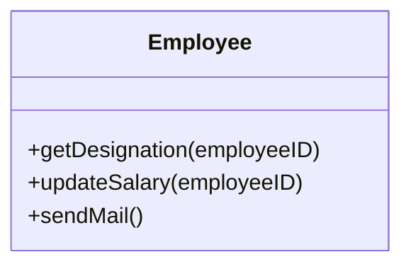
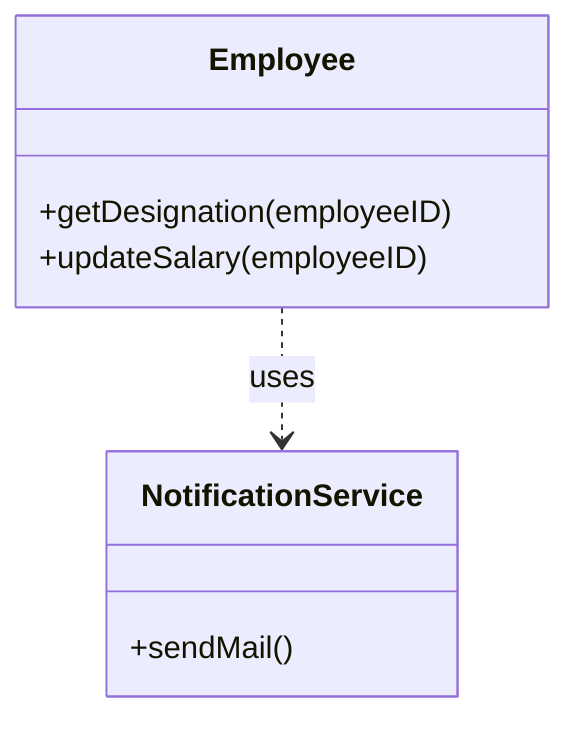
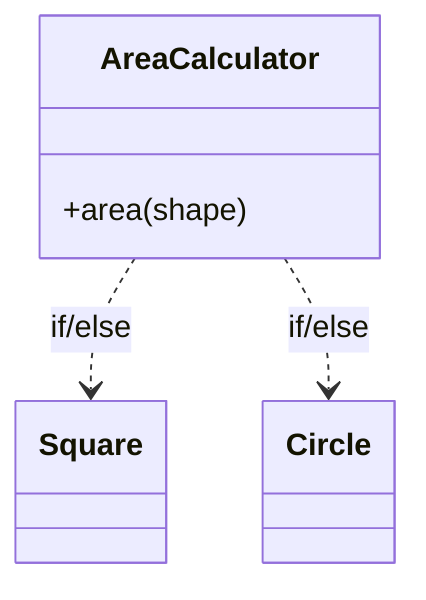
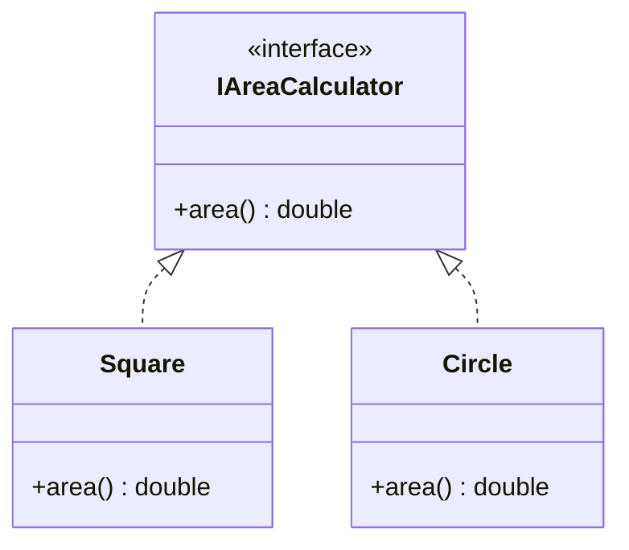
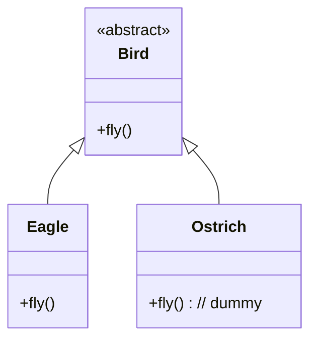
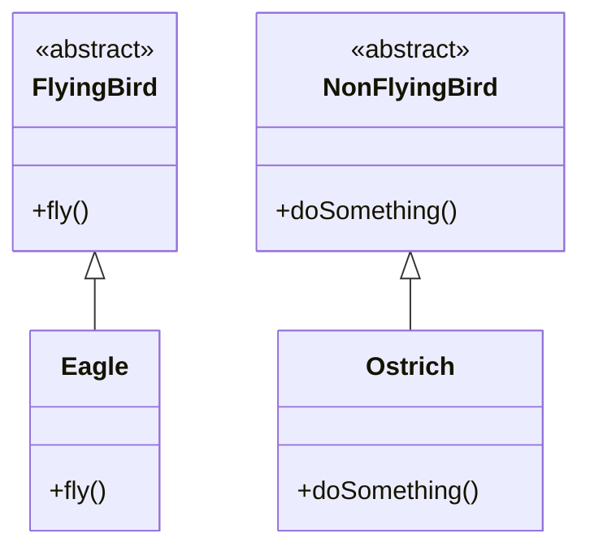
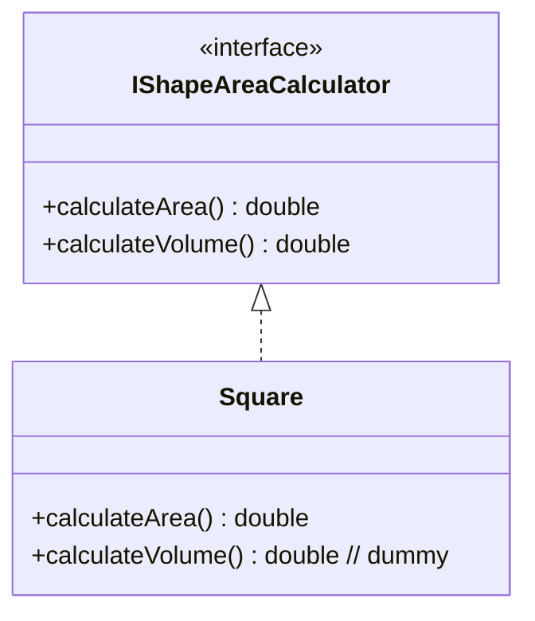
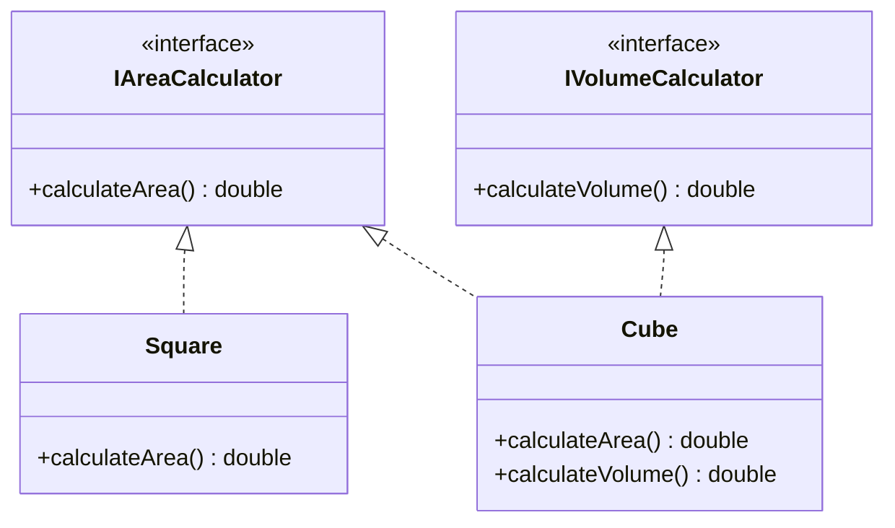
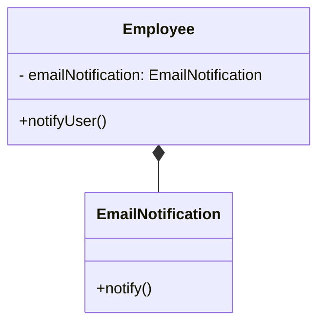
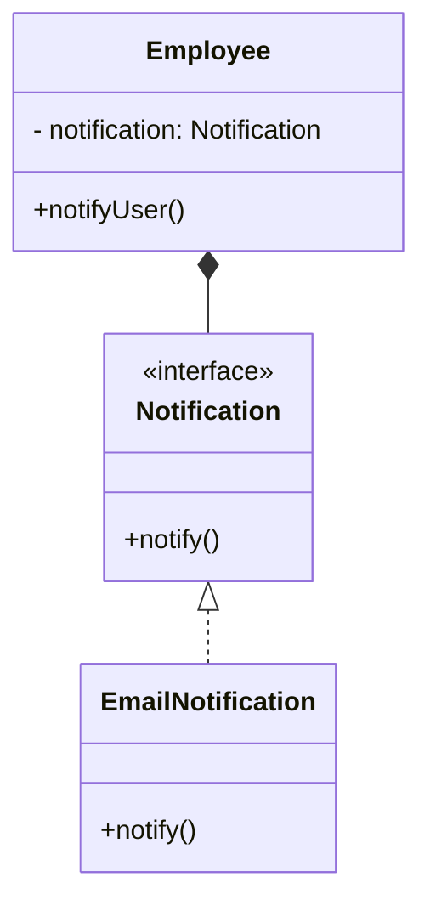

---

# Zasady SOLID w Javie — wyjaśnienie z przykładami kodu

- Czego się nauczysz: zrozumienia pięciu zasad SOLID wraz z przykładami w języku Java.
- Po co: aby tworzyć oprogramowanie bardziej odporne na zmiany, czytelne i łatwiejsze w utrzymaniu.

---

## Czym są zasady SOLID?

- Zestaw pięciu zasad projektowych w paradygmacie obiektowym.
- Stosowanie ich poprawia: rozszerzalność, czytelność, testowalność i możliwość ponownego użycia.

Akronim SOLID oznacza:

- Single Responsibility Principle (Zasada jednej odpowiedzialności, SRP)
- Open/Closed Principle (Zasada otwarte/zamknięte, OCP)
- Liskov Substitution Principle (Zasada podstawienia Liskov, LSP)
- Interface Segregation Principle (Zasada segregacji interfejsów, ISP)
- Dependency Inversion Principle (Zasada odwrócenia zależności, DIP)

---

## SRP — Single Responsibility Principle

- Każda klasa powinna mieć jedną, jasno określoną odpowiedzialność — jeden powód do zmiany.

Przykład naruszenia SRP:

```java
public class Employee{
  public String getDesignation(int employeeID){ // }
  public void updateSalary(int employeeID){ // }
  public void sendMail(){ // }
}
```

- Powyżej klasa `Employee` ma zachowania specyficzne dla pracownika (`getDesignation`, `updateSalary`),
  ale także metodę `sendMail`, która wykracza poza jej odpowiedzialność.
- Rozwiązanie: przenieść wysyłanie wiadomości do osobnej klasy/usługi.

Diagram UML (Mermaid) — przed (naruszenie SRP):



```java
public class Employee{
  public String getDesignation(int employeeID){ // }
  public void updateSalary(int employeeID){ // }
}

public class NotificationService {
    public void sendMail() { // }
}
```

Diagram UML (Mermaid) — po (zgodne z SRP):



---

## OCP — Open/Closed Principle

- Moduły powinny być „otwarte na rozszerzanie, zamknięte na modyfikowanie”.
- Przykład problemu: kalkulator pola rozróżnia kształty instrukcjami warunkowymi.

```java
public class AreaCalculator(){
  public double area(Shape shape){
    double areaOfShape;
    if(shape instanceof Square){
        // calculate the area of Square
    } else if(shape instanceof Circle){
        // calculate the area of Circle
    }
    return areaOfShape;
  }
}
```

Diagram UML (Mermaid) — przed (naruszenie OCP):



- Gdy dojdzie nowy `Shape`, musimy modyfikować kod — łamie to OCP.
- Rozwiązanie: wprowadzić interfejs, a każdy kształt niech sam zna sposób liczenia pola.

```java
interface IAreaCalculator(){
  double area();
}

class Square implements IAreaCalculator{
  @Override
  public double area(){
    System.out.println("Calculating area for Square");
    return 0.0;
   }
}

class Circle implements IAreaCalculator{
  @Override
  public double area(){
    System.out.println("Calculating area for Circle");
    return 0.0;
   }
}
```

Diagram UML (Mermaid) — po (zgodne z OCP):



---

## LSP — Liskov Substitution Principle

- Obiekt klasy bazowej musi dać się bezpiecznie zastąpić obiektem klasy pochodnej,
  nie naruszając poprawności programu.

Przykład problemu:

```java
abstract class Bird{
   abstract void fly();
}

class Eagle extends Bird {
   @Override
   public void fly() { // some implementation }
}

class Ostrich extends Bird {
   @Override
   public void fly() { // dummy implementation }
}
```

Diagram UML (Mermaid) — przed (naruszenie LSP):



- `Ostrich` (struś) nie potrafi latać, więc jest zmuszony do „atrapy” metody `fly()` — łamie to LSP.
- Rozwiązanie: rozdzielić hierarchię na ptaki latające i nielatające.

```java
abstract class FlyingBird{
   abstract void fly();
}

abstract class NonFlyingBird{
   abstract void doSomething();
}

class Eagle extends FlyingBird {
   @Override
   public void fly() { // some implementation }
}

class Ostrich extends NonFlyingBird {
   @Override
   public void doSomething() { // some implementation }
}
```

Diagram UML (Mermaid) — po (zgodne z LSP):



---

## ISP — Interface Segregation Principle

- Twórz małe, wyspecjalizowane interfejsy — klient nie powinien być zmuszany do implementowania metod, których nie potrzebuje.

Przykład problemu (za duży interfejs):

```java
interface IShapeAreaCalculator(){
  double calculateArea();
  double calculateVolume();
}

class Square implements IShapeAreaCalculator{
  double calculateArea(){ // calculate the area }
  double calculateVolume(){ // dummy implementation }
}
```

Diagram UML (Mermaid) — przed (naruszenie ISP):



- `Square` nie ma objętości, a jednak musi implementować `calculateVolume()`.
- Rozwiązanie: rozdzielić interfejsy.

```java
interface IAreaCalculator {
    double calculateArea();
}

interface IVolumeCalculator {
    double calculateVolume();
}

class Square implements IAreaCalculator {
    @Override
    public double calculateArea() { // calculate the area }
}

class Cube implements IAreaCalculator, IVolumeCalculator {
    @Override
    public double calculateArea() { // calculate the area }

    @Override
    public double calculateVolume() {// calculate the volume }
}
```

Diagram UML (Mermaid) — po (zgodne z ISP):



---

## DIP — Dependency Inversion Principle

- Moduły wysokiego poziomu nie powinny zależeć od modułów niskiego poziomu.
- Zależności powinny kierować się przez abstrakcje (luźne powiązanie).

Przykład zależności od szczegółu (złe):

```java
public interface Notification {
    void notify();
}

public class EmailNotification implements Notification {
    public void notify() {
        System.out.println("Sending notification via email");
    }
}

public class Employee {
    private EmailNotification emailNotification; 
    public Employee(EmailNotification emailNotification) {
        this.emailNotification = emailNotification;
    }
    public void notifyUser() {
        emailNotification.notify();
    }
}
```

Diagram UML (Mermaid) — przed (naruszenie DIP):



- `Employee` zależy bezpośrednio od `EmailNotification` (szczegół) — to łamie DIP.

Rozwiązanie: zależeć od abstrakcji:

```java
public interface Notification{
  public void notify();
}

public class Employee{
  private Notification notification;
  public Employee(Notification notification){
      this.notification = notification;
  }
  public void notifyUser(){
    notification.notify();
  }
 }

 public class EmailNotification implements Notification{
    public void notify(){
        //implement notification via email 
    }
 }

 public static void main(String [] args){
    Notification notification = new EmailNotification();
    Employee employee = new Employee(notification);
    employee.notifyUser();
 }
```

Diagram UML (Mermaid) — po (zgodne z DIP):



- Teraz mamy luźne powiązanie: `Employee` zależy od interfejsu, a nie od konkretnej implementacji.
- Zmiana rodzaju powiadomienia wymaga dostarczenia innej implementacji `Notification`.

---

## Podsumowanie

- SRP: jedna odpowiedzialność na klasę.
- OCP: rozszerzaj bez modyfikowania istniejącego kodu.
- LSP: podklasy muszą zachowywać kontrakt klasy bazowej.
- ISP: preferuj mniejsze interfejsy dopasowane do potrzeb klienta.
- DIP: zależ od abstrakcji, nie od szczegółów.

---

