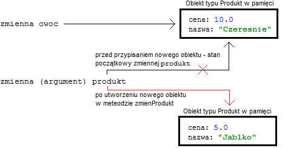
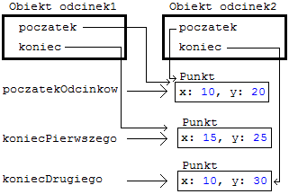

# Referencje do obiektów
> źródło - https://kursjava.com/klasy/referencje-do-obiektow/  
 
- [Referencje do obiektów](#referencje-do-obiektów)
- [Przesyłanie i modyfikowanie obiektów w metodach](#przesyłanie-i-modyfikowanie-obiektów-w-metodach)
- [Współdzielenie obiektów](#współdzielenie-obiektów)
- [Osobne obiekty typu Punkt](#osobne-obiekty-typu-punkt)
- [Tworzenie kopii obiektów](#tworzenie-kopii-obiektów)
- [Kiedy współdzielić obiekty?](#kiedy-współdzielić-obiekty)
- [Stałe referencje](#stałe-referencje)
- [Obiekty niemutowalne (immutable objects)](#obiekty-niemutowalne-immutable-objects)
- [Zalety i wady obiektów niemutowalnych](#zalety-i-wady-obiektów-niemutowalnych)
- [Jak zapewnić niemutowalność obiektów](#jak-zapewnić-niemutowalność-obiektów)
- [Niemutowalny typ String](#niemutowalny-typ-string)
- [Pamięć programu – stos i sterta](#pamięć-programu--stos-i-sterta)
- [Czas życia obiektów utworzonych w metodach](#czas-życia-obiektów-utworzonych-w-metodach)
- [Podsumowanie różnic typów prymitywnych i referencyjnych](#podsumowanie-różnic-typów-prymitywnych-i-referencyjnych)
- [Podsumowanie](#podsumowanie)

Wiemy, że zmienne typów referencyjnych wskazują na obiekty w pamięci – są one referencjami do tych obiektów. Gdy definiujemy zmienną typu Osoba, zmienna ta będzie mogła wskazywać na obiekty typu Osoba utworzone wcześniej za pomocą operatora new.

Dla przykładu, spójrzmy na poniższy fragment kodu – ile obiektów jest w nim tworzonych?

```java
Osoba o1 = new Osoba("Jan", "Nowak", 25);
Osoba o2 = o1;
```

W tym fragmencie definiujemy dwie zmienne mogące pokazywać na obiekty typu Osoba, ale tworzymy tylko jeden obiekt tego typu – obie zmienne wskazują na ten sam, jeden obiekt w pamięci.

Jeżeli zmienilibyśmy pole imie za pomocą zmiennej o1, to po wypisaniu imienia za pomocą zmiennej o2 zobaczylibyśmy tą zmianę:

```java
System.out.println("imie o1: " + o1.getImie());
System.out.println("imie o2: " + o2.getImie());
o1.setImie("Karol");
System.out.println("imie o1: " + o1.getImie());
System.out.println("imie o2: " + o2.getImie());
```

Wynikiem działania powyższego kodu jest:

```text
imie o1: Jan
imie o2: Jan
imie o1: Karol
imie o2: Karol
```

Dzieje się tak dlatego, że zmienne o1 i o2 wskazują na ten sam obiekt – nieważne, za pomocą której referencji się do niego odnosimy – nadal jest to ten sam, jeden obiekt typu Osoba.

W tym rozdziale zobaczymy, że rozróżnienie referencji do obiektu, oraz obiektu, do którego ta referencja się odnosi, jest bardzo ważne i może przysporzyć problemów, jeżeli nie weźmiemy pod uwagę konsekwencji, jaką niesie ze sobą współdzielenie obiektów.
## Przesyłanie i modyfikowanie obiektów w metodach

W rozdziale o metodach wspomnieliśmy, że modyfikowanie obiektów przesłanych do metody odbywa się na oryginalnym obiekcie, a nie na kopii obiektu. Spójrzmy na poniższy przykład – skorzystamy z klasy Produkt z jednego z poprzednich podrozdziałów:

Nazwa pliku: `Produkt.java`

```java
public class Produkt {
  private double cena;
  private String nazwa;
  public Produkt(double cena, String nazwa) {
    this.cena = cena;
    this.nazwa = nazwa;
  }
  public void setCena(double cena) {
    this.cena = cena;
  }
  public void setNazwa(String nazwa) {
    this.nazwa = nazwa;
  }
  public String toString() {
    return "Produkt o nazwie " + nazwa + " kosztuje " + cena;
  }
}
```

Prześlemy obiekt klasy Produkt do metody, a także wartość typu double, zmodyfikujemy je w metodzie i zobaczymy, jakie wartości będą miały oryginalne zmienne:

Nazwa pliku: `ModyfikacjeObiektowPrzyklady.java`

```java
public class ModyfikacjeObiektowPrzyklady {
  public static void main(String[] args) {
    Produkt ksiazka = new Produkt(49.0, "Hyperion");
    System.out.println("Ksiazka przed zmiana ceny: " + ksiazka);
    double nowaCena = 30.0;
    zmienCene(nowaCena, ksiazka); // 1
    System.out.println("nowaCena po wywolaniu metody: " + nowaCena);
    System.out.println("Ksiazka po zmianie ceny: " + ksiazka);
  }
  public static void zmienCene(double cena, Produkt produkt) {
    cena = cena * 1.23;
    produkt.setCena(cena); // 2
  }
}
```

Powyższa klasa spowoduje wypisanie na ekran:

```text
Ksiazka przed zmiana ceny: Produkt o nazwie Hyperion kosztuje 49.0
nowaCena po wywolaniu metody: 30.0
Ksiazka po zmianie ceny: Produkt o nazwie Hyperion kosztuje 36.9
```

Jak widzimy, zmiana ceny w metodzie zmienCene (2) odbyła się na oryginalnym obiekcie Produkt, utworzonym w metodzie main, a przesłanym do metody zmienCene w linii (1), a nie na kopii tego obiektu. Z drugiej strony, wartość zmiennej nowaCena, po powrocie z metody zmienCene, nie zmieniła się – pozostała równa 30.0.

Dzieje się tak dlatego, ponieważ do metody zmienCene, jako drugi argument, przesyłamy referencję do obiektu w pamięci. W związku z tym, w metodzie zmienCene uzyskujemy dostęp do oryginalnego obiektu typu Produkt, na który wskazuje zmienna o nazwie ksiazka. Ten oryginalny obiekt typu Produkt modyfikujemy w linii (2), odnosząc się do niego za pomocą zmiennej (argumentu) produkt.

Z kolei pierwszy argument, cena, jest typu prymitywnego – zmienne typu prymitywnego wskazują na konkretne, "proste" wartości w pamięci – podczas przesyłania do metod są one kopiowane. Wszelkie zmiany w metodach nie są odzwierciedlane w oryginalnych zmiennych.

Zwróćmy jeszcze uwagę na jeden fakt. Argumenty typu złożonego (jak argument produkt typu Produkt powyżej) także są przesyłane jako kopie, ale kopiowany jest adres obiektu, a nie cały obiekt, ponieważ zmienne typu złożonego (referencyjnego) zawierają referencję (odniesienie) do obiektu do pamięci – i właśnie to odniesienie do obiektu jest kopiowane i przesyłane do metody. Za pomocą tej referencji mamy dostęp do obiektu w pamięci.
Przypomnijmy także, że podobnie dzieje się z tablicami, które także są typami złożonymi – gdy prześlemy tablicę do metody i zmodyfikujemy ją, to wszelkie zmiany będą wykonywane na oryginalnej tablicy.

Rozróżnienie pomiędzy obiektami w pamięci a referencjami do nich jest bardzo istotne podczas programowania w języku Java – możemy mieć wiele referencji (zmiennych) do tego samego obiektu w pamięci, co może prowadzić do niechcianych i trudnych do zdiagnozowania błędów, o czym zaraz opowiemy sobie dokładniej.

Spójrzmy na inny przykład związany z obiektami i referencjami – co tym razem zostanie wypisane na ekran?

```java
public static void main(String[] args) {
  Produkt owoc = new Produkt(10.0, "Czeresnie"); // 1
  System.out.println("Owoc przed zmiana: " + owoc);
  zmienProdukt(owoc, 5.0, "Jablko");
  System.out.println("Owoc po zmianie: " + owoc);
}
public static void zmienProdukt(Produkt produkt, double nowaCena, String nowaNazwa){
  produkt = new Produkt(nowaCena, nowaNazwa); // 2
}
```

Na ekranie zobaczymy dwa razy taką samą informację o obiekcie owoc:

```text
Owoc przed zmiana: Produkt o nazwie Czeresnie kosztuje 10.0
Owoc po zmianie: Produkt o nazwie Czeresnie kosztuje 10.0
```

Dlaczego przypisanie do argumentu produkt nowo utworzonego obiektu typu Produkt w metodzie zmienProdukt (2) nie spowodowało zmiany oryginalnego obiektu utworzonego w linii (1)?

Zrozumienie, co dzieje się w powyższym przykładzie jest bardzo istotne – przeanalizujmy, co robi poniższa linia kodu:

```java
produkt = new Produkt(nowaCena, nowaNazwa);
```

W tej linii tworzymy nowy obiekt typu Produkt na podstawie wartości przesłanych jako argumenty. Następnie, obiekt ten przypisywany jest do argumentu produkt, który jest prostu zmienną mogącą pokazywać na obiekty typu Produkt.

Na początku tej metody, argument produkt wskazuje na obiekt w pamięci, do którego referencję podaliśmy wywołując metodę zmienProdukt:

```java
zmienProdukt(owoc, 5.0, "Jablko");
```

Dlatego, przed przypisaniem do argumentu produkt nowo utworzonego obiektu, pokazuje on na obiekt utworzony w linii (1), a poźniej na nowy obiekt w pamięci o cenie i nazwie nowaCena i nowaNazwa.

Metoda zmienProdukt w żaden sposób nie zmienia ani obiektu, na który pokazuje zmienna owoc, ani nie powoduje, że zmienna owoc zacznie pokazywać na obiekt utworzony wewnątrz metody zmienProdukt. Jedyna zmiana, jaka zostaje wykonana, to zmiana, na jaki obiekt pokazuje argument produkt – z obiektu utworzonego w linii (1) na nowy obiekt utworzony w metodzie (2).

Zagadnienie to zostało przedstawione poniżej:  


Jedynym efektem przypisania nowego obiektu do argumentu produkt jest to, że od momentu wykonania tej instrukcji, nie mamy już w metodzie zmienProdukt dostępu do obiektu, na który wcześniej wskazywał argument produkt. Oryginalny obiekt, jak i zmienna owoc, która na niego wskazuje, nie zmieniają się.

Takie samo zachowanie moglibyśmy zauważyć w metodzie main – spójrzmy na poniższy fragment kodu – co zobaczymy na ekranie?

```java
Produkt rower = new Produkt(999.0, "Rower"); // 1
Produkt pojazd = rower;
pojazd = new Produkt(50000.0, "Samochod"); // 2
System.out.println(rower);
System.out.println(pojazd);
```

Na ekranie zobaczymy:

```text
Produkt o nazwie Rower kosztuje 999.0
Produkt o nazwie Samochod kosztuje 50000.0
```

Mamy tutaj podobną sytuację, jak z metodą zmienProdukt – odpowiednikiem argumentu produkt jest tutaj zmienna pojazd – przypisujemy jej odniesienie do tego samego obiektu, na który wskazuje zmienna rower.

Następnie, przypisujemy do zmiennej pojazd nowy obiekt typu Produkt. To przypisanie w żaden sposób nie wpływa na obiekt utworzony w linii (1), ani też nie ma wpływu na to, na co pokazuje zmienna rower. Jedyne, co się zmienia, to zmienna pojazd – od linii (2) zaczyna ona pokazywać na inny obiekt w pamięci.
## Współdzielenie obiektów

To, że możemy mieć wiele zmiennych pokazujących na ten sam obiekt w pamięci, ma swoje wady i zalety.

Spójrzmy na przykład z klasami Odcinek i Punkt – obiekty klasy Odcinek opisane są poprzez dwa punkty na płaszczyźnie, do czego wykorzystywane są obiekty klasy Punkt:

Nazwa pliku: `wspoldzielenieobiektow/Punkt.java`

```java
public class Punkt {
  private int x;
  private int y;
  public Punkt(int x, int y) {
    this.x = x;
    this.y = y;
  }
  public int getX() {
    return x;
  }
  public void setX(int x) {
    this.x = x;
  }
  public int getY() {
    return y;
  }
  public void setY(int y) {
    this.y = y;
  }
  public String toString() {
    return "Punkt(x: " + x + ", y: " + y + ")";
  }
}
```

Nazwa pliku: `wspoldzielenieobiektow/Odcinek.java`

```java
public class Odcinek {
  private Punkt poczatek;
  private Punkt koniec;
  public Odcinek(Punkt poczatek, Punkt koniec) {
    this.poczatek = poczatek;
    this.koniec = koniec;
  }
  public void przesunPoczatek(int x, int y) {
    this.poczatek.setX(x);
    this.poczatek.setY(y);
  }
  public String toString() {
    return "Odcinek zawarty pomiedzy " + poczatek + " i " + koniec; 
  }
}
```

Obie klasy mają konstruktory, inicjalizujące ich pola, oraz metody toString, pomocne przy opisywaniu obiektów obu klas. Klasa Odcinek korzysta z klasy Punkt – ma ona dwa prywatne pola typu Punkt, które wyznaczają, odpowiednio, początek i koniec odcinka na płaszczyźnie.

Klasa Odcinek udostępnia także publiczną metodę przesunPoczatek, która pozwala na zmianę położenia początkowego punktu – wywołuje ona po prostu settery na obiekcie poczatek, z odpowiednimi argumentami.

Dopiszemy do klasy Odcinek metodę main, w której utworzymy dwa obiekty typu Odcinek. Oba odcinki będą zaczynały się w tym samym punkcie, więc użyjemy tego samego obiektu Punkt dwukrotnie:
Fragment pliku `Odcinek.java` z katalogu `wspoldzielenieobiektow`:

```java
public static void main(String[] args) {
  Punkt poczatekOdcinkow = new Punkt(10, 20);
  Punkt koniecPierwszego = new Punkt(15, 25);
  Punkt koniecDrugiego = new Punkt(10, 30);
  // 1
  Odcinek odcinek1 = new Odcinek(poczatekOdcinkow, koniecPierwszego);
  // 2
  Odcinek odcinek2 = new Odcinek(poczatekOdcinkow, koniecDrugiego);
  System.out.println(odcinek1);
  System.out.println(odcinek2);
}
```

Dzięki metodom toString, które dodaliśmy do naszych, klas, na ekranie zobaczymy czytelną, tekstową reprezentację obu obiektów typu Odcinek:

```text
Odcinek zawarty pomiedzy Punkt(x: 10, y: 20) i Punkt(x: 15, y: 25)
Odcinek zawarty pomiedzy Punkt(x: 10, y: 20) i Punkt(x: 10, y: 30)
```

W powyższym przykładzie utworzyliśmy trzy obiekty typu Punkt i dwa obiekty typu Odcinek. Pierwszy z utworzonych punktów, poczatekOdcinkow, użyliśmy dwukrotnie – przekazaliśmy go jako pierwszy argument do konstruktorów dwóch obiektów typu Odcinek (1) (2).

Załóżmy teraz, że chcielibyśmy przesunąć pierwszy odcinek – zmienić położenie jego punktu początkowego – możemy w tym celu skorzystać z metody przesunPoczatek klasy Odcinek.

Pytanie: co zostanie wypisane na ekran w wyniku działania poniższego fragmentu kodu?

```java
odcinek1.przesunPoczatek(0, 5);
System.out.println(odcinek1);
System.out.println(odcinek2);
```

Tym razem na ekranie zobaczymy:

```text
Odcinek zawarty pomiedzy Punkt(x: 0, y: 5) i Punkt(x: 15, y: 25)
Odcinek zawarty pomiedzy Punkt(x: 0, y: 5) i Punkt(x: 10, y: 30)
```

Jak widzimy, po zmianie pierwszego odcinka, zmiany zaszły także w drugim obiekcie – oba odcinki mają zmienione początkowe położenie – dlaczego tak się stało?

Tworząc obiekty odcinek1 i odcinek2, przesłaliśmy jako argument do ich konstruktorów referencję do tego samego obiektu Punkt o nazwie poczatekOdcinkow:

```java
Odcinek odcinek1 = new Odcinek(poczatekOdcinkow, koniecPierwszego);
Odcinek odcinek2 = new Odcinek(poczatekOdcinkow, koniecDrugiego);
```

W konstruktorze klasy Odcinek, do pola poczatek, przypisujemy referencję do obiektu przesłanego jako pierwszy argument:

```java
public Odcinek(Punkt poczatek, Punkt koniec) {
  this.poczatek = poczatek;
  this.koniec = koniec;
}
```

Oba obiekty odcinek1 i odcinek2 przechowują w polu poczatek odniesienie do tego samego obiektu w pamięci – obiektu poczatekOdcinkow.

Gdy wywołujemy poniższą linię kodu, zmieniamy położenie obiektu odcinek1:

```java
odcinek1.przesunPoczatek(0, 5);
```

Jak działa ta metoda? Przypisuje ona do obiektu wskazywanego przez pole poczatek nowe wartości za pomocą setterów:

```java
public void przesunPoczatek(int x, int y) {
  this.poczatek.setX(x);
  this.poczatek.setY(y);
}
```

Modyfikując obiekt wskazywany przez pole poczatek, zmieniamy de facto obiekt, który jest współdzielony przez oba obiekty: odcinek1 i odcinek2.

Mało tego – do obiektu opisującego początek obu odcinków mamy jeszcze dostęp w inny sposób – poprzez zmienną poczatekOdcinkow:

```java
poczatekOdcinkow.setX(-20);
poczatekOdcinkow.setY(50);
System.out.println(odcinek1);
System.out.println(odcinek2);
```

Powyższy kod spowoduje wypisanie na ekran:

```text
Odcinek zawarty pomiedzy Punkt(x: -20, y: 50) i Punkt(x: 15, y: 25)
Odcinek zawarty pomiedzy Punkt(x: -20, y: 50) i Punkt(x: 10, y: 30)
```

Modyfikując obiekt poczatekOdcinkow sprawiliśmy, że zmieniło się położenie obu odcinków! Wynika to z faktu, że wszystkie trzy zmienne:

```text
poczatekOdcinkow,
poczatek obiektu odcinek1,
poczatek obiektu odcinek2,
```

wskazują na ten sam obiekt w pamięci:  


W tym przypadku takie zachowanie jest niepożądane, ponieważ chcemy móc niezależnie modyfikować pola obiektów klasy Odcinek, nie wpływając na inne, istniejące obiekty tej klasy.

Co możemy zrobić, aby zapobiec takiemu zachowaniu obiektów w naszych programach?

Mamy trzy opcje:

1. Możemy utworzyć osobne obiekty dla punktów początkowych każdego z odcinków.
2. Możemy w konstruktorze klasy Odcinek zrobić kopię przesłanych obiektów typu Punkt.
3. Możemy korzystać z obiektów niemutowalnych (immutable objects), o których opowiemy sobie za chwilę w jednym z kolejnych rozdziałów.

Powyższe propozycje mają wady i zalety – spójrzmy na implementację dwóch pierwszych opcji.

## Osobne obiekty typu Punkt

Przyjrzyjmy się najpierw implementacji, w której korzystamy z osobnych obiektów typu Punkt dla każdego z obiektów klasy Odcinek:

```java
Punkt poczatekPierwszego = new Punkt(10, 20);
Punkt koniecPierwszego = new Punkt(15, 25);
Punkt poczatekDrugiego = new Punkt(10, 20);
Punkt koniecDrugiego = new Punkt(10, 30);
Odcinek odcinek1 = new Odcinek(poczatekPierwszego, koniecPierwszego);
Odcinek odcinek2 = new Odcinek(poczatekDrugiego, koniecDrugiego);
odcinek1.przesunPoczatek(0, 5); // 1
System.out.println(odcinek1);
System.out.println(odcinek2);
```

Gdy teraz zmienimy położenie pierwszego odcinka (1), to położenie drugiego odcinka się nie zmieni, ponieważ każdy z odcinków ma osobny obiekt typu Punkt, który opisuje początek:

```text
Odcinek zawarty pomiedzy Punkt(x: 0, y: 5) i Punkt(x: 15, y: 25)
Odcinek zawarty pomiedzy Punkt(x: 10, y: 20) i Punkt(x: 10, y: 30)
```

Zaletą tego rozwiązania jest to, że jest proste – tworzymy dedykowane obiekty typu Punkt dla każdego z obiektów typu Odcinek i przesyłamy je jako argumenty do konstruktora.

Wadą tego rozwiązania jest to, że nadal mamy dostęp do utworzonych obiektów typu Punkt spoza wnętrza klasy Odcinek. Spójrzmy na poniższy przykład – za pomocą zmiennych poczatekPierwszego i poczatekDrugiego możemy zmodyfikować położenie obu odcinków:

```java
poczatekPierwszego.setX(-100);
poczatekPierwszego.setY(-100);
poczatekDrugiego.setX(200);
poczatekDrugiego.setY(200);
System.out.println(odcinek1);
System.out.println(odcinek2);
```

Na ekranie zobaczymy:

```text
Odcinek zawarty pomiedzy Punkt(x: -100, y: -100) i Punkt(x: 15, y: 25)
Odcinek zawarty pomiedzy Punkt(x: 200, y: 200) i Punkt(x: 10, y: 30)
```

Za pomocą zmiennych zdefiniowanych w metodzie main mamy dostęp do obiektów, na które wskazują prywatne pola klasy Odcinek – zazwyczaj nie jest dobra praktyka, ponieważ możliwe są do wykonania zmiany naszych obiektów bez naszej wiedzy, co może prowadzić do potencjalnych błędów. Wszystko zależy od kontekstu, w jakim tworzymy nasze klasy, to znaczy: kto i do czego będzie ich używał.

Często można w prosty sposób uchronić się przed potencjalnymi problemami, pisząc kod w taki sposób, by nie współdzielić obiektów, które powinny być prywatne i wszelkie ich modyfikacje powinny odbywać się jedynie wewnątrz metod klasy, która z tych obiektów korzysta.
## Tworzenie kopii obiektów

Możemy w konstruktorze klasy Odcinek nie przypisywać do pól poczatek i koniec referencji do obiektów przesłanych jako argumenty, lecz utworzyć nowe obiekty typu Punkt na podstawie tych argumentów:

```java
// poprzednia wersja
public Odcinek(Punkt poczatek, Punkt koniec) {
  this.poczatek = poczatek;
  this.koniec = koniec;
}
// nowa wersja konstruktora
public Odcinek(Punkt poczatek, Punkt koniec) { // 1
  this.poczatek = new Punkt(poczatek.getX(), poczatek.getY());
  this.koniec = new Punkt(koniec.getX(), koniec.getY());
}
```

Nowa wersja konstruktora (1) nie przypisuje już do pól poczatek i koniec argumentów konstruktora, lecz tworzy zupełnie nowe obiekty klasy Punkt z takimi samymi wartościami pól x i y, jakie mają obiekty przesłane jako argumenty. Nowo utworzone obiekty są przypisywane do pól poczatek i koniec.

W ten sposób, obiekty klasy Odcinek zupełnie odcinają się od zewnętrznego świata i są od niego uniezależnione – wszelkie zmiany obiektów przesłanych jako argumenty nie mają wpływu na pola obiektów klasy Odcinek:

```java
Punkt poczatekOdcinkow = new Punkt(10, 20);
Punkt koniecPierwszego = new Punkt(15, 25);
Punkt koniecDrugiego = new Punkt(10, 30);
Odcinek odcinek1 = new Odcinek(poczatekOdcinkow, koniecPierwszego);
Odcinek odcinek2 = new Odcinek(poczatekOdcinkow, koniecDrugiego);
System.out.println(odcinek1);
System.out.println(odcinek2);
poczatekOdcinkow.setX(-20);
poczatekOdcinkow.setY(50);
System.out.println(odcinek1);
System.out.println(odcinek2);
```

W pierwszej wersji powyższego kodu, zmiana obiektu poczatekOdcinkow powodowała, że zmieniał się początkowy punkt obu odcinków – zobaczmy, co tym razem zostanie wypisane na ekran:

```text
Odcinek zawarty pomiedzy Punkt(x: 10, y: 20) i Punkt(x: 15, y: 25)
Odcinek zawarty pomiedzy Punkt(x: 10, y: 20) i Punkt(x: 10, y: 30)
Odcinek zawarty pomiedzy Punkt(x: 10, y: 20) i Punkt(x: 15, y: 25)
Odcinek zawarty pomiedzy Punkt(x: 10, y: 20) i Punkt(x: 10, y: 30)
```

Tym razem zmiana obiektu poczatekOdcinkow nie wpływa na obiekty odcinek1 i odcinek2, ponieważ każdy z tych obiektów ma własne egzemplarze obiektów typu Punkt, które zostały utworzone w konstruktorze. Jedyną możliwością, by zmienić położenie odcinka, jest teraz użycie metody przesunPoczatek.

To rozwiązanie zapewnia, że obiekty klasy Odcinek są chronione przed zmianami ich wewnętrznego stanu poza klasą Odcinek. Wadą tego rozwiązania jest to, że musimy tworzyć więcej obiektów – tworzenie obiektów zajmuje czas procesora i pamięć komputera. W naszym prostym przykładzie nie ma to żadnego znaczenia, ale gdy działamy z tysiącami/milionami obiektów, które posiadają kilkanaście złożonych pól, które z kolei składają się z wielu kolejnych pól, to może się to odbić negatywnie na wydajności naszych programów.
## Kiedy współdzielić obiekty?

Czasem chcemy, by wewnętrzny stan obiektów był możliwy do zmiany jedynie z wnętrza klasy tych obiektów. Obiekty klasy Uczen powinny zawsze mieć dedykowaną, prywatną dla nich i ukrytą przed światem tablicę ocen ucznia – nie chcemy, by wiele obiektów klasy Uczen korzystało z tego samego egzemplarza tablicy w pamięci!

Z drugiej strony, obiekty często oczekują, że zostaną im przesłane obiekty, z których będą mogły korzystać i nie ma znaczenia, czy obiekty te są dedykowane dla konkretnego obiektu, czy współdzielone pomiędzy wieloma obiektami – w rzeczywistości, jest to częsta praktyka (mowa tutaj o Dependency Injection, popularnym w ostatnich latach sposobie zarządzania zależnościami pomiędzy obiektami w języku Java. Jest to jedna z podstawowych funkcjonalności udostępnianych przez framework Spring).

Jeżeli jesteśmy w stanie zapewnić, że stan współdzielonych obiektów nie zostanie zmieniony w niepożądany sposób przez któryś z używających go obiektów, albo możemy wręcz zapewnić, że obiekty takie są niemodyfikowalne (o takich obiektach zaraz sobie opowiemy), to współdzielenie obiektów powoduje zmniejszenie zasobów, jakie są potrzebne dla programu – zamiast tworzyć wiele obiektów danego typu, możemy utworzyć jeden i pozwalać na korzystanie z niego przez zależne od niego obiekty.

Przykładem współdzielenia obiektów są np. obiekty odpowiedzialne za łączenie się z bazą danych i zarządzanie takimi połączeniami – są to kosztowne operacje z punkty widzenia wykonywania programu, które możemy zoptymalizować, jeżeli zarządzanie połączeniami oddelegujemy do jednego obiektu, z którego inne klasy będą mogły korzystać do zapisywania i odczytywania danych z bazy danych.

## Stałe referencje

W rozdziale o konstruktorach zobaczyliśmy, że polom typu referencyjnego, zdefiniowanych z modyfikatorem final, nie możemy przypisać innej wartości po ich zainicjalizowaniu. Podobnie ze zmiennymi lokalnymi:

```java
final Punkt punkt = new Punkt(10, 20);
punkt = new Punkt(25, 30);
```

Próba kompilacji powyższego fragmentu kodu kończy się następującymi błędem:

```text
error: cannot assign a value to final variable punkt
        punkt = new Punkt(25, 30);
        ^
1 error
```

Zmienna punkt jest final, więc po jej inicjalizacji nie możemy już przypisać do niej innego obiektu, o czym informuje nas kompilator.

A co by się stało, gdybyśmy na powyższej zmiennej punkt spróbowali wywołać setter i zmienić np. pole x obiektu punkt? Jaki będzie wynik kompilacji poniższego kodu i uruchomienia go?

```java
final Punkt punkt = new Punkt(10, 20);
System.out.println(punkt);
punkt.setX(5);
System.out.println(punkt);
```

Tym razem nie zobaczymy na ekranie błędu:

```text
Punkt(x: 10, y: 20)
Punkt(x: 5, y: 20)
```

Dlaczego kod zadziałał i udało nam się zmienić obiekt zdefiniowany z modyfikatorem final?

Musimy pamiętać, że w tym przypadku to nie obiekt, któremu zmieniamy wartość pola x, lecz zmienna o nazwie punkt, jest final.

Nic nie stoi nam na przeszkodzie, by zmienić obiekt typu Punkt, znajdujący się gdzieś w pamięci, odnosząc się do niego za pomocą zmiennej punkt. To, czego nie możemy zrobić, to zmienić, na co zmienna punkt pokazuje – to właśnie zapewnia nam słowo kluczowe final.

W powyższym kodzie zmienna punkt jest stałą referencją do obiektu typu Punkt, ale obiekt ten nie musi być stały – możemy zmieniać wartości jego pól. Należy to zawsze mieć na uwadze pracując z obiektami.

## Obiekty niemutowalne (immutable objects)

W poprzednim podrozdziale wspomnieliśmy o obiektach niemutowalnych (immutable objects).

Obiekty niemutowalne to takie obiekty, których wartości nie mogą zmienić się po ich utworzeniu.

Aby zapewnić niemożliwość zmiany, klasy, których obiekty mają być niemutowalne, nie posiadają setterów oraz nie udostępniają żadnego sposobu na modyfikację wewnętrznego stanu obiektów tej klasy. Wartości pól raz utworzonego, niemodyfikowalnego obiektu, pozostają takie same przez całe "życie" takiego obiektu.

Wróćmy do klasy Punkt z poprzedniego podrozdziału:

Nazwa pliku: `wspoldzielenieobiektow/Punkt.java`

```java
public class Punkt {
  private int x;
  private int y;
  public Punkt(int x, int y) {
    this.x = x;
    this.y = y;
  }
  public int getX() {
    return x;
  }
  public void setX(int x) {
    this.x = x;
  }
  public int getY() {
    return y;
  }
  public void setY(int y) {
    this.y = y;
  }
  public String toString() {
    return "Punkt(x: " + x + ", y: " + y + ")";
  }
}
```

Czy obiekty tej klasy są niemutowalne?

Po utworzeniu obiektu klasy Punkt, możemy zmienić wartości jego pól x oraz y za pomocą setterów setX oraz setY, więc obiekty tej klasy nie są obiektami niemutowalnymi.

Moglibyśmy usunąć settery z powyższej klasy – wtedy w żaden sposób nie można byłoby zmienić wartości pól x oraz y. Wartości nadane tym polom w konstruktorze byłyby wartościami, które obiekty klasy Punkt miałyby już na stałe – w ten sposób, otrzymalibyśmy obiekty niemutowalne. Spójrzmy na drugą wersję klasy Punkt, którą nazwiemy NiemutowalnyPunkt:

Nazwa pliku: `NiemutowalnyPunkt.java`

```java
public class NiemutowalnyPunkt {
  private final int x;
  private final int y;
  public NiemutowalnyPunkt(int x, int y) {
    this.x = x;
    this.y = y;
  }
  public int getX() {
    return x;
  }
  public int getY() {
    return y;
  }
  public String toString() {
    return "NiemutowalnyPunkt(x: " + x + ", y: " + y + ")";
  }
}
```

Obiekty powyższej klasy są niemutowalne – zauważmy, że gdy utworzymy obiekt klasy NiemutowalnyPunkt, to nie będziemy już mogli zmienić wartości pól x oraz y w żaden sposób. Zauważmy także, że dodaliśmy modyfikator final do pól x oraz y, aby mieć pewność, że nigdzie wewnątrz klasy NiemutowalnyPunkt nie spróbujemy zmodyfikować wartości tych pól.

Moglibyśmy teraz napisać klasę NiemutowalnyOdcinek, która zawierałaby dwa obiekty typu NiemutowalnyPunkt:

Nazwa pliku: `NiemutowalnyOdcinek.java`

```java
public class NiemutowalnyOdcinek {
  private final NiemutowalnyPunkt poczatek;
  private final NiemutowalnyPunkt koniec;
  public NiemutowalnyOdcinek(
      NiemutowalnyPunkt poczatek, NiemutowalnyPunkt koniec) {
    this.poczatek = poczatek;
    this.koniec = koniec;
  }
  public String toString() {
    return "NiemutowalnyOdcinek zawarty pomiedzy " +
        poczatek + " i " + koniec;
  }
}
```

W poprzednim podrozdziale, w jednej z wersji klasy Odcinek, natknęliśmy się na sytuację, w której konstruktor klasy Odcinek przypisywał do pól poczatek oraz koniec obiekty typu Punkt przesłane jako argument:

fragment pliku `wspoldzielenieobiektow/Odcinek.java`

```java
public Odcinek(Punkt poczatek, Punkt koniec) {
  this.poczatek = poczatek;
  this.koniec = koniec;
}
```

Powodowało to, że mogliśmy modyfikować stan obiektów typu Odcinek za pomocą referencji do obiektów klasy Punkt, które przekazaliśmy do konstruktora klasy Odcinek:

```java
Punkt punktPierwszy = new Punkt(10, 20);
Punkt punktDrugi = new Punkt(15, 25);
Odcinek odcinek1 = new Odcinek(punktPierwszy, punktDrugi);
  
punktPierwszy.setX(-100); // zmieniamy stan obieku odcinek1!
punktPierwszy.setY(-100);
```

W powyższym fragmencie, zmiana obiektu punktPierwszy powoduje, że zmienia się także obiekt odcinek1, ponieważ pole poczatek obiektu odcinek1 wskazuje na ten sam obiekt, co zmienna punktPierwszy.

Zauważmy, że tego problemu nie napotkamy w przypadku klas NiemutowalnyPunkt oraz NiemutowalnyOdcinek, ponieważ, nawet jeżeli będziemy mieli referencję do obiektów typu NiemutowalnyPunkt, które prześlemy jako argumenty do konstruktora klasy NiemutowalnyOdcinek, to i tak nie będziemy mogli ich w żaden sposób zmienić, ponieważ są niemutowalne:
fragment pliku `NiemutowalnyOdcinek.java`

```java
public static void main(String[] args) {
  NiemutowalnyPunkt poczatek = new NiemutowalnyPunkt(10, 20);
  NiemutowalnyPunkt koniec = new NiemutowalnyPunkt(15, 25);
  NiemutowalnyOdcinek odcinek =
      new NiemutowalnyOdcinek(poczatek, koniec);
}
```

Pomimo, że mamy dostęp do obiektów poczatek i koniec, z których będzie korzystać obiekt odcinek, to nie mamy możliwości zmiany wartości przechowywanych przez te obiekty, ponieważ są niemutowalne.

Spójrzmy na inny przykład – czy obiekty tej klasy są niemutowalne?

Nazwa pliku: `Figura.java`

```java
public class Figura {
  private final NiemutowalnyPunkt[] punkty;
  public Figura(NiemutowalnyPunkt[] punkty) {
    this.punkty = punkty;
  }
  public String toString() {
    String punktyFigury = "";
    for (NiemutowalnyPunkt punkt : punkty) {
      punktyFigury += "\t" + punkt + "\n";
    }
    return "Figura sklada sie z punktow:\n" + punktyFigury;
  }
}
```

Na pierwszy rzut oka może się wydawać, że obiekty klasy Figura są niemutowalne – nie dajemy dostępu do pola punkty – nie ma setterów oraz pole punkty jest prywatne i finalne, a jego wartość jest nadawana jednorazowo w konstruktorze klasy Figura. Ponadto, korzystamy z klasy NiemutowalnyPunkt, której obiekty, jak już wiemy, są niemutowalne, więc nie ma opcji, aby zmodyfikować którykolwiek z nich, nawet, gdybyśmy mieli do niego referencję.

Niestety, zapomnieliśmy o jeszcze jednym obiekcie – tablicy, którą przesyłamy jako argument do konstruktora klasy Figura! Spójrzmy na przykład, który udowadnia, że klasa Figura nie jest niemutowalna:
fragment pliku `Figura.java`

```java
public static void main(String[] args) {
  NiemutowalnyPunkt[] punktyKwadratu = {
      new NiemutowalnyPunkt(0, 0),
      new NiemutowalnyPunkt(10, 0),
      new NiemutowalnyPunkt(10, 10),
      new NiemutowalnyPunkt(0, 10),
  };
  Figura figura = new Figura(punktyKwadratu);
  System.out.println(figura);
  punktyKwadratu[0] = new NiemutowalnyPunkt(-10, -5);
  System.out.println(figura);
}
```

W powyższym przykładzie tworzymy tablicę punktyKwadratu, która przechowuje wierzchołki kwadratu, a następnie przekazujemy ją do konstruktora klasy Figura. Wypisujemy na ekran obiekt figura, a następnie modyfikujemy tablicę punktyKwadratu – do pierwszego elementu tablicy zapisujemy zupełnie nowy obiekt typu NiemutowalnyPunkt i ponownie wypisujemy na ekran obiekt figura. To, co widzimy na ekranie po wykonaniu powyższej metody main, świadczy o tym, że jesteśmy w stanie zmienić obiekt typu Figura:

```text
Figura sklada sie z punktow:
  NiemutowalnyPunkt(x: 0, y: 0)
  NiemutowalnyPunkt(x: 10, y: 0)
  NiemutowalnyPunkt(x: 10, y: 10)
  NiemutowalnyPunkt(x: 0, y: 10)

Figura sklada sie z punktow:
  NiemutowalnyPunkt(x: -10, y: -5)
  NiemutowalnyPunkt(x: 10, y: 0)
  NiemutowalnyPunkt(x: 10, y: 10)
  NiemutowalnyPunkt(x: 0, y: 10)
```
W powyższej metodzie toString skorzystaliśmy z dwóch "znaków kontrolnych": \t oraz \n. Są to specjalne znaki, które powodują zmianę wyświetlania tekstu na ekranie. Znak \t, czyli znak tabulacji, powoduje, że tekst będzie wcięty, natomiast znak \n (newline), spowoduje, że na ekranie dodany będzie znak nowej linii, a to, co następuje za nim, zostanie wypisane linijkę niżej na ekranie. Dzięki temu, tekst jest ładnie sformatowany na ekranie.

Nie zadbaliśmy w naszej klasie, by wziąć pod uwagę, że użytkownik naszej klasy może zmodyfikować zawartość tablicy przesłanej jako argument do konstruktora klasy Figura. Może to być skutkiem potencjalnych błędów w naszym programie, jednak możemy w prosty sposób uchronić się przed powyższą sytuacją, jeżeli zamiast przypisywać przesłaną tablicą do pola punkty, utworzymy nową tablicę:

```java
public class NiemutowalnaFigura {
  private final NiemutowalnyPunkt[] punkty;
  public NiemutowalnaFigura(NiemutowalnyPunkt[] punkty) {
    // utworz nowa tablice
    this.punkty = new NiemutowalnyPunkt[punkty.length];
    // i przepisz zawartosc z tablicy-argumentu do nowej tablicy
    for (int i = 0; i < punkty.length; i++) {
      this.punkty[i] = punkty[i];
    }
  }
  public String toString() {
    String punktyFigury = "";
    for (NiemutowalnyPunkt punkt : punkty) {
      punktyFigury += "\t" + punkt + "\n";
    }
    return "Figura sklada sie z punktow:\n" + punktyFigury;
  }
  public static void main(String[] args) {
    NiemutowalnyPunkt[] punktyKwadratu = {
        new NiemutowalnyPunkt(0, 0),
        new NiemutowalnyPunkt(10, 0),
        new NiemutowalnyPunkt(10, 10),
        new NiemutowalnyPunkt(0, 10),
    };
    NiemutowalnaFigura figura =
        new NiemutowalnaFigura(punktyKwadratu);
    System.out.println(figura);
    punktyKwadratu[0] = new NiemutowalnyPunkt(-10, -5);
    System.out.println(figura);
  }
}
```

W konstruktorze klasy NiemutowalnaFigura zamiast przypisać do pola punkty wartość przesłanego argumentu, tworzymy nową tablicę o takim samym rozmiarze, jak rozmiar przesłanej tablicy. Następnie, przepisujemy do nowej tablicy zawartość tablicy-argumentu. Tym razem, gdy uruchomimy program, zobaczymy na ekranie dwa razy ten sam komunikat:

```text
Figura sklada sie z punktow:
  NiemutowalnyPunkt(x: 0, y: 0)
  NiemutowalnyPunkt(x: 10, y: 0)
  NiemutowalnyPunkt(x: 10, y: 10)
  NiemutowalnyPunkt(x: 0, y: 10)

Figura sklada sie z punktow:
  NiemutowalnyPunkt(x: 0, y: 0)
  NiemutowalnyPunkt(x: 10, y: 0)
  NiemutowalnyPunkt(x: 10, y: 10)
  NiemutowalnyPunkt(x: 0, y: 10)
```

Zmiana tablicy punktyKwadratu nie miała wpływu na obiekt figura, ponieważ obiekt figura posiada własną, osobną tablicę obiektów typu NiemutowalnyPunkt. Dzięki temu zabiegowi, obiekty klasy NiemutowalnaFigura są niemutowalne.
## Zalety i wady obiektów niemutowalnych

Obiekty niemutowalne mają kilka zalet:

- mogą być współdzielone przez różne obiekty – będziemy mieli pewność, że ich stan się nie zmieni,
- mając raz utworzony obiekt niemutowalnej klasy mamy pewność, że nie zmienił on swojej wartości w trakcie działania programu,
- powyższe cechy są bardzo ważne podczas programowania wielowątkowego, ponieważ nie musimy się przejmować potencjalną modyfikacją obiektu przez różne wątki,
- niezmienialne obiekty są dobrymi kluczami dla map, które są często wykorzystywanymi strukturami danych (o mapach opowiemy sobie w jednym z dalszych rozdziałów kursu).

Wadą obiektów niemutowalnych jest to, że potrzeba zmiany wartości takiego obiektu wiąże się z wymogiem utworzenia nowego obiektu z nowymi wartościami. Tworzenie nowego obiektu wymaga czasu oraz pamięci komputera, jednak, o ile nie będziemy tworzyli tysięcy "ciężkich" obiektów (mających wiele pól, z których wiele będzie obiektami mającymi kolejne obiekty itd.), to nie powinno być to problemem.

## Jak zapewnić niemutowalność obiektów

Aby obiekty były niemutowalne, muszą spełniać kilka wymagań, jak opisano w oficjalnej dokumentacji języka Java na stronie:

[Jak zapewnić niemutowalność - dokumentacja Java](https://docs.oracle.com/javase/tutorial/essential/concurrency/imstrat.html)

1. Klasa nie powinna posiadać setterów.
2. Pola klasy powinny być prywatne i finalne (private final).
3. Klasa powinna być finalna, tzn. nie powinno się móc tworzyć podklas, których ta klasa byłaby rodzicem. O klasach finalnych opowiemy sobie w rozdziale o dziedziczeniu. Pozwalając na tworzenie podklas klasy, która z założenia miała być niemutowalna, moglibyśmy dać użytkownikom szansę na zniesienie niemutowalności. Zobaczymy taki przypadek w rozdziale o dziedziczeniu.
4. Jeżeli klasa zawiera pola, które nie są niemutowalne (np. tablica – możemy przypisać inny obiekt do któregoś z elementów tablicy), to nie powinniśmy zwracać referencji do takich obiektów – w przeciwnym razie, użytkownicy uzyskają możliwość zmiany wewnętrznego stanu obiektu.

Spójrzmy na problem opisany w punkcie 4 – wróćmy do klasy NiemutowalnaFigura – załóżmy, że chcielibyśmy mieć metodę w tej klasie, która zwraca tablicę punktów, z których ta figura się składa:

fragment pliku `NiemutowalnaFigura.java`

```java
public NiemutowalnyPunkt[] getPunkty() {
  return punkty;
}
```

Czy po dodaniu takiej metody do klasy NiemutowalnaFigura obiekty tej klasy nadal będą niemutowalne? Nie! Zwracamy dostęp do prywatnego pola punkty, które jest tablicą – możemy zmienić teraz elementy tej tablicy. Aby naprawić ten problem, powinniśmy zwracać kopię tablicy punkty:

fragment pliku `NiemutowalnaFigura.java`

```java
public NiemutowalnyPunkt[] getPunkty() {
  NiemutowalnyPunkt[] rezultat =
      new NiemutowalnyPunkt[punkty.length];
  for (int i = 0; i < rezultat.length; i++) {
    rezultat[i] = punkty[i];
  }
  return rezultat;
}
```

W tej wersji metody getPunkty tworzymy kopię tablicy punkty i to ją zwracamy. Jakiekolwiek zmiany wykonane na tablicy zwróconej przez powyższą metodę nie będą miały wpływu na obiekt klasy NiemutowalnaFigura.
## Niemutowalny typ String

Typ String był pierwszym typem złożonym, z jakiego zaczęliśmy korzystać. Wielokrotnie używaliśmy metod typu String do wykonywania różnych działań na łańcuchach tekstowych, jak na przykład toUpperCase, która zwraca łańcuch tekstowy z małymi literami zamienionymi na wielkie litery.

Wszystkie metody typu String mają wspólną cechę – nie zmieniają one obiektu, na rzecz którego są wywoływane, lecz za każdym razem zwracają nowy string, który jest wynikiem wywołania metody. Dla przykładu, poniższy fragment kodu:

```java
String powitanie = "Witajcie!";
powitanie.toUpperCase();
System.out.println(powitanie);
```

spowoduje wypisanie na ekran komunikatu "Witajcie!", a nie "WITAJCIE!" – oryginalna wartość przechowywana w zmiennej powitanie nie ulega zmianie – zamiast tego, zwracany jest nowy string.

Powodem jest to, że wartości typu String są z założenia twórców języka Java wartościami niemutowalnymi – jedyny sposób na zmianę wartości typu String to przypisanie do niej zupełnie nowej wartości.

Jest kilka powodów, dla których wartości typu String zostały zaprojektowane jako niemutowalne, wśród których jest możliwość ich cache'owanie przez Maszynę Wirtualną Java, co przekłada się na wydajność aplikacji. Ponadto, zapewnienie, że wartości typu String are niemutowalne sprawia, że są dobrymi kandydatami jako klucze map. Mapy to struktury danych o których opowiemy sobie w dalszej części kursu.

## Pamięć programu – stos i sterta

Bardzo ważnym aspektem w programowaniu jest użycie pamięci komputera. Każdy program ma przydzieloną pamięć, z której może korzystać z trakcie swojego działania – jeżeli program przekroczy przydzieloną mu pamięć, zakończy się on błędem.

W wielu językach programiści muszą sami zatroszczyć się o alokację pamięci dla tworzonych obiektów, a także o jej zwolnienie, gdy obiekty nie są już potrzebne – przykładem takiego języka jest język C++.

Język Java, jak wiele innych nowoczesnych języków programowania, wykonuje, dla naszej wygody, obie powyższe operacje bez potrzeby naszej pomocy. Maszyna Wirtualna Java zarówno alokuje (czyli przydziela) pamięć dla obiektów, które tworzymy używając słowa kluczowego new, jak i zwalnia pamięć zajętą przez utworzone wcześniej obiekty, które przestały być potrzebne. Zwalnianiem pamięci zajmuje się specjalny mechanizm nazywany Garbage Collector.
Garbage Collector śledzi referencje do utworzonych przez nas obiektów. Jeżeli do obiektu nie ma już żadnych referencji (bo np. zmienna, która na obiekt wskazywała, została utworzona w metodzie, która zakończyła działanie), to Garbage Collector zwalnia miejsce, które było zarezerwowane dla tego obiektu, dzięki czemu może ono zostać wykorzystane przez kolejne obiekty, które będziemy potrzebowali utworzyć w naszym programie.

Algorytm działania Garbage Collectora jest dość skomplikowany. Warto, prędzej czy później, się z nim zaznajomić. Więcej informacji o działaniu Garbage Collectora można znaleźć w Internecie.

Automatyzacja alokacji i zwalniania pamięci nie zmienia jednak faktu, że trzeba mieć na uwadze pamięć systemu operacyjnego, która jest przydzielona do naszego programu. Gdy piszemy proste programy, to raczej nie napotkamy na problem z pamięcią, ale tworząc produkcyjne aplikacje, z których potencjalnie będą korzystały tysiące użytkowników, powinniśmy zastanowić się i przetestować nasz program pod dużym obciążeniem.

Do tej pory poznaliśmy kilka różnic pomiędzy typami referencyjnymi (złożonymi), a typami prymitywnymi. Kolejną z nich jest to, że zmienne typów prymitywnych trzymane są na tzw. stosie (stack), natomiast obiekty, do których odnoszą się zmienne typów referencyjnych, tworzone są na stercie (heap).

Stos i sterta to obszary pamięci, które są zarezerwowane na czas działania naszego programu, którymi zarządza dla nas Maszyna Wirtualna Java. Zasadniczą różnicą pomiędzy stosem i stertą jest to, że stos ma dużo mniej pamięci do wykorzystania, niż sterta.

Gdy uruchamiamy Maszynę Wirtualną Java (program java), która ma wykonać kod naszego programu, to możemy podać jako argument maksymalny rozmiar sterty, jaki ma przysługiwać naszemu programowi, tzn. ile pamięci maksymalnie nasz program może zużyć. Ten argument to -Xmx, po którym od razu powinien nastąpić maksymalny rozmiar pamięci. Zapisujemy go jako liczbę, po której od razu następuje M bądź G – od Megabyte i Gigabyte (jeden Gigabyte to 1024 Megabyte'y).

Spróbujmy napisać program, który celowo zużyje całą dostępną dla niego pamięć, którą ustawimy na 2 Megabyte'y. Spróbujemy w programie utworzyć milion obiektów, które będą zawierały pewien ciąg znaków:

Nazwa pliku: `HeapOverflow.java`

```java
public class PrzepelnienieSterty {
  private String tekst;
  public PrzepelnienieSterty(String tekst) {
    this.tekst = tekst;
  }
  public static void main(String[] args) {
    PrzepelnienieSterty[] tab = new PrzepelnienieSterty[1000000];
    for (int i = 0; i < tab.length; i++) {
      tab[i] = new PrzepelnienieSterty("Witaj po raz" + i + "!");
    }
  }
}
```

Kompilacja i uruchomienie powyższego programu, bez ustawiania domyślnego rozmiaru pamięci sterty, kończy się bez błędu:

```text
> javac PrzepelnienieSterty.java
> java PrzepelnienieSterty
```

Domyślna pamięć dla sterty jest w tym przypadku wystarczająca, jednak jeżeli bardzo ją ograniczymy, na przykład, do dwóch megabyte'ów, to zobaczymy na ekranie błąd po uruchomieniu:

```text
> java -Xmx2M PrzepelnienieSterty
Exception in thread "main" java.lang.OutOfMemoryError: Java heap space
        at PrzepelnienieSterty.main(PrzepelnienieSterty.java:9)
```

Argumentem -Xmx2M powiedzieliśmy Maszynie Wirtualnej Java: "Gdy będziesz wykonywać kod programu PrzepelnienieSterty, to nie zużyj więcej, niż dwa megabyte'y pamięci". Tym razem, działanie programu zakończyło się błędem OutOfMemory, co świadczy o tym, że program potrzebował do swojego wykonania więcej, niż zapewniła mu Maszyna Wirtualna Java (za naszym przykazem poprzez użycie argumentu -Xmx).

Co należy zapamiętać:

- My, jako programiści, nie musimy sami alokować i zwalniać pamięci – robi to za nas Java.
- Automatyzacja alokacji i zwalniania pamięci nie zwalnia nas z obowiązku pisania kodu w taki sposób, by nie zużywał nadmiernie pamięci, tzn. nie tworzył nadmiernej liczby obiektów.
- Stos służy jako pamięć podręczna naszego programu, gdzie m. in. trzymane są zmienne typów w prymitywnych.
- Sterta to miejsce, gdzie przechowywane są obiekty typów złożonych.

Ten rozdział jest o tyle istotny, że programiści, którzy zaczynają naukę programowania bezpośrednio od takich języków jak Java czy C# nie mają wiedzy o alokacji i zwalnianiu pamięci, ponieważ jest to robione za nich. W warunkach produkcyjnych, tzn. pisząc programy, który będą używane przez użytkowników, nierzadko natknąć się można na problemy z brakiem pamięci.

## Czas życia obiektów utworzonych w metodach

W rozdziale o metodach dowiedzieliśmy, że zmienne tworzone w metodach to zmienne lokalne, które kończą swoje "życie" wraz z zakończeniem działania metody.

Poniższy przykład korzysta z klasy NiemutowalnyPunkt z poprzedniego podrozdziału – po zakończeniu metody przesunPunkt, wszystkie trzy zmienne: noweX, noweY, oraz przesunietyPunkt, przestają istnieć:

Nazwa pliku: `ZwracaniaObiektuZMetody.java`

```java
public class ZwracanieObiektuZMetody {
  public static void main(String[] args) {
    NiemutowalnyPunkt pewienPunkt = new NiemutowalnyPunkt(10, 20);
    przesunPunkt(pewienPunkt, 5);
  }
  public static void przesunPunkt(NiemutowalnyPunkt punkt, int wartosc) {
    int noweX = punkt.getX() + wartosc;
    int noweY = punkt.getY() + wartosc;
    NiemutowalnyPunkt przesunietyPunkt =
        new NiemutowalnyPunkt(noweX, noweY);
  }
}
```

Metoda przesunPunkt tworzy nowy NiemutowalnyPunkt na podstawie wartości argumentu punkt, którego współrzędne x oraz y przesunięte są o wartosc. Tworzony obiekt na razie nie jest zwracany, ani w żaden sposób używany. Gdy metoda przesunPunkt kończy działanie, to wszystkie zmienne lokalne przestają istnieć.

Garbage Collector, o którym wspomnieliśmy w poprzednim podrozdziale, zauważa, że do utworzonego w zaznaczonej powyżej linii obiektu typu NiemutowalnyPunkt, po zakończeniu metody przesunPunkt, nie odnosi się już żadna zmienna, więc Garbage Collector będzie mógł zwolnić zajmowaną przez ten obiekt pamięć.

A co by się stało, gdybyśmy zwrócili z metody przesunPunkt utworzony obiekt typu NiemutowalnyPunkt? Spróbujmy:

Nazwa pliku: `ZwracaniaObiektuZMetody.java`

```java
public class ZwracanieObiektuZMetody {
  public static void main(String[] args) {
    NiemutowalnyPunkt pewienPunkt = new NiemutowalnyPunkt(10, 20);
    System.out.println("Poczatkowy punkt: " + pewienPunkt);
    NiemutowalnyPunkt nowyPunkt = przesunPunkt(pewienPunkt, 5);
    System.out.println("Przesuniety punkt: " + nowyPunkt);
  }
  public static NiemutowalnyPunkt przesunPunkt(
      NiemutowalnyPunkt punkt, int wartosc) {
    int noweX = punkt.getX() + wartosc;
    int noweY = punkt.getY() + wartosc;
    return new NiemutowalnyPunkt(noweX, noweY);
  }
}
```

Zmieniliśmy typ zwracany przez metodę przesunPunkt z void na NiemutowalnyPunkt. W zaznaczonej linii zwracamy nowo utworzony obiekt. W metodzie main, wynik działania metody przesunPunkt przypisujemy do zmiennej nowyPunkt, a następnie wypisujemy na ekran tekstową reprezentację tego obiektu. Na ekranie zobaczymy:

```text
Poczatkowy punkt: NiemutowalnyPunkt(x: 10, y: 20)
Przesuniety punkt: NiemutowalnyPunkt(x: 15, y: 25)
```

Jak widzimy, obiekt utworzony w metodzie przesunPunkt "żyje" po zakończeniu metody, w której został utworzony – świadczy o tym to, że jesteśmy w stanie wypisać jego zawartość w metodzie main. Tym razem obiekt typu NiemutowalnyPunkt, który tworzymy w metodzie przesunPunkt, nie przestaje istnieć wraz z końcem metody przesunPunkt, ponieważ w kodzie programu nadal istnieje zmienna, która na niego wskazuje – jest to zmienna nowyPunkt zdefiniowana w metodzie main. Dopóki istnieje zmienna, która odnosi się do obiektu, to obiekt także będzie istniał. Jest to bardzo ważna cecha obiektów typów referencyjnych.
## Podsumowanie różnic typów prymitywnych i referencyjnych

W kilku ostatnich rozdziałach tego kursu poznaliśmy wiele różnic pomiędzy typami referencyjnymi (złożonymi) oraz typami prymitywnymi. Poniższa tabela podsumowuje te różnice:

| Cecha | Typy Prymitywne | Typy Referencyjne |
| :--- | :--- | :--- |
| **Wartości** | konkretne, np. 5, true, 'a' | adresy obiektów |
| **Tworzenie** | zdefiniowanie zmiennej | operator `new` |
| **Domyślne wartości** | zmienne lokalne – brak, pola klas – zależne od typu | zmienne lokalne – brak, pola klas – `null` |
| **Porównywanie** | porównywane są wartości | porównywane są wartości, którymi są adresy obiektów, a nie obiekty, więc użycie operatora `==` zwróci `true` tylko wtedy, gdy dwie zmienne będą wskazywały na dokładnie ten sam obiekt w pamięci – do porównywania obiektów złożonych powinniśmy stosować metodę `equals` |
| **Pamięć** | tworzone są na stosie | tworzone są na stercie |
| **Przesyłanie do metod** | przez wartość | przez wartość – wysyłana jest referencja do obiektu, a nie kopia obiektu – obiekt źródłowy może zostać zmieniony, jeżeli wykonujemy na nim operacje |

## Podsumowanie

1. Zmienne typów złożonych (referencyjnych) wskazują na obiekty utworzone w pamięci. Dwie różne zmienne mogą wskazywać na ten sam obiekt w pamięci – będziemy wtedy mogli zmodyfikować ten sam obiekt za pomocą dwóch różnych zmiennych:

```java
Osoba o1 = new Osoba("Jan", "Nowak", 25);
Osoba o2 = o1;
System.out.println("imie o1: " + o1.getImie());
System.out.println("imie o2: " + o2.getImie());
o1.setImie("Karol");
System.out.println("imie o1: " + o1.getImie());
System.out.println("imie o2: " + o2.getImie());
```

Zmieniając pole imie za pomocą settera `setImie`, wywołanego na rzecz zmiennej `o2` w zaznaczonej linii, modyfikujemy ten sam obiekt, na który wskazuje zmienna `o1` – wynikiem działania tego programu jest:

```text
imie o1: Jan
imie o2: Jan
imie o1: Karol
imie o2: Karol
```

2. Przesłanie do metody obiektu typu złożonego powoduje, że wszelkie zmiany wykonane na tym obiekcie będą wykonywane na oryginalnym obiekcie – w poniższym programie przesyłamy jako argument obiekt `ksiazka` utworzony w pierwszej linii metody `main` – obiekt ten modyfikujemy w metodzie `zmienCene`. Zmiana odbywa się na oryginalnym obiekcie przesłanym do tej metody:

```java
public static void main(String[] args) {
  Produkt ksiazka = new Produkt(49.0, "Hyperion");
  System.out.println("Ksiazka przed zmiana ceny: " + ksiazka);
  zmienCene(30, ksiazka);
  System.out.println("Ksiazka po zmianie ceny: " + ksiazka);
}
public static void zmienCene(double cena, Produkt produkt) {
  cena = cena * 1.23;
  produkt.setCena(cena);
}
```

Wynik działania tego programu:

```text
Ksiazka przed zmiana ceny: Produkt o nazwie Hyperion kosztuje 49.0
Ksiazka po zmianie ceny: Produkt o nazwie Hyperion kosztuje 36.9
```

3. Jeżeli w metodzie do jej argumentu typu złożonego przypiszemy nowy obiekt, to oryginalny obiekt, przesłany jako argument, nie zmieni się – zmieni się jedynie to, na co wskazuje argument metody:

```java
public static void main(String[] args) {
  Produkt owoc = new Produkt(10.0, "Czeresnie");
  System.out.println("Owoc przed zmiana: " + owoc);
  zmienProdukt(owoc, 5.0, "Jablko");
  System.out.println("Owoc po zmianie: " + owoc);
}
public static void zmienProdukt(Produkt produkt, double nowaCena, String nowaNazwa){
  produkt = new Produkt(nowaCena, nowaNazwa);
}
```

W zaznaczonej linii przypisujemy do argumentu produkt nowo utworzony obiekt typu Produkt. Nie powoduje to zmiany obiektu utworzonego w pierwszej linii metody `main` o nazwie `owoc` – zmienia się jedynie obiekt, na który pokazuje argument `produkt` metody `zmienProdukt`. Wynik działania tego programu jest następujący:

```text
Owoc przed zmiana: Produkt o nazwie Czeresnie kosztuje 10.0
Owoc po zmianie: Produkt o nazwie Czeresnie kosztuje 10.0
```

Powyższe zagadnienia przedstawia poniższy rysunek:


4. Zmienne typów złożonych mogą być zdefiniowane z modyfikatorem `final` – spowoduje to, że zmiennej nie będzie można przypisać innego obiektu (pierwszy fragment kodu poniżej), ale obiekt, na który zmienna ta wskazuje, będzie mógł być zmodyfikowany (drugi fragment kodu):

```java
final Punkt punkt = new Punkt(10, 20);
punkt = new Punkt(25, 30); // blad kompilacji!
```

```java
final Punkt punkt = new Punkt(10, 20);
System.out.println(punkt);
punkt.setX(5);
System.out.println(punkt);
```

Pierwszy fragment kodu spowodowałby błąd kompilacji, natomiast drugi jest poprawny i spowoduje wypisanie na ekran:

```text
Punkt(x: 10, y: 20)
Punkt(x: 5, y: 20)
```

Musimy pamiętać, że w tym przypadku to nie obiekt, któremu zmieniamy wartość pola `x`, lecz zmienna o nazwie `punkt`, jest `final`.

5. Obiekty, które tworzymy, mogą być współdzielone przez wiele innych obiektów. Powoduje to, że zmiana współdzielonego obiektu pociągnie za sobą de facto zmianę także obiektów, które z nich korzystają:

```java
Punkt poczatekOdcinkow = new Punkt(10, 20);
Punkt koniecPierwszego = new Punkt(15, 25);
Punkt koniecDrugiego = new Punkt(10, 30);
Odcinek odcinek1 = new Odcinek(poczatekOdcinkow, koniecPierwszego);
Odcinek odcinek2 = new Odcinek(poczatekOdcinkow, koniecDrugiego);
System.out.println(odcinek1);
System.out.println(odcinek2);
odcinek1.przesunPoczatek(0, 5);
System.out.println(odcinek1);
System.out.println(odcinek2);
```

Oba obiekty `odcinek1` oraz `odcinek2` korzystają z tego samego obiektu typu `Punkt` o nazwie `poczatekOdcinkow`. Gdy w zaznaczonej linii zmieniamy początkowe położenie pierwszego odcinka, to zmiany widoczne będą także w obiekcie `odcinek2`, ponieważ korzysta on z tego samego obiektu typu `Punkt` – na ekranie zobaczymy:

```text
Odcinek zawarty pomiedzy Punkt(x: 10, y: 20) i Punkt(x: 15, y: 25)
Odcinek zawarty pomiedzy Punkt(x: 10, y: 20) i Punkt(x: 10, y: 30)
Odcinek zawarty pomiedzy Punkt(x: 0, y: 5) i Punkt(x: 15, y: 25)
Odcinek zawarty pomiedzy Punkt(x: 0, y: 5) i Punkt(x: 10, y: 30)
```

Na poniższym obrazku widać, że pola `poczatek` obu obiektów `odcinek1` i `odcinek2` wskazują na ten sam obiekt in pamięci, na który wskazuje także zmienna `poczatekOdcinkow`:


6. Aby uchronić się przed potencjalnymi problemami związanymi ze współdzieleniem obiektów, możemy:
    - w konstruktorze robić kopie przesyłanych argumentów
    - lub
    - korzystać z obiektów niemutowalnych (immutable objects).

7. Obiekty niemutowalne to takie obiekty, których wartości nie mogą zmienić się po ich utworzeniu.
Aby zapewnić niemożliwość zmiany, klasy, których obiekty mają być niemutowalne, nie posiadają setterów oraz nie udostępniają żadnego sposobu na modyfikację wewnętrznego stanu obiektów tej klasy. Wartości pól raz utworzonego, niemodyfikowalnego obiektu, pozostają takie same przez całe "życie" takiego obiektu.

8. Przykład klasy, której obiekty są niemutowalne – po utworzeniu obiektu tej klasy, nie ma możliwości na zmianę jej pól:

```java
public class NiemutowalnyPunkt {
  private final int x;
  private final int y;
  public NiemutowalnyPunkt(int x, int y) {
    this.x = x;
    this.y = y;
  }
  public int getX() {
    return x;
  }
  public int getY() {
    return y;
  }
  public String toString() {
    return "NiemutowalnyPunkt(x: " + x + ", y: " + y + ")";
  }
}
```

Obiekty niemutowalne mogą być współdzielone przez różne obiekty – będziemy mieli pewność, że ich stan się nie zmieni.

9. Wadą obiektów niemutowalnych jest to, że potrzeba zmiany wartości takiego obiektu wiąże się z wymogiem utworzenia nowego obiektu z nowymi wartościami. Tworzenie nowego obiektu wymaga czasu oraz pamięci komputera, jednak, o ile nie będziemy tworzyli tysięcy "ciężkich" obiektów (mających wiele pól, z których wiele będzie obiektami mającymi kolejne obiekty itd.), to nie powinno być to problemem.

10. Aby obiekty były niemutowalne, muszą spełniać kilka wymagań, jak opisano w oficjalnej dokumentacji języka Java:
    - Klasa nie powinna posiadać setterów.
    - Pola klasy powinny być prywatne i finalne (private final).
    - Klasa powinna być finalna, tzn. nie powinno się móc tworzyć podklas, których ta klasa byłaby rodzicem. Pozwalając na tworzenie podklas klasy, która z założenia miała być niemutowalna, moglibyśmy dać użytkownikom szansę na zniesienie niemutowalności.
    - Jeżeli klasa zawiera pola, które nie są niemutowalne (np. tablica – możemy przypisać inny obiekt do któregoś z elementów tablicy), to nie powinniśmy zwracać referencji do takich obiektów – w przeciwnym razie, użytkownicy uzyskają możliwość zmiany wewnętrznego stanu obiektu.

11. Typ `String` jest przykładem typu niemutowalnego.

12. Programy napisane w języku Java, które uruchamiamy w Maszynie Wirtualnej Java, mają dostęp do dwóch rodzajów pamięci – sterty (heap) oraz stosu (stack).

13. Obiekty typu złożonego tworzone są na stercie, a prymitywnego – na stosie.

14. Więcej pamięci dla sterty możemy ustawić podczas uruchamiania Maszyny Wirtualnej Java, np.: `java -Xmx2G NazwaKlasy`

15. W języku Java nie musimy sami alokować pamięci na tworzone obiekty, ani go zwalniać – robi to za nas Maszyna Wirtualna Java. Mechanizm, które monitoruje, które obiekty można usunąć, a tym samym zwolnić zajmowane przez nie pamięć, nazywa się Garbage Collector.

16. Poniżej znajduje się podsumowanie różnic pomiędzy typami złożonymi (referencyjnymi) a prymitywnymi:

| Cecha | Typy Prymitywne | Typy Referencyjne |
| :--- | :--- | :--- |
| **Wartości** | konkretne, np. 5, true, 'a' | adresy obiektów |
| **Tworzenie** | zdefiniowanie zmiennej | operator `new` |
| **Domyślne wartości** | zmienne lokalne – brak, pola klas – zależne od typu | zmienne lokalne – brak, pola klas – `null` |
| **Porównywanie** | porównywane są wartości | porównywane są wartości, którymi są adresy obiektów, a nie obiekty, więc użycie operatora `==` zwróci `true` tylko wtedy, gdy dwie zmienne będą wskazywały na dokładnie ten sam obiekt w pamięci – do porównywania obiektów złożonych powinniśmy stosować metodę `equals` |
| **Pamięć** | tworzone są na stosie | tworzone są na stercie |
| **Przesyłanie do metod** | przez wartość | przez wartość – wysyłana jest referencja do obiektu, a nie kopia obiektu – obiekt źródłowy może zostać zmieniony, jeżeli wykonujemy na nim operacje |
