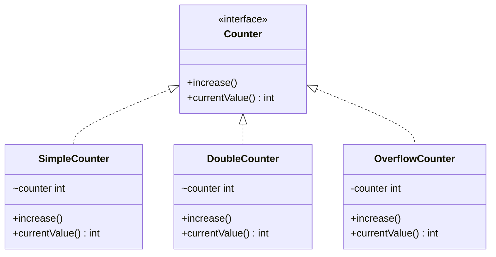
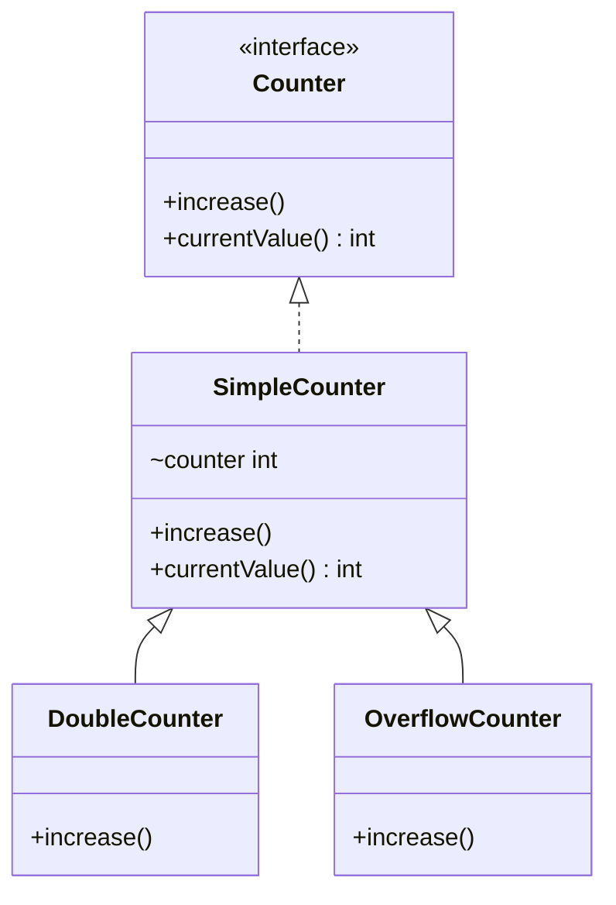
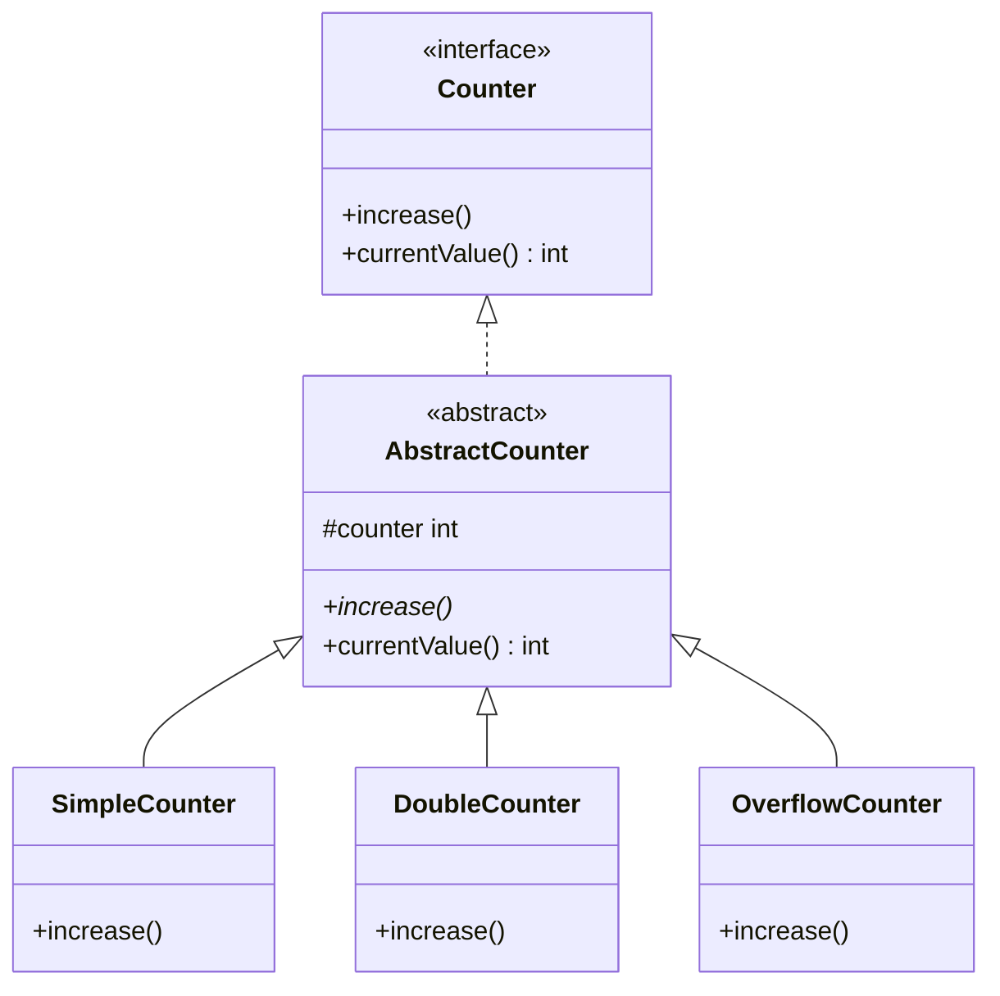

# Laboratorium 3 — Dziedziczenie i kompozycja

## Cel zajęć:
Celem laboratorium jest zapoznanie się z pojęciami dziedziczenia i
  kompozycji w programowaniu obiektowym

---

## Wprowadzenie

Jedną z korzyści, jakie daje programowanie obiektowe, jest możliwość
modelowania złożonych systemów, i wyrażania tych modeli w postaci
diagramów. Pewnym standardem tworzenia tego rodzaju diagramów jest
notacja UML (Universal Modeling Language). Jednym z podstawowych
rodzajów diagramów w programowaniu jest *diagram klas*, który pokazuje
relacje pomiędzy klasami i interfejsami.

Do tworzenia tego rodzaju diagramów można używać ołówka i kartki
papieru, kredy i tablicy albo dowolnych programów do rysowania.

Istnieją jednak narzędzia, takie jak **PlantUML** czy **MermaidJS**,
które pozwalają na generowanie eleganckich i czytelnych diagramów na
podstawie tekstowego (javopodobnego) opisu.

W szczególności notacja Mermaid jest o tyle interesująca, że można jej
używać w plikach markdown na githubie.

Oto przykładowy kod, który opisuje diagram odzwierciedlający
strukturę programu, którą opracowaliśmy na poprzednim laboratorium:

```
classDiagram
    class Counter {
        <<interface>>
        +increase()
        +currentValue() int
    }

    class SimpleCounter {
		~counter int
        +increase()
        +currentValue() int
    }

    class DoubleCounter {
		~counter int
        +increase()
        +currentValue() int
    }

    class OverflowCounter {
		~counter int
        +increase()
        +currentValue() int
    }

    Counter <|.. SimpleCounter
    Counter <|.. DoubleCounter
    Counter <|.. OverflowCounter

```

Na podstawie tego kodu Mermaid wygeneruje nam następujący diagram:



Edytor pozwalający na podglądanie diagramów Mermaid na bieżąco jest
dostępny pod adresem <https://mermaid.live>.

Dokumentację diagramów klas w Mermaid można zaś znaleźć pod adresem
<https://docs.mermaidchart.com/mermaid-oss/syntax/classDiagram.html>

## Pojęcie dziedziczenia

Podczas poprzednich zajęć stworzyliśmy 3 implementacje interfejsu
`Counter`:
- `SimpleCounter`
- `DoubleCounter`
- `OverflowCounter`

Ich implementacje wyglądają następująco:

```java
public class SimpleCounter implements Counter {
  int counter = 0;
  public void increase() {
    ++counter;
  }
  
  public int currentValue() {
    return counter;
  }
}

public class DoubleCounter implements Counter {
  int counter = 0;
  public void increase() {
    counter += 2;
  }
  
  public int currentValue() {
    return counter;
  }
}

public class OverflowCounter implements Counter {
  int counter = 0;
  public void increase() {
    if (counter < 9) {
      ++counter;
	else {
	  counter = 0;
	}
  }
  
  public int currentValue() {
    return counter;
  }
}

```

Spójrzmy teraz, co te klasy mają ze sobą wspólnego:
- wszystkie implementują interfejs `Counter`
- wszystkie definiują zmienną składową `counter` typu `int`
- wszystkie definiują metodę `currentValue()` zdefiniowaną dokładnie tak samo

Rodzi to pokusę wyodrębnienia tego, co wspólne, w jedno miejsce.
Do tego celu służy mechanizm *dziedziczenia*.

Możliwych jest wiele schematów dziedziczenia, ale my rozważymy dwa:

- pierwszy, w którym `DoubleCounter` i `OverflowCounter` dziedziczą
  po klasie `SimpleClass` (uznanej za modelową implementację licznika)
  

  
- drugi, w którym wprowadzimy *klasę abstrakcyjną* `AbstractCounter`,
  z których dziedzczyć będą wszystkie nasze klasy



### Zadanie 1: zaimplementuj pierwszy z powyższych schematów dziedziczenia.

Aby wyrazić w jężyku Java, że klasa `B` dziedziczy z klasy `A`, używamy
słowa kluczowego `extends`:

```
class B extends A {
    ...
}
```

Uruchom program `CounterApp` z poprzedniego laboratorium po
wprowadzeniu modyfikacji.

Kod źródłowy plików z implementacjami poszczególnych trzech klas wklej
do sprawozdania.

### Zadanie 2: zaimplementuj drugi schemat dziedziczenia (z klasą abstrakcyjną)

Aby wyrazić w języku Java, że klasa `A` jest klasą abstrakcyjną,
używamy słowa kluczowego `abstract`. Podobnie możemy użyć tego słowa
na oznaczenie tego, że dana metoda jest metodą abstrakcyjną (tj. że
dana klasa deklaruje, że taka metoda będzie dostępna dla jej
konkretnych specjalizacji, ale sama nie dostarcza jej
implementacji). Zatem aby zdefiniować `A` jako klasę abstrakcyjną z
publiczną metodą abstrakcyjną `m` (która nie pobiera żadnych
argumentów i nie zwraca żadnych wartości), napisalibyśmy:

```
abstract class A {
   ...
   abstract public void m();
   ...
}
```
Uruchom program `CounterApp` z poprzedniego laboratorium po
wprowadzeniu modyfikacji.

Kod źródłowy plików z implementacjami poszczególnych czterech klas
wklej do sprawozdania.

### Zadanie 3: odpowiedz (w sprawodzaniu) na pytania:

Jakie są zalety pierwszego rozwiązania projektowego, a jakie drugiego?
Które z rozwiązań bardziej Ci się podoba?

### Zadanie 4: Metody klas nadrzędnych

Zdefiniuj nową klasę, `BeepingCounter`, która będzie dziedziczyć po
klasie `SimpleCounter`, ale przy każdym wywołaniu metody `increase()`
oprócz zwiększenia licznika (co powinno się odbywac poprzez wywołanie
metody klasy nadrzędnej) dodatkowo wywołaj
`java.awt.Toolkit.getDefaultToolkit().beep()`

**Wskazówka**: aby z klasy dziedziczącej wywołać w Javie metodę klasy
nadrzędnej, należy użyć słowa kluczowego `super`. Przykładowo, jeżeli
chcielibyśmy wywołać metodę `m()` klasy nadrzędnej, musielibyśmy
napisać `super.m()`.

Dodaj instancję tej klasy do tablicy `counters` w klasie `CounterApp`
i zobacz, czy faktycznie wydaje dźwięk.

Kod nowej klasy wklej do sprawozdania.

### Zadanie 5: Odpowiedz na pytanie (w sprawozdaniu):

Gdybyśmy chcieli stworzyć odpowiedniki pozostałych klas
(tj. `DoubleCounter` oraz `OverflowCounter`) implementujących liczniki
zgodnie z metodą z zdadania 4, jakie nowe klasy musielibyśmy
zdefiniować?

Czym różniłyby się definicje tych klas od definicji klasy
`BeepingCounter`?

### Zadanie 6: Kompozycja i delegacja

Zdefiniuj nową klasę, `Beeping`, która:
- implementuje interfejs `Counter`
- jako argument konstruktora pobiera obiekt klasy `Counter`
  (i zapisuje go sobie w zmiennej składowej)
- implementacje metod `increase()` i `currentValue()` *oddelegowuje*
  do obiektu przekazanego w konstruktorze
- ale dodatkowo w metodzie `increase()` wywołuje
  `java.awt.Toolkit.getDefaultToolkit().beep()`

Następnie do inicjalizacji tablicy `counters` w klasie `CounterApp`
dodaj następujące elementy:

```
new Beeping(new SimpleCounter()),
new Beeping(new DoubleCounter()),
new Beeping(new OverflowCounter()),
```

i sprawdź czy program działa.

Definicję klasy `Beeping` dodaj do sprawozdania i odpowiedz na
następujące pytanie: porównując klasę `Beeping` z techniką rozszerzania
klas opartą na dziedziczeniu z zadań 4 i 5, która z tych technik
wymaga więcej pracy (i dlaczego)?

