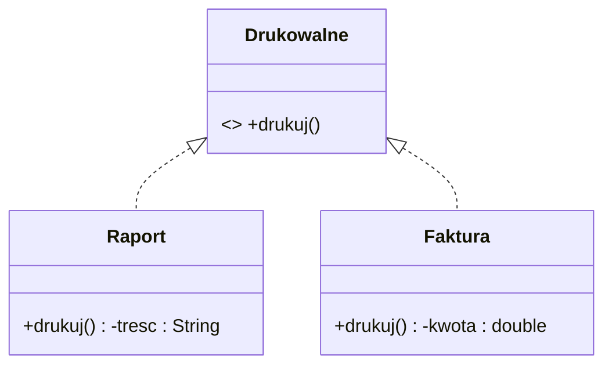
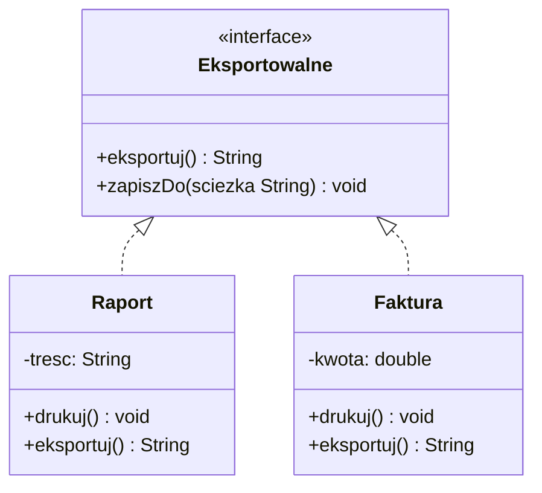
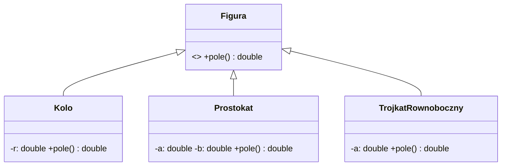
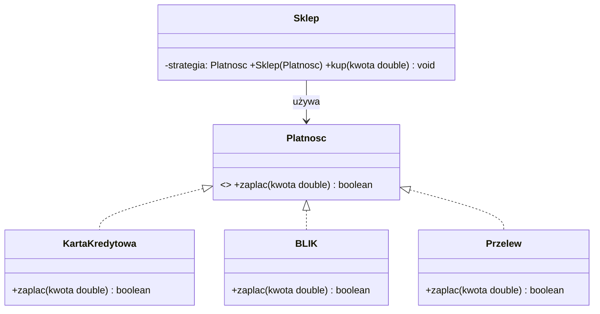
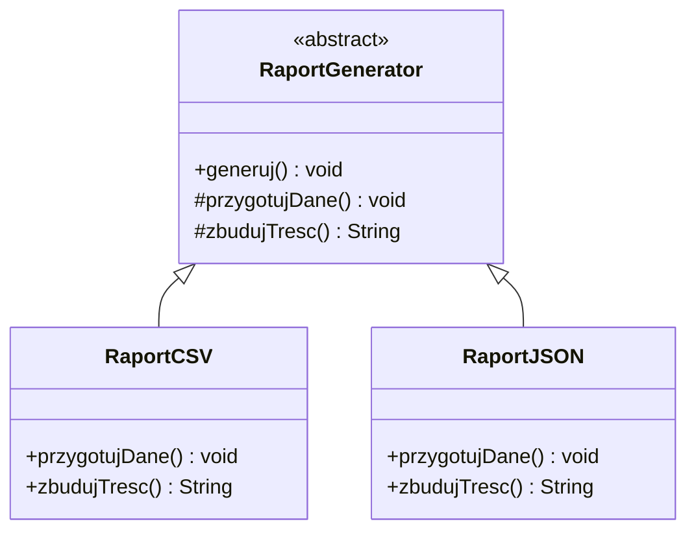
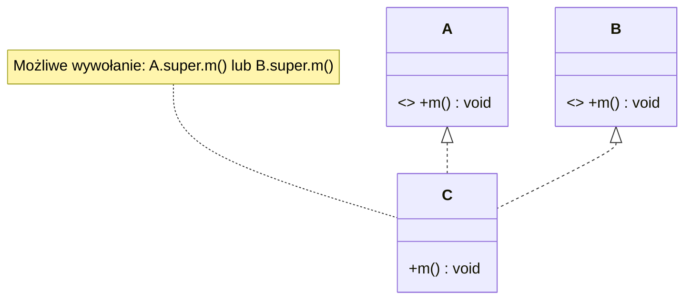
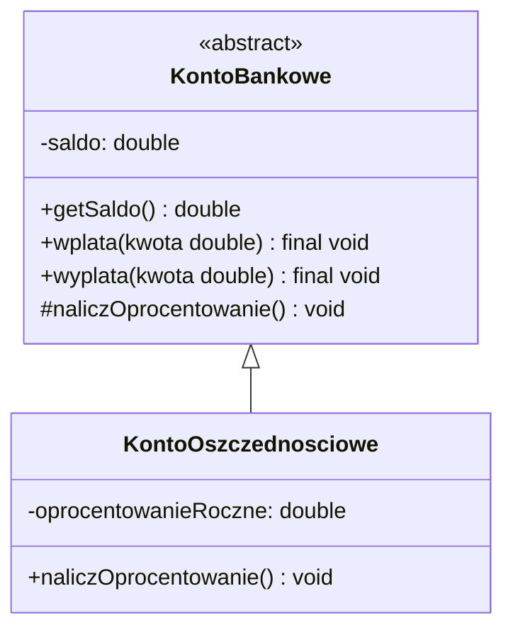
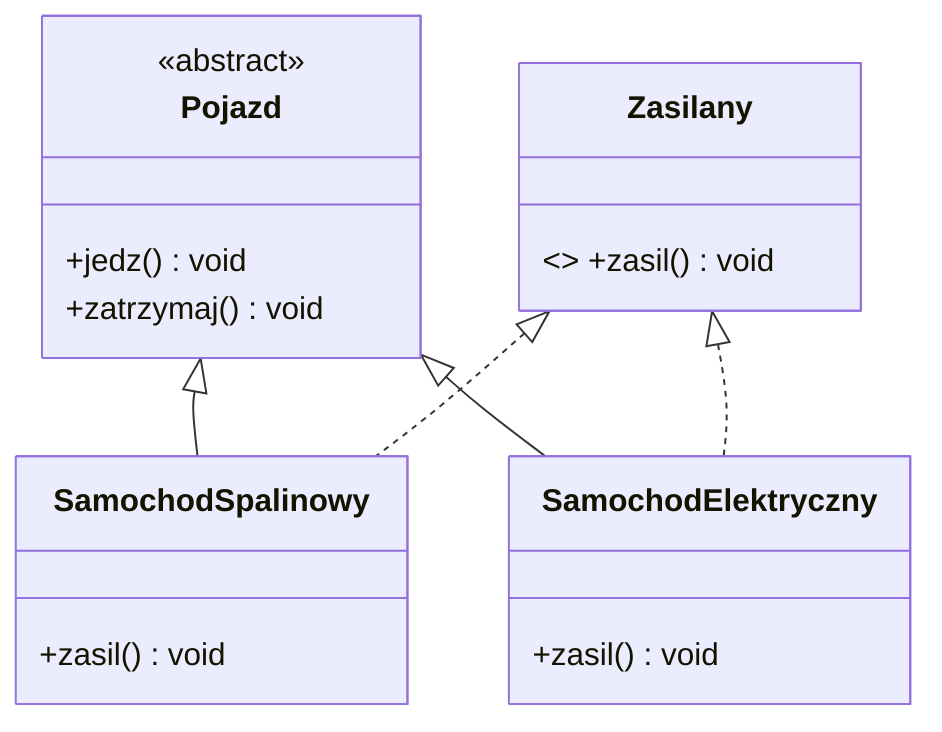

# Laboratorium 6 — Interfejsy i klasy abstrakcyjne (Java), grupa 1

W tym laboratorium ćwiczymy wyłącznie interfejsy i klasy abstrakcyjne. Zadania odnoszą się do materiału z pliku `08-interfejsy-i-klasy-abstrakcyjne.md` (bez zagadnień lambd/Stream API).

Zasady ogólne:
- Jedna klasa z `main` na zadanie (plik o sugerowanej nazwie); klasy pomocnicze w osobnych plikach.
- Bez użycia wyrażeń lambda ani Stream API w tym labie.
- Dbałość o czytelność, sensowne `toString()` oraz enkapsulację pól.

## Zadanie 1 — Interfejs `Drukowalne`

Stwórz interfejs `Drukowalne` z metodą `void drukuj()`.
- Zaimplementuj w klasach `Raport` i `Faktura` (przykładowe pola: `tresc`, `kwota`).
- Napisz funkcję, która przyjmuje listę `Drukowalne` i wywołuje `drukuj()` na każdym.

Diagram (Mermaid):

Kryteria akceptacji:
- Wypisane treści dla każdego elementu listy zgodnie z implementacją.

Sugerowane pliki: `Zad1_DrukowalneDemo.java`, `Raport.java`, `Faktura.java`, `Drukowalne.java`.

---

## Zadanie 2 — Interfejs z metodą `default`

Zdefiniuj interfejs `Eksportowalne` z metodą `String eksportuj()` i metodą domyślną `default void zapiszDo(String sciezka)`, która wypisuje połączony tekst: ścieżka + wynik `eksportuj()`.
- Zaimplementuj `Eksportowalne` w `Raport` i `Faktura` z poprzedniego zadania.

Diagram (Mermaid):

Kryteria akceptacji:
- Wywołanie `zapiszDo` działa bez konieczności powielania kodu w implementacjach.

Sugerowane pliki: `Eksportowalne.java` (plus klasy z Zadania 1).

---

## Zadanie 3 — Klasa abstrakcyjna `Figura`

Utwórz abstrakcyjną klasę `Figura` z metodą abstrakcyjną `double pole()` i opcjonalnie `double obwod()`.
- Zaimplementuj `Kolo`, `Prostokat` i `TrojkatRownoboczny`.
- Napisz metodę, która przyjmuje listę figur i zwraca sumę pól.

Diagram (Mermaid):

Kryteria akceptacji:
- Poprawne wartości pól i sumy pól dla przykładowej listy figur.

Sugerowane pliki: `Figura.java`, `Kolo.java`, `Prostokat.java`, `TrojkatRownoboczny.java`, `Zad3_FiguryDemo.java`.

---

## Zadanie 4 — Strategia płatności (interfejs)

Zaprojektuj interfejs `Platnosc` z metodą `boolean zaplac(double kwota)`.
- Zaimplementuj `KartaKredytowa`, `BLIK`, `Przelew` jako różne strategie.
- Klasa `Sklep` powinna przyjmować `Platnosc` w konstruktorze i wywoływać `zaplac` podczas zakupów.

Diagram (Mermaid):

Kryteria akceptacji:
- Możliwość podmiany strategii płatności bez zmian w `Sklep` (programowanie do interfejsu).

Sugerowane pliki: `Platnosc.java`, `KartaKredytowa.java`, `BLIK.java`, `Przelew.java`, `Sklep.java`, `Zad4_SklepDemo.java`.

---

## Zadanie 5 — Metoda szablonowa (Template Method)

Zaimplementuj klasę abstrakcyjną `RaportGenerator` z metodą szablonową `final void generuj()` i metodami abstrakcyjnymi `przygotujDane()` oraz `String zbudujTresc()`.
- Dodaj dwie implementacje: `RaportCSV` i `RaportJSON`.

Diagram (Mermaid):

Kryteria akceptacji:
- `generuj()` wywołuje kroki w ustalonej kolejności, a implementacje różnią się sposobem budowy treści.

Sugerowane pliki: `RaportGenerator.java`, `RaportCSV.java`, `RaportJSON.java`, `Zad5_RaportyDemo.java`.

---

## Zadanie 6 — Konflikt metod `default`

Utwórz interfejsy `A` i `B` z metodą `default void m()` o tej samej sygnaturze. Klasa `C` ma implementować oba, rozwiązać konflikt i dodać własne zachowanie.

Diagram (Mermaid):

Kryteria akceptacji:
- Nadpisanie metody w `C` i jawne wskazanie `A.super.m()` lub `B.super.m()` (albo własna implementacja).

Sugerowane pliki: `A.java`, `B.java`, `C.java`, `Zad6_DefaultConflictDemo.java`.

---

## Zadanie 7 — `final` i częściowa implementacja w abstrakcji

Utwórz klasę abstrakcyjną `KontoBankowe` z prywatnym stanem `saldo`, metodami `final` do odczytu i aktualizacji oraz metodą abstrakcyjną `naliczOprocentowanie()`.
- Zaimplementuj `KontoOszczednosciowe` i pokaż działanie metody `naliczOprocentowanie()`.

Diagram (Mermaid):

Kryteria akceptacji:
- Logika wspólna zamknięta w abstrakcji, brak możliwości nadpisania metod szablonowych oznaczonych jako `final`.

Sugerowane pliki: `KontoBankowe.java`, `KontoOszczednosciowe.java`, `Zad7_KontaDemo.java`.

---

## Zadanie 8 — Hybryda: klasa abstrakcyjna + interfejs

Zbuduj abstrakcyjną klasę `Pojazd` z częściową implementacją (`jedz`, `zatrzymaj`).
- Zdefiniuj interfejs `Zasilany` (np. `tankuj()` lub `laduj()`).
- Zaimplementuj `SamochodSpalinowy` oraz `SamochodElektryczny`, które dziedziczą po `Pojazd` i implementują `Zasilany`.

Diagram (Mermaid):

Kryteria akceptacji:
- Polimorficzne użycie `Pojazd` i niezależna realizacja zasilania przez interfejs `Zasilany`.

Sugerowane pliki: `Pojazd.java`, `Zasilany.java`, `SamochodSpalinowy.java`, `SamochodElektryczny.java`, `Zad8_PojazdyDemo.java`.

---

Uwagi organizacyjne:
- Jedna klasa „zadaniowa” z `main` na zadanie (np. `Zad1_DrukowalneDemo.java`).  
- Klasy pomocnicze w osobnych plikach (bez deklaracji pakietów), aby ułatwić wielokrotne użycie.
- Komentarze w kodzie mile widziane — wyjaśniaj kroki istotne dla zrozumienia mechanizmów interfejsów i klas abstrakcyjnych.
