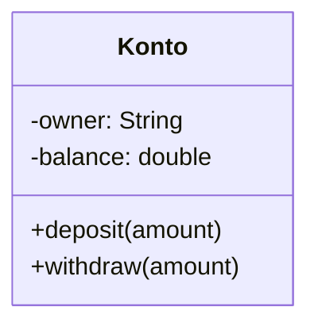
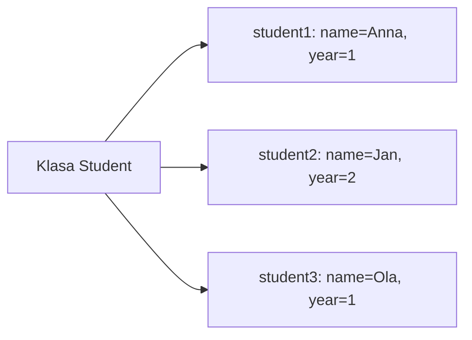

# 6. Pola klas i stan obiektu

> To laboratorium odpowiada wykładowi `06-pola-klas-i-stan-obiektu.md` i rozwija temat rozpoczęty w laboratorium 3.

## Teoria

### Czym jest stan obiektu?
Stan obiektu to zbiór wartości przechowywanych w jego polach w danym momencie działania programu. Dwa obiekty tej samej klasy mogą mieć ten sam zestaw metod, ale zupełnie inny stan.



Jeżeli utworzymy dwa obiekty `Konto`, każdy będzie miał własny `owner` i własne `balance`.

### Rodzaje pól

#### Pola instancyjne
- należą do konkretnego obiektu,
- każdy obiekt ma własną kopię,
- służą do przechowywania stanu.

#### Pola statyczne
- należą do klasy,
- są współdzielone przez wszystkie obiekty,
- nadają się do liczników, stałych wspólnych lub konfiguracji klasowej.

#### Pola `final`
- mogą być przypisane tylko raz,
- pomagają budować obiekty niezmienne i bezpieczniejsze w użyciu.

### Wartości domyślne pól
Jeśli pole klasy nie zostanie jawnie zainicjalizowane, Java nada mu wartość domyślną:

| Typ pola | Wartość domyślna |
|---|---|
| `int`, `long`, `short`, `byte` | `0` |
| `double`, `float` | `0.0` |
| `boolean` | `false` |
| `char` | `'\0'` |
| typ referencyjny | `null` |

Uwaga: zmienne lokalne w metodach **nie** dostają wartości domyślnych automatycznie.

### Pole klasy a zmienna lokalna

| Cecha | Pole klasy | Zmienna lokalna |
|---|---|---|
| Gdzie istnieje? | w obiekcie lub klasie | wewnątrz metody |
| Czas życia | tak długo, jak żyje obiekt | tylko podczas wykonania metody |
| Wartość domyślna | tak | nie |
| Dostęp | przez metody klasy | tylko w danym bloku |

### Dobra praktyka
Pola powinny opisywać **trwały stan obiektu**, a nie chwilowe wartości pomocnicze. Jeśli coś istnieje tylko podczas jednego obliczenia, zwykle powinno być zmienną lokalną.

## Przykłady

### Przykład 1 - dwa obiekty, dwa różne stany

```java
public class Book {
    private String title;
    private boolean borrowed;

    public Book(String title) {
        this.title = title;
        this.borrowed = false;
    }

    public void borrow() {
        borrowed = true;
    }

    public void printState() {
        System.out.println(title + " | borrowed=" + borrowed);
    }

    public static void main(String[] args) {
        Book b1 = new Book("Clean Code");
        Book b2 = new Book("Effective Java");

        b1.borrow();

        b1.printState();
        b2.printState();
    }
}
```

### Przykład 2 - pole statyczne jako licznik obiektów

```java
public class Student {
    private String name;
    private static int counter = 0;

    public Student(String name) {
        this.name = name;
        counter++;
    }

    public static int getCounter() {
        return counter;
    }

    public static void main(String[] args) {
        new Student("Anna");
        new Student("Jan");
        new Student("Ola");

        System.out.println("Liczba studentów: " + Student.getCounter());
    }
}
```

### Przykład 3 - pole `final`

```java
public class Country {
    private final String code;
    private String name;

    public Country(String code, String name) {
        this.code = code;
        this.name = name;
    }

    public void rename(String newName) {
        this.name = newName;
    }

    @Override
    public String toString() {
        return code + " -> " + name;
    }
}
```

### Przykład 4 - pułapka współdzielenia stanu przez pole statyczne

```java
public class BankFeeCalculator {
    private static double feeRate = 0.02;

    public static void setFeeRate(double feeRate) {
        BankFeeCalculator.feeRate = feeRate;
    }

    public static double calculate(double amount) {
        return amount * feeRate;
    }
}
```

Jeśli jedna część programu zmieni `feeRate`, zmiana wpłynie na wszystkich użytkowników klasy. To bywa zaletą albo źródłem błędów - zależnie od projektu.

## Diagram: obiekty tej samej klasy, różny stan



## Zadania laboratoryjne

1. Napisz klasę `Product` z polami:
   - `name`,
   - `price`,
   - `category`,
   - `available`.
   Dodaj metodę `printInfo()`.
2. Dodaj do klasy `Product` pole statyczne `productCount`, które zlicza utworzone produkty.
3. Napisz klasę `LibraryMember` z polem `final memberId`.
4. Pokaż różnicę między polem klasy a zmienną lokalną na przykładzie licznika wywołań metody.
5. Zbuduj klasę `ScoreBoard`, w której:
   - pola instancyjne przechowują wynik jednego meczu,
   - pole statyczne przechowuje liczbę rozegranych meczów.

## Rozszerzenie

Przepisz jedną z klas z laboratorium 3 tak, aby:
- pola były prywatne,
- stan był modyfikowany tylko przez metody,
- pola, które nie powinny się zmieniać, zostały oznaczone jako `final`.

## Podsumowanie

Po tym laboratorium student powinien:
- rozumieć, że pola reprezentują stan obiektu,
- odróżniać pola instancyjne od statycznych,
- wiedzieć, kiedy używać `final`,
- rozumieć konsekwencje współdzielenia danych na poziomie klasy.
