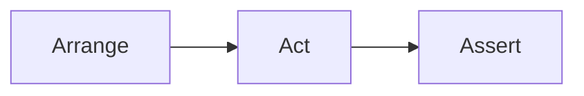

# 12. Testowanie kodu

> To laboratorium odpowiada wykładowi `12-testowanie-kodu.md`. Jego celem jest pokazanie, że dobry kod obiektowy powinien być nie tylko poprawny, ale też testowalny.

## Teoria

### Po co testujemy?
Testy pomagają:
- szybciej wykrywać błędy,
- bezpiecznie rozwijać kod,
- dokumentować oczekiwane zachowanie programu,
- ograniczać regresje po zmianach.

### Rodzaje testów

#### Testy manualne
Programista uruchamia program i sprawdza wynik "na oko".

#### Testy automatyczne
Kod sam weryfikuje, czy wynik jest zgodny z oczekiwaniem.

#### Testy jednostkowe
Skupiają się na małej jednostce: zwykle pojedynczej metodzie lub klasie.

### Cechy dobrego testu
- jest powtarzalny,
- jest mały i czytelny,
- sprawdza jedną rzecz,
- daje jasny komunikat przy błędzie.

### Schemat AAA



- **Arrange** - przygotowanie danych,
- **Act** - wykonanie testowanej operacji,
- **Assert** - sprawdzenie wyniku.

## Testy bez frameworka

Na początku można pisać proste testy samodzielnie.

```java
public class Calculator {
    public int add(int a, int b) {
        return a + b;
    }

    public static void main(String[] args) {
        Calculator c = new Calculator();

        int result = c.add(2, 3);
        if (result != 5) {
            System.out.println("BLAD: oczekiwano 5, otrzymano " + result);
        } else {
            System.out.println("OK");
        }
    }
}
```

To działa, ale szybko staje się niewygodne przy większej liczbie przypadków.

## Przykład testowalnej klasy

```java
public class DiscountCalculator {
    public double applyStudentDiscount(double price) {
        if (price < 0) {
            throw new IllegalArgumentException("Cena nie może być ujemna");
        }
        return price * 0.9;
    }
}
```

Klasa jest testowalna, bo:
- metoda ma prosty kontrakt,
- nie czyta z konsoli,
- nie zapisuje do pliku,
- nie miesza logiki z prezentacją.

## Przykład z JUnit 5

```java
import static org.junit.jupiter.api.Assertions.*;
import org.junit.jupiter.api.Test;

class DiscountCalculatorTest {

    @Test
    void shouldApplyStudentDiscount() {
        DiscountCalculator calculator = new DiscountCalculator();

        double result = calculator.applyStudentDiscount(100.0);

        assertEquals(90.0, result);
    }

    @Test
    void shouldThrowForNegativePrice() {
        DiscountCalculator calculator = new DiscountCalculator();

        assertThrows(IllegalArgumentException.class,
                () -> calculator.applyStudentDiscount(-10.0));
    }
}
```

### Najczęstsze asercje
- `assertEquals(expected, actual)`
- `assertTrue(condition)`
- `assertFalse(condition)`
- `assertNotNull(object)`
- `assertThrows(...)`

## Given - When - Then

To alternatywny sposób opisu testu:

- **Given** - mamy dane wejściowe,
- **When** - wykonujemy akcję,
- **Then** - oczekujemy konkretnego rezultatu.

```java
@Test
void shouldReturnAreaOfRectangle() {
    // Given
    Rectangle rectangle = new Rectangle(4, 5);

    // When
    int area = rectangle.area();

    // Then
    assertEquals(20, area);
}
```

## Co utrudnia testowanie?

- logika biznesowa w `main`,
- zależność od `Scanner`,
- twardo zakodowane odczyty plików,
- mieszanie obliczeń z `System.out.println`,
- klasy robiące zbyt wiele naraz.

## Przykład: lepszy i gorszy projekt

### Gorszy

```java
public class TemperatureApp {
    public static void main(String[] args) {
        Scanner scanner = new Scanner(System.in);
        System.out.println("Podaj temperaturę:");
        double c = scanner.nextDouble();
        System.out.println(c * 9 / 5 + 32);
    }
}
```

Trudno testować, bo logika jest zmieszana z wejściem i wyjściem.

### Lepszy

```java
public class TemperatureConverter {
    public double celsiusToFahrenheit(double celsius) {
        return celsius * 9 / 5 + 32;
    }
}
```

Teraz test jest prosty.

## Zadania laboratoryjne

1. Napisz klasę `MathUtils` z metodami:
   - `square(int x)`,
   - `isEven(int x)`,
   - `max(int a, int b)`.
   Dla każdej metody przygotuj minimum 3 przypadki testowe.
2. Napisz klasę `PasswordValidator`, która:
   - odrzuca hasła krótsze niż 8 znaków,
   - wymaga przynajmniej jednej cyfry.
   Przygotuj testy poprawnych i błędnych danych.
3. Napisz klasę `BankAccount` z metodą `withdraw(double amount)` i przetestuj:
   - poprawną wypłatę,
   - próbę wypłaty kwoty większej niż saldo,
   - próbę wypłaty kwoty ujemnej.
4. Weź jedną klasę z wcześniejszych laboratoriów i przepisz ją tak, aby była łatwiejsza do testowania.

## Mini-checklista

- Czy testujesz zachowanie, a nie szczegóły implementacji?
- Czy test jest mały i czytelny?
- Czy wiadomo, co oznacza porażka testu?
- Czy logika jest oddzielona od wejścia i wyjścia?
- Czy klasa ma jedną odpowiedzialność?

## Podsumowanie

Po tym laboratorium student powinien:
- umieć zaprojektować prosty test jednostkowy,
- rozumieć związek między projektem klasy a testowalnością,
- znać podstawowe asercje i strukturę testu,
- widzieć, że testowanie nie jest dodatkiem po fakcie, tylko częścią projektowania kodu.
