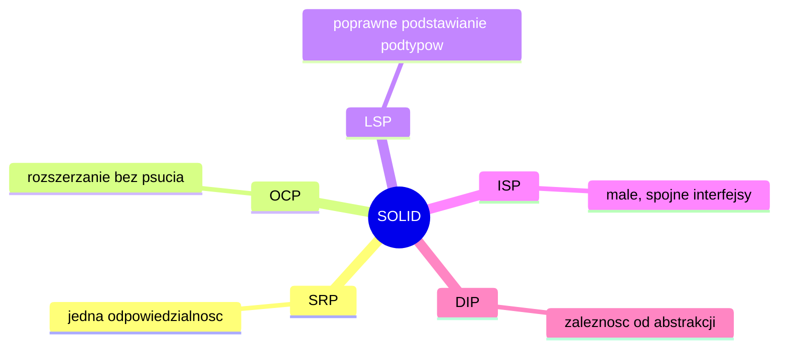

# 13. SOLID - zasady projektowania obiektowego

> To laboratorium odpowiada wykładowi `13-solid-zasady-projektowania-obiektowego.md`. Celem jest przełożenie zasad SOLID na proste ćwiczenia refaktoryzacyjne w Javie.

## Teoria

### Po co studentowi SOLID?
Na wcześniejszych laboratoriach uczysz się pisać klasy. Tutaj uczysz się pisać je tak, żeby:
- łatwiej je rozwijać,
- prościej je testować,
- nie psuły się przy każdej zmianie.

SOLID to zestaw pięciu zasad:
- **S** - Single Responsibility Principle,
- **O** - Open/Closed Principle,
- **L** - Liskov Substitution Principle,
- **I** - Interface Segregation Principle,
- **D** - Dependency Inversion Principle.



## 1. SRP - jedna odpowiedzialność

### Zły przykład

```java
public class InvoiceService {
    public double calculateTotal() { return 100.0; }
    public void saveToDatabase() { }
    public void sendEmail() { }
}
```

Jedna klasa:
- liczy,
- zapisuje,
- wysyła wiadomość.

### Lepszy kierunek

```java
public class InvoiceCalculator {
    public double calculateTotal() { return 100.0; }
}

public class InvoiceRepository {
    public void save() { }
}

public class InvoiceMailer {
    public void sendEmail() { }
}
```

## 2. OCP - otwarte na rozszerzanie

### Zły przykład

```java
public class PaymentService {
    public void pay(String type) {
        if ("CARD".equals(type)) {
            System.out.println("Platnosc karta");
        } else if ("BLIK".equals(type)) {
            System.out.println("Platnosc BLIK");
        }
    }
}
```

Każda nowa metoda płatności wymaga modyfikowania klasy.

### Lepszy kierunek

```java
interface PaymentMethod {
    void pay();
}

class CardPayment implements PaymentMethod {
    public void pay() {
        System.out.println("Platnosc karta");
    }
}

class BlikPayment implements PaymentMethod {
    public void pay() {
        System.out.println("Platnosc BLIK");
    }
}
```

## 3. LSP - poprawne podstawianie

Jeśli obiekt klasy pochodnej nie może bezpiecznie zastąpić klasy bazowej, hierarchia jest zła.

### Klasyczny przykład problemu

```java
class Rectangle {
    void setWidth(int width) { }
    void setHeight(int height) { }
}

class Square extends Rectangle {
    @Override
    void setWidth(int width) { }
}
```

Jeśli klient oczekuje zwykłego prostokąta, `Square` może zepsuć założenia.

Wniosek:
- nie każde "wydaje się podobne" powinno dziedziczyć,
- czasem lepszy jest wspólny interfejs `Shape`.

## 4. ISP - małe interfejsy

### Zły przykład

```java
interface Machine {
    void print();
    void scan();
    void fax();
}
```

Drukarka bez skanera będzie zmuszana do implementacji niepotrzebnych metod.

### Lepszy kierunek

```java
interface Printable {
    void print();
}

interface Scannable {
    void scan();
}

interface Faxable {
    void fax();
}
```

## 5. DIP - zależność od abstrakcji

### Zły przykład

```java
class FileLogger {
    void log(String text) { }
}

class UserService {
    private FileLogger logger = new FileLogger();
}
```

### Lepszy kierunek

```java
interface Logger {
    void log(String text);
}

class FileLogger implements Logger {
    public void log(String text) { }
}

class UserService {
    private final Logger logger;

    UserService(Logger logger) {
        this.logger = logger;
    }
}
```

## Ćwiczenia laboratoryjne

### Zadanie 1 - SRP
Masz klasę:

```java
class UserManager {
    void createUser() { }
    void sendWelcomeEmail() { }
    void saveToFile() { }
}
```

Rozbij ją na mniejsze klasy zgodnie z SRP.

### Zadanie 2 - OCP
Przepisz system naliczania rabatów oparty na `if/else`, tak aby używał interfejsu `DiscountPolicy`.

### Zadanie 3 - LSP
Przeanalizuj hierarchię `Bird -> Penguin`. Odpowiedz:
- czy `Penguin` powinien dziedziczyć po `Bird`, jeśli klasa bazowa zakłada możliwość latania?
- jak przebudować model?

### Zadanie 4 - ISP
Podziel interfejs:

```java
interface SmartDevice {
    void print();
    void scan();
    void playMusic();
}
```

na mniejsze kontrakty.

### Zadanie 5 - DIP
Przepisz klasę `OrderService`, aby nie zależała bezpośrednio od `MySqlOrderRepository`, tylko od interfejsu `OrderRepository`.

## Zadanie projektowe

Zbuduj mały system obsługi zamówienia:
- `OrderService`,
- `OrderRepository`,
- `PaymentMethod`,
- `NotificationService`.

Następnie oceń:
- gdzie zastosowano SRP,
- gdzie jest OCP,
- czy zależności prowadzą przez abstrakcje,
- czy któryś interfejs nie jest zbyt szeroki.

## Dodatkowe wskazówki

- Nie używaj SOLID mechanicznie.
- Nie twórz interfejsu tylko dlatego, że "tak trzeba".
- Najpierw prostota, potem refaktoryzacja tam, gdzie kod zaczyna się robić sztywny.

## Podsumowanie

Po tym laboratorium student powinien:
- rozpoznawać podstawowe naruszenia SOLID,
- umieć zaproponować prostą refaktoryzację,
- rozumieć, że dobre projektowanie jest naturalnym rozwinięciem klas, interfejsów, dziedziczenia i testowania.
