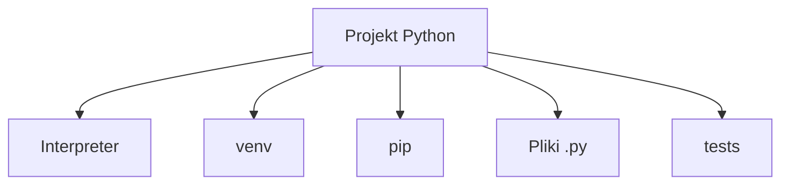

# 1. Środowisko języka Python

## Teoria

### Czym jest środowisko pracy w Pythonie?
W Pythonie programista pracuje bezpośrednio z interpreterem, modułami i menedżerem pakietów. Typowy zestaw narzędzi obejmuje:
- interpreter `python`,
- menedżer pakietów `pip`,
- środowisko wirtualne `venv`,
- edytor lub IDE,
- narzędzia pomocnicze, np. `pytest`, `ruff`, `black`.

### Interpreter i uruchamianie kodu
Najprostszy program:

```python
print("Hello, Python!")
```

Uruchomienie:

```bash
python hello.py
```

Python nie wymaga obowiązkowej funkcji `main`, ale w praktyce stosuje się idiom:

```python
def main() -> None:
    print("Uruchamiam program")


if __name__ == "__main__":
    main()
```

### Środowiska wirtualne
Każdy projekt powinien mieć własne środowisko wirtualne, aby zależności nie mieszały się między projektami.

```bash
python -m venv .venv
source .venv/bin/activate
```

Na Windows:

```powershell
.venv\Scripts\activate
```

### `pip` i instalowanie pakietów

```bash
pip install pytest
pip freeze > requirements.txt
pip install -r requirements.txt
```

### Struktura prostego projektu

```text
project/
    .venv/
    app.py
    requirements.txt
    tests/
```



## Przykłady

### Przykład 1 - sprawdzenie wersji interpretera

```bash
python --version
pip --version
```

### Przykład 2 - prosty skrypt

```python
name = "Anna"
print(f"Cześć, {name}!")
```

### Przykład 3 - idiom `__main__`

```python
def add(a: int, b: int) -> int:
    return a + b


def main() -> None:
    print(add(2, 3))


if __name__ == "__main__":
    main()
```

### Przykład 4 - instalowanie i użycie zewnętrznej biblioteki

```python
from rich import print

print("[bold green]Python project[/bold green]")
```

## Zadania

1. Sprawdź wersję Pythona i `pip` na swoim komputerze.
2. Utwórz środowisko `.venv` i aktywuj je.
3. Napisz plik `app.py`, który wypisze Twoje imię i aktualny kierunek studiów.
4. Dodaj funkcję `main()` i uruchamiaj kod tylko przez blok `if __name__ == "__main__":`.
5. Zainstaluj `pytest` do lokalnego środowiska projektu.

## Checklista

- Czy rozumiesz rolę interpretera?
- Czy potrafisz utworzyć `venv`?
- Czy umiesz zainstalować pakiet przez `pip`?
- Czy rozumiesz różnicę między uruchomieniem pliku a importem modułu?
