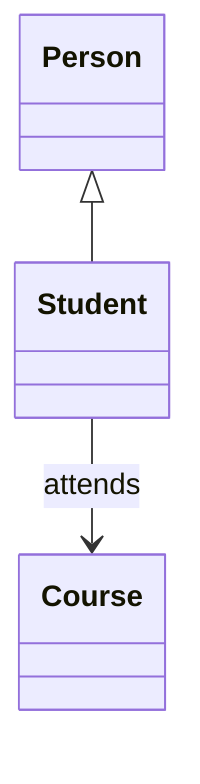

# 2. Paradygmaty obiektowości

## Teoria

### Czym jest OOP w Pythonie?
Programowanie obiektowe polega na organizowaniu programu wokół obiektów łączących stan i zachowanie. Python jest językiem wieloparadygmatowym, więc OOP jest jednym z możliwych stylów, a nie jedyną słuszną drogą.

### Cztery filary OOP
1. **Abstrakcja** - pokazujemy tylko istotne cechy obiektu.
2. **Enkapsulacja** - ukrywamy szczegóły działania za interfejsem klasy.
3. **Dziedziczenie** - budujemy klasy na bazie innych klas.
4. **Polimorfizm** - różne obiekty mogą reagować na to samo wywołanie metodą na swój sposób.

### Python a obiektowość
W Pythonie obiektami są nie tylko instancje własnych klas, ale też liczby, napisy, listy i funkcje.

### Relacje między obiektami
- `is-a` - dziedziczenie,
- `has-a` - kompozycja,
- `uses-a` - chwilowa zależność.



## Przykłady

### Przykład 1 - prosta klasa i obiekt

```python
class Car:
    def __init__(self, brand: str, model: str) -> None:
        self.brand = brand
        self.model = model

    def describe(self) -> None:
        print(f"{self.brand} {self.model}")


car = Car("Toyota", "Corolla")
car.describe()
```

### Przykład 2 - abstrakcja

```python
class BankAccount:
    def __init__(self, owner: str, balance: float) -> None:
        self.owner = owner
        self._balance = balance

    def deposit(self, amount: float) -> None:
        if amount > 0:
            self._balance += amount

    def get_balance(self) -> float:
        return self._balance
```

### Przykład 3 - kompozycja

```python
class Engine:
    def start(self) -> None:
        print("Silnik uruchomiony")


class Car:
    def __init__(self) -> None:
        self.engine = Engine()

    def start(self) -> None:
        self.engine.start()
```

### Przykład 4 - duck typing

```python
class Dog:
    def speak(self) -> None:
        print("Hau")


class Robot:
    def speak(self) -> None:
        print("Beep")


def make_sound(entity) -> None:
    entity.speak()
```

## Zadania

1. Napisz klasę `Book` z metodą `describe()`.
2. Zaimplementuj klasę `Student`, która przechowuje imię i numer indeksu.
3. Zbuduj relację `has-a`: klasa `Computer` ma obiekt `Processor`.
4. Napisz funkcję, która przyjmuje obiekt z metodą `speak()` i ją wywołuje.
5. Zastanów się, które elementy Twoich klas są przykładem abstrakcji, a które enkapsulacji.

## Checklista

- Czy rozumiesz różnicę między klasą a obiektem?
- Czy umiesz wskazać filary OOP?
- Czy rozpoznajesz relacje `is-a` i `has-a`?
- Czy rozumiesz ideę duck typing?
