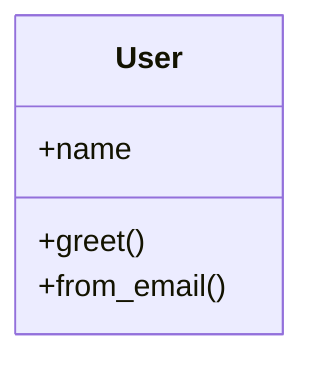

# 3. Klasy, obiekty i punkt wejścia programu

## Teoria

### Definicja klasy
Klasa w Pythonie opisuje strukturę i zachowanie obiektów.

```python
class User:
    pass
```

### `self`
`self` oznacza bieżącą instancję obiektu i jest przekazywane jako pierwszy argument metod instancji.

### Metody instancji, klasowe i statyczne
- metoda instancji - działa na obiekcie,
- `@classmethod` - działa na klasie,
- `@staticmethod` - logicznie związana z klasą, ale nie potrzebuje ani instancji, ani klasy.

### Punkt wejścia programu

```python
if __name__ == "__main__":
    ...
```

To idiom pozwalający oddzielić importowanie modułu od uruchamiania go jako programu.

## Przykłady

### Przykład 1 - klasa z metodą instancji

```python
class User:
    def __init__(self, name: str) -> None:
        self.name = name

    def greet(self) -> None:
        print(f"Cześć, jestem {self.name}")
```

### Przykład 2 - metoda klasowa

```python
class User:
    def __init__(self, name: str) -> None:
        self.name = name

    @classmethod
    def from_email(cls, email: str) -> "User":
        return cls(email.split("@")[0])
```

### Przykład 3 - metoda statyczna

```python
class MathUtils:
    @staticmethod
    def add(a: int, b: int) -> int:
        return a + b
```

### Przykład 4 - `__main__`

```python
def main() -> None:
    user = User("Anna")
    user.greet()


if __name__ == "__main__":
    main()
```

## Diagram



## Zadania

1. Napisz klasę `Movie` z metodą `describe()`.
2. Dodaj do klasy `Movie` metodę klasową `from_dict`.
3. Napisz klasę `TemperatureConverter` z metodą statyczną `celsius_to_fahrenheit`.
4. Utwórz funkcję `main()` i użyj w niej kilku obiektów swoich klas.
5. Wyjaśnij, kiedy lepiej użyć `@classmethod`, a kiedy `@staticmethod`.

## Checklista

- Czy rozumiesz rolę `self`?
- Czy umiesz napisać metodę klasową?
- Czy odróżniasz `@classmethod` od `@staticmethod`?
- Czy umiesz poprawnie użyć bloku `if __name__ == "__main__":`?
