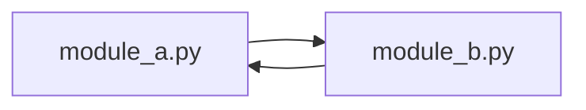

# 4. Modułowość, pakiety i importy

## Teoria

### Moduł i pakiet
- **moduł** - pojedynczy plik `.py`,
- **pakiet** - katalog z modułami, zwykle z `__init__.py`.

### Importy
Najczęstsze formy importu:

```python
import math
from math import sqrt
import statistics as stats
```

### `__init__.py`
Może:
- oznaczać katalog jako pakiet,
- eksportować wybrane nazwy,
- inicjalizować pakiet.

### Importy absolutne i względne

```python
from shop.product import Product
from .product import Product
```

### Cykliczne importy
Jeśli dwa moduły importują się nawzajem, projekt zwykle wymaga przebudowy.



## Przykłady

### Przykład 1 - import modułu standardowego

```python
import math

print(math.sqrt(16))
```

### Przykład 2 - import konkretnej nazwy

```python
from math import pi

print(pi)
```

### Przykład 3 - alias

```python
import statistics as stats

print(stats.mean([1, 2, 3]))
```

### Przykład 4 - prosty pakiet

```text
shop/
    __init__.py
    product.py
    order.py
```

`product.py`

```python
class Product:
    def __init__(self, name: str, price: float) -> None:
        self.name = name
        self.price = price
```

`order.py`

```python
from .product import Product


class Order:
    def __init__(self, product: Product) -> None:
        self.product = product
```

## Zadania

1. Utwórz pakiet `school` z modułami `student.py` i `course.py`.
2. W `student.py` utwórz klasę `Student`.
3. W `course.py` zaimportuj `Student` i utwórz klasę `Course`.
4. Dodaj `__init__.py` eksportujący obie klasy.
5. Spróbuj świadomie doprowadzić do cyklicznego importu i opisz, co się dzieje.

## Checklista

- Czy rozumiesz różnicę między modułem i pakietem?
- Czy umiesz użyć kilku form importu?
- Czy wiesz, po co jest `__init__.py`?
- Czy rozumiesz problem cyklicznych importów?
