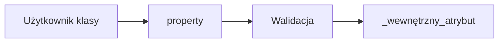

# 5. Enkapsulacja, atrybuty i `property`

## Teoria

### Enkapsulacja w Pythonie
Python nie ma formalnych modyfikatorów dostępu jak Java. Zamiast tego używa:
- publicznych atrybutów,
- konwencji `_name`,
- name mangling przez `__name`,
- właściwości `property`.

### `_attr` i `__attr`
- `_attr` - sygnał: "użytek wewnętrzny",
- `__attr` - name mangling, trudniejszy dostęp z zewnątrz.

### `property`
Pozwala kontrolować odczyt i zapis atrybutu:

```python
class BankAccount:
    def __init__(self, balance: float) -> None:
        self._balance = balance

    @property
    def balance(self) -> float:
        return self._balance

    @balance.setter
    def balance(self, value: float) -> None:
        if value < 0:
            raise ValueError("Saldo nie może być ujemne")
        self._balance = value
```

## Przykłady

### Przykład 1 - atrybut publiczny

```python
class User:
    def __init__(self, name: str) -> None:
        self.name = name
```

### Przykład 2 - konwencja `_name`

```python
class User:
    def __init__(self, name: str) -> None:
        self._name = name
```

### Przykład 3 - name mangling

```python
class Secret:
    def __init__(self, token: str) -> None:
        self.__token = token
```

### Przykład 4 - `property` tylko do odczytu

```python
class Circle:
    def __init__(self, radius: float) -> None:
        self._radius = radius

    @property
    def area(self) -> float:
        return 3.14 * self._radius * self._radius
```

## Diagram



## Zadania

1. Napisz klasę `Person` z atrybutem `_age`.
2. Udostępnij `age` przez `@property` i dodaj walidację.
3. Dodaj read-only property `is_adult`.
4. Napisz klasę z atrybutem `__secret_key` i sprawdź, jak działa name mangling.
5. Porównaj styl getter/setter z `property` i opisz różnicę.

## Checklista

- Czy rozumiesz rolę `_attr`?
- Czy umiesz użyć `property`?
- Czy potrafisz dodać walidację do settera?
- Czy wiesz, czym różni się `__attr` od `_attr`?
