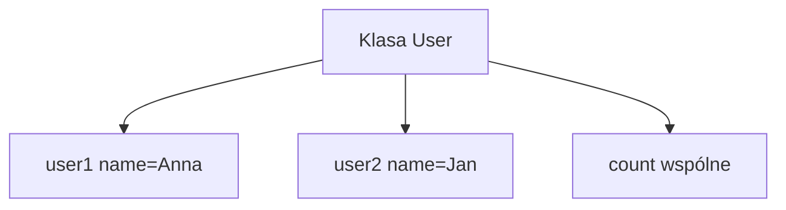

# 6. Atrybuty klasy i stan obiektu

## Teoria

### Atrybut instancji
Przechowuje stan konkretnego obiektu:

```python
class Student:
    def __init__(self, name: str) -> None:
        self.name = name
```

### Atrybut klasy
Jest współdzielony przez wszystkie instancje:

```python
class Student:
    school = "UMG"
```

### Pułapka mutowalnych atrybutów klasowych

```python
class Team:
    members = []
```

To oznacza jedną wspólną listę dla wszystkich obiektów.

## Przykłady

### Przykład 1 - stan dwóch obiektów

```python
class Book:
    def __init__(self, title: str) -> None:
        self.title = title
        self.borrowed = False

    def borrow(self) -> None:
        self.borrowed = True
```

### Przykład 2 - licznik obiektów

```python
class User:
    count = 0

    def __init__(self, name: str) -> None:
        self.name = name
        User.count += 1
```

### Przykład 3 - błędny mutowalny atrybut klasy

```python
class Basket:
    items = []
```

### Przykład 4 - poprawna wersja

```python
class Basket:
    def __init__(self) -> None:
        self.items = []
```

## Diagram



## Zadania

1. Napisz klasę `Product` z atrybutami instancji `name` i `price`.
2. Dodaj atrybut klasy `currency = "PLN"`.
3. Dodaj licznik utworzonych produktów.
4. Zaimplementuj błędny przykład z listą jako atrybutem klasy i pokaż problem.
5. Przepisz go poprawnie z użyciem atrybutu instancji.

## Checklista

- Czy rozumiesz różnicę między atrybutem instancji i klasy?
- Czy umiesz wskazać stan obiektu?
- Czy rozpoznajesz pułapkę współdzielonej mutowalnej listy?
