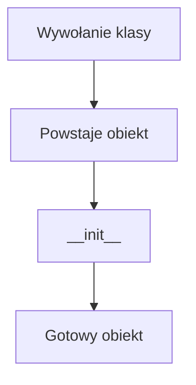

# 7. Inicjalizacja obiektów i `dataclass`

## Teoria

### `__init__`
Metoda `__init__` inicjalizuje stan obiektu po jego utworzeniu.

### Walidacja wejścia
To dobre miejsce na sprawdzanie poprawności danych.

### `@classmethod` jako alternatywny konstruktor

```python
@classmethod
def from_email(cls, email: str):
    ...
```

### `@dataclass`
Upraszcza klasy przechowujące głównie dane.

## Przykłady

### Przykład 1 - zwykła inicjalizacja

```python
class Product:
    def __init__(self, name: str, price: float) -> None:
        if price < 0:
            raise ValueError("Cena nie może być ujemna")
        self.name = name
        self.price = price
```

### Przykład 2 - alternatywny konstruktor

```python
class User:
    def __init__(self, name: str, email: str) -> None:
        self.name = name
        self.email = email

    @classmethod
    def from_email(cls, email: str) -> "User":
        return cls(email.split("@")[0], email)
```

### Przykład 3 - `dataclass`

```python
from dataclasses import dataclass


@dataclass
class Point:
    x: int
    y: int
```

### Przykład 4 - `__post_init__`

```python
from dataclasses import dataclass


@dataclass
class Employee:
    name: str
    salary: float

    def __post_init__(self) -> None:
        if self.salary < 0:
            raise ValueError("Pensja nie może być ujemna")
```

## Diagram



## Zadania

1. Napisz klasę `Rectangle` z walidacją szerokości i wysokości.
2. Dodaj metodę klasową `square`.
3. Napisz `@dataclass` `Address`.
4. Dodaj `__post_init__` z walidacją kodu pocztowego.
5. Porównaj ręcznie napisaną klasę z wersją `@dataclass`.

## Checklista

- Czy rozumiesz rolę `__init__`?
- Czy umiesz zrobić walidację przy tworzeniu obiektu?
- Czy znasz zastosowanie `@classmethod`?
- Czy umiesz użyć `@dataclass`?
