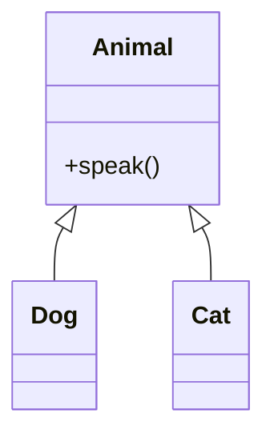

# 8. Dziedziczenie i polimorfizm

## Teoria

### Dziedziczenie
Pozwala budować klasy pochodne na bazie klas bazowych.

```python
class Animal:
    ...


class Dog(Animal):
    ...
```

### Przesłanianie metod
Podklasa może dostarczyć własną implementację metody klasy bazowej.

### Polimorfizm
Kod może działać na wspólnej abstrakcji, a konkretne obiekty reagują różnie.

### `super()`
Służy do korzystania z implementacji klasy bazowej.

### Wielokrotne dziedziczenie i MRO
Python wspiera wielokrotne dziedziczenie, ale wymaga ostrożności.

## Przykłady

### Przykład 1 - podstawowe dziedziczenie

```python
class Animal:
    def speak(self) -> None:
        print("Some sound")


class Dog(Animal):
    def speak(self) -> None:
        print("Hau")
```

### Przykład 2 - `super()`

```python
class Person:
    def __init__(self, name: str) -> None:
        self.name = name


class Student(Person):
    def __init__(self, name: str, index_no: str) -> None:
        super().__init__(name)
        self.index_no = index_no
```

### Przykład 3 - polimorfizm

```python
class Cat(Animal):
    def speak(self) -> None:
        print("Miau")


def make_sound(animal: Animal) -> None:
    animal.speak()
```

### Przykład 4 - wielokrotne dziedziczenie

```python
class Flyer:
    def move(self) -> None:
        print("Flying")


class Swimmer:
    def swim(self) -> None:
        print("Swimming")


class Duck(Flyer, Swimmer):
    pass
```

## Diagram



## Zadania

1. Zaimplementuj klasy `Vehicle`, `Car`, `Bike`.
2. Nadpisz metodę `describe()` w klasach pochodnych.
3. Napisz funkcję przyjmującą listę `Vehicle` i wywołującą `describe()`.
4. Dodaj przykład z `super()`.
5. Zbuduj prosty przykład wielokrotnego dziedziczenia i sprawdź `__mro__`.

## Checklista

- Czy umiesz napisać podklasę?
- Czy rozumiesz działanie `super()`?
- Czy rozumiesz polimorfizm?
- Czy wiesz, kiedy dziedziczenie bywa gorsze od kompozycji?
