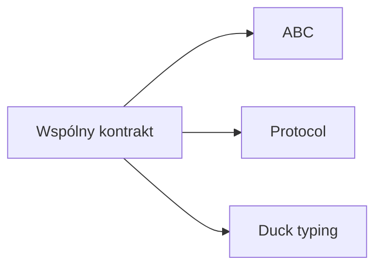

# 9. Protokoły, ABC i klasy abstrakcyjne

## Teoria

### `ABC`
Python udostępnia klasy abstrakcyjne przez moduł `abc`.

```python
from abc import ABC, abstractmethod
```

### `Protocol`
Pozwala opisać kontrakt strukturalny.

```python
from typing import Protocol
```

### Duck typing
W prostych przypadkach wystarczy, że obiekt ma oczekiwaną metodę, bez formalnego dziedziczenia.

## Przykłady

### Przykład 1 - klasa abstrakcyjna

```python
from abc import ABC, abstractmethod


class Shape(ABC):
    @abstractmethod
    def area(self) -> float:
        pass
```

### Przykład 2 - implementacja ABC

```python
class Circle(Shape):
    def __init__(self, radius: float) -> None:
        self.radius = radius

    def area(self) -> float:
        return 3.14 * self.radius * self.radius
```

### Przykład 3 - `Protocol`

```python
from typing import Protocol


class Printable(Protocol):
    def print(self) -> None:
        ...
```

### Przykład 4 - duck typing

```python
def render(entity) -> None:
    entity.print()
```

## Diagram



## Zadania

1. Zdefiniuj ABC `Employee` z metodą `calculate_salary`.
2. Zaimplementuj klasy `FullTimeEmployee` i `ContractEmployee`.
3. Zdefiniuj `Protocol` `Closable` z metodą `close`.
4. Napisz funkcję pracującą z obiektami zgodnymi z `Closable`.
5. Porównaj, kiedy lepsze jest `ABC`, a kiedy `Protocol`.

## Checklista

- Czy rozumiesz rolę `@abstractmethod`?
- Czy umiesz stworzyć klasę abstrakcyjną?
- Czy rozumiesz kontrakt strukturalny przez `Protocol`?
- Czy widzisz różnicę między formalnym interfejsem a duck typing?
