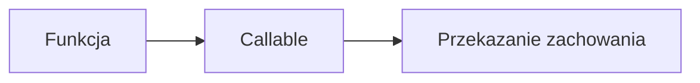

# 11. Funkcje lambda i callables

## Teoria

### Funkcje jako obiekty
W Pythonie funkcje można:
- przypisać do zmiennej,
- przekazać jako argument,
- zwrócić z funkcji.

### Lambda
Krótka funkcja anonimowa:

```python
lambda x: x * x
```

### `Callable`
Callable to wszystko, co można wywołać:
- funkcja,
- metoda,
- klasa,
- obiekt z `__call__`.

## Przykłady

### Przykład 1 - funkcja jako argument

```python
def apply_twice(fn, value):
    return fn(fn(value))
```

### Przykład 2 - lambda

```python
square = lambda x: x * x
print(square(5))
```

### Przykład 3 - `sorted` z kluczem

```python
words = ["python", "c", "java"]
print(sorted(words, key=lambda word: len(word)))
```

### Przykład 4 - obiekt callable

```python
class Multiplier:
    def __init__(self, factor: int) -> None:
        self.factor = factor

    def __call__(self, value: int) -> int:
        return value * self.factor
```

## Diagram



## Zadania

1. Napisz funkcję przyjmującą inną funkcję i listę liczb.
2. Użyj `lambda` do posortowania listy obiektów po wybranym polu.
3. Napisz klasę z `__call__`.
4. Użyj `map` i `filter`.
5. Porównaj, kiedy lepsza jest lambda, a kiedy zwykła funkcja.

## Checklista

- Czy rozumiesz, że funkcje są obiektami?
- Czy umiesz napisać prostą lambdę?
- Czy rozumiesz ideę `Callable`?
- Czy potrafisz użyć funkcji jako strategii zachowania?
