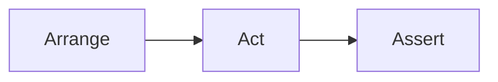

# 12. Testowanie kodu

## Teoria

### Po co testować?
- sprawdzenie poprawności,
- szybkie wykrywanie regresji,
- bezpieczna refaktoryzacja,
- dokumentowanie zachowania klasy.

### `pytest`
Najczęściej używane narzędzie testowe w Pythonie.

### Arrange-Act-Assert



## Przykłady

### Przykład 1 - klasa do testowania

```python
class Calculator:
    def add(self, a: int, b: int) -> int:
        return a + b
```

### Przykład 2 - test w `pytest`

```python
def test_add() -> None:
    calc = Calculator()
    assert calc.add(2, 3) == 5
```

### Przykład 3 - test wyjątku

```python
import pytest


class BankAccount:
    def __init__(self, balance: float) -> None:
        self.balance = balance

    def withdraw(self, amount: float) -> None:
        if amount < 0:
            raise ValueError("Negative amount")


def test_withdraw_rejects_negative() -> None:
    account = BankAccount(100)
    with pytest.raises(ValueError):
        account.withdraw(-10)
```

### Przykład 4 - fixture

```python
import pytest


@pytest.fixture
def account() -> BankAccount:
    return BankAccount(100)
```

## Zadania

1. Napisz klasę `Rectangle` i test metody `area()`.
2. Napisz klasę `PasswordValidator` i testy poprawnych oraz błędnych haseł.
3. Dodaj testy dla wyjątków.
4. Użyj fixture w `pytest`.
5. Przepisz jedną z poprzednich klas tak, by była łatwiejsza do testowania.

## Checklista

- Czy umiesz napisać prosty test w `pytest`?
- Czy rozumiesz AAA?
- Czy umiesz sprawdzić oczekiwany wyjątek?
- Czy rozumiesz związek między projektem klasy a testowalnością?
