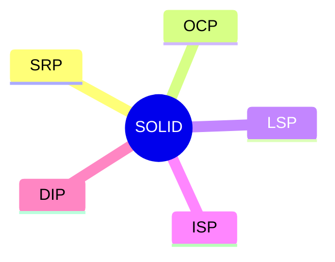

# 13. SOLID w Pythonie

## Teoria

### SRP
Jedna klasa powinna mieć jedną główną odpowiedzialność.

### OCP
Kod powinien dać się rozszerzać bez ciągłego modyfikowania stabilnego modułu.

### LSP
Podtyp nie powinien psuć kontraktu nadtypu.

### ISP
Lepiej mieć małe kontrakty niż jeden szeroki interfejs.

### DIP
Kod wysokiego poziomu powinien zależeć od abstrakcji, nie od konkretów.



## Przykłady

### Przykład 1 - SRP

```python
class ReportService:
    def generate(self) -> None:
        ...

    def save(self) -> None:
        ...

    def send_email(self) -> None:
        ...
```

### Przykład 2 - OCP przez strategię

```python
def apply_discount(price: float, policy) -> float:
    return policy(price)
```

### Przykład 3 - DIP

```python
from typing import Protocol


class Repository(Protocol):
    def save(self, value: str) -> None:
        ...
```

## Zadania

1. Rozbij klasę, która liczy, zapisuje i wysyła e-mail.
2. Zastąp `if/elif` strategią opartą o callables.
3. Zdefiniuj `Protocol` dla repozytorium.
4. Przeanalizuj przykład naruszenia LSP.
5. Zastanów się, gdzie w Twoim wcześniejszym kodzie pojawia się naruszenie SRP.

## Checklista

- Czy rozumiesz sens każdej zasady SOLID?
- Czy umiesz wskazać naruszenie SRP?
- Czy widzisz, jak Python upraszcza OCP i DIP przez funkcje i protokoły?
