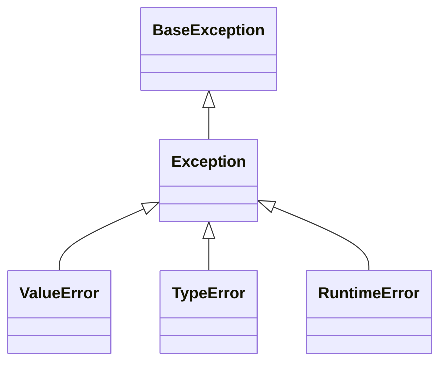

# 14. Wyjątki

## Teoria

### Czym jest wyjątek?
Wyjątek to obiekt sygnalizujący błąd wykonania programu.

### Podstawowa składnia

```python
try:
    ...
except ValueError:
    ...
finally:
    ...
```

### `raise`
Umożliwia ręczne zgłoszenie wyjątku.

### Własne wyjątki

```python
class DomainError(Exception):
    pass
```

## Przykłady

### Przykład 1 - prosty `try/except`

```python
try:
    value = int("abc")
except ValueError:
    print("Niepoprawna liczba")
```

### Przykład 2 - `else` i `finally`

```python
try:
    value = int("10")
except ValueError:
    print("Błąd")
else:
    print(value)
finally:
    print("Koniec")
```

### Przykład 3 - własny wyjątek

```python
class InsufficientFundsError(Exception):
    pass
```

### Przykład 4 - chaining

```python
try:
    int("abc")
except ValueError as exc:
    raise RuntimeError("Parsing failed") from exc
```

## Diagram



## Zadania

1. Napisz funkcję dzielącą liczby i obsługującą dzielenie przez zero.
2. Napisz klasę `BankAccount`, która rzuca wyjątek przy niepoprawnej wypłacie.
3. Zdefiniuj własny wyjątek domenowy.
4. Użyj `with open(...)` i pokaż rolę context managera.
5. Dodaj testy do własnych wyjątków.

## Checklista

- Czy umiesz używać `try/except/else/finally`?
- Czy rozumiesz `raise`?
- Czy umiesz stworzyć własny wyjątek?
- Czy rozumiesz chaining wyjątków?
