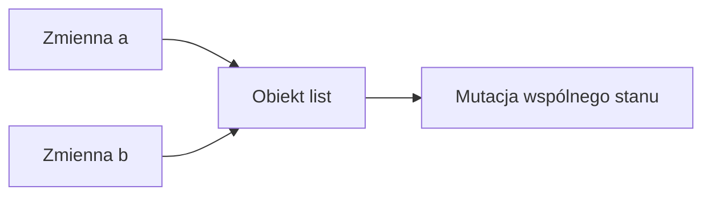

# 15. Referencje, mutowalność i niemutowalność

## Teoria

### Referencje do obiektów
W Pythonie zmienne przechowują referencje do obiektów.

```python
a = [1, 2]
b = a
```

### Mutowalne i niemutowalne typy

#### Niemutowalne
- `int`
- `float`
- `str`
- `tuple`

#### Mutowalne
- `list`
- `dict`
- `set`
- większość własnych klas

### `is` vs `==`
- `is` - porównanie tożsamości,
- `==` - porównanie równości logicznej.

### Kopiowanie
- `copy.copy()` - kopia płytka,
- `copy.deepcopy()` - kopia głęboka.

## Przykłady

### Przykład 1 - współdzielona lista

```python
a = [1, 2, 3]
b = a
b.append(4)
print(a)
```

### Przykład 2 - `is` vs `==`

```python
a = [1, 2]
b = [1, 2]
c = a

print(a == b)
print(a is b)
print(a is c)
```

### Przykład 3 - `deepcopy`

```python
import copy

matrix = [[1, 2], [3, 4]]
clone = copy.deepcopy(matrix)
```

### Przykład 4 - mutowalny argument domyślny

```python
def add_item(value: int, items: list[int] | None = None) -> list[int]:
    if items is None:
        items = []
    items.append(value)
    return items
```

## Diagram



## Zadania

1. Pokaż różnicę między przypisaniem listy a jej kopią.
2. Napisz przykład z `copy.copy` i `copy.deepcopy`.
3. Porównaj kilka obiektów przez `is` i `==`.
4. Zaimplementuj klasę danych niemutowalnych przez `@dataclass(frozen=True)`.
5. Pokaż błąd z mutowalnym argumentem domyślnym i napraw go.

## Checklista

- Czy rozumiesz, że zmienne przechowują referencje?
- Czy odróżniasz typy mutowalne i niemutowalne?
- Czy rozumiesz różnicę między `is` i `==`?
- Czy umiesz użyć `copy` i `deepcopy`?
