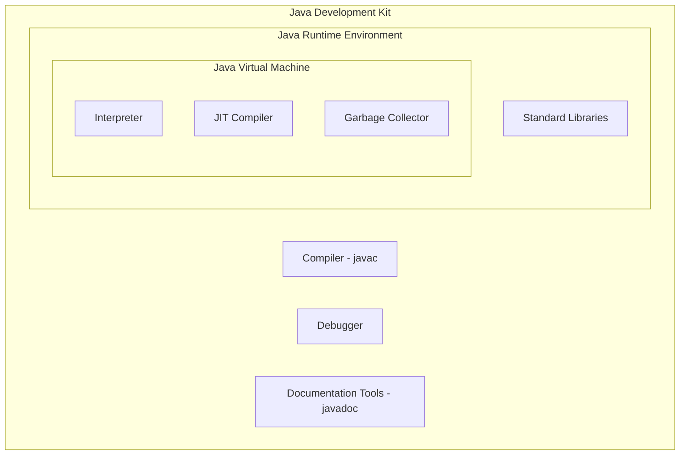
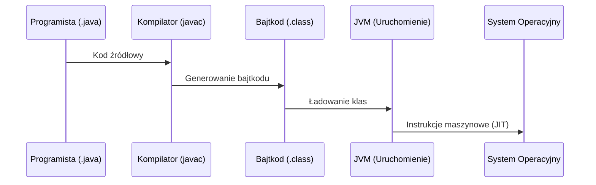
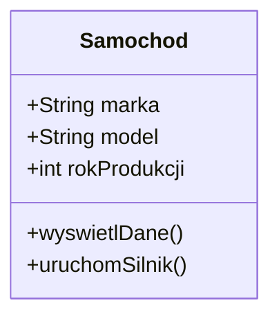
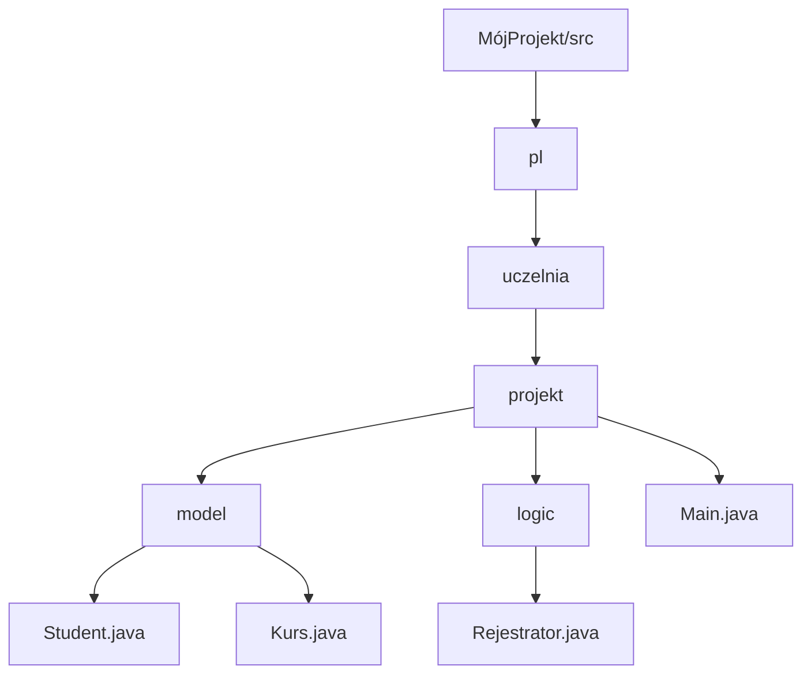
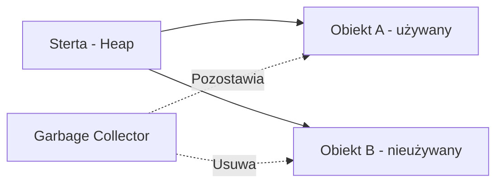

# Wykład 1: Środowisko języka Java

Java to nie tylko język programowania, ale cała platforma technologiczna. Aby zrozumieć, jak działa Java, należy zapoznać się z jej trzema głównymi komponentami: JVM, JRE oraz JDK.

## 1. Architektura platformy Java (JDK vs JRE vs JVM)

### JVM (Java Virtual Machine)
Serce platformy. Maszyna wirtualna odpowiedzialna za wykonywanie bajtkodu Javy. Dzięki niej Java jest niezależna od architektury sprzętowej (zasada "Write Once, Run Anywhere").

### JRE (Java Runtime Environment)
Środowisko uruchomieniowe. Zawiera JVM oraz biblioteki standardowe niezbędne do uruchomienia gotowych aplikacji Javy. Nie zawiera narzędzi deweloperskich (np. kompilatora).

### JDK (Java Development Kit)
Zestaw programisty. Zawiera JRE oraz narzędzia niezbędne do tworzenia oprogramowania, takie jak kompilator (`javac`), debugger, dokumentator (`javadoc`) i inne.



---

## 2. Proces kompilacji i uruchamiania

W tradycyjnych językach kompilowanych (jak C++), kod źródłowy jest tłumaczony bezpośrednio na kod maszynowy konkretnego procesora. W Javie proces ten jest dwuetapowy.

1.  **Kompilacja**: Kompilator `javac` zamienia plik `.java` na plik `.class` zawierający **bajtkod**.
2.  **Interpretacja/JIT**: JVM ładuje bajtkod i tłumaczy go na instrukcje procesora w trakcie działania programu.



---

## 3. Podstawy składni Javy

Java jest językiem silnie typowanym, co oznacza, że każda zmienna musi mieć zadeklarowany typ.

### 3.1. Typy danych

W Javie wyróżniamy dwie główne kategorie typów danych: **prymitywne** oraz **referencyjne**.

#### Typy prymitywne (Primitive Types)
Przechowują proste wartości bezpośrednio w pamięci (na stosie).

| Grupa | Typ | Rozmiar (bity) | Zakres / Wartość |
| :--- | :--- | :--- | :--- |
| **Całkowitoliczbowe** | `byte` | 8 | -128 do 127 |
| | `short` | 16 | -32,768 do 32,767 |
| | `int` | 32 | ok. -2 mld do 2 mld (domyślny) |
| | `long` | 64 | bardzo duży (wymaga przyrostka `L`) |
| **Zmiennoprzecinkowe** | `float` | 32 | precyzja do 7 cyfr (wymaga `f`) |
| | `double` | 64 | precyzja do 15 cyfr (domyślny) |
| **Logiczny** | `boolean` | 1* | `true` lub `false` |
| **Znakowy** | `char` | 16 | pojedynczy znak Unicode (np. 'A') |

#### Typy referencyjne (Reference Types)
Wskazują na obiekt w pamięci (na stercie). Przykładem jest `String`, tablice oraz wszystkie klasy zdefiniowane przez programistę.

```java
String tekst = "Witaj w świecie Javy!";
Integer liczbaObiektowa = 10; // Wrapper typu int
```

### 3.2. Klasy i metody

Java jest językiem czysto obiektowym – niemal każdy kod musi znajdować się wewnątrz klasy.

#### Klasy: Zasady i rodzaje

W Javie klasy są podstawowymi blokami budulcowymi. Oto kluczowe zasady dotyczące ich definiowania:

1.  **Liczba klas w pliku**:
    -   W jednym pliku `.java` może znajdować się wiele klas.
    -   Jednakże, **tylko jedna klasa może być publiczna (`public`)**.
    -   Nazwa pliku musi być identyczna z nazwą klasy publicznej (np. klasa `public class Samochod` musi znajdować się w pliku `Samochod.java`).
2.  **Rodzaje klas (na poziomie pliku)**:
    -   **Klasa publiczna (`public`)**: Widoczna dla wszystkich innych klas w projekcie.
    -   **Klasa pakietowa (bez modyfikatora)**: Widoczna tylko dla klas znajdujących się w tym samym pakiecie.

#### Konwencje nazewnictwa

Przestrzeganie standardów nazewnictwa (tzw. *Java Code Conventions*) jest kluczowe dla czytelności kodu:

| Element | Konwencja | Przykład | Opis |
| :--- | :--- | :--- | :--- |
| **Klasy** | **PascalCase** | `SamochodOsobowy` | Każde słowo zaczyna się wielką literą. Zazwyczaj są to rzeczowniki. |
| **Metody** | **camelCase** | `obliczPredkosc` | Pierwsze słowo małą literą, kolejne wielką. Zazwyczaj są to czasowniki. |
| **Zmienne** | **camelCase** | `liczbaKol` | Podobnie jak metody. |
| **Pakiety** | **lowercase** | `pl.edu.pwr.projekt` | Tylko małe litery, słowa oddzielone kropkami. |



**Podstawowa struktura klasy:**
```java
public class Samochod {
    // Pola (atrybuty)
    String marka;
    int predkosc;

    // Metoda (funkcja wewnątrz klasy)
    void przyspiesz(int oIle) {
        predkosc += oIle;
        System.out.println("Jedziemy z prędkością: " + predkosc);
    }
}
```

#### Anatomia metody

Metoda to blok kodu, który wykonuje określone zadanie. Składa się z nagłówka (sygnatury) oraz ciała.

```java
modyfikator typZwracany nazwaMetody(parametry) {
    // ciało metody
    return wartosc; // opcjonalne, zależne od typu zwracanego
}
```

**1. Modyfikatory dostępu (Access Modifiers):**
Definiują widoczność metody dla innych klas.

| Modyfikator | Opis |
| :--- | :--- |
| `public` | Metoda dostępna z każdego miejsca w projekcie. |
| `private` | Metoda dostępna tylko w obrębie tej samej klasy (enkapsulacja). |
| `protected` | Dostępna w tej samej klasie, podklasach oraz klasach w tym samym pakiecie. |
| *(brak)* | "Package-private" – dostępna tylko dla klas w tym samym pakiecie. |

**2. Typ zwracany (Return Type):**
Określa, jaki rodzaj danych metoda przekaże z powrotem po zakończeniu działania.

-   **Typy danych**: Może to być dowolny typ prymitywny (`int`, `double`) lub referencyjny (`String`, `Samochod`).
-   **`void`**: Specjalne słowo kluczowe oznaczające, że metoda **nie zwraca żadnej wartości** (wykonuje tylko akcję, np. wypisuje tekst).

**3. Parametry:**
Zmienne przekazywane do metody, które służą jako dane wejściowe. Jeśli metoda nie przyjmuje parametrów, nawiasy pozostają puste: `()`.

**Przykład różnorodnych metod:**

```java
public class Kalkulator {
    
    // Metoda publiczna zwracająca int, przyjmująca dwa parametry
    public int dodaj(int a, int b) {
        return a + b;
    }

    // Metoda prywatna (pomocnicza), nie zwraca nic (void)
    private void loguj(String wiadomosc) {
        System.out.println("[LOG]: " + wiadomosc);
    }

    // Metoda publiczna typu void
    public void wyswietlWynik(int wynik) {
        loguj("Wyświetlanie wyniku");
        System.out.println("Wynik to: " + wynik);
    }
}
```

### 3.3. Tablice (Arrays)

Tablice w Javie mają stały rozmiar określany w momencie tworzenia.

| Cecha | Opis |
| :--- | :--- |
| **Indeksowanie** | Zawsze od 0 do `length - 1`. |
| **Typowanie** | Tablica może przechowywać elementy tylko jednego typu. |
| **Atrybut length** | Pozwala sprawdzić rozmiar tablicy (np. `tablica.length`). |

**Przykład deklaracji i inicjalizacji:**
```java
// Sposób 1: Deklaracja i rezerwacja miejsca
int[] liczby = new int[5];
liczby[0] = 10;

// Sposób 2: Inicjalizacja z wartościami
String[] owoce = {"Jabłko", "Banan", "Pomarańcza"};

// Tablice wielowymiarowe
int[][] macierz = {
    {1, 2, 3},
    {4, 5, 6}
};
```

### 3.4. Struktury sterujące

Java oferuje standardowe instrukcje znane z innych języków C-podobnych.

*   **Warunkowe**: `if`, `else if`, `else`, `switch`.
*   **Pętle**:
    *   `for` (klasyczna),
    *   `for-each` (do iteracji po kolekcjach/tablicach),
    *   `while`, `do-while`.

```java
// Przykład pętli for-each
for (String owoc : owoce) {
    System.out.println("Lubię: " + owoc);
}
```

### 3.5. Struktura projektu (Pakiety)

W miarę rozwoju aplikacji, liczba klas rośnie. Aby utrzymać porządek, Java używa **pakietów** (`packages`), które działają jak foldery na dysku.

**Przykładowa struktura projektu:**



**Opis struktury:**
-   **`src`**: Główny folder z kodem źródłowym.
-   **`pl.uczelnia.projekt`**: Odwrócona nazwa domeny używana jako unikalny identyfikator pakietu.
-   **Pakiety tematyczne**:
    -   `model`: Przechowuje klasy reprezentujące dane (tzw. POJO - Plain Old Java Objects).
    -   `logic`: Przechowuje klasy odpowiedzialne za logikę biznesową aplikacji.
-   **`Main.java`**: Klasa startowa aplikacji (zazwyczaj w głównym pakiecie projektu).

W pliku `.java` przynależność do pakietu deklarujemy na samej górze:
```java
package pl.uczelnia.projekt.model;

public class Student {
    // ...
}
```

---

## 4. Zarządzanie pamięcią i Garbage Collector

Jedną z największych zalet Javy jest automatyczne zarządzanie pamięcią. Programista nie musi ręcznie zwalniać pamięci (jak w C++ za pomocą `delete`).



**Garbage Collector (GC)** to proces działający w tle wewnątrz JVM, który:
-   Identyfikuje obiekty, które nie są już używane przez program.
-   Automatycznie zwalnia zajmowaną przez nie pamięć.

---

## 5. Konfiguracja środowiska

### Instalacja JDK
Obecnie zaleca się korzystanie z dystrybucji OpenJDK, takich jak:
-   **Eclipse Temurin** (dawniej AdoptOpenJDK)
-   **Amazon Corretto**
-   **Azul Zulu**

### Zmienne środowiskowe
Aby narzędzia Javy były dostępne w terminalu, należy skonfigurować:
-   `JAVA_HOME`: ścieżka do katalogu głównego JDK.
-   `PATH`: należy dodać do niej folder `bin` z katalogu JDK.

### Sprawdzenie wersji
W terminalu możemy sprawdzić poprawność instalacji komendami:
```bash
java -version
javac -version
```

---

## 6. Współczesne narzędzia (Ecosystem)

W profesjonalnym tworzeniu aplikacji w Javie rzadko używa się samego JDK z linii komend. Wykorzystuje się:

1.  **Systemy budowania**: Maven, Gradle (zarządzają bibliotekami i procesem budowy).
2.  **IDE**: IntelliJ IDEA, Eclipse, NetBeans.
3.  **Biblioteki**: Spring Framework, Hibernate, JUnit.

---

## 7. Dlaczego warto wybrać Javę?

-   **Bezpieczeństwo**: JVM zapewnia piaskownicę (sandbox) dla aplikacji.
-   **Wielowątkowość**: Java ma natywne wsparcie dla procesów równoległych.
-   **Ogromna społeczność**: Miliardy urządzeń i miliony programistów.
-   **Wsteczna kompatybilność**: Stary kod zazwyczaj działa bez zmian na nowych wersjach JVM.
