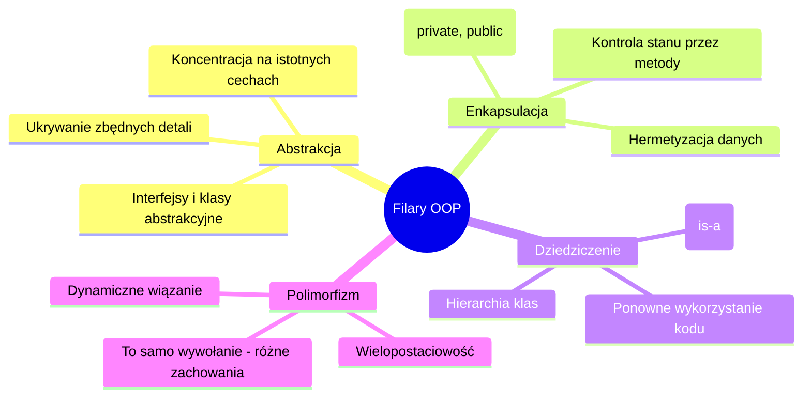
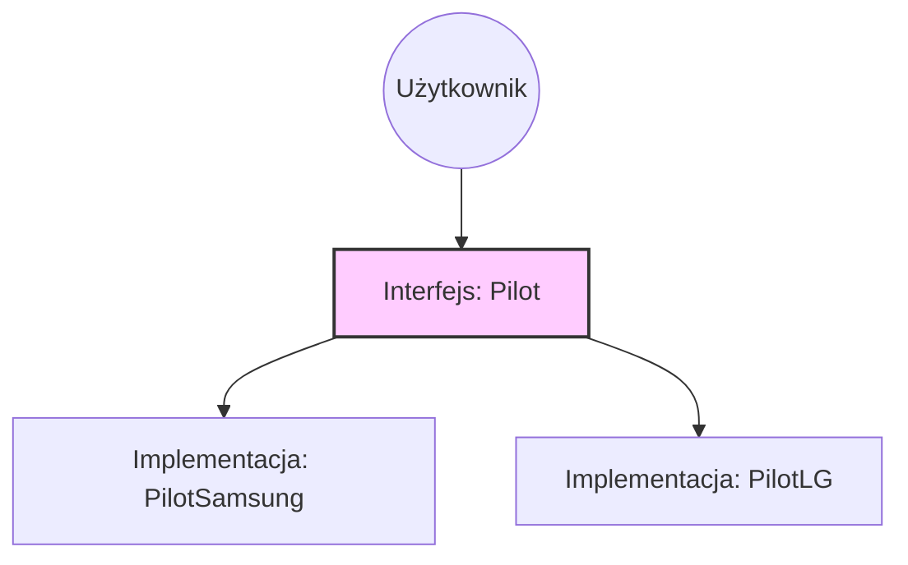
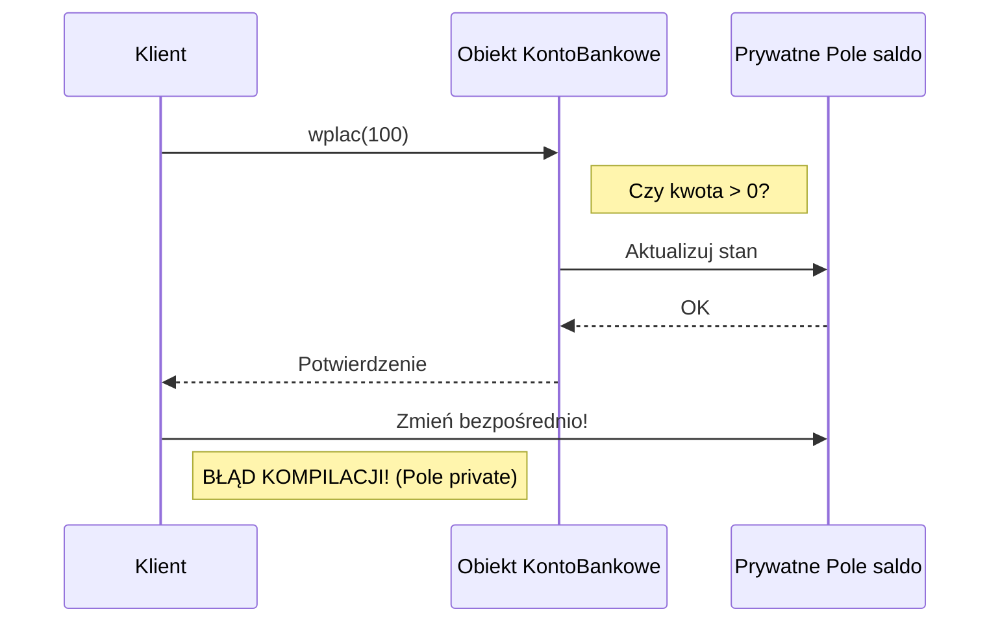
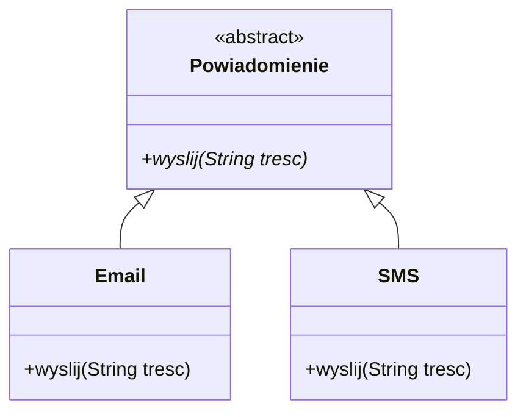
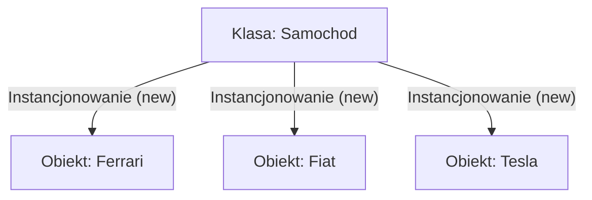
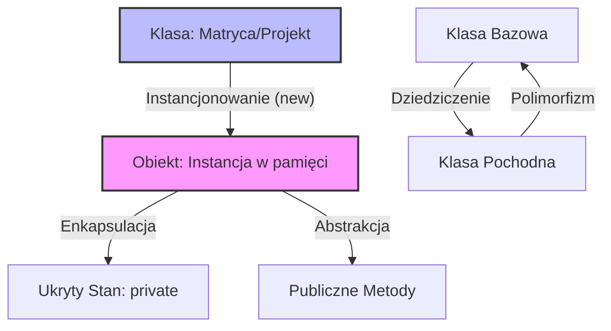

# Wykład 2: Paradygmaty programowania obiektowego (OOP)

Programowanie obiektowe (Object-Oriented Programming, OOP) to paradygmat programowania, który opiera się na koncepcji "obiektów" – bytów, które łączą w sobie dane (**stan**) oraz funkcjonalność (**zachowanie**).

---

## I. Dlaczego potrzebujemy OOP? (Analogie i Teoria)

Wyobraźmy sobie dużą firmę logistyczną. Na początku, gdy firma jest mała (5 osób), każdy wie wszystko o wszystkim. Księgowy wie, gdzie leży paczka, a kurier wie, ile pieniędzy jest w kasie.

Jednak w miarę wzrostu (1000 osób), ten model prowadzi do chaosu. Jeśli każdy może wejść do kasy i wziąć pieniądze na paliwo, księgowość nigdy nie będzie się zgadzać. Rozwiązaniem jest podział na **działy** (obiekty) o jasno określonych **odpowiedzialnościach**.

- **Dział Finansowy** (Obiekt): Tylko on ma dostęp do sejfu. Inni muszą poprosić go o wypłatę (Metoda).
- **Magazyn** (Obiekt): Tylko on wie, gdzie są paczki. Inni muszą złożyć zamówienie na wydanie towaru.

To jest właśnie fundament OOP: **Dziel i rządź**.

---

## II. Cztery filary OOP

OOP opiera się na czterech fundamentach, które wspólnie zapewniają modularność, elastyczność i łatwość utrzymania kodu.



### 1. Abstrakcja

Abstrakcja polega na wyodrębnieniu kluczowych cech obiektu, ignorując szczegóły, które nie są istotne w danym kontekście.

**Przykład z życia: Pilot do TV**
Używając pilota, naciskasz przycisk "Zmień kanał". Nie interesuje Cię, jak sygnał podczerwieni jest kodowany, jakie fale radiowe są wysyłane ani jak procesor w telewizorze interpretuje ten sygnał. Dla Ciebie pilot to zestaw przycisków (abstrakcja), a cała skomplikowana elektronika jest ukryta.

**Przykład w kodzie (Java):**
```java
// Definiujemy co system powinien robić, a nie jak dokładnie to robi
interface Pilot {
    void nastepnyKanal();
    void glosniej();
    void wylacz();
}

class PilotSamsung implements Pilot {
    public void nastepnyKanal() {
        System.out.println("Samsung: Wysyłam kod IR 0x34A...");
    }
    public void glosniej() {
        System.out.println("Samsung: Zwiększam napięcie na module audio.");
    }
    public void wylacz() {
        System.out.println("Samsung: Przechodzę w tryb Standby.");
    }
}
```



### 2. Enkapsulacja (Hermetyzacja)

Enkapsulacja to ukrywanie stanu wewnętrznego obiektu przed bezpośrednim dostępem z zewnątrz. Dostęp do danych odbywa się wyłącznie przez publiczne metody (gettery i settery), co pozwala na walidację danych i ochronę integralności obiektu.

**Dlaczego to ważne?**
Wyobraź sobie, że każdy może wejść do serwerowni banku i ręcznie zmienić cyfry w bazie danych. To byłby brak enkapsulacji. W poprawnym systemie, musisz przejść przez "okienko" (metodę), która sprawdzi Twoją tożsamość i czy masz wystarczające środki.



**Przykład w kodzie (Java):**
```java
public class KontoBankowe {
    private double saldo; // Pole prywatne - nikt z zewnątrz go nie zmieni bezpośrednio

    public void wplac(double kwota) {
        if (kwota > 0) {
            this.saldo += kwota;
            System.out.println("Wpłacono: " + kwota);
        } else {
            System.out.println("Błąd: Kwota wpłaty musi być dodatnia!");
        }
    }

    public void wyplac(double kwota) {
        if (kwota > 0 && kwota <= saldo) {
            this.saldo -= kwota;
            System.out.println("Wypłacono: " + kwota);
        } else {
            System.out.println("Błąd: Brak środków lub nieprawidłowa kwota!");
        }
    }

    public double getSaldo() {
        return saldo;
    }
}
```

### 3. Dziedziczenie

Dziedziczenie pozwala tworzyć nowe klasy na podstawie już istniejących. Nowa klasa (**podklasa**) przejmuje pola i metody klasy bazowej (**nadklasy**), co sprzyja ponownemu wykorzystaniu kodu.

**Relacja "IS-A" (jest):**
- Pracownik **jest** Osobą.
- Smartfon **jest** Telefonem.

**Przykład w kodzie (Java):**
```java
class Pracownik {
    protected String imie;
    protected double pensja;

    void pracuj() {
        System.out.println(imie + " wykonuje obowiązki.");
    }
}

class Programista extends Pracownik {
    String glownyJezyk;

    @Override
    void pracuj() {
        System.out.println(imie + " pisze kod w " + glownyJezyk);
    }
    
    void programuj() {
        System.out.println("Tworzę nową aplikację...");
    }
}
```

### 4. Polimorfizm (Wielopostaciowość)

Polimorfizm pozwala traktować obiekty różnych klas, które mają wspólnego przodka, w ten sam sposób. Wywołanie tej samej metody na różnych obiektach może skutkować różnym zachowaniem.

**Przykład z życia: System Powiadomień**
Masz system, który wysyła powiadomienia do użytkowników. Może to być E-mail, SMS lub Push. Z perspektywy systemu nie ma znaczenia, co to dokładnie jest – on po prostu mówi: "Wyślij!".



**Przykład w kodzie (Java):**
```java
abstract class Powiadomienie {
    abstract void wyslij(String tresc);
}

class Email extends Powiadomienie {
    void wyslij(String tresc) {
        System.out.println("Wysyłam E-mail: " + tresc);
    }
}

class SMS extends Powiadomienie {
    void wyslij(String tresc) {
        System.out.println("Wysyłam SMS: " + tresc);
    }
}

// Użycie polimorfizmu:
public class Main {
    public static void main(String[] args) {
        Powiadomienie[] powiadomienia = { new Email(), new SMS() };
        
        for (Powiadomienie p : powiadomienia) {
            p.wyslij("Witaj w systemie!"); // To samo wywołanie, różne efekty
        }
    }
}
```

---

## III. Kluczowe pojęcia: Klasa vs Obiekt

| Pojęcie | Opis | Analogia |
| :--- | :--- | :--- |
| **Klasa** | Szablon, przepis, projekt, definicja typu. | Projekt architektoniczny domu. |
| **Obiekt** | Konkretny byt stworzony na podstawie klasy (instancja). | Fizycznie wybudowany dom przy ul. Kwiatowej 5. |



---

## IV. Podsumowanie - Jak to wszystko łączy się w całość?

Poniższy diagram przedstawia relacje między różnymi pojęciami, które poznaliśmy.



---

## V. Korzyści z zastosowania OOP

1. **Modularność**: Łatwiejsze dzielenie pracy w dużych zespołach.
2. **Utrzymanie**: Zmiana implementacji wewnątrz klasy nie psuje reszty programu (dzięki enkapsulacji).
3. **Rozszerzalność**: Nowe funkcjonalności dodajemy tworząc podklasy, zamiast modyfikować istniejący, działający kod.
4. **Czytelność**: Kod odzwierciedla realny świat (modelowanie dziedzinowe).
