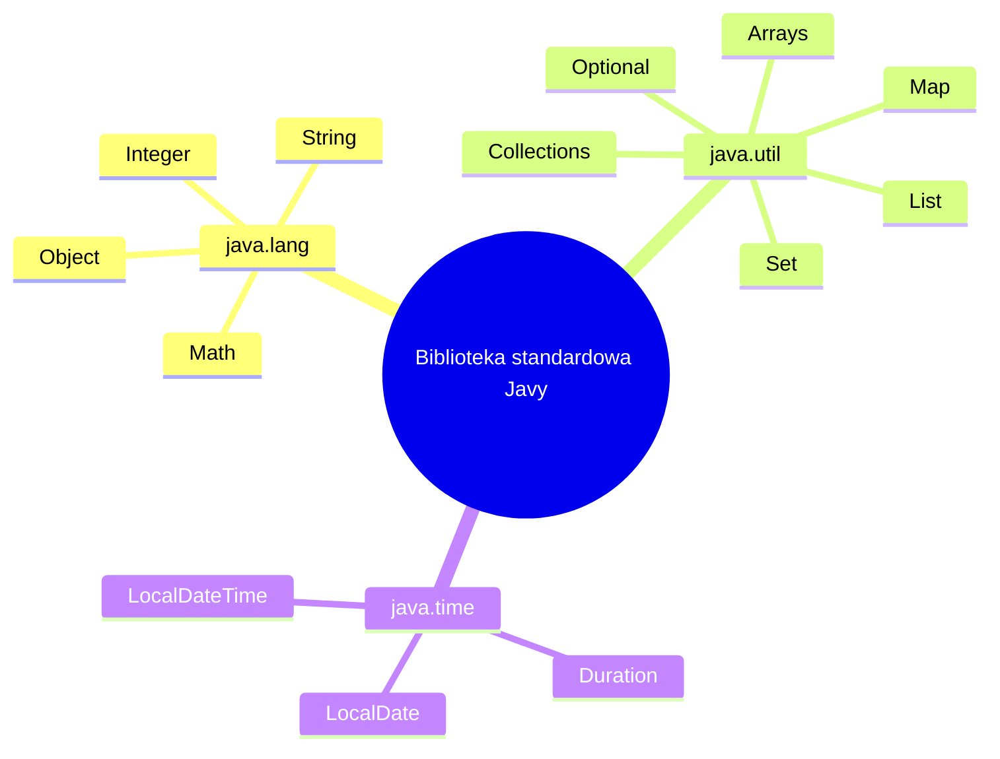

# Wykład 10: Podstawowe klasy biblioteki Java

Ten moduł porządkuje najważniejsze klasy i interfejsy biblioteki standardowej Javy, z którymi student spotyka się niemal od razu przy pisaniu kodu obiektowego. Celem nie jest omówienie całego API, ale zrozumienie najczęściej używanych narzędzi i ich roli w projektowaniu klas.

## 1. Po co znać bibliotekę standardową?

W programowaniu obiektowym nie tworzymy wszystkiego od zera. Biblioteka standardowa:
- dostarcza sprawdzone abstrakcje,
- zmniejsza liczbę błędów,
- upraszcza kod,
- ujednolica styl pracy w projektach.

Zamiast pisać własną listę, mapę, klasę do daty albo parser liczb, zwykle korzystamy z gotowych elementów Javy.



## 2. Klasa `Object` - wspólny przodek wszystkich klas

Każda klasa w Javie dziedziczy po `Object`, nawet jeśli nie zapisujemy tego jawnie.

Najważniejsze metody:
- `toString()` - tekstowa reprezentacja obiektu,
- `equals(Object other)` - porównywanie obiektów logicznie,
- `hashCode()` - wsparcie dla struktur haszujących,
- `getClass()` - informacja o typie w czasie działania.

Przykład:

```java
public class Book {
    private final String title;
    private final String author;

    public Book(String title, String author) {
        this.title = title;
        this.author = author;
    }

    @Override
    public String toString() {
        return "Book{title='" + title + "', author='" + author + "'}";
    }
}
```

Wnioski praktyczne:
- własne klasy warto wyposażać w sensowne `toString()`,
- jeśli obiekty mają być porównywane "po zawartości", trzeba przemyśleć `equals()` i `hashCode()`,
- `Object` jest fundamentem polimorfizmu i kolekcji.

## 3. `String` - niemutowalny typ tekstowy

`String` jest jedną z najważniejszych klas w Javie.

Cechy:
- jest niemutowalny (`immutable`),
- bezpieczny do współdzielenia,
- wspiera wiele metod pomocniczych, np. `length()`, `substring()`, `contains()`, `equals()`, `toLowerCase()`.

```java
String firstName = "Anna";
String lastName = "Nowak";
String fullName = firstName + " " + lastName;

System.out.println(fullName.length());
System.out.println(fullName.toUpperCase());
System.out.println(fullName.contains("Now"));
```

Ważna uwaga:
- do porównywania napisów używamy `equals()`, nie `==`.

```java
String a = new String("Java");
String b = new String("Java");

System.out.println(a == b);      // false
System.out.println(a.equals(b)); // true
```

## 4. `StringBuilder` - wydajne budowanie tekstu

Jeśli łączymy napisy w pętli, lepiej użyć `StringBuilder`.

```java
StringBuilder sb = new StringBuilder();

for (int i = 1; i <= 3; i++) {
    sb.append("Linia ");
    sb.append(i);
    sb.append('\n');
}

String result = sb.toString();
System.out.println(result);
```

Kiedy używać:
- raporty tekstowe,
- eksport CSV,
- składanie większych komunikatów,
- wielokrotne dopisywanie fragmentów tekstu.

## 5. Klasy opakowujące: `Integer`, `Double`, `Boolean`

Typy prymitywne (`int`, `double`, `boolean`) nie są obiektami. Ich odpowiedniki obiektowe to:
- `Integer`,
- `Double`,
- `Boolean`,
- `Long`, `Float`, `Character`, `Byte`, `Short`.

Przykład:

```java
Integer x = 10;      // autoboxing
int y = x + 5;       // auto-unboxing

double value = Double.parseDouble("3.14");
int number = Integer.parseInt("42");
```

W praktyce są potrzebne m.in.:
- w kolekcjach (`List<Integer>`),
- w generics,
- przy parsowaniu danych wejściowych.

## 6. `Math` - operacje matematyczne

Klasa `Math` udostępnia statyczne metody pomocnicze.

```java
double radius = 3.0;
double area = Math.PI * Math.pow(radius, 2);

System.out.println(Math.sqrt(25));
System.out.println(Math.max(10, 15));
System.out.println(area);
```

Najczęściej używane metody:
- `abs`,
- `max`, `min`,
- `pow`,
- `sqrt`,
- `round`,
- `random`.

## 7. Tablice oraz klasa `Arrays`

Tablica ma stały rozmiar. Gdy rozmiar danych się zmienia, zwykle lepiej użyć kolekcji.

```java
int[] values = {4, 1, 7, 2};
Arrays.sort(values);
System.out.println(Arrays.toString(values));
```

Przydatne metody:
- `Arrays.sort(...)`,
- `Arrays.toString(...)`,
- `Arrays.copyOf(...)`,
- `Arrays.asList(...)`.

```java
String[] names = {"Jan", "Anna", "Ola"};
String[] copy = Arrays.copyOf(names, names.length);
System.out.println(Arrays.toString(copy));
```

## 8. Kolekcje: `List`, `Set`, `Map`

### `List`
Uporządkowana kolekcja elementów, dopuszcza duplikaty.

```java
List<String> students = new ArrayList<>();
students.add("Anna");
students.add("Piotr");
students.add("Anna");

System.out.println(students.get(0));
System.out.println(students.size());
```

### `Set`
Zbiór unikalnych elementów.

```java
Set<String> tags = new HashSet<>();
tags.add("java");
tags.add("oop");
tags.add("java");

System.out.println(tags.size()); // 2
```

### `Map`
Struktura klucz-wartość.

```java
Map<String, Integer> points = new HashMap<>();
points.put("Anna", 10);
points.put("Piotr", 8);

System.out.println(points.get("Anna"));
System.out.println(points.containsKey("Piotr"));
```

Porównanie:

| Struktura | Przechowuje | Duplikaty | Typowe użycie |
|---|---|---|---|
| `List` | sekwencję | tak | lista studentów, historia zdarzeń |
| `Set` | zbiór | nie | unikalne tagi, role użytkownika |
| `Map` | pary klucz-wartość | klucze nie | słownik danych, konfiguracja |

## 9. `Collections` i operacje pomocnicze

Klasa `Collections` zawiera metody użytkowe do pracy z kolekcjami.

```java
List<Integer> numbers = new ArrayList<>(Arrays.asList(3, 1, 2));
Collections.sort(numbers);
Collections.reverse(numbers);

System.out.println(numbers);
```

Warto znać:
- `sort`,
- `reverse`,
- `shuffle`,
- `unmodifiableList`.

## 10. `Optional<T>`

`Optional` pomaga wyrazić, że wynik może istnieć albo nie.

```java
Optional<String> email = Optional.of("anna@example.com");
System.out.println(email.orElse("brak"));

Optional<String> emptyEmail = Optional.empty();
System.out.println(emptyEmail.orElse("brak"));
```

Przykład użycia:

```java
public Optional<Student> findByIndex(String index) {
    if ("12345".equals(index)) {
        return Optional.of(new Student("Anna"));
    }
    return Optional.empty();
}
```

`Optional` nie zastępuje wszystkich wyjątków i nie powinien być nadużywany jako pole każdej klasy. Dobrze sprawdza się głównie jako typ zwracany z metod wyszukujących.

## 11. API dat i czasu: `java.time`

Nowoczesne API dat jest dużo bezpieczniejsze niż stare klasy `Date` i `Calendar`.

Najważniejsze typy:
- `LocalDate`,
- `LocalTime`,
- `LocalDateTime`,
- `Duration`,
- `Period`.

```java
LocalDate today = LocalDate.now();
LocalDate examDate = LocalDate.of(2026, 7, 15);

System.out.println(today);
System.out.println(examDate.isAfter(today));
```

Przykład z `Duration`:

```java
LocalDateTime start = LocalDateTime.of(2026, 7, 5, 10, 0);
LocalDateTime end = LocalDateTime.of(2026, 7, 5, 12, 30);

Duration duration = Duration.between(start, end);
System.out.println(duration.toMinutes()); // 150
```

## 12. Dobre praktyki

- Najpierw szukaj rozwiązania w bibliotece standardowej, dopiero potem pisz własną implementację.
- Używaj właściwej struktury danych do problemu.
- Nie porównuj napisów przez `==`.
- Jeśli klasa ma być używana w kolekcjach haszujących, przemyśl `equals()` i `hashCode()`.
- Nie twórz własnego systemu dat i czasu.
- `Optional` traktuj jako narzędzie do zwracania wyniku opcjonalnego, nie jako modę.

## 13. Mini-zadania

1. Napisz klasę `Book`, która nadpisuje `toString()` i przechowuje tytuł oraz autora.
2. Utwórz `List<Integer>`, posortuj ją i wypisz największy element.
3. Zbuduj `Map<String, Double>` przechowującą ceny produktów i oblicz średnią cenę.
4. Napisz metodę, która przyjmuje `String[]` i zwraca posortowaną kopię tablicy.
5. Użyj `LocalDate` do sprawdzenia, ile dni zostało do egzaminu.

## 14. Podsumowanie

Znajomość podstawowych klas biblioteki Javy jest częścią dojrzałego programowania obiektowego. Student powinien rozumieć:
- które klasy reprezentują stan i dane,
- które służą do organizacji kolekcji,
- które wspierają pracę pomocniczą,
- oraz kiedy lepiej użyć gotowej abstrakcji niż dopisywać własny kod.
