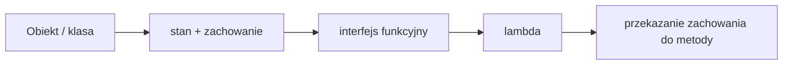

# Wykład 11: Wyrażenia lambda i interfejsy funkcyjne

Wyrażenia lambda są naturalnym rozwinięciem programowania obiektowego w Javie. Pozwalają przekazywać zachowania jako argumenty, upraszczają kod oparty o interfejsy jednomeetodowe i dobrze łączą się z kolekcjami, komparatorami oraz strumieniami.

## 1. Po co w ogóle lambda?

Przed wprowadzeniem lambd w Javie częstym rozwiązaniem były:
- osobne małe klasy implementujące interfejs,
- klasy anonimowe,
- duża ilość kodu pomocniczego tylko po to, by przekazać "co zrobić".

Lambda pozwala zapisać to samo krócej i czytelniej.

Przykład porównawczy:

```java
Comparator<String> byLengthOld = new Comparator<String>() {
    @Override
    public int compare(String a, String b) {
        return Integer.compare(a.length(), b.length());
    }
};

Comparator<String> byLengthLambda = (a, b) -> Integer.compare(a.length(), b.length());
```

## 2. Interfejs funkcyjny

Interfejs funkcyjny to taki interfejs, który ma dokładnie jedną metodę abstrakcyjną.

Przykład:

```java
@FunctionalInterface
public interface Printer {
    void print(String text);
}
```

Adnotacja `@FunctionalInterface`:
- nie jest obowiązkowa,
- ale pomaga kompilatorowi wykrywać błędy,
- komunikuje intencję autora kodu.

Lambda może zastąpić implementację takiego interfejsu:

```java
Printer printer = text -> System.out.println(">> " + text);
printer.print("Java");
```

## 3. Składnia lambd

Ogólny schemat:

```java
(parametry) -> wyrazenie
```

albo:

```java
(parametry) -> {
    instrukcje;
}
```

Przykłady:

```java
() -> System.out.println("Hello");
(x) -> x * x;
(a, b) -> a + b;
(name) -> {
    System.out.println("Cześć " + name);
};
```

Zasady praktyczne:
- jeśli parametr jest jeden, nawiasy można pominąć,
- jeśli ciało ma jedną instrukcję zwracającą wynik, nawiasy klamrowe i `return` można pominąć,
- typy parametrów zwykle są wywnioskowane przez kompilator.

## 4. Wbudowane interfejsy funkcyjne z `java.util.function`

Najważniejsze:
- `Predicate<T>` - przyjmuje `T`, zwraca `boolean`,
- `Function<T, R>` - przyjmuje `T`, zwraca `R`,
- `Consumer<T>` - przyjmuje `T`, nic nie zwraca,
- `Supplier<T>` - nic nie przyjmuje, zwraca `T`,
- `UnaryOperator<T>` - `T -> T`,
- `BinaryOperator<T>` - `(T, T) -> T`.

### `Predicate<T>`

```java
Predicate<Integer> isAdultAge = age -> age >= 18;
System.out.println(isAdultAge.test(20)); // true
```

### `Function<T, R>`

```java
Function<String, Integer> lengthFunction = text -> text.length();
System.out.println(lengthFunction.apply("Java"));
```

### `Consumer<T>`

```java
Consumer<String> logger = msg -> System.out.println("LOG: " + msg);
logger.accept("Start programu");
```

### `Supplier<T>`

```java
Supplier<Double> randomValue = () -> Math.random();
System.out.println(randomValue.get());
```

## 5. Lambda jako argument metody

To najważniejszy praktyczny przypadek użycia.

```java
public class TextProcessor {
    public static void process(String text, Consumer<String> action) {
        action.accept(text);
    }

    public static void main(String[] args) {
        process("Java", value -> System.out.println(value.toUpperCase()));
        process("OOP", value -> System.out.println("[" + value + "]"));
    }
}
```

Korzyść:
- jedna metoda może wykonywać różne zachowania bez tworzenia wielu klas.

## 6. `Comparator` i sortowanie

Jedno z najczęstszych zastosowań lambd.

```java
List<String> names = new ArrayList<>();
names.add("Joanna");
names.add("Jan");
names.add("Aleksandra");

names.sort((a, b) -> Integer.compare(a.length(), b.length()));
System.out.println(names);
```

Z użyciem metod pomocniczych:

```java
names.sort(Comparator.comparingInt(String::length));
```

## 7. Referencje do metod

Jeśli lambda tylko wywołuje istniejącą metodę, można użyć krótszego zapisu.

Rodzaje:
- `ClassName::staticMethod`,
- `object::instanceMethod`,
- `ClassName::instanceMethod`,
- `ClassName::new`.

Przykłady:

```java
Consumer<String> printer = System.out::println;
Function<String, Integer> parser = Integer::parseInt;
Supplier<List<String>> listFactory = ArrayList::new;
```

Przykład w praktyce:

```java
List<String> values = Arrays.asList("3", "1", "2");
values.stream()
      .map(Integer::parseInt)
      .sorted()
      .forEach(System.out::println);
```

## 8. Zasięg zmiennych i "effectively final"

Lambda może korzystać ze zmiennych lokalnych tylko wtedy, gdy są one finalne albo "effectively final".

```java
String prefix = "Wynik: ";
Consumer<Integer> consumer = value -> System.out.println(prefix + value);
```

To zadziała, bo `prefix` nie zmienia wartości.

To już nie:

```java
int counter = 0;
// counter++;
// Runnable r = () -> System.out.println(counter);
```

Powód: lambda nie może dowolnie modyfikować lokalnego stanu metody, bo utrudniałoby to przewidywalność kodu.

## 9. Lambdy a programowanie obiektowe

Lambda nie zastępuje klas i obiektów. Uzupełnia je.

W OOP nadal modelujemy:
- stan,
- odpowiedzialności,
- relacje między obiektami.

Lambda jest szczególnie przydatna wtedy, gdy:
- chcemy przekazać mały fragment zachowania,
- nie chcemy tworzyć osobnej klasy tylko dla jednej metody,
- pracujemy z kolekcjami i operacjami przetwarzania danych.



## 10. Lambdy i Stream API - krótki wstęp

Pełne omówienie strumieni można zrobić osobno, ale warto znać podstawowy wzorzec:

```java
List<Integer> numbers = Arrays.asList(1, 2, 3, 4, 5);

int sum = numbers.stream()
        .filter(n -> n % 2 == 0)
        .map(n -> n * 10)
        .reduce(0, Integer::sum);

System.out.println(sum);
```

Tu lambda służy do:
- filtrowania,
- przekształcania,
- redukcji danych.

## 11. Dobre praktyki

- Używaj lambd do krótkich zachowań.
- Gdy lambda robi się długa i wieloliniowa, rozważ zwykłą metodę.
- Nie upychaj całej logiki biznesowej w strumieniach.
- Nadawaj znaczące nazwy interfejsom funkcyjnym własnej produkcji.
- Jeśli pasuje gotowy interfejs z `java.util.function`, nie twórz własnego bez potrzeby.
- Dla czytelności wybieraj prostotę zamiast "sprytnego" zapisu.

## 12. Typowe błędy

- Mylenie lambd z wielowątkowością - lambda nie oznacza automatycznie kodu asynchronicznego.
- Nadużywanie strumieni tam, gdzie zwykła pętla jest czytelniejsza.
- Tworzenie własnych interfejsów funkcyjnych mimo istnienia `Predicate`, `Function` czy `Consumer`.
- Ukrywanie skomplikowanej logiki w jednej, trudnej do debugowania lambdzie.

## 13. Przykłady zadań

### Zadanie 1 - filtrowanie listy

```java
public static List<String> filter(List<String> data, Predicate<String> predicate) {
    List<String> result = new ArrayList<>();
    for (String item : data) {
        if (predicate.test(item)) {
            result.add(item);
        }
    }
    return result;
}
```

Wywołanie:

```java
List<String> names = Arrays.asList("Ala", "Ola", "Jan", "Anna");
List<String> longNames = filter(names, name -> name.length() >= 4);
System.out.println(longNames);
```

### Zadanie 2 - strategia rabatu

```java
@FunctionalInterface
interface DiscountStrategy {
    double apply(double price);
}

public class Shop {
    public static double finalPrice(double price, DiscountStrategy strategy) {
        return strategy.apply(price);
    }

    public static void main(String[] args) {
        double result = finalPrice(100.0, p -> p * 0.9);
        System.out.println(result);
    }
}
```

## 14. Mini-quiz

1. Czym różni się interfejs funkcyjny od zwykłego interfejsu?
2. Kiedy lepiej użyć lambdy, a kiedy zwykłej metody?
3. Co robi `Predicate<T>`?
4. Dlaczego zmienna lokalna używana w lambdzie musi być effectively final?
5. Co oznacza zapis `System.out::println`?

## 15. Podsumowanie

Po tym module student powinien:
- rozumieć, czym jest interfejs funkcyjny,
- umieć zapisać prostą lambdę,
- korzystać z podstawowych interfejsów z `java.util.function`,
- stosować lambdy do sortowania, filtrowania i przekazywania zachowań,
- rozumieć związek lambd z nowoczesnym stylem programowania w Javie.
