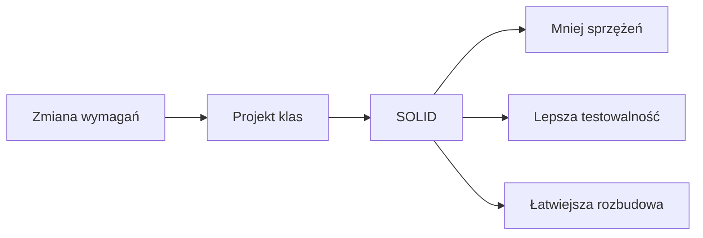
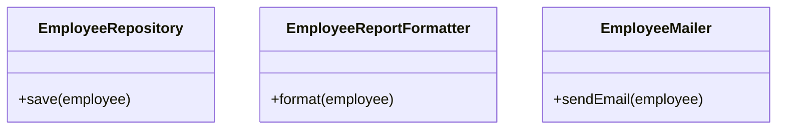
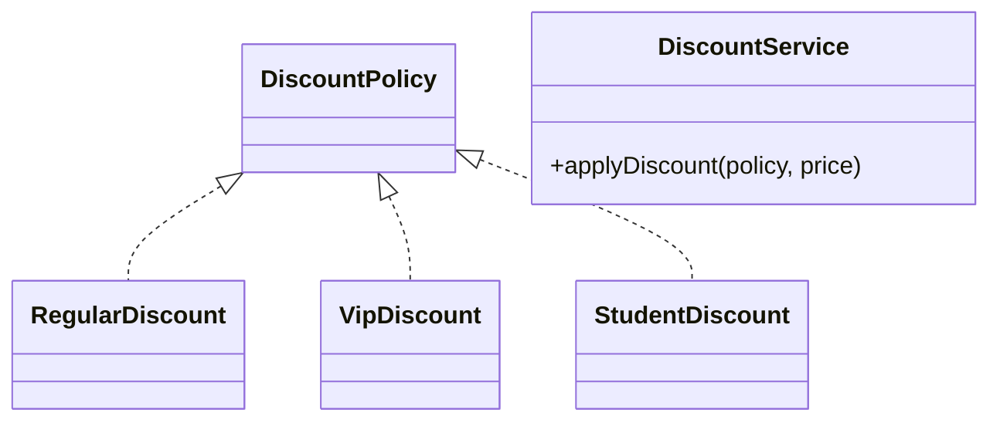
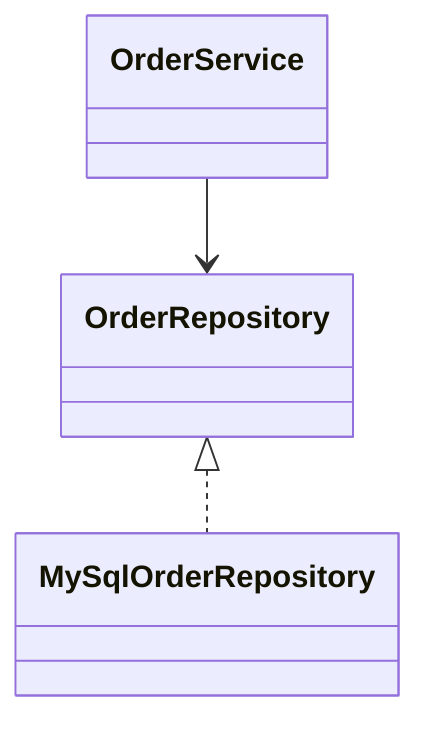

# Wykład 13: SOLID - zasady projektowania obiektowego

Ten materiał scala trzy wcześniejsze warianty wykładu o SOLID: skrótowy, rozszerzony oraz diagramowy. Zawiera krótkie definicje, pogłębienie teoretyczne, przykłady w Javie, kilka porównań z Pythonem, diagramy Mermaid oraz zadania do przećwiczenia.

## 1. Czym jest SOLID?

SOLID to zestaw pięciu zasad projektowych, które pomagają budować kod:
- czytelny,
- rozszerzalny,
- mniej podatny na regresje,
- łatwiejszy do testowania.

Akronim oznacza:
- **S** - Single Responsibility Principle,
- **O** - Open/Closed Principle,
- **L** - Liskov Substitution Principle,
- **I** - Interface Segregation Principle,
- **D** - Dependency Inversion Principle.

### Po co w ogóle te zasady?

W większych projektach bez zasad projektowych kod szybko staje się:
- sztywny,
- kruchy,
- trudny do ponownego użycia,
- zbyt mocno sprzężony.

SOLID nie jest celem samym w sobie. To zestaw narzędzi, które pomagają podejmować lepsze decyzje projektowe.



## 2. S - Single Responsibility Principle

**Definicja:** klasa powinna mieć jeden główny powód do zmiany.

### Intuicja

Jeśli jedna klasa:
- liczy,
- zapisuje do bazy,
- wysyła e-maile,
- formatuje raport,

to wykonuje zbyt wiele różnych zadań.

### Zły przykład

```java
public class EmployeeService {
    public void save(Employee employee) {
        // zapis do bazy
    }

    public String formatReport(Employee employee) {
        return employee.getName() + " - " + employee.getSalary();
    }

    public void sendEmail(Employee employee) {
        // wysyłka maila
    }
}
```

### Lepszy przykład

```java
public class EmployeeRepository {
    public void save(Employee employee) {
        // zapis do bazy
    }
}

public class EmployeeReportFormatter {
    public String format(Employee employee) {
        return employee.getName() + " - " + employee.getSalary();
    }
}

public class EmployeeMailer {
    public void sendEmail(Employee employee) {
        // wysyłka maila
    }
}
```

### Diagram



### Co daje SRP?

- mniejsze klasy,
- prostsze testy,
- mniejszy wpływ zmian,
- czytelniejszy podział odpowiedzialności.

### Typowe symptomy naruszenia SRP

- "god object",
- zbyt długa klasa,
- zbyt dużo prywatnych metod obsługujących różne obszary,
- zmiany z kilku różnych powodów w jednym pliku.

## 3. O - Open/Closed Principle

**Definicja:** moduły powinny być otwarte na rozszerzanie, ale zamknięte na modyfikację.

### Intuicja

Nowe zachowanie lepiej dodać przez:
- nową klasę,
- implementację interfejsu,
- strategię,

niż przez dokładanie kolejnych `if`, `switch` i `instanceof` w jednej klasie.

### Zły przykład

```java
public class DiscountService {
    public double applyDiscount(String customerType, double price) {
        if ("REGULAR".equals(customerType)) {
            return price * 0.95;
        } else if ("VIP".equals(customerType)) {
            return price * 0.80;
        } else if ("STUDENT".equals(customerType)) {
            return price * 0.90;
        }
        return price;
    }
}
```

Każdy nowy typ klienta wymaga modyfikacji klasy.

### Lepszy przykład

```java
public interface DiscountPolicy {
    double apply(double price);
}

public class RegularDiscount implements DiscountPolicy {
    @Override
    public double apply(double price) {
        return price * 0.95;
    }
}

public class VipDiscount implements DiscountPolicy {
    @Override
    public double apply(double price) {
        return price * 0.80;
    }
}

public class StudentDiscount implements DiscountPolicy {
    @Override
    public double apply(double price) {
        return price * 0.90;
    }
}
```

```java
public class DiscountService {
    public double applyDiscount(DiscountPolicy policy, double price) {
        return policy.apply(price);
    }
}
```

### Diagram



### Uwaga praktyczna

OCP nie oznacza, że każda klasa ma mieć od razu pięć warstw abstrakcji. Najpierw prostota, potem punkty rozszerzeń tam, gdzie zmienność jest realna.

## 4. L - Liskov Substitution Principle

**Definicja:** obiekty klas pochodnych powinny dać się podstawiać w miejsce klasy bazowej bez psucia poprawności programu.

### Klasyczny problem

Jeśli `Square` dziedziczy po `Rectangle`, a setter szerokości zmienia też wysokość, to kod oczekujący "zwykłego prostokąta" może przestać działać poprawnie.

### Zły przykład

```java
class Rectangle {
    protected int width;
    protected int height;

    public void setWidth(int width) {
        this.width = width;
    }

    public void setHeight(int height) {
        this.height = height;
    }

    public int area() {
        return width * height;
    }
}

class Square extends Rectangle {
    @Override
    public void setWidth(int width) {
        this.width = width;
        this.height = width;
    }

    @Override
    public void setHeight(int height) {
        this.height = height;
        this.width = height;
    }
}
```

Kod testujący:

```java
Rectangle r = new Square();
r.setWidth(5);
r.setHeight(4);
System.out.println(r.area()); // 16 zamiast oczekiwanych 20
```

### Wniosek

Hierarchia typów nie odzwierciedla poprawnie kontraktu.

### Lepszy kierunek

Zamiast wymuszać złe dziedziczenie, lepiej modelować wspólne zachowanie przez abstrakcję:

```java
interface Shape {
    int area();
}

final class Rectangle implements Shape {
    private final int width;
    private final int height;

    Rectangle(int width, int height) {
        this.width = width;
        this.height = height;
    }

    @Override
    public int area() {
        return width * height;
    }
}

final class Square implements Shape {
    private final int side;

    Square(int side) {
        this.side = side;
    }

    @Override
    public int area() {
        return side * side;
    }
}
```

### Pytania pomocnicze przy LSP

- Czy podtyp zachowuje kontrakt typu bazowego?
- Czy nie zaostrza prewarunków?
- Czy nie osłabia gwarancji?
- Czy klient klasy bazowej nie musi znać wyjątków dla podtypu?

## 5. I - Interface Segregation Principle

**Definicja:** lepiej mieć kilka małych, wyspecjalizowanych interfejsów niż jeden duży interfejs zmuszający klasy do implementowania niepotrzebnych metod.

### Zły przykład

```java
public interface Worker {
    void work();
    void eat();
    void sleep();
}

public class RobotWorker implements Worker {
    @Override
    public void work() {
        System.out.println("Robot pracuje");
    }

    @Override
    public void eat() {
        throw new UnsupportedOperationException("Robot nie je");
    }

    @Override
    public void sleep() {
        throw new UnsupportedOperationException("Robot nie śpi");
    }
}
```

### Lepszy przykład

```java
public interface Workable {
    void work();
}

public interface Eatable {
    void eat();
}

public interface Sleepable {
    void sleep();
}

public class HumanWorker implements Workable, Eatable, Sleepable {
    @Override
    public void work() { }

    @Override
    public void eat() { }

    @Override
    public void sleep() { }
}

public class RobotWorker implements Workable {
    @Override
    public void work() { }
}
```

### Wniosek

Interfejs powinien opisywać spójny kontrakt, a nie przypadkowy zbiór funkcji.

## 6. D - Dependency Inversion Principle

**Definicja:** moduły wysokiego poziomu nie powinny zależeć od modułów niskiego poziomu. Oba powinny zależeć od abstrakcji.

### Zły przykład

```java
public class OrderService {
    private final MySqlOrderRepository repository = new MySqlOrderRepository();

    public void placeOrder(Order order) {
        repository.save(order);
    }
}
```

Problem:
- `OrderService` jest przyklejony do konkretnej bazy lub implementacji.

### Lepszy przykład

```java
public interface OrderRepository {
    void save(Order order);
}

public class MySqlOrderRepository implements OrderRepository {
    @Override
    public void save(Order order) {
        // zapis
    }
}

public class OrderService {
    private final OrderRepository repository;

    public OrderService(OrderRepository repository) {
        this.repository = repository;
    }

    public void placeOrder(Order order) {
        repository.save(order);
    }
}
```

### Zysk

- łatwiejsze testy,
- prostsza wymiana implementacji,
- mniejsze sprzężenie.

### Diagram



## 7. SOLID a testowalność

Zasady SOLID silnie wpływają na testy:
- SRP upraszcza zakres testu,
- OCP i DIP ułatwiają podstawianie atrap i stubów,
- ISP pozwala mockować tylko potrzebne zachowanie,
- LSP chroni przed ukrytymi błędami kontraktów.

Przykład testowego podstawienia zależności:

```java
class InMemoryOrderRepository implements OrderRepository {
    private final List<Order> orders = new ArrayList<>();

    @Override
    public void save(Order order) {
        orders.add(order);
    }

    public int count() {
        return orders.size();
    }
}
```

## 8. Najczęstsze nieporozumienia

### "SOLID zawsze oznacza więcej interfejsów"
Nie. Interfejs ma sens wtedy, gdy istnieje zmienność, kilka implementacji albo potrzeba oddzielenia klienta od konkretu.

### "Każda klasa musi mieć dokładnie jedną metodę"
Nie. SRP mówi o jednej odpowiedzialności, nie o jednej metodzie.

### "OCP zabrania modyfikacji kodu"
Nie. Chodzi o to, by typowy kierunek rozwoju polegał na rozszerzaniu, a nie ciągłym grzebaniu w stabilnym module.

### "Dziedziczenie zawsze pomaga"
Nie. Często lepsza jest kompozycja i małe interfejsy.

## 9. Zasady uzupełniające: DRY, KISS, YAGNI

### DRY - Don't Repeat Yourself

Jedno źródło prawdy. Powtarzająca się logika utrudnia zmiany i zwiększa ryzyko niespójności.

### KISS - Keep It Simple, Stupid

Wybieraj najprostsze rozwiązanie, które spełnia wymagania. Prostszy kod jest tańszy w utrzymaniu.

### YAGNI - You Aren't Gonna Need It

Nie implementuj abstrakcji, rozszerzeń i konfiguracji "na zapas", jeśli nie mają realnego użytkownika dziś.

## 10. Krótki przewodnik decyzyjny

Jeśli widzisz, że:
- jedna klasa robi za dużo -> sprawdź SRP,
- rośnie liczba `if` po typach -> sprawdź OCP,
- podtyp psuje oczekiwania klienta -> sprawdź LSP,
- interfejs ma dziwne metody "na wszelki wypadek" -> sprawdź ISP,
- logika wysokiego poziomu zna szczegóły techniczne -> sprawdź DIP.

## 11. Mini-case study

Wyobraźmy sobie system zamówień.

Wersja słaba projektowo:
- `OrderManager` liczy cenę,
- tworzy PDF,
- zapisuje do bazy,
- wysyła e-mail,
- zna konkretną implementację płatności.

Wersja dojrzalsza:
- `OrderService` koordynuje proces,
- `PriceCalculator` liczy,
- `InvoiceGenerator` generuje dokument,
- `OrderRepository` zapisuje,
- `NotificationService` wysyła wiadomość,
- `PaymentGateway` jest abstrakcją.

To nie znaczy, że zawsze trzeba budować cały zestaw klas. To znaczy, że odpowiedzialności i zależności powinny być świadomie rozdzielone.

## 12. Pytania kontrolne

1. Dlaczego klasa z kilkoma różnymi odpowiedzialnościami jest trudniejsza do utrzymania?
2. Kiedy `if` po typie może sugerować naruszenie OCP?
3. Na czym polega problem z dziedziczeniem `Square` po `Rectangle`?
4. Dlaczego `UnsupportedOperationException` w metodzie interfejsu bywa sygnałem naruszenia ISP?
5. Jak DIP pomaga w testach jednostkowych?

## 13. Zadania dla studentów

1. Rozbij klasę, która jednocześnie:
   - liczy sumę zamówienia,
   - zapisuje dane,
   - drukuje raport.
2. Zamień instrukcję `if/else` zależną od typu płatności na strategię opartą o interfejs.
3. Sprawdź, czy hierarchia `Vehicle -> ElectricScooter` nie narusza kontraktów klasy bazowej.
4. Podziel zbyt szeroki interfejs `SmartDevice` na mniejsze kontrakty.
5. Przepisz serwis zależny od konkretnej klasy repozytorium tak, aby zależał od abstrakcji.

## 14. Podsumowanie

SOLID nie służy do "upiększania" kodu, tylko do zarządzania zmianą. Dobrze stosowane zasady:
- porządkują odpowiedzialności,
- redukują sprzężenie,
- ułatwiają testowanie,
- poprawiają czytelność architektury.

Najlepszy efekt daje pragmatyczne użycie: najpierw prosty model, potem świadoma refaktoryzacja tam, gdzie kod zaczyna boleć.
