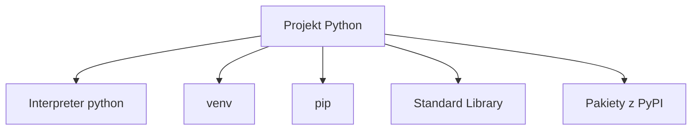
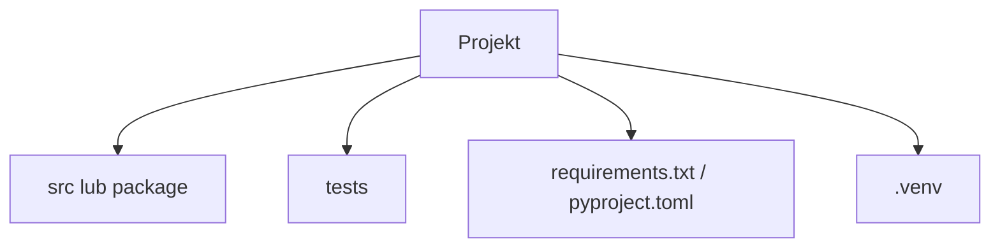

# Wykład 1: Środowisko języka Python

Python to nie tylko składnia języka, ale też cały sposób pracy z interpreterem, środowiskami wirtualnymi, pakietami i narzędziami developerskimi. W odróżnieniu od Javy nie zaczynamy od kompilacji do bajtkodu użytkownika, lecz od interpretera, który uruchamia kod źródłowy i generuje pliki pośrednie automatycznie.

## 1. Python jako język i ekosystem

Najważniejsze elementy środowiska pracy:
- **interpreter Pythona** - uruchamia kod,
- **standard library** - gotowe moduły dostarczane z językiem,
- **pip** - menedżer pakietów,
- **venv** - izolowane środowiska projektowe,
- **narzędzia developerskie** - np. `pytest`, `ruff`, `mypy`, `black`.



## 2. Interpreter CPython i inne implementacje

Najczęściej używaną implementacją jest **CPython**. To ona jest zwykle instalowana jako `python` lub `python3`.

Inne implementacje:
- **PyPy** - inna maszyna wykonawcza, często szybsza w wybranych scenariuszach,
- **Jython** - historyczna implementacja na JVM,
- **IronPython** - dla środowiska .NET,
- **MicroPython** - dla systemów wbudowanych.

W praktyce kursowej i projektowej najczęściej pracujemy z CPythonem.

## 3. Instalacja i sprawdzenie wersji

Podstawowe komendy:

```bash
python --version
python3 --version
pip --version
```

W środowisku wieloplatformowym warto wiedzieć:
- na Windows często używa się `py`,
- na Linux i macOS częste jest `python3`,
- w repozytoriach projektowych trzeba uważać, żeby nie mieszać interpreterów systemowych i projektowych.

## 4. Struktura uruchamiania programu

Najprostszy program:

```python
print("Hello, Python!")
```

Uruchomienie:

```bash
python hello.py
```

W Pythonie nie ma obowiązkowej metody `main` jak w Javie, ale istnieje powszechny idiom:

```python
def main() -> None:
    print("Uruchomiono program")


if __name__ == "__main__":
    main()
```

To pozwala odróżnić:
- uruchomienie pliku jako programu,
- import pliku jako modułu.

## 5. REPL, skrypty i notebooki

Python dobrze wspiera kilka stylów pracy:
- **REPL** - szybkie eksperymenty w konsoli,
- **skrypty `.py`** - klasyczny kod aplikacyjny,
- **notebooki** - analiza danych, edukacja, prototypowanie.

Do nauki OOP najlepsze są zwykłe pliki `.py`, bo uczą struktury programu i importów.

## 6. Środowiska wirtualne (`venv`)

Izolacja zależności to jedna z najważniejszych praktyk w Pythonie.

Tworzenie środowiska:

```bash
python -m venv .venv
```

Aktywacja:

```bash
source .venv/bin/activate
```

Na Windows:

```powershell
.venv\Scripts\activate
```

Po aktywacji pakiety instalują się lokalnie do projektu, a nie globalnie do systemu.

## 7. `pip` i zarządzanie zależnościami

Instalacja pakietu:

```bash
pip install pytest
```

Zapis zależności:

```bash
pip freeze > requirements.txt
```

Instalacja z pliku:

```bash
pip install -r requirements.txt
```

W praktyce projektowej używa się też narzędzi wyższego poziomu, np. Poetry, Hatch albo PDM, ale `pip + venv` wystarcza do zrozumienia podstaw.

## 8. Pliki projektu Python

Najczęstsze elementy:
- `*.py` - kod źródłowy,
- `__pycache__/` - cache bajtkodu,
- `requirements.txt` - zależności,
- `pyproject.toml` - konfiguracja nowocześniejszych projektów,
- `tests/` - testy,
- `.venv/` - środowisko wirtualne.



## 9. Konwencje stylu

Python ma silne konwencje:
- wcięcia mają znaczenie składniowe,
- zalecany styl opisuje **PEP 8**,
- nazwy klas: `PascalCase`,
- funkcje i zmienne: `snake_case`,
- stałe: `UPPER_CASE`.

Przykład:

```python
class BankAccount:
    DEFAULT_CURRENCY = "PLN"

    def __init__(self, owner: str, balance: float) -> None:
        self.owner = owner
        self.balance = balance
```

## 10. Narzędzia developerskie

W praktyce warto znać:
- **pytest** - testy,
- **ruff** lub **flake8** - linting,
- **black** - formatowanie,
- **mypy** - statyczna analiza typów,
- **pdb** - debugowanie.

To nie są elementy samego języka, ale realnego środowiska pracy z Pythonem.

## 11. Typowanie w Pythonie

Python jest dynamicznie typowany, ale wspiera adnotacje typów:

```python
def add(a: int, b: int) -> int:
    return a + b
```

Adnotacje:
- poprawiają czytelność,
- wspierają IDE,
- pozwalają używać `mypy`,
- nie zmieniają domyślnie sposobu wykonania programu.

## 12. Najczęstsze błędy początkujących

- instalowanie pakietów globalnie zamiast w `venv`,
- uruchamianie kodu innym interpreterem niż ten z aktywnego środowiska,
- mieszanie `python` i `python3` bez świadomości wersji,
- brak rozróżnienia między plikiem, modułem i pakietem,
- wrzucanie całego programu do jednego pliku.

## 13. Podsumowanie

Po tym wykładzie student powinien:
- rozumieć, czym jest interpreter Pythona,
- umieć utworzyć i aktywować `venv`,
- instalować pakiety przez `pip`,
- rozumieć idiom `if __name__ == "__main__":`,
- orientować się w podstawowych plikach projektu Python.
