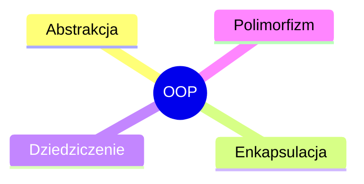
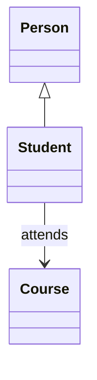

# Wykład 2: Paradygmaty obiektowości w Pythonie

Programowanie obiektowe w Pythonie nie jest kopią Javy. Python jest językiem wieloparadygmatowym: pozwala pisać kod proceduralny, funkcyjny i obiektowy. OOP w Pythonie jest elastyczne, mniej formalne i mocniej oparte o konwencje.

## 1. Czym jest OOP?

Programowanie obiektowe polega na modelowaniu programu jako zbioru współpracujących obiektów. Każdy obiekt:
- ma **stan**,
- ma **zachowanie**,
- posiada **tożsamość**.

W Pythonie obiektami są nie tylko instancje własnych klas, ale praktycznie wszystko:
- liczby,
- napisy,
- listy,
- funkcje,
- klasy.

## 2. Cztery filary OOP



### Abstrakcja
Wyodrębnienie istotnych cech obiektu i pominięcie szczegółów niepotrzebnych użytkownikowi klasy.

### Enkapsulacja
Ukrywanie sposobu przechowywania i modyfikowania danych za interfejsem klasy.

### Dziedziczenie
Budowanie nowych klas na podstawie istniejących.

### Polimorfizm
Umożliwienie używania różnych obiektów przez wspólny interfejs.

## 3. Python jako język wieloparadygmatowy

Ten sam problem można zapisać różnie:
- proceduralnie,
- obiektowo,
- funkcyjnie.

Przykład proceduralny:

```python
def calculate_area(width: float, height: float) -> float:
    return width * height
```

Przykład obiektowy:

```python
class Rectangle:
    def __init__(self, width: float, height: float) -> None:
        self.width = width
        self.height = height

    def area(self) -> float:
        return self.width * self.height
```

Nie każdy kod musi być obiektowy. OOP ma sens tam, gdzie modelujemy byty z własnym stanem i odpowiedzialnością.

## 4. Klasa a obiekt

- **klasa** - definicja typu,
- **obiekt** - konkretna instancja tej klasy.

```python
class User:
    pass


u1 = User()
u2 = User()
```

`u1` i `u2` są dwoma różnymi obiektami tej samej klasy.

## 5. Relacje między obiektami

Najczęstsze relacje:
- **is-a** - dziedziczenie,
- **has-a** - kompozycja lub agregacja,
- **uses-a** - zależność chwilowa.

Przykład kompozycji:

```python
class Engine:
    def start(self) -> None:
        print("Silnik uruchomiony")


class Car:
    def __init__(self) -> None:
        self.engine = Engine()

    def start(self) -> None:
        self.engine.start()
```

## 6. Obiektowy model Pythona

W Pythonie:
- klasy też są obiektami,
- metody są funkcjami powiązanymi z obiektem,
- dynamicznie można dodawać atrybuty,
- język jest bardziej elastyczny niż Java.

To daje dużą siłę, ale wymaga dyscypliny projektowej.

## 7. Duck typing

Python często polega na zasadzie:

> "Jeśli coś zachowuje się jak kaczka, to traktujmy to jak kaczkę."

Nie zawsze pytamy o typ. Częściej pytamy, czy obiekt ma potrzebne zachowanie.

```python
class Dog:
    def speak(self) -> None:
        print("Hau")


class Robot:
    def speak(self) -> None:
        print("Beep")


def make_sound(entity) -> None:
    entity.speak()
```

Jeśli obiekt ma metodę `speak`, funkcja zadziała, nawet bez wspólnej klasy bazowej.

## 8. OOP a SOLID

Zasady SOLID nie są ograniczone do Javy. W Pythonie również mają sens, ale zwykle stosuje się je mniej sztywno i bardziej pragmatycznie.

Najczęściej w Pythonie bardziej niż "rozbudowane hierarchie" liczy się:
- mała, czytelna klasa,
- kompozycja,
- dobrze zaprojektowany interfejs,
- testowalność.

## 9. Typowe błędne intuicje

- "Jak jest klasa, to jest OOP." - nie zawsze. Można mieć klasę słabo zaprojektowaną.
- "Trzeba wszystko robić klasami." - nie. W Pythonie część rzeczy lepiej zapisać funkcjami.
- "Dziedziczenie to podstawowy sposób reuse." - często lepsza jest kompozycja.

## 10. Diagram relacji



## 11. Podsumowanie

Po tym wykładzie student powinien:
- rozumieć czym jest OOP w Pythonie,
- znać cztery filary obiektowości,
- rozróżniać klasę i obiekt,
- rozumieć relacje `is-a` i `has-a`,
- znać ideę duck typing.
