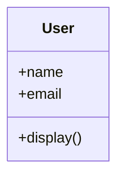

# Wykład 3: Klasy, obiekty i punkt wejścia programu

W Pythonie klasa jest definiowana znacznie prościej niż w Javie, ale pod spodem kryje wiele mechanizmów: dynamiczne atrybuty, metody instancji, metody klasowe, metody statyczne i metody specjalne.

## 1. Definicja klasy

```python
class Book:
    pass
```

To poprawna, minimalna klasa. Słowo `pass` oznacza pusty blok.

Bardziej praktyczny przykład:

```python
class Book:
    def __init__(self, title: str, author: str) -> None:
        self.title = title
        self.author = author

    def describe(self) -> str:
        return f"{self.title} - {self.author}"
```

## 2. Obiekt i jego stan

Tworzenie obiektu:

```python
b = Book("Clean Code", "Robert C. Martin")
print(b.describe())
```

Każda instancja przechowuje własny stan w atrybutach, zwykle przypisywanych przez `self`.

## 3. `self` - co naprawdę oznacza?

W Pythonie `self`:
- nie jest słowem kluczowym,
- jest konwencją,
- oznacza bieżącą instancję.

```python
class Counter:
    def __init__(self) -> None:
        self.value = 0

    def increment(self) -> None:
        self.value += 1
```

Wywołanie:

```python
c = Counter()
c.increment()
```

Pod spodem Python przekazuje obiekt jako pierwszy argument metody.

## 4. Metody instancji, klasowe i statyczne

### Metoda instancji

```python
class User:
    def greet(self) -> str:
        return "Hello"
```

### Metoda klasowa

```python
class User:
    count = 0

    @classmethod
    def from_email(cls, email: str) -> "User":
        name = email.split("@")[0]
        return cls(name)
```

### Metoda statyczna

```python
class MathUtils:
    @staticmethod
    def add(a: int, b: int) -> int:
        return a + b
```

Różnice:
- metoda instancji operuje na obiekcie,
- klasowa operuje na klasie,
- statyczna jest logicznie związana z klasą, ale nie potrzebuje ani instancji, ani klasy.

## 5. Punkt wejścia programu

Python nie wymaga `main`, ale powszechny wzorzec wygląda tak:

```python
def main() -> None:
    print("Uruchamiam program")


if __name__ == "__main__":
    main()
```

Dlaczego to ważne?
- plik można uruchamiać jako program,
- ten sam plik można też importować jako moduł,
- unika się wykonywania kodu przy imporcie.

## 6. Atrybuty instancji a atrybuty klasy

```python
class User:
    species = "human"

    def __init__(self, name: str) -> None:
        self.name = name
```

`species` jest atrybutem klasy, a `name` atrybutem instancji.

## 7. Metody specjalne

Python używa tzw. **dunder methods**:
- `__init__`,
- `__repr__`,
- `__str__`,
- `__eq__`,
- `__len__`,
- `__call__`.

Przykład:

```python
class User:
    def __init__(self, name: str) -> None:
        self.name = name

    def __repr__(self) -> str:
        return f"User(name={self.name!r})"
```

## 8. `repr` i `str`

- `__repr__` - reprezentacja techniczna, bardziej dla developera,
- `__str__` - reprezentacja czytelna dla użytkownika.

```python
class Product:
    def __init__(self, name: str, price: float) -> None:
        self.name = name
        self.price = price

    def __repr__(self) -> str:
        return f"Product(name={self.name!r}, price={self.price!r})"

    def __str__(self) -> str:
        return f"{self.name}: {self.price:.2f} PLN"
```

## 9. Prosty model klasowy



## 10. Najczęstsze błędy

- przypisywanie danych do zmiennych lokalnych zamiast `self.xxx`,
- wykonywanie dużej części logiki w ciele pliku zamiast w funkcjach lub klasach,
- mylenie atrybutów klasy z atrybutami instancji,
- nadużywanie `@staticmethod`.

## 11. Podsumowanie

Po tym wykładzie student powinien:
- umieć zdefiniować klasę w Pythonie,
- rozumieć rolę `self`,
- rozróżniać metody instancji, klasowe i statyczne,
- znać idiom `if __name__ == "__main__":`,
- rozumieć podstawowe metody specjalne.
