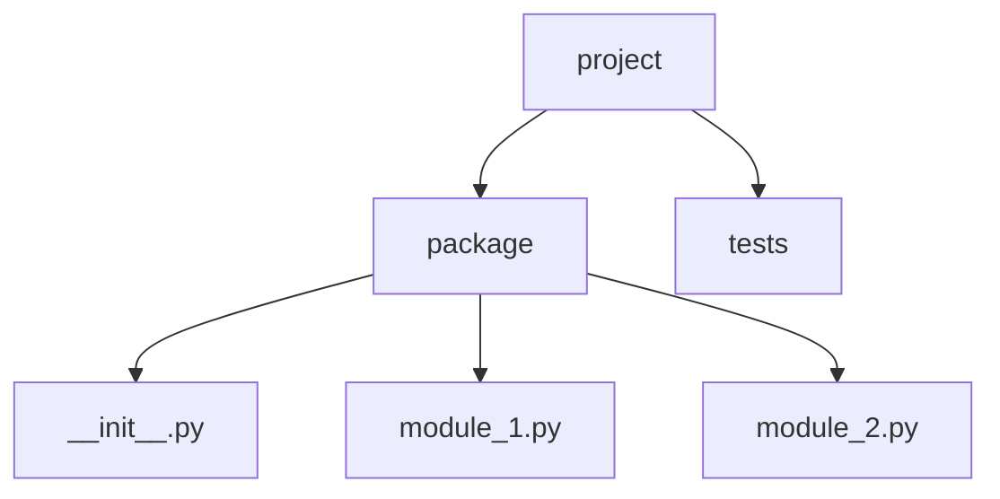

# Wykład 4: Modułowość, pakiety i importy w Pythonie

Python opiera organizację kodu na modułach i pakietach. To odpowiednik logicznego dzielenia systemu na mniejsze jednostki odpowiedzialności, ale z inną składnią i innymi konwencjami niż w Javie.

## 1. Moduł i pakiet

- **moduł** - pojedynczy plik `.py`,
- **pakiet** - katalog zawierający moduły, zwykle z plikiem `__init__.py`.

Przykład:

```text
shop/
    __init__.py
    product.py
    order.py
    services/
        __init__.py
        payments.py
```

## 2. Import modułu

```python
import math

print(math.sqrt(25))
```

Import konkretnej nazwy:

```python
from math import sqrt

print(sqrt(25))
```

Alias:

```python
import numpy as np
```

## 3. Jak działa import?

Przy imporcie Python:
1. wyszukuje moduł,
2. wykonuje kod modułu przy pierwszym imporcie,
3. zapisuje go w cache `sys.modules`,
4. przy kolejnych importach zwykle używa już załadowanej wersji.

To ważne, bo kod wykonywany "na górze pliku" uruchomi się przy imporcie.

## 4. `__name__` i `__main__`

Jeżeli moduł jest uruchamiany bezpośrednio, jego `__name__` ma wartość `"__main__"`.

Przy imporcie:
- `__name__` ma nazwę modułu,
- kod w bloku `if __name__ == "__main__":` nie uruchamia się.

## 5. Importy absolutne i względne

Import absolutny:

```python
from shop.services.payments import charge
```

Import względny:

```python
from .payments import charge
```

W praktyce:
- w większych projektach zwykle preferuje się importy absolutne,
- względne bywają wygodne wewnątrz pakietu.

## 6. Rola `__init__.py`

Plik `__init__.py`:
- oznacza katalog jako pakiet,
- może inicjalizować pakiet,
- może eksportować wybrane nazwy.

Przykład:

```python
from .product import Product
from .order import Order
```

To pozwala pisać:

```python
from shop import Product, Order
```

## 7. Struktura projektu



## 8. Konflikty nazw i cykliczne importy

### Konflikty nazw

Jeśli importujesz różne rzeczy pod tą samą nazwą, kod stanie się nieczytelny. Aliasy warto stosować świadomie.

### Cykliczne importy

Jeśli:
- `a.py` importuje `b.py`,
- a `b.py` importuje `a.py`,

to może dojść do problemów inicjalizacji.

Rozwiązania:
- przenieść wspólne rzeczy do trzeciego modułu,
- ograniczyć import lokalnie w funkcji,
- uprościć zależności.

## 9. `__all__` i eksport API

Można sterować tym, co pakiet wystawia na zewnątrz:

```python
__all__ = ["Product", "Order"]
```

Nie jest to mechanizm bezpieczeństwa, raczej sygnał projektowy.

## 10. Dobre praktyki

- trzymaj małe, spójne moduły,
- unikaj "god module",
- nie umieszczaj ciężkiego kodu wykonywanego przy imporcie,
- trzymaj importy na górze pliku,
- preferuj importy absolutne, jeśli poprawiają czytelność,
- nie używaj `from x import *` w kodzie aplikacyjnym.

## 11. Przykład pakietu

`product.py`

```python
class Product:
    def __init__(self, name: str, price: float) -> None:
        self.name = name
        self.price = price
```

`order.py`

```python
from .product import Product


class Order:
    def __init__(self, product: Product) -> None:
        self.product = product
```

## 12. Podsumowanie

Po tym wykładzie student powinien:
- rozumieć czym jest moduł i pakiet w Pythonie,
- znać podstawowe rodzaje importów,
- rozumieć rolę `__init__.py`,
- unikać cyklicznych importów,
- umieć organizować kod w pakietach.
