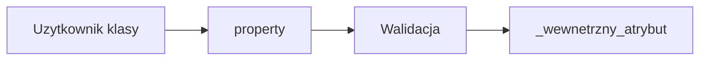

# Wykład 5: Enkapsulacja, atrybuty i `property`

Python nie ma modyfikatorów dostępu takich jak `private`, `protected` i `public` znanych z Javy. Zamiast tego używa konwencji, mechanizmu name mangling oraz właściwości (`property`), które pozwalają kontrolować dostęp do stanu obiektu.

## 1. Czym jest enkapsulacja w Pythonie?

Enkapsulacja oznacza:
- ukrywanie szczegółów implementacji,
- ograniczanie bezpośredniej ingerencji w stan obiektu,
- udostępnianie kontrolowanego interfejsu.

W Pythonie częściej mówimy o:
- **konwencji prywatności**,
- **projektowaniu API klasy**,
- **kontrolowanej mutacji stanu**.

## 2. Atrybuty publiczne i konwencja `_name`

### Publiczne

```python
class User:
    def __init__(self, name: str) -> None:
        self.name = name
```

### Konwencja "chronione" / wewnętrzne

```python
class User:
    def __init__(self, name: str) -> None:
        self._name = name
```

Pojedyncze `_` oznacza:
- "to szczegół wewnętrzny",
- "da się użyć, ale nie powinno się".

To konwencja, nie blokada techniczna.

## 3. Name mangling: `__name`

Podwójny underscore uruchamia mechanizm name mangling:

```python
class User:
    def __init__(self, name: str) -> None:
        self.__name = name
```

Pod spodem Python zapisze nazwę jako coś w rodzaju `_User__name`.

To:
- utrudnia przypadkowy dostęp,
- nie jest pełnym ukryciem,
- przydaje się głównie do ochrony przed kolizjami w dziedziczeniu.

## 4. `property` - pythonowy odpowiednik kontrolowanego dostępu

Najważniejsze narzędzie enkapsulacji w Pythonie.

```python
class BankAccount:
    def __init__(self, balance: float) -> None:
        self._balance = balance

    @property
    def balance(self) -> float:
        return self._balance

    @balance.setter
    def balance(self, value: float) -> None:
        if value < 0:
            raise ValueError("Saldo nie może być ujemne")
        self._balance = value
```

Użycie:

```python
account = BankAccount(100.0)
print(account.balance)
account.balance = 50.0
```

Użytkownik klasy nadal używa składni atrybutu, ale pod spodem wywoływane są metody.

## 5. Zalety `property`

- można dodać walidację,
- można dodać logikę obliczania,
- nie trzeba zmieniać API klasy z `obj.x` na `obj.get_x()`,
- kod wygląda naturalnie po pythonowemu.

## 6. Getter/setter w stylu Javy a styl Python

Styl jawny:

```python
class User:
    def get_name(self) -> str:
        return self._name
```

Styl pythonowy:

```python
class User:
    @property
    def name(self) -> str:
        return self._name
```

W Pythonie zwykle preferuje się `property`, chyba że klasyczne metody mają lepszy sens semantyczny.

## 7. Read-only property

```python
class Circle:
    def __init__(self, radius: float) -> None:
        self._radius = radius

    @property
    def area(self) -> float:
        return 3.14 * self._radius * self._radius
```

`area` wygląda jak atrybut, ale jest obliczana dynamicznie.

## 8. Klasy niemutowalne

W Pythonie nie ma twardego mechanizmu niezmienności dla zwykłych klas, ale można ją modelować:
- przez `@dataclass(frozen=True)`,
- przez brak setterów,
- przez ostrożny projekt API.

## 9. Diagram dostępu do stanu



## 10. Dobre praktyki

- nie ukrywaj wszystkiego na siłę,
- jeśli atrybut ma być częścią publicznego API, nazwij go normalnie,
- jeśli chcesz zachować możliwość dodania walidacji w przyszłości, `property` jest dobrym wyborem,
- `_name` traktuj jako sygnał "wewnętrzne użycie",
- `__name` stosuj oszczędnie.

## 11. Podsumowanie

Po tym wykładzie student powinien:
- rozumieć, jak Python realizuje enkapsulację bez modyfikatorów dostępu,
- znać różnicę między `_attr` i `__attr`,
- umieć użyć `@property`,
- rozumieć, jak kontrolować dostęp do stanu obiektu.
