# Wykład 6: Atrybuty klasy i stan obiektu

W Pythonie rozróżniamy atrybuty instancji i atrybuty klasy. To temat fundamentalny, bo od niego zależy poprawne modelowanie stanu oraz unikanie bardzo typowych błędów, np. współdzielenia mutowalnych danych między obiektami.

## 1. Atrybuty instancji

Najczęściej definiowane w `__init__`.

```python
class Student:
    def __init__(self, name: str) -> None:
        self.name = name
```

Każda instancja ma własną wartość `name`.

## 2. Atrybuty klasy

Definiowane w ciele klasy:

```python
class Student:
    school = "UMG"

    def __init__(self, name: str) -> None:
        self.name = name
```

`school` należy do klasy i jest współdzielone.

## 3. Jak Python wyszukuje atrybuty?

Kolejność:
1. atrybut instancji,
2. atrybut klasy,
3. atrybuty klas bazowych.

To oznacza, że instancja może "przykryć" atrybut klasy własnym atrybutem o tej samej nazwie.

```python
class Config:
    timeout = 30


c = Config()
print(c.timeout)  # 30
c.timeout = 10
print(c.timeout)  # 10
print(Config.timeout)  # 30
```

## 4. Stan obiektu

Stan obiektu to zestaw aktualnych wartości przechowywanych w jego atrybutach instancji.

```mermaid
graph TD
    A[Klasa User] --> B[user_1 name=Anna active=True]
    A --> C[user_2 name=Jan active=False]
```



Obie instancje mają ten sam interfejs, ale inny stan.

## 5. Typowa pułapka: mutowalny atrybut klasy

```python
class Team:
    members = []
```

To prawie zawsze błąd, bo wszystkie instancje będą współdzielić jedną listę.

Lepsza wersja:

```python
class Team:
    def __init__(self) -> None:
        self.members = []
```

## 6. Stałe klasowe

W Pythonie stałe to konwencja:

```python
class FileConfig:
    DEFAULT_ENCODING = "utf-8"
```

To sygnał dla programisty, nie gwarancja języka.

## 7. `ClassVar` i typowanie

Przy adnotacjach typów można oznaczyć atrybut klasowy:

```python
from typing import ClassVar


class User:
    species: ClassVar[str] = "human"

    def __init__(self, name: str) -> None:
        self.name = name
```

## 8. Dobre praktyki

- trzymaj stan obiektu w atrybutach instancji,
- atrybuty klasy stosuj do danych współdzielonych,
- unikaj mutowalnych atrybutów klasowych bez wyraźnego powodu,
- jeśli coś ma być wspólne dla wszystkich obiektów, nazwij to świadomie.

## 9. Podsumowanie

Po tym wykładzie student powinien:
- odróżniać atrybut klasy od atrybutu instancji,
- rozumieć czym jest stan obiektu,
- znać pułapkę współdzielonych mutowalnych atrybutów klasowych,
- umieć używać `ClassVar` i konwencji stałych.
