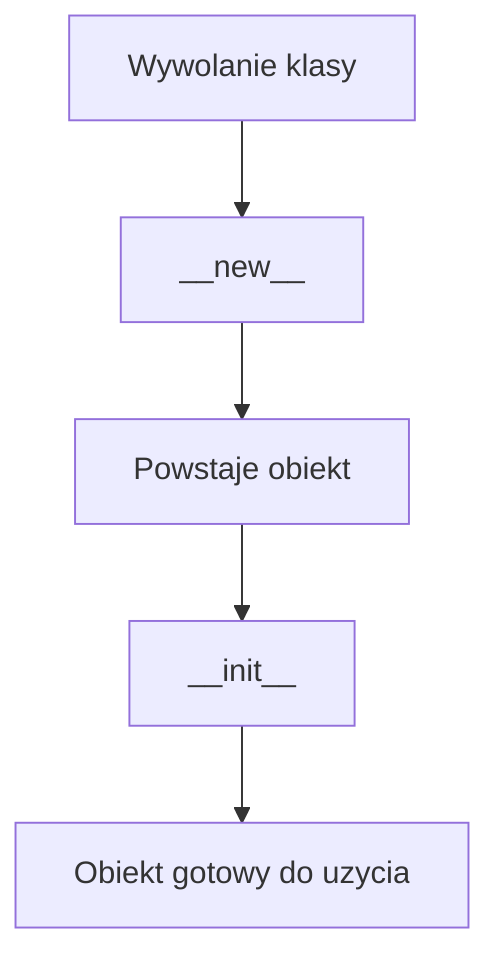

# Wykład 7: Inicjalizacja obiektów i `dataclass`

W Pythonie odpowiednikiem konstruktorów jest przede wszystkim metoda `__init__`. Oprócz niej ważne są `__new__`, alternatywne konstruktory przez `@classmethod` oraz mechanizm `dataclass`, który upraszcza definicję klas danych.

## 1. `__init__`

```python
class Product:
    def __init__(self, name: str, price: float) -> None:
        self.name = name
        self.price = price
```

`__init__`:
- inicjalizuje obiekt po jego utworzeniu,
- nie zwraca wartości,
- zwykle nadaje początkowy stan.

## 2. `__new__`

To niższy poziom tworzenia obiektu.

```python
class Example:
    def __new__(cls):
        return super().__new__(cls)
```

W codziennej pracy rzadko potrzeba `__new__`. Najczęściej używa się `__init__`.

## 3. Walidacja w `__init__`

```python
class BankAccount:
    def __init__(self, owner: str, balance: float) -> None:
        if not owner:
            raise ValueError("Owner is required")
        if balance < 0:
            raise ValueError("Balance cannot be negative")

        self.owner = owner
        self.balance = balance
```

## 4. Alternatywne konstruktory przez `@classmethod`

```python
class User:
    def __init__(self, name: str, email: str) -> None:
        self.name = name
        self.email = email

    @classmethod
    def from_email(cls, email: str) -> "User":
        name = email.split("@")[0]
        return cls(name=name, email=email)
```

To bardzo pythonowy odpowiednik nazwanych konstruktorów lub metod fabrykujących.

## 5. `dataclass`

Python oferuje moduł `dataclasses`, bardzo użyteczny dla klas przechowujących dane.

```python
from dataclasses import dataclass


@dataclass
class Point:
    x: int
    y: int
```

Automatycznie generowane mogą być m.in.:
- `__init__`,
- `__repr__`,
- `__eq__`.

## 6. `dataclass` z ustawieniami

```python
from dataclasses import dataclass


@dataclass(frozen=True)
class Currency:
    code: str
```

Przydatne opcje:
- `frozen=True`,
- `order=True`,
- `slots=True`.

## 7. `__post_init__`

Przy `dataclass` można dodać dodatkową walidację po inicjalizacji:

```python
from dataclasses import dataclass


@dataclass
class Employee:
    name: str
    salary: float

    def __post_init__(self) -> None:
        if self.salary < 0:
            raise ValueError("Salary cannot be negative")
```

## 8. Argumenty domyślne i pułapki

Mutowalne wartości domyślne są niebezpieczne:

```python
class Bad:
    def __init__(self, items: list = []) -> None:
        self.items = items
```

Lepsza wersja:

```python
class Good:
    def __init__(self, items: list | None = None) -> None:
        self.items = [] if items is None else items
```

W `dataclass` używa się `field(default_factory=list)`.

## 9. Diagram procesu tworzenia obiektu



## 10. Podsumowanie

Po tym wykładzie student powinien:
- rozumieć rolę `__init__`,
- umieć walidować dane przy inicjalizacji,
- znać alternatywne konstruktory przez `@classmethod`,
- umieć użyć `@dataclass`,
- znać pułapki mutowalnych argumentów domyślnych.
