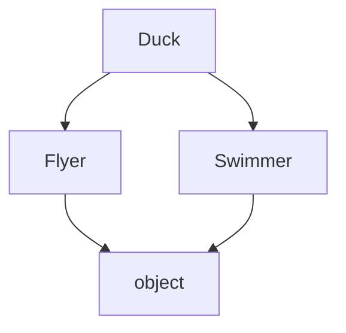

# Wykład 8: Dziedziczenie i polimorfizm w Pythonie

Python wspiera dziedziczenie pojedyncze i wielokrotne. To daje dużą elastyczność, ale wymaga ostrożności projektowej. W praktyce warto rozumieć zarówno mechanikę `super()`, jak i ograniczenia rozbudowanych hierarchii klas.

## 1. Dziedziczenie

```python
class Animal:
    def speak(self) -> None:
        print("Some sound")


class Dog(Animal):
    def speak(self) -> None:
        print("Hau")
```

`Dog` dziedziczy po `Animal`.

## 2. Przesłanianie metod

Podklasa może dostarczyć własną implementację metody:

```python
class Cat(Animal):
    def speak(self) -> None:
        print("Miau")
```

## 3. Polimorfizm

```python
def make_animal_speak(animal: Animal) -> None:
    animal.speak()
```

Ta funkcja działa z różnymi podtypami `Animal`.

```python
make_animal_speak(Dog())
make_animal_speak(Cat())
```

## 4. `super()`

Python używa `super()` do odwoływania się do nadklasy.

```python
class Employee:
    def __init__(self, name: str) -> None:
        self.name = name


class Manager(Employee):
    def __init__(self, name: str, team_size: int) -> None:
        super().__init__(name)
        self.team_size = team_size
```

## 5. Wielokrotne dziedziczenie

Python je wspiera:

```python
class Flyer:
    def move(self) -> None:
        print("Flying")


class Swimmer:
    def swim(self) -> None:
        print("Swimming")


class Duck(Flyer, Swimmer):
    pass
```

To potężne, ale może komplikować projekt.

## 6. MRO - Method Resolution Order

Python rozstrzyga kolejność wyszukiwania metod według **MRO**.

```python
print(Duck.__mro__)
```

To bardzo ważne przy wielokrotnym dziedziczeniu i `super()`.



## 7. Kiedy dziedziczenie ma sens?

Gdy:
- istnieje realna relacja `is-a`,
- podtyp zachowuje kontrakt nadtypu,
- wspólne zachowanie rzeczywiście jest współdzielone.

Często lepsza jest kompozycja:

```python
class Engine:
    def start(self) -> None:
        print("Engine started")


class Car:
    def __init__(self) -> None:
        self.engine = Engine()
```

## 8. `isinstance` i `issubclass`

```python
isinstance(Dog(), Animal)
issubclass(Dog, Animal)
```

Przydatne, ale nie należy ich nadużywać tam, gdzie lepszy jest polimorfizm.

## 9. Typowe błędy

- budowanie zbyt głębokich hierarchii,
- używanie dziedziczenia zamiast kompozycji,
- łamanie kontraktu klasy bazowej,
- mieszanie wielu odpowiedzialności w bazowej klasie.

## 10. Podsumowanie

Po tym wykładzie student powinien:
- rozumieć dziedziczenie i przesłanianie metod,
- znać działanie `super()`,
- rozumieć polimorfizm,
- znać podstawy wielokrotnego dziedziczenia i MRO,
- wiedzieć, kiedy preferować kompozycję.
