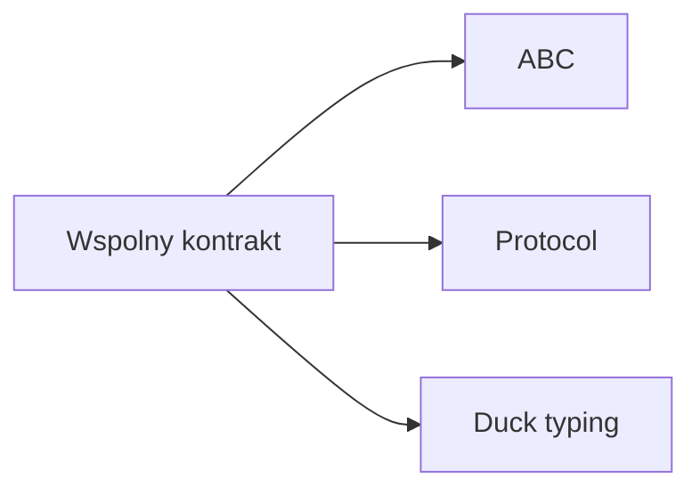

# Wykład 9: Protokoły, ABC i klasy abstrakcyjne

Python ma kilka sposobów definiowania wspólnego interfejsu:
- klasy abstrakcyjne przez `abc`,
- protokoły przez `typing.Protocol`,
- zwykły duck typing bez formalnej deklaracji.

To jeden z najbardziej pythonowych tematów w OOP, bo pokazuje różnicę między formalnym kontraktem a kontraktem wynikającym z zachowania obiektu.

## 1. Klasa abstrakcyjna przez `abc`

```python
from abc import ABC, abstractmethod


class Shape(ABC):
    @abstractmethod
    def area(self) -> float:
        pass
```

Podklasa musi zaimplementować `area`.

```python
class Circle(Shape):
    def __init__(self, radius: float) -> None:
        self.radius = radius

    def area(self) -> float:
        return 3.14 * self.radius * self.radius
```

## 2. Po co używać ABC?

- formalny kontrakt,
- ochrona przed utworzeniem niekompletnej klasy,
- czytelniejsze API,
- dobre wsparcie dla frameworków i architektury warstwowej.

## 3. Klasa abstrakcyjna z częściową implementacją

```python
from abc import ABC, abstractmethod


class Report(ABC):
    def print_header(self) -> None:
        print("=== REPORT ===")

    @abstractmethod
    def generate_body(self) -> str:
        pass
```

## 4. `Protocol`

Python wspiera też typowanie strukturalne:

```python
from typing import Protocol


class SupportsClose(Protocol):
    def close(self) -> None:
        ...
```

Każdy obiekt z metodą `close()` pasuje do tego protokołu, nawet bez dziedziczenia.

## 5. `Protocol` vs ABC

### ABC
- formalna relacja dziedziczenia,
- wymuszenie implementacji przy tworzeniu klasy.

### Protocol
- kontrakt strukturalny,
- szczególnie przydatny przy typowaniu,
- bardziej naturalny w duchu duck typing.

## 6. Duck typing

W wielu przypadkach Python nie potrzebuje ani ABC, ani Protocol:

```python
def save(entity) -> None:
    entity.serialize()
```

Jeśli obiekt ma `serialize`, funkcja działa.

## 7. Kiedy używać czego?

| Sytuacja | Narzędzie |
|---|---|
| chcesz formalnej bazy klas | `ABC` |
| chcesz typowania strukturalnego | `Protocol` |
| potrzebujesz prostego zachowania bez formalizmów | duck typing |

## 8. Diagram porównawczy



## 9. Podsumowanie

Po tym wykładzie student powinien:
- umieć tworzyć klasy abstrakcyjne przez `abc`,
- rozumieć rolę `@abstractmethod`,
- znać `typing.Protocol`,
- rozumieć różnicę między kontraktem nominalnym i strukturalnym,
- wiedzieć, że Python często opiera się na duck typing.
