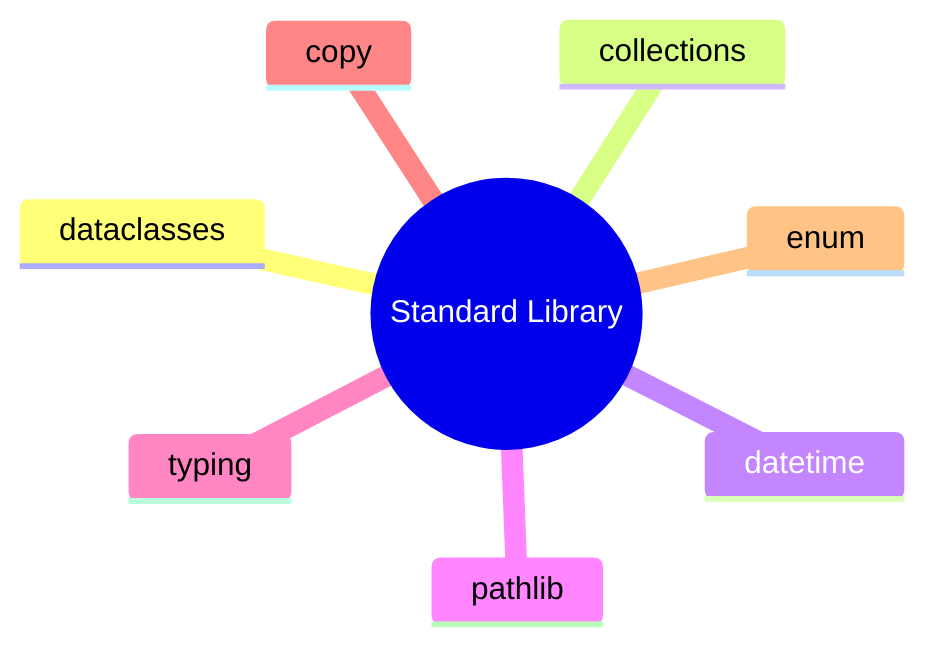

# Wykład 10: Podstawowe moduły standard library w kontekście OOP

Python dostarcza bogatą bibliotekę standardową. W programowaniu obiektowym szczególnie ważne są moduły, które wspierają modelowanie danych, kolekcje, daty, kopiowanie obiektów, typowanie i serializację.

## 1. Najważniejsze moduły

- `dataclasses`
- `collections`
- `datetime`
- `pathlib`
- `typing`
- `copy`
- `enum`
- `itertools`



## 2. `dataclasses`

Służy do prostego modelowania obiektów danych.

```python
from dataclasses import dataclass


@dataclass
class Product:
    name: str
    price: float
```

## 3. `collections`

Przydatne typy:
- `defaultdict`
- `Counter`
- `deque`
- `namedtuple`

Przykład:

```python
from collections import Counter

votes = Counter(["python", "java", "python"])
print(votes["python"])
```

## 4. `datetime`

Modelowanie dat i czasu:

```python
from datetime import date, datetime, timedelta

today = date.today()
deadline = today + timedelta(days=7)
```

## 5. `pathlib`

Obiektowe podejście do ścieżek plików:

```python
from pathlib import Path

path = Path("data") / "report.txt"
print(path.exists())
```

## 6. `typing`

Typowanie wspiera czytelność i projekt API:

```python
from typing import Iterable


def total(values: Iterable[int]) -> int:
    return sum(values)
```

## 7. `copy`

Kopiowanie płytkie i głębokie:

```python
import copy

shallow = copy.copy(obj)
deep = copy.deepcopy(obj)
```

To ważne przy obiektach zagnieżdżonych.

## 8. `enum`

Dobre do modelowania zamkniętego zbioru stanów:

```python
from enum import Enum


class OrderStatus(Enum):
    NEW = "new"
    PAID = "paid"
    SHIPPED = "shipped"
```

## 9. `itertools`

Przydatne do przetwarzania danych i iteracji:

```python
from itertools import groupby
```

## 10. Podsumowanie

Po tym wykładzie student powinien:
- znać kilka najważniejszych modułów standard library,
- rozumieć ich zastosowanie w kodzie obiektowym,
- wiedzieć, kiedy używać gotowych narzędzi zamiast pisać własne od zera.
