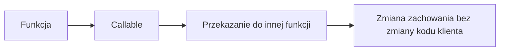

# Wykład 11: Funkcje lambda, callables i funkcje jako obiekty

W Pythonie funkcje są obiektami pierwszej klasy. Można je przekazywać, zwracać, zapisywać w strukturach danych i traktować jako zachowanie. To pythonowy odpowiednik pracy z lambdami i interfejsami funkcyjnymi, choć realizowany inaczej niż w Javie.

## 1. Funkcje jako obiekty

```python
def greet(name: str) -> str:
    return f"Hello, {name}"


fn = greet
print(fn("Anna"))
```

## 2. Lambda

```python
square = lambda x: x * x
print(square(5))
```

Lambda:
- jest krótką funkcją anonimową,
- najlepiej nadaje się do prostych wyrażeń,
- nie powinna zastępować pełnych funkcji w złożonej logice.

## 3. `callable`

W Pythonie callable to wszystko, co da się wywołać:
- funkcja,
- metoda,
- klasa,
- obiekt z `__call__`.

```python
class Multiplier:
    def __init__(self, factor: int) -> None:
        self.factor = factor

    def __call__(self, value: int) -> int:
        return value * self.factor
```

## 4. Funkcje wyższego rzędu

Funkcja może:
- przyjmować inną funkcję,
- zwracać funkcję.

```python
def apply_twice(fn, value):
    return fn(fn(value))
```

## 5. `map`, `filter`, `sorted`

```python
numbers = [1, 2, 3, 4]
print(list(map(lambda x: x * 2, numbers)))
print(list(filter(lambda x: x % 2 == 0, numbers)))
print(sorted(["aaa", "b", "cc"], key=lambda x: len(x)))
```

## 6. Domknięcia

```python
def make_multiplier(factor: int):
    def inner(value: int) -> int:
        return value * factor
    return inner
```

Domknięcie oznacza, że funkcja wewnętrzna pamięta wartości z otaczającego ją kontekstu.

## 7. Strategia przez callable

W Pythonie bardzo często wzorzec strategii można zrealizować bez osobnego interfejsu i bez rozbudowanej hierarchii klas.

```python
from typing import Callable


def calculate_total(price: float, discount: Callable[[float], float]) -> float:
    return discount(price)


def student_discount(price: float) -> float:
    return price * 0.9


print(calculate_total(100.0, student_discount))
print(calculate_total(100.0, lambda p: p * 0.8))
```

To ważna różnica względem Javy: w Pythonie funkcja sama może być kontraktem zachowania.

## 8. `Callable` w typowaniu

```python
from typing import Callable


def process(items: list[int], fn: Callable[[int], int]) -> list[int]:
    return [fn(item) for item in items]
```

Taki zapis mówi:
- funkcja przyjmuje `int`,
- zwraca `int`.

## 9. `functools`

W pracy z callables przydaje się też `functools`.

### `partial`

```python
from functools import partial


def multiply(a: int, b: int) -> int:
    return a * b


double = partial(multiply, 2)
print(double(10))
```

### `lru_cache`

```python
from functools import lru_cache


@lru_cache(maxsize=None)
def fib(n: int) -> int:
    if n < 2:
        return n
    return fib(n - 1) + fib(n - 2)
```

## 10. Lambda czy zwykła funkcja?

Lambda jest dobra, gdy:
- wyrażenie jest krótkie,
- użycie jest lokalne,
- intencja pozostaje czytelna.

Zwykła funkcja jest lepsza, gdy:
- logika jest wieloetapowa,
- potrzebna jest nazwa opisująca intencję,
- kod ma być wielokrotnie użyty,
- potrzebne są testy i debugowanie.

## 11. Diagram



## 12. Podsumowanie

Po tym wykładzie student powinien:
- rozumieć, że funkcje są obiektami,
- znać lambdy,
- rozumieć callable i `__call__`,
- umieć używać funkcji wyższego rzędu,
- rozumieć ideę domknięć,
- widzieć, że Python często realizuje wzorce zachowań przez funkcje zamiast formalnych interfejsów.
