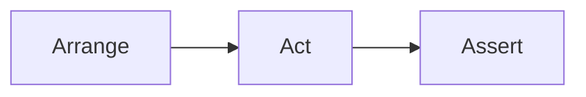

# Wykład 12: Testowanie kodu w Pythonie

Testowanie jest integralną częścią projektowania kodu obiektowego. Dobrze zaprojektowana klasa nie tylko działa, ale też da się łatwo przetestować.

## 1. Po co testujemy?

- weryfikacja poprawności,
- ochrona przed regresjami,
- dokumentacja kontraktu klasy,
- bezpieczna refaktoryzacja.

## 2. `unittest` i `pytest`

### `unittest`
Wbudowany framework standard library.

### `pytest`
Najpopularniejsze nowoczesne narzędzie testowe w Pythonie.

W praktyce:
- `unittest` jest dobrym punktem wyjścia, bo jest w standard library,
- `pytest` daje prostszą składnię, fixture'y i wygodniejsze raportowanie.

## 3. Przykład testu w `pytest`

```python
import pytest


class BankAccount:
    def __init__(self, balance: float) -> None:
        self.balance = balance

    def withdraw(self, amount: float) -> None:
        if amount < 0:
            raise ValueError("Negative amount")
        if amount > self.balance:
            raise ValueError("Insufficient funds")
        self.balance -= amount


def test_withdraw_changes_balance() -> None:
    account = BankAccount(100)
    account.withdraw(30)
    assert account.balance == 70


def test_withdraw_rejects_negative_value() -> None:
    account = BankAccount(100)
    with pytest.raises(ValueError):
        account.withdraw(-10)
```

## 4. `unittest` - przykład

```python
import unittest


class TestBankAccount(unittest.TestCase):
    def test_withdraw_changes_balance(self) -> None:
        account = BankAccount(100)
        account.withdraw(20)
        self.assertEqual(account.balance, 80)

    def test_withdraw_rejects_negative_value(self) -> None:
        account = BankAccount(100)
        with self.assertRaises(ValueError):
            account.withdraw(-1)
```

## 5. Arrange-Act-Assert



Przykład:

```python
def test_area_of_rectangle() -> None:
    # Arrange
    rectangle = Rectangle(4, 5)

    # Act
    result = rectangle.area()

    # Assert
    assert result == 20
```

## 6. Zasady testowalnego kodu

- małe, spójne klasy,
- brak ukrytych zależności,
- oddzielenie logiki od I/O,
- przewidywalny interfejs,
- sensowne wyjątki.

## 7. Mocki i stuby

Przy testach integracji klas przydają się:
- `unittest.mock`,
- atrapowe repozytoria,
- fałszywe implementacje.

Przykład:

```python
from unittest.mock import Mock


def test_user_service_calls_repository() -> None:
    repository = Mock()
    service = UserService(repository)

    service.create_user("Anna")

    repository.save.assert_called_once()
```

## 8. Fixture'y w `pytest`

```python
import pytest


@pytest.fixture
def account() -> BankAccount:
    return BankAccount(100)


def test_fixture_example(account: BankAccount) -> None:
    account.withdraw(10)
    assert account.balance == 90
```

## 9. Co zwykle utrudnia testowanie?

- logika schowana w kodzie uruchamianym przy imporcie,
- bezpośrednie odwołania do plików, sieci i bazy w metodach domenowych,
- losowość bez możliwości podstawienia generatora,
- zależności tworzone wewnątrz klasy zamiast przekazywane z zewnątrz,
- jedna klasa robiąca zbyt wiele rzeczy.

## 10. Testy a projekt obiektowy

Jeśli klasa jest trudna do przetestowania, to często sygnał, że:
- ma za dużo odpowiedzialności,
- zależy od konkretów zamiast abstrakcji,
- miesza logikę biznesową z I/O,
- ukrywa ważny stan lub skutki uboczne.

## 11. Podsumowanie

Po tym wykładzie student powinien:
- znać rolę testów jednostkowych,
- rozumieć różnicę między `unittest` i `pytest`,
- umieć napisać prosty test klasy,
- wiedzieć, jak projektować klasy łatwe do testowania,
- rozumieć rolę mocków i fixture'ów.
