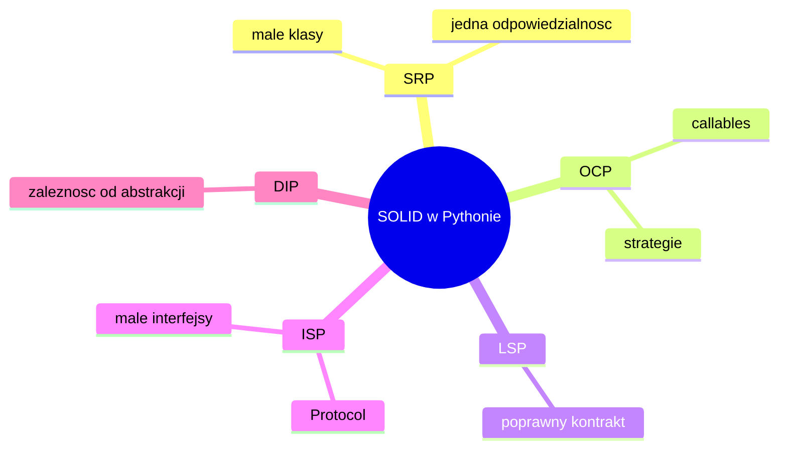

# Wykład 13: SOLID w Pythonie

SOLID nie jest związany wyłącznie z Javą czy C#. W Pythonie również pomaga budować czytelny, rozszerzalny i testowalny kod. Różnica polega na tym, że Python zwykle stosuje te zasady mniej ceremonialnie i bardziej pragmatycznie.

## 1. SRP

Jedna klasa powinna mieć jedną główną odpowiedzialność.

Zły przykład:

```python
class UserService:
    def create_user(self, name: str) -> None:
        print(f"Creating user {name}")

    def save_to_file(self, name: str) -> None:
        print(f"Saving {name} to file")

    def send_welcome_email(self, name: str) -> None:
        print(f"Sending email to {name}")
```

Lepszy kierunek:

```python
class UserCreator:
    def create_user(self, name: str) -> None:
        print(f"Creating user {name}")


class UserRepository:
    def save(self, name: str) -> None:
        print(f"Saving {name}")


class Mailer:
    def send_welcome_email(self, name: str) -> None:
        print(f"Sending email to {name}")
```

## 2. OCP

Lepiej rozszerzać zachowanie przez nowe obiekty, funkcje lub strategie niż stale modyfikować jedną klasę pełną `if`.

```python
from typing import Protocol


class DiscountPolicy(Protocol):
    def __call__(self, price: float) -> float:
        ...


def apply_discount(price: float, policy: DiscountPolicy) -> float:
    return policy(price)
```

W Pythonie OCP często wygodnie realizuje się przez:
- callables,
- protokoły,
- kompozycję,
- wstrzykiwanie funkcji.

## 3. LSP

Podtyp powinien zachowywać kontrakt nadtypu.

Jeżeli kod oczekuje obiektu `Bird`, który potrafi latać, a podtyp `Penguin` nie spełnia tego założenia, to model jest wadliwy. W Pythonie takie błędy są łatwe do przeoczenia, bo język jest dynamiczny.

## 4. ISP

Lepiej mieć małe, czytelne protokoły lub interfejsy niż jeden wielki kontrakt.

```python
from typing import Protocol


class Printable(Protocol):
    def print(self) -> None:
        ...


class Scannable(Protocol):
    def scan(self) -> None:
        ...
```

## 5. DIP

Kod wysokiego poziomu powinien zależeć od abstrakcji, nie od konkretów.

```python
from typing import Protocol


class Repository(Protocol):
    def save(self, value: str) -> None:
        ...


class Service:
    def __init__(self, repository: Repository) -> None:
        self.repository = repository
```

## 6. Pythonowy kontekst

W Pythonie często:
- używa się kompozycji zamiast głębokiego dziedziczenia,
- stosuje się `Protocol`,
- zamiast wielu fabryk wystarczą callables,
- ważniejsza jest czytelność niż formalizm.

## 7. Diagram



## 8. Najczęstsze nadużycia

- tworzenie zbyt wielu warstw "na zapas",
- kopiowanie wzorców z Javy 1:1 bez potrzeby,
- formalne interfejsy tam, gdzie wystarczy jedna funkcja,
- nadmierne dziedziczenie zamiast prostych obiektów współpracujących.

## 9. SOLID a testy

SOLID pomaga testować:
- SRP upraszcza zakres testu,
- DIP pozwala podmieniać zależności,
- ISP zmniejsza koszt mockowania,
- OCP ułatwia rozszerzanie bez łamania istniejących testów.

## 10. Podsumowanie

Po tym wykładzie student powinien:
- znać zasady SOLID,
- rozumieć ich pythonową interpretację,
- widzieć związek między SOLID a testowalnością,
- rozumieć, że prostota nadal ma pierwszeństwo,
- umieć rozpoznać typowe naruszenia SOLID w kodzie Python.
