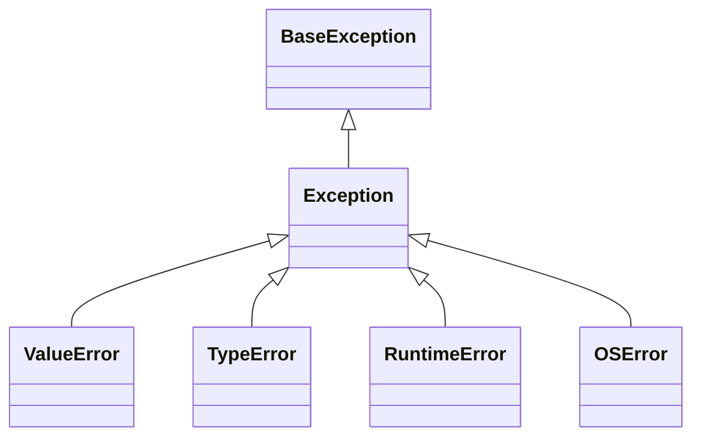

# Wykład 14: Wyjątki w Pythonie

Wyjątki są podstawowym mechanizmem obsługi błędów w Pythonie. W odróżnieniu od Javy Python nie ma checked exceptions, więc projekt API wymaga jeszcze większej dyscypliny dokumentacyjnej i testowej.

## 1. Podstawy

```python
try:
    value = int("abc")
except ValueError as exc:
    print(f"Blad: {exc}")
```

## 2. Hierarchia wyjątków



Najczęstsze wyjątki użytkowe:
- `ValueError`,
- `TypeError`,
- `KeyError`,
- `IndexError`,
- `AttributeError`,
- `RuntimeError`,
- `OSError`.

## 3. `try`, `except`, `else`, `finally`

```python
try:
    value = int("10")
except ValueError:
    print("Niepoprawna wartosc")
else:
    print(value)
finally:
    print("Koniec")
```

Znaczenie bloków:
- `try` - kod ryzykowny,
- `except` - obsługa konkretnego błędu,
- `else` - wykona się tylko gdy wyjątku nie było,
- `finally` - wykona się zawsze.

## 4. `raise`

```python
def withdraw(balance: float, amount: float) -> float:
    if amount < 0:
        raise ValueError("Amount cannot be negative")
    return balance - amount
```

## 5. Wiele `except` i łapanie konkretnych błędów

```python
try:
    value = int(data)
except ValueError:
    print("Niepoprawny format liczby")
except TypeError:
    print("Dane maja zly typ")
```

Dobra praktyka:
- łap możliwie konkretny wyjątek,
- unikaj gołego `except:`.

## 6. Własne wyjątki

```python
class DomainError(Exception):
    pass
```

Przykład domenowy:

```python
class InsufficientFundsError(Exception):
    pass
```

## 7. Chaining

```python
try:
    int("abc")
except ValueError as exc:
    raise RuntimeError("Parsing failed") from exc
```

To pozwala zachować przyczynę błędu.

## 8. `with` i kontekst zasobów

Python używa context managerów:

```python
with open("data.txt", "r", encoding="utf-8") as file:
    content = file.read()
```

To odpowiednik bezpiecznego zamykania zasobu, podobny w roli do `try-with-resources` w Javie.

## 9. Projektowanie API z wyjątkami

W Pythonie trzeba świadomie zdecydować:
- kiedy rzucać wyjątek,
- jaki typ wyjątku wybrać,
- czy stworzyć wyjątek domenowy.

Dobre pytania projektowe:
- czy to błąd danych wejściowych?
- czy to błąd stanu programu?
- czy to błąd infrastruktury?

## 10. Antywzorce

- `except Exception:` bez realnej potrzeby,
- tłumienie błędu bez logowania i bez reakcji,
- używanie wyjątków do zwykłej kontroli przepływu,
- ukrywanie przyczyny przez brak `from`.

## 11. Podsumowanie

Po tym wykładzie student powinien:
- znać mechanizm wyjątków w Pythonie,
- umieć używać `try/except/else/finally`,
- rozumieć `raise`,
- umieć tworzyć własne wyjątki,
- rozumieć brak checked exceptions,
- znać rolę context managerów i chainingu wyjątków.
